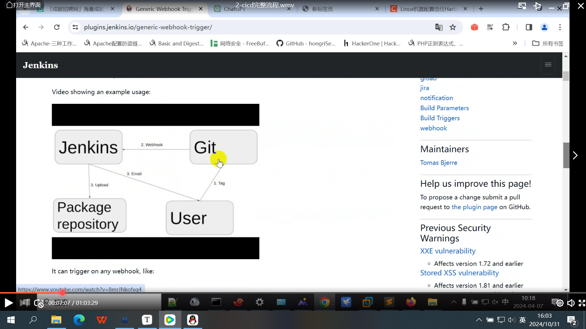
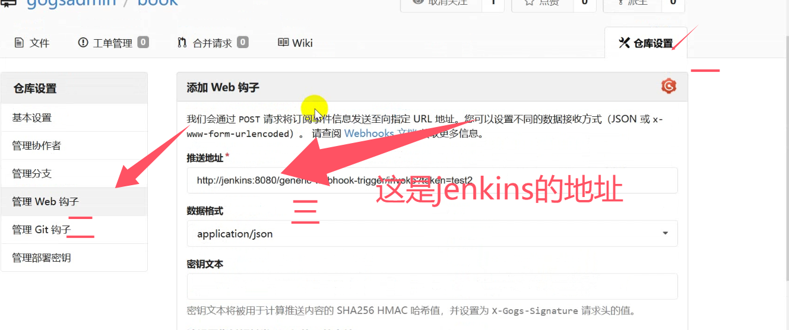

## cicd部署完整流程

#### 1、知识回顾

```
jenkins 迁移至k8s

kubernetes 实现动态slave

代码仓库 gogs gitlab

容器镜像仓库 harbor

拉去代码====编译构建------打包镜像----部署

​						docker out docker /var/run/docker.sock挂载
```

> x509：不信任证书，首先容器要信任证书，系统也要信任证书，客户端也要信任证书
>
> harbor信任证书：https://blog.csdn.net/weixin_46660849/article/details/132550969

#### 2、打包镜像之dind

```
dind：101服务器
docker 容器内部信任证书而且系统也要信任证书
mkdir dockerindocker
cd dockerindocker
cp /etc/docker/certs.d/harbor.y2312.com/ca.crt ./
进入容器内部：docker run -it --privileged --rm docker:25-git /bin/sh
vi Dockerfile
FROM docker:25-git
ADD ca.crt /etc/docker/certs.d/harbor.y2312.com/  ===容器要信任证书
ADD ca.crt /etc/ssl/certs/   ====docker:25-git跑的系统内部要信任证书（发行版本为ubantu，版本不一样，path就不一样，详见上面链接）
RUN update-ca-certificates  ===更新证书
打包镜像：
docker build . -t harbor.y2312.com/cicd/dind:25-git
拉取镜像：
docker push harbor.y2312.com/cicd/dind:25-git
在jenkins中修改代码

```

#### 3、jenkins中pipeline（dind）：

```
pipeline {
  agent {
    kubernetes {
      yaml '''
        apiVersion: v1
        kind: Pod
        metadata:
          labels:
            some-label: some-label-value
        spec:
          volumes:
          - name: dsock
            hostPath:
             path: /var/run/
             type: Directory
          containers:
          - name: docker-cli
            image: harbor.y2312.com/cicd/docker:25.0.5-cli
            command:
            - cat
            tty: true
            volumeMounts:
            - mountPath: /var/run/
              name: dsock
          - name: git
            image: harbor.y2312.com/cicd/dind:25-git
            securityContext:
              privileged: true
          - name: mvn
            image: mvn:v3
            command:
            - cat
            tty: true
        '''
      retries 2
    }
  }
  stages {
    stage('拉取代码') {
      steps {
        container('git') {
          checkout scmGit(branches: [[name: '*/master']], extensions: [], userRemoteConfigs: [[url: 'http://gogs.y2312.com/gogsadmin/book.git']])
        }
      }
    }
    stage('编译构建') {
      steps {
        container('mvn') {
            sh 'mvn clean package'
            sh 'sleep 10'
        }  
      }
    }
    stage('打包镜像') {
      steps {
         container('git') {
            sh 'docker build . -t  harbor.y2312.com/bookmanage/book:v0.0.1'
            withCredentials([usernamePassword(credentialsId: 'harbor', passwordVariable: 'hpass', usernameVariable: 'huser')]) {
            sh "echo ${hpass} | docker login harbor.y2312.com --username ${huser} --password-stdin" 
            sh 'docker push  harbor.y2312.com/bookmanage/book:v0.0.1'
            }
         }
      }
    }
  }
}
```

#### 4、部署更新：

```
100服务器需要：
deployment（更新）
		image：book：v2
等价于：  image: {{ .Values.image}}
可以使用sed 和helm模板
===》helm upgrade --install --set image=book ./

service 
ingress

创建helm模板
helm create mybook
cd mybook
cd templates
rm -rf _helpers.yaml hpa.yaml NOTES.txt serviceaccount.yaml test/
vi Chart.yaml
==修改0.0.1

vi value.yaml
image: harbor.y2312.com/bookmanage/book====>harbor仓库里面查找
- host: book.y2312.com
ingress：
  enabled: true ===要求暴露
service:
 port:8080
部署：
helm upgrade --install book --set tag=v0.0.2 ./ -n kube-ops
win7解析域名： 192.168.18.101 book.y2312.com
浏览器中输入： book.y2312.com访问
```

#### 5、准备具备helm工具的镜像

```
在100服务器中：
scp .kube/config 192.168.66.101:/root/
scp /usr/bin/helm 192.168.66.101:/root/
scp myapp 192.168.66.101:/root/
101:jenkins和helm整合
cd mvndocker
mv config mvndocker/
mv helm mvndocker/
mv myapp  Books-Management-System/
git init
git add .
git commit -m "add myapp"
git push -u origin master

mvndocker/
准备Dockerfile
FROM centos:7
ADD jdk-8u22.tar.gz /usr/local
ADD apache-maven.tar.gz /usr/local
RUN ln -s /usr/local/jdk8 /usr/local/java
RUN ln -s /usr/lcoal/apache-maven /usr/local/mvn
EVN JAVA_HOME=/usr/lcoal/java MAVEN_HOME=/usr/lcoal/mvn PATH:=$PATH:/usr/lcoal/mvn/bin:/usr/local/java/bin
ADD settings.xml /usr/lcoal/mvn/conf
ADD helm /usr/bin/
RUN chmod +x /usr/bin/helm
ADD config /root/.kube/ ===连接k8s的配置文件，通过helm连接到k8s集群中去

docker build . -t harbor.y2312.com/cicd/mvnhelm:v0.0.1
docker push harbor.y2312.com/cicd/mvnhelm:v0.0.1

jenkins中pipeline语法：
pipeline {
  agent {
    kubernetes {
      yaml '''
        apiVersion: v1
        kind: Pod
        metadata:
          labels:
            some-label: some-label-value
        spec:
          volumes:
          - name: dsock
            hostPath:
             path: /var/run/
             type: Directory
          containers:
          - name: docker-cli
            image: harbor.y2312.com/cicd/docker:25.0.5-cli
            command:
            - cat
            tty: true
            volumeMounts:
            - mountPath: /var/run/
              name: dsock
          - name: git
            image: harbor.y2312.com/cicd/dind:25-git
            securityContext:
              privileged: true
          - name: mvn
            image: harbor.y2312.com/cicd/mvnhelm:v0.0.1
            command:
            - cat
            tty: true
        '''
      retries 2
    }
  }
  stages {
    stage('拉取代码') {
      steps {
        container('git') {
          checkout scmGit(branches: [[name: '*/master']], extensions: [], userRemoteConfigs: [[url: 'http://gogs.y2312.com/gogsadmin/book.git']])
        }
      }
    }
    stage('编译构建') {
      steps {
        container('mvn') {
            sh 'mvn clean package'
            sh 'sleep 10'
        }  
      }
    }
    stage('打包镜像') {
      steps {
         container('git') {
            sh 'docker build . -t  harbor.y2312.com/bookmanage/book:v0.0.3'
            withCredentials([usernamePassword(credentialsId: 'harbor', passwordVariable: 'hpass', usernameVariable: 'huser')]) {
            sh "echo ${hpass} | docker login harbor.y2312.com --username ${huser} --password-stdin" 
            sh 'docker push  harbor.y2312.com/bookmanage/book:v0.0.3'
            }
         }
      }
    }
    stage('部署测试') {
        steps {
             container('mvn') {
                sh 'helm upgrade --install --set tag=0.0.3  book myapp/  -n kube-ops'
            }
        }
    }
  }
}
```

#### 6、自动构建：

```
jenkins安装插件：
触发器：====》jenkins插件管理：webhook
即可以接受post请求也可以接受query请求：用户打tag提交到git上，通过webhook触发jenkins，然后jenkins编译构建打包等，jenkins也可以通过webhook发送邮件给用户说编译构建成功

test2---流水线---配置---token：test2
http://jenkins.y2312.com/generic-webhook-trigger/invoke?token=test2==访问一下这个链接就会触发====jenkins就会立即构建
101：vi /etc/hosts
192.168.18.101 jenkins.y2312.com
curl http://jenkins.y2312.com/generic-webhook-trigger/invoke?token=test2
jenkins中就会自己创建任务。
jenkins的webhook也可以传递参数：
jenkins中添加值（webhook第一个）name $.app.name（勾选jsonPATH）
101服务器触发：
curl -v -H "Content-Type: application/json" -X POST -d '{ "app":{ "name":"some value" }}' http://jenkins.y2312.com/generic-webhook-trigger/invoke?token=test2

gogs仓库中：添加webhook钩子触发器设置，并添加白名单
curl http://jenkins.y2312.com/generic-webhook-trigger/invoke?token=test2
出现： 推送URL被解析到默认禁用的本地网络地址。
gogs仓库中触发web钩子，然后在node2节点上面（挂载点的节点上）添加一个白名单（101服务器中：vi /data/k8s/gogs/gogs/conf/app.ini，最后一行添加：LOCAL_NETWORK_ALLOWLIST = jenkins），然后在k8s中重启gogs，然后再gogs上面的仓库添加web钩子
gogs代码仓库中推送地址：http://jenkins:8080/generic-webhook-trigger/invoke?token=test2(test2为在jenkins中自己创建)。
保留版本号后6位：jenkins是用groovy写的，调用groovy可以使用script来调用。
模拟修改完代码：

```





```
用户打tag提交到git上面，通过webhook触发jenkins然后jenkins编译构建打包等，也可以通过webhook发送邮件给用户成功了。
jenkins插件---kubenetes实现动态slave，编译构建是在容器里面完成的，当pod结束了，环境什么都能没有了，此时借助harbor保存编译构建后的镜像。所有步骤都在容器完成的。
```



#### 7、部署代码：

```
jenkins中pipeline语法：
pipeline {
  agent {
    kubernetes {
      yaml '''
        apiVersion: v1
        kind: Pod
        metadata:
          labels:
            some-label: some-label-value
        spec:
          volumes:
          - name: dsock
            hostPath:
             path: /var/run/
             type: Directory
          containers:
          - name: docker-cli
            image: harbor.y2312.com/cicd/docker:25.0.5-cli
            command:
            - cat
            tty: true
            volumeMounts:
            - mountPath: /var/run/
              name: dsock
          - name: git
            image: harbor.y2312.com/cicd/dind:25-git
            securityContext:
              privileged: true
          - name: mvn
            image: harbor.y2312.com/cicd/mvnhelm:v0.0.1
            command:
            - cat
            tty: true
        '''
      retries 2
    }
  }
  environment {
      xtag=tag.substring(tag.length() - 6)
  }
  stages {
    stage('拉取代码') {
      steps {
        container('git') {
          checkout scmGit(branches: [[name: '*/master']], extensions: [], userRemoteConfigs: [[url: 'http://gogs.y2312.com/gogsadmin/book.git']])
        }
      }
    }
    stage('编译构建') {
      steps {
        container('mvn') {
            sh 'mvn clean package'
            sh 'sleep 10'
        }  
      }
    }
    stage('打包镜像') {
      steps {
         container('git') {
            sh "docker build . -t  harbor.y2312.com/bookmanage/book:${xtag}"
            withCredentials([usernamePassword(credentialsId: 'harbor', passwordVariable: 'hpass', usernameVariable: 'huser')]) {
            sh "echo ${hpass} | docker login harbor.y2312.com --username ${huser} --password-stdin" 
            sh "docker push  harbor.y2312.com/bookmanage/book:${xtag}"
            }
         }
      }
    }
    stage('部署测试') {
        steps {
             container('mvn') {
                sh 'helm upgrade --install --set tag=${xtag} book myapp/  -n kube-ops'
            }
        }
    }
  }
}
```

