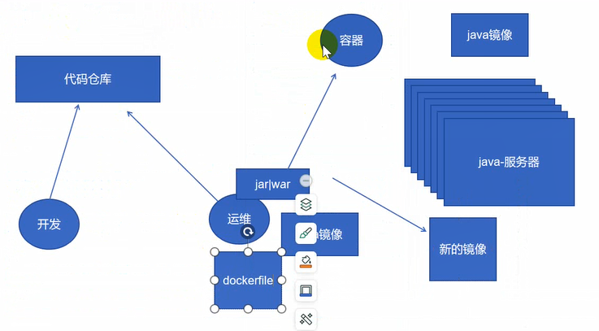

dockerfile

将镜像保存为压缩文件

```
11：
[root@www ~]# docker save web1:v1 -o web1.tar.gz
[root@www ~]# scp web1.tar.gz 192.168.18.13:/root/


13：解压
[root@www ~]# docker load -i web1.tar.gz 

```


docker与外部通信

网络模式：- - network

​			bridge： 默认，桥接到docker0上

​			host： 容器共享宿主机网络

​			none： 隔离模式

​			container： 联盟，容器之间共享一个网络空间

​			自定义网络：docker network create --subnet 172.18.0.0/24 --gateway 172.18.0.1 docker1(自己去名)

​									使用：docker run -it --rm --network docker1 busybox:latest /bin/sh

​			

```
11：
[root@www ~]# docker exec -it 8616d20b5020 /bin/bash
root@8616d20b5020:/# curl www.baidu.com==可以访问外部，但是只作为容器的内网
[root@www ~]# docker inspect 20730052546c===查询容器ip0.2
[root@www ~]# ping 172.17.0.3

[root@www ~]# docker network ls   ===查看docker的网络
NETWORK ID     NAME      DRIVER    SCOPE
e0c970eec7b4   bridge    bridge    local===桥接
abd8055f0098   host      host      local====主机
8e44c617782e   none      null      local

[root@www ~]# docker run --name web3 --network host nginx:latest==容器网络使用宿主机网络--host
浏览器中访问：192.168.18.11==nginx页面


[root@www ~]# docker run -it --rm --network container:8616d20b5020 busybox:latest /bin/sh====访问web1，联盟就是容器与容器间的访问
/ # wget -O - -q http://127.0.0.1  ===大O
<h1> this is y2312 site </h1>

自定义网桥：
--subnet ---指定ip地址范围
docker network create --subnet 172.18.0.0/24 --gateway 172.18.0.1 docker1
[root@www ~]# docker run -it --rm --network docker1 busybox:latest /bin/sh
/ # ping www.baidu.com===可以ping通外部
=======》ping 172.17.0.1可以ping通，ping0.2时不行（网桥），需要借助外部插件打通网络

​			-v挂载：容器数据持久化

​			nginx -v  webroot/:usr/share/nginx/html/   ===webroot/代码拉去或者克隆的根目录
```


dockerfile：构建镜像

​		FROM: 指明基础镜像

​		RUN: 在构建镜像时运行指令

​		LABEL:  autho=wyxmr1025

​		CMD: 运行容器时执行的指令有====> [ ] 和sh -c

​		ENTRYPOINT 运行容器时执行的指令,性能优于CMD

​		ADD:复制并压缩文件

​		COPY:复制

​		

开发将代码提交到代码仓库（gitlab），如果代码更新或者改变通过weg钩子来触发，我们就去拉去下来编译成war/jar包部署到java-服务器上面，可以通过ansible部署到java-服务器上面，这些服务器可以做成一个一个的容器，将编译构建好的代码与容器进行部署----此时解决方案构建新的镜像然后部署，使用这些新的镜像可以使用Dockerfile




```
docker官网---doc文档---相关reference---有dockerfile的文档

[root@www ~]# mkdir y2312dockerfile/
[root@www ~]# cd y2312dockerfile/
[root@www y2312dockerfile]# vi Dockerfile==构建镜像
FROM centos:7
[root@www y2312dockerfile]# docker build . -t y2312web:v0.0.1===镜像y2312web==此时不能跑起来，没有进程运行在前台，可以安装一个web服务器

安装httpd
vi Dockerfile                                
FROM centos:7========可替代为almalinux:9
RUN yum install httpd -y
[root@www y2312dockerfile]# docker build . -t y2312web:v0.0.2
[root@www y2312dockerfile]# curl 127.0.0.1===页面出现

vi Dockerfile
...
CMD httpd
[root@www y2312dockerfile]# docker build . -t y2312web:v0.0.4

进程运行在前台：httpd -DFROEGROUND
vi Dockerfile
..
CMD httpd -DFROEGROUND   ====先执行shell脚本，在去执行httpd，官网推荐使用[]这个
或者 CMD ["httpd", "-DFOREGROUND"]   ===直接执行httpd
[root@www y2312dockerfile]# docker run y2312web:v0.0.5==运行在前台

提供页面文件：ADD COPY都可以提供文件，区别在于
vi Dockerfile
..
COPY index.html /var/www/html/
vi index.html
<h1>this is dockerfile</h1>
[root@www y2312dockerfile]# docker build . -t y2312web:v0.0.7
[root@www ~]# docker inspect ca3975cbb618===查询v0.0.7的ip地址
[root@www ~]# curl 172.17.0.3
<h1>this is dockerfile</h1>

压缩并解压：ADD
[root@www y2312dockerfile]# tar -zcf index.html.tar.gz index.html
vi Dockerfile
ADD index.html.tar.gz /var/www/html/
docker build . -t y2312web:v0.0.8
docker run y2312web:v0.0.8
[root@www ~]# curl 172.17.0.3
<h1>this is dockerfile</h1>
[root@www ~]# docker exec 46d45f876f67 ls /var/www/html===查询是否有index.htmml
index.html

```

代码跟新 git pull clone 构建 copy /var/www/html 镜像 部署新构建的镜像


lamp平台上部署wordpress===需要php php-mysqlnd

```
yum install lrzsz -y

vi Dockerfile
FROM centos:7=======替代：almalinux:9 | rockylinux:latest|amazonlinux:2
RUN yum install httpd php php-mysqlnd -y
ADD  wordpress-3.3.1-zh_CN.tar.gz /var/www/html/
RUN chown -R apache:apache /var/www/html/wordpress
CMD ["httpd", "-DFOREGROUND"]
docker run -d -p 8091:80 y2312web:v0.0.9
浏览器中访问192.168.18.11:8091/wordpress/=====写入，没有权限===
向Dockerfile中
RUN chown -R apache：apache /var/www/html/wordpress
[root@www y2312dockerfile]# docker build . -t y2312web:v0.1.0
[root@www y2312dockerfile]# docker run -d -p 8092:80 y2312web:v0.1.0

```

两个容器公用一个网络：       

dockerhub官网搜索： mysql 数据库在容器外面

数据库：

 -e  ==指定环境变量

MYSQL_ROOT_PASSWORD

MYSQL_DATABASE

MYSQL_USER

MYSQL_PASSWORD

指定字符集：--character-set-server=utf8mb4 --collation-server=utf8mb4_unicode_ci

```
11: -e====指定环境变量
拉去mysql镜像：
[root@www y2312dockerfile]# docker pull mysql:5.5.62

[root@www y2312dockerfile]# docker run -d -e MYSQL_ROOT_PASSWORD=Aa@123456 -e MYSQL_DATABASE=wordpress -e MYSQL_USER=wpuser -e MYSQL_PASSWORD=Aa@123456 mysql:5.5.62 --character-set-server=utf8mb4 --collation-server=utf8mb4_unicode_ci
查看拉去的镜像：docker images  ====复制编号
查看镜像的相关信息： docker ps 编号 ===得出镜像的ip地址
[root@www y2312dockerfile]# mysql -h172.17.0.6 -uroot -p
[root@www y2312dockerfile]# mysql -h 172.17.0.6 -uwpuser -p
都可以正常来访问mysql
[root@www y2312dockerfile]# docker rm -f `docker ps -aq`
[root@www y2312dockerfile]# docker run -d -p 8093:80 y2312web:v0.1.0===跑wordpress
0ab25798edf509ec350c29d8630bd164989a30844fcf8266992c53d8ca1eb9f8
[root@www y2312dockerfile]# docker run -d -e MYSQL_ROOT_PASSWORD=Aa@123456 -e MYSQL_DATABASE=wordpress -e MYSQL_USER=wpuser -e MYSQL_PASSWORD=Aa@123456 --network container:0ab25798edf509ec mysql:5.5.62 --character-set-server=utf8mb4 --collation-server=utf8mb4_unicode_ci   ====公用一个容器网络


++++
以上是部署在两个容器中
```


部署一个数据库和程序在一个平台上：

```
vi Dockerfile
ENTRYPOINT ["httpd", "-DFOREGROUND"]
docker build . -t y2312web:v0.1.1
docker run --rm y2312web:v0.1.1

当既有cmd又有entrypoint
CMD sleep 3000
ENTRYPOINT httpd -DFOREGROUND
[root@www y2312dockerfile]# docker build . -t y2312web:v0.1.3
[root@www y2312dockerfile]# docker run --rm y2312web:v0.1.3
======》同时有cmd和entrypoint时运行的是后者
docker run --rm --entrypoint /bin/sh y2312web:v0.1.3

```


```
11：先启动mysql

FROM centos:7
RUN yum install httpd php php-mysqlnd mariadb-server -y
ADD  wordpress-3.3.1-zh_CN.tar.gz /var/www/html/
RUN chown -R apache:apache /var/www/html/wordpress
[root@www y2312dockerfile]# docker build . -t y2312web:v0.1.3
docker run -it y2312web：v0.1.3 /bin/bash
数据库启动的脚本
[root@www ~]# vi /usr/lib/systemd/system/mariadb.service |或在/etc/systemd/system/mysqld.service | /etc/init.d/mysqld（传统 init.d 启动脚本
）|/usr/local/mysql/support-files/mysql.server（源码或者二进制安装）

初始化数据库目录
[root@1ea3026eabdd /]# /usr/libexec/mariadb-prepare-db-dir 
[root@1ea3026eabdd /]#=运行在后台
[root@1ea3026eabdd /]# /usr/libexec/mysqld -umysql &
[root@1ea3026eabdd /]# mysql -e 'create database wordpress'===外部创建mysql
[root@1ea3026eabdd /]# mysql -e "grant all privileges on *.* to 'wpuser'@'localhost' identified by 'Aa@123456'"======》外部授权：
[root@1ea3026eabdd /]# mysql -e 'flush privileges'
mysql -uwpuser -h127.0.0.1 -p===Aa@123456

写在脚本里面
vi start.sh
#!/bin/bash
1、初始化数据库===》 /usr/libexec/mariadb-prepare-db-dir
2、启动mysql（后台）==>/usr/libexec/mysqld -umysql &
sleep 2
3、创建数据库并授权==> mysql -e "grant all privileges on *.* to 'wpuser'@'localhost' identified by 'Aa@123456' ;create database wordpress;flush privileges "
4、启动httpd===>httpd -DFOREGROUND

vi Dockerfile
FROM centos:7
RUN yum install httpd php php-mysqlnd mariadb-server -y
ADD  wordpress-3.3.1-zh_CN.tar.gz /var/www/html/
RUN chown -R apache:apache /var/www/html/wordpress && mkdir /app/
WORKDIR /app  ===指定工作目录
COPY --chmod=0755 start.sh ./ =====./指的是/app
ENTRYPOINT ./start.sh  ===执行脚本
[root@www y2312dockerfile]# docker build . -t y2312web:v0.1.5
[root@www y2312dockerfile]# docker run -p 8099:80 y2312web:v0.1.5
==浏览器中输入192.168.18.11：8099/wordpress

```

> xxx.启动脚本=> /usr/lib/systemd/system/mariadb.service  ==>centos7+centos9
>
> 或在/etc/systemd/system/mysqld.service => centos7
>
> /etc/init.d/mysqld（传统 init.d 启动脚本）=>一般为centos6
>
> /usr/local/mysql/support-files/mysql.server（源码或者二进制安装）

sqli-labs为靶场注入（是word press写的lamp平台）

```
[root@www ~]# mkdir y2312wordpress
[root@www ~]# cd y2312wordpress/
vi Dockerfile
FROM c0ny1/sqli-labs:0.1   sql注入的靶场平台，此时作为一个基础镜像，搭建好的wordpress镜像里面有php、mysqld、等搭建好的lamp平台
COPY --chmod=0755 mysql-setup.sh ./
RUN rm -rf /var/www/html/*
ADD wordpress/ /var/www/html/

vi mysql-setup.sh
#!/bin/bash
mysql -uroot -e "CREATE USER 'wpuser'@'%' IDENTIFIED BY 'Aa@123456'";
mysql -uroot -e "GRANT PRIVILEGES ON *.* TO 'wpuser'@'%' WITH GRANT OPTION";
mysql -uroot -e "create database wordpress";
[root@www y2312wordpress]# cp ../y2312dockerfile/wordpress-3.3.1-zh_CN.tar.gz ./
[root@www y2312wordpress]# tar -xf wordpress-3.3.1-zh_CN.tar.gz 
[root@www y2312wordpress]# docker build . -t wordpress:v0.0.1
[root@www y2312wordpress]# docker run -p 8090:80 wordpress:v0.0.1

```

**注意：**

```
# docker exec与attach的区别：
1、docker exec进入容器会开启一个新的终端，退出容器时容器不会停止
2、docker attach表示进入正在运行的容器，退出容器时容器会停止

docker使用了写时复制cow(copy-on-write)和用时分配(allocate-on-demand)技术来提高存储的利用率。

# docker如何占用更少的空间？
答：写时复制用时分配，同时配合overlay2联合文件系统可以大大提升存储的应用
```

