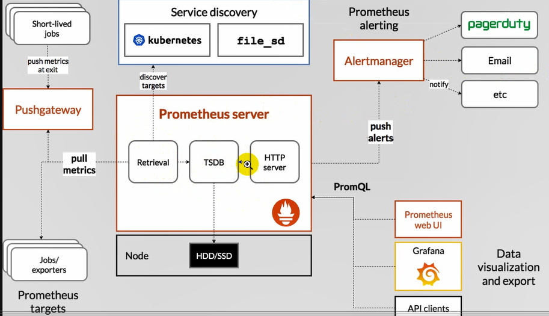

## prometheus： 容器类的监控

#### 1、采集信息监控主键：

```
采集数据： exporter（客服端）

存储数据： tsdb（time service时序数据库，时间戳，类似于坐标的，数据量大）

数据展示： grafana

故障告警：alertmanger
```

#### 2、prometheus监控原理：

```
最核心的是prometheus server，TSDB时序数据库存放到硬盘中，采集数据的客服端exporter  pull拉去到时序数据库中，每隔时间间隔收集一次，放到时序数据库中，再通过http server 输出到页面，页面功能不是很强大，就通过grafana  web接口，在grafana来展示。也可以将告警push 到alertmanage发送给邮件/dingding/企业微信。同时也支持服务发现机制，动态收集各种pod和组件。监控收集的数据主动推送到pushgateway，然后prometheus主动去拉去
```



#### 3、安装promethtus:

```
101：
解压prometheus----进入prometheus---启动
[root@www prometheus-2.51.0.linux-amd64]# ./prometheus --config.file="prometheus.yml"
浏览器中输入： ip:9090出现prometheus页面
时间同步：chronyc sources -v
date -s "2024-03-26 16:37"
systemctl restart chronyd


102:节点
如果没有自己的exporter就要自己去写exporter在9100端口
解压node-export---进入node-export--启动./node-export

将node-export收集的数据统一到prometheus中，在官网查看文档
101：vi prometheus.yml
 - job_name: "node-exporter"
    static_configs:
      - targets: ["192.168.18.102:9100"]
        labels:  ===打标签（做数据过滤）
          class: y2312
```

#### 4、k8s集群中引入prometheus：

```
将prometheus部署到k8s中：采集k8s里面的数据，采集node数据、k8s的数据：api-server的数据、schduler kuberlet、etcd coredns的数据，此时只需要一个基础镜像，将prometheus这个二进制文件考到里面，采集的数据也要做持久化所以还要把目录弄进去，还要提供配置文件通过k8s的configmap，还要权限rbac
100：
rbac pv-pvc configmap dep svc
创建名称空间：
kubectl create ns monitor====存放prometheus的配置
[root@www monitor]# kubectl create ns monitor
namespace/monitor created
[root@www monitor]# kubectl apply -f rbac.yaml 

101：[root@www ~]# mkdir -pv /data/k8s/prometheus====存放prometheus收集的数据

[root@www monitor]# kubectl apply -f pv-pvc.yaml configmap.yaml
vi dep.yaml
 args:
            - '--config.file=/etc/prometheus/prometheus.yml'
            - '--storage.tsdb.path=/prometheus' # 指定tsdb数据路径
            - '--storage.tsdb.retention.time=24h'
            - '--web.enable-admin-api' # 控制对admin HTTP API的访问，其中包括删除时间序列等功能
            - '--web.enable-lifecycle' # 支持热更新，直接执行post localhost:9090/-/reload立即生效
[root@www monitor]# kubectl taint node www.y2312node1.com hobby-  ====》删除污点
```

#### 5、监控主键之coredns

```
监控coredns：
10.244.0.14
10.244.0.12

vi configmap.yaml
- job_name: 'coredns'
      static_configs:
      - targets: ['10.244.0.14:9153','10.244.0.12:9153']
kubectl apply -f configmap.yaml
k9s中monitor===service====ip：31207
浏览器中输入：192.168.18.102:31207====出现prometheus页面

监控： coredns kubelet apiserver scheduler controller-manager etcd node-exporter等主键监控起来

1、coredns监控：coredns（kube-system）默认通过svc暴露出来的
k9s中kube-system=====svc===coredns端口===》10.96.0.10：9153端口
[root@www monitor]# curl http://10.96.0.10:9153/metrics
10.244.0.16===针对的写死的
10.244.0.15
vi configmap.yaml
 - job_name: 'coredns'
      static_configs:
      - targets: ['10.244.0.16:9153','10.244.0.15:9153']
[root@www monitor]# kubectl get pod -n monitor -o wide得知
10.244.2.10
重载：curl -x POST http://10.244.2.10:9153/-/reload

或者：k9s中====monitor===删除就重载==浏览器中输入：192.168.18.102:31207===出现coredns的endpoints===出现很多====只要9153的====筛选====relabel_configs标签来筛选

针对动态ip：kubernetes_sd_configs--k8s的服务发现，基于node、service、pod、endpoints发现、基于role发现

vi configmap.yaml
- job_name: 'coredns'
      kubernetes_sd_configs:
      - role: endpoints
      针对标签：
      relabel_configs:
      - source_labels: [__meta_kubernetes_namespace,__meta_kubernetes_endpoints_name]
        regex: kube-system;kube-dns
        action: keep
        保留9153的端口丢掉53端口：
      - source_labels: [__address__]
        regex: (.*):53
        action: drop
浏览器中：得知有两种标签，一种源标签，一种过滤标签
```

#### 6、监控主键之node-exporter

```
2、监控节点node-exporter，每个node上面都要部署，可以使用k8s的DaemonSet,产生信息的节点可以挂载进去，部署在容器里面
hostPID: true==使用节点的id
hostIPC: true
hostNetwork: true==使用节点的网络
vi configmap.yaml
 - job_name: 'node_exporter'
   kubernetes_sd_configs:
   - role: node
	将端口10250改成9100端口：
   relabel_configs: 
   - source_labels: [__address__]
     regex: (.*):10250
     replacement: $1:9100
     action: replace
     target_label: __address__
```

#### 7、监控主键值之kubelet

```
3、kubelet监控：
kubelet基于https访问，需要证书双向认证
证书和token放在：/var/run/secrets/kubernetes.io/serviceaccount/
vi configmap.yaml
- job_name: 'kubelet'
      kubernetes_sd_configs:
      - role: node
      scheme: https  --指定协议
      tls_config:
        ca_file: /var/run/secrets/kubernetes.io/serviceaccount/ca.crt
        insecure_skip_verify: true
      bearer_token_file: /var/run/secrets/kubernetes.io/serviceaccount/token
```


#### 8、监控主键之cAdvisor

```
4、cAdvisor监控：提供容器自身的性能指标
cAdvisor 已经内置在了 kubelet 组件之中，所以我们不需要单独去安装，cAdvisor 的数据路径为 /api/v1/nodes/<node>/proxy/metrics
查看cadvisor： curl -k https://192.168.66.90:10250/metrics/cadvisor===显示没有认证
vi configmap.yaml
 - job_name: 'cadvisor'
      kubernetes_sd_configs:
      - role: node
      relabel_configs:
      - action: labelmap  ====标签映射
        regex: __meta_kubernetes_node_label_(.+)
        replacement: $1
      scheme: https
      metrics_path: /metrics/cadvisor
      tls_config:
        ca_file: /var/run/secrets/kubernetes.io/serviceaccount/ca.crt
        insecure_skip_verify: true
      bearer_token_file: /var/run/secrets/kubernetes.io/serviceaccount/token
```

#### 9、监控主键之api-server

```
5、api-server监控：默认监听在6443的端口
以pod运行，pod以endpoints发现====api-server以endpoints运行
静态pod：写在/etc/kubenetes/manifests
动态pod：通过apply获取的
vi configmap.yaml
- job_name: 'api-server'
      kubernetes_sd_configs:
      - role: endpoints
      scheme: https
      tls_config:
        ca_file: /var/run/secrets/kubernetes.io/serviceaccount/ca.crt
        insecure_skip_verify: true
      bearer_token_file: /var/run/secrets/kubernetes.io/serviceaccount/token
      relabel_configs:
      - source_labels: [__meta_kubernetes_namespace,__meta_kubernetes_endpoints_name]
        regex: default;kubernetes
        action: keep
```

#### 10、监控主键之etcd

```
6、etcd监控：
默认监听在2379端口
vi /etc/kubernetes/main../etcd.yaml
- --listen-metrics-urls=http://0.0.0.0:2381===改地址
此时集群会掉====[root@www manifests]# curl http://192.168.18.100:2381/metrics

vi etcd-endpoints.yaml===创建endpoint
apiVersion: v1
kind: Endpoints
metadata:
  name: etcd-svc
  namespace: kube-system
subsets:
- addresses:
  - ip: 192.168.18.100
  ports:
  - name: metrics
    port: 2381
  
vi etcd-svc.yaml===创建service
apiVersion: v1
kind: Service
metadata:
  name: etcd-svc
  namespace: kube-system
spec:
  ports:
  - name: metrics
    port: 2381
    targetPort: 2381

vi configmap.yaml
- job_name: 'etcd'
      kubernetes_sd_configs:
      - role: endpoints
      relabel_configs:
      - source_labels: [__meta_kubernetes_namespace,__meta_kubernetes_endpoints_name]
        regex: kube-system;etcd-svc
        action: keep
采集数据： 基于角色来发现，根据源标签来保留或丢弃等


抓取数据：
1 static_config：静态
2 kubernetes_sd_config：动态
  - role： node|endpoints
  relabels：
  - sourse_labels: []
    sperator
    regex:
    action: keep|drop|replacement
    target_label:替换的标签
```

#### 11、监控主键之kube-controller

```
7、kube-controller监控：默认监听端口10257
vi /etc/kubernetes/manifests/kube-controller-manager.yaml
 - --bind-address=0.0.0.0===修改ip
 
vi controller-endpoints.yaml
apiVersion: v1
kind: Endpoints
metadata:
  name: controller-svc
  namespace: kube-system
subsets:
- addresses:
  - ip: 192.168.18.100
  ports:
  - name: metrics
    port: 10257

vi controller-svc.yaml
apiVersion: v1
kind: Service
metadata:
  name: controller-svc
  namespace: kube-system
spec:
  ports:
  - name: metrics
    port: 10257
    targetPort: 10257

vi configmap.yaml
- job_name: 'controller-manager'
      kubernetes_sd_configs:
      - role: endpoints
      relabel_configs:
      - source_labels: [__meta_kubernetes_namespace,__meta_kubernetes_endpoints_name]
        regex: kube-system;controller-svc
        action: keep
      scheme: https
      tls_config:
        ca_file: /var/run/secrets/kubernetes.io/serviceaccount/ca.crt
        insecure_skip_verify: true
      bearer_token_file: /var/run/secrets/kubernetes.io/serviceaccount/token
```

>
>
>要求重启快一些，再节点node1上：rm -rf /data/k8s/prometheus/* （生产坏境不允许）

#### 12、监控主键之scheduler

```
8、scheduler监控：默认端口10259
vi /etc/kubernetes/manifests/kube-scheduler.yaml 
- --bind-address=0.0.0.0
labelmap：标签映射

vi scheduler-endpoints.yaml
apiVersion: v1
kind: Endpoints
metadata:
  name: scheduler-svc
  namespace: kube-system
subsets:
- addresses:
  - ip: 192.168.18.100
  ports:
  - name: metrics
    port: 10259

vi scheduler-svc.yaml
apiVersion: v1
kind: Service
metadata:
  name: scheduler-svc
  namespace: kube-system
spec:
  ports:
  - name: metrics
    port: 10259
    targetPort: 10259

vi configmap.yaml
- job_name: 'scheduler-manager'
      kubernetes_sd_configs:
      - role: endpoints
      relabel_configs:
      - source_labels: [__meta_kubernetes_namespace,__meta_kubernetes_endpoints_name]
        regex: kube-system;scheduler-svc
        action: keep
      - action: labelmap====映射，匹配到的标签作为过滤标签
        regex: __meta_kubernetes_node_label_(.+)===将这个标签后面所有的标签替换成$1
        replacement: $1===将$1的标签映射成过滤标签
      scheme: https
      tls_config:
        ca_file: /var/run/secrets/kubernetes.io/serviceaccount/ca.crt
        insecure_skip_verify: true
      bearer_token_file: /var/run/secrets/kubernetes.io/serviceaccount/token

监控---展示---告警---prometheus-operator
```

注意：

```
基于endpoints发现：cordns、api-server、etcd、controller-manager、scheduler
基于node发现：node-exportor、kubelet、cAdvisor
```

#### 13、监控之kube-state-metrics

​	作用： 主要提供容器自身启动次数，失败次数、磁盘使用率等

```
github.com上查找：kube-state-metrics/examples/standard
```

