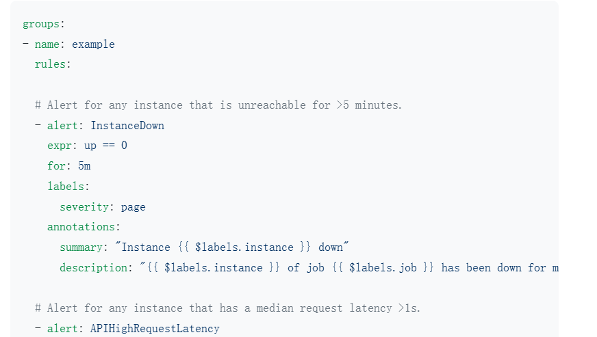
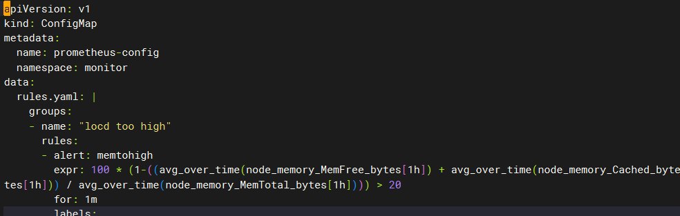
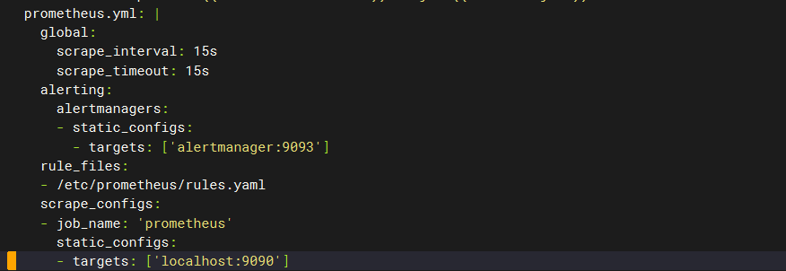

## prometheus监控告警之altermanager

#### 1、告警规则：

```
alertmanager的configmap.yaml文件（alert-config.yaml）
alert：

	global：

	route：

			group by：分组

		    routes：

			    match:===>标签来匹配

     receivers：
```

#### 2、prometheus的告警之alertmanger:

```
prometheus的configmap.yaml文件
global：指定规则文件

rule_files：
- /etc/prometheus/alertrule

alerting：告警

	alertmanagers：

 	- static_configs：
    	- tagerts:
scrape_configs:
- job_name: 'node-exporter'

qq授权码：umywuycjtnotidbh|blndllrisdezhjja

```



####  3、k8s集群引入altermanager

```
1、告警媒介：email
100：
写在alertmanager中的configmap中书写方式：
vi alert-config.yaml
apiVersion: v1
kind: ConfigMap
metadata:
  name: alert-config
  namespace: monitor
data:
  config.yml: |-
    global:
      # 当alertmanager持续多长时间未接收到告警后标记告警状态为 resolved
      resolve_timeout: 5m===解决的时间
      # 配置邮件发送信息
      smtp_smarthost: 'smtp.qq.com:25'====qq服务器的端口25
      smtp_from: '100898646@qq.com'
      smtp_auth_username: '100898646@qq.com'
      smtp_auth_password: 'jejpfmpckffkcbcc'
      smtp_hello: 'hello'
      smtp_require_tls: false
    # 所有报警信息进入后的根路由，用来设置报警的分发策略
    route:====路由：主要是用来分组的
      # 这里的标签列表是接收到报警信息后的重新分组标签，例如，接收到的报警信息里面有许多具有 cluster=A 和 alertname=LatncyHigh 这样的标签的报警信息将会批量被聚合到一个分组里面
      group_by: ['alertname', 'cluster']
      # 当一个新的报警分组被创建后，需要等待至少 group_wait 时间来初始化通知，这种方式可以确保您能有足够的时间为同一分组来获取多个警报，然后一起触发这个报警信息。
      group_wait: 30s

      # 相同的group之间发送告警通知的时间间隔
      group_interval: 30s

      # 如果一个报警信息已经发送成功了，等待 repeat_interval 时间来重新发送他们，不同类型告警发送频率需要具体配置
      repeat_interval: 1h===想通告警等一小时才会再次发送

      # 默认的receiver：如果一个报警没有被一个route匹配，则发送给默认的接收器
      receiver: default===告警接受者，以上是一条默认路由

      # 上面所有的属性都由所有子路由继承，并且可以在每个子路由上进行覆盖。
      routes:
      - receiver: email==接受者
        group_wait: 10s
        group_by: ['instance'] # 根据instance做分组
        match:
          team: node==匹配标签，，并按instance来分组
    receivers:=====》这里定义email，这个接受者
    - name: 'default'
      email_configs:
      - to: '1491506452@qq.com'
        send_resolved: true  # 接受告警恢复的通知
    - name: 'email'
      email_configs:
      - to: '1491506452@qq.com'
        send_resolved: true

部署alertmanager：创建deployment和service并进行挂载
vi alert-dep-svc.yaml
apiVersion: apps/v1
kind: Deployment
metadata:
  name: alertmanager
  namespace: monitor
  labels:
    app: alertmanager
spec:
  selector:
    matchLabels:
      app: alertmanager
  template:
    metadata:
      labels:
        app: alertmanager
    spec:
      volumes:
        - name: alertcfg
          configMap:
            name: alert-config
      containers:
        - name: alertmanager
          image: prom/alertmanager:v0.24.0
          imagePullPolicy: IfNotPresent
          args:
            - '--config.file=/etc/alertmanager/config.yml'
          ports:
            - containerPort: 9093
              name: http
          volumeMounts:
            - mountPath: '/etc/alertmanager'
              name: alertcfg
          resources:
            requests:
              cpu: 100m
              memory: 256Mi
            limits:
              cpu: 100m
              memory: 256Mi
---

apiVersion: v1
kind: Service
metadata:
  name: alertmanager
  namespace: monitor
  labels:
    app: alertmanager
spec:
  selector:
    app: alertmanager
  type: NodePort
  ports:
    - name: web
      port: 9093
      targetPort: http

转义： yum install dos2unix
dos2unix alert-config.yaml

k9s中===monitor===svc====alertmanager暴露的端口：30517
浏览器中输入：192.168.18.100:30965

prometheus触发告警交给alertmanager：
global：
	rule_files：==指定告警规则
	- /etc/prometheus/alert.rule
alerting：
	alertmanagers：
	- static_configs：  ===静态配置
		targets：[]
		
prometheus的configmap.yaml文件中添加告警规则：		
vi  configmap.yaml
rules.yml: |
    groups:
    - name: "locd too high"
      rules:
      - alert: memtohigh
        expr: 100 * (1-((avg_over_time(node_memory_MemFree_bytes[1h]) + avg_over_time(node_memory_Cached_bytes[1h]) + avg_over_time(node_memory_Buffers_bytes[1h])) / avg_over_time(node_memory_MemTotal_bytes[1h]))) > 20
        for: 1m
        labels:
          team: node
        annotations:
          summary: "Instance {{ $labels.instance  }} memory too high"
          description: "{{ $labels.instance  }} of job {{ $labels.job }} has been down for more then 5 minutes."
....
alerting:
   alertmanagers:
   - static_configs:
     - targets: ['alertmanager:9093']
rule_files:
- /etc/prometheus/rules.yml
101：先清除一下prometheus内容：rm -rf /data/k8s/prometheus/*
k8s中删除prometheus触发告警
qq验证码：ydxgntyobmjvgegi
```





#### 4、altermanager告警路由之钉钉

```
2、alertmanager支持邮箱、微信、但不支持钉钉，但是有webhook
https://oapi.dingtalk.com/robot/send?access_token=0f3f7d655d198536fd14e43195190fbe374ca5751732e7d6734077242fa43a78
最后在win7上添加环境变量：DURL:钉钉机器人的url

alertmanager----》http请求------》创建web服务器（格式转化）----》钉钉机器人
           ------》email
自己开发一个web服务器：模拟一个curl命令，使用curl来模拟alertmanager 来发送一个webhook的数据，在通过格式转换成钉钉机器人能识别的。可以使用glang 或者python来写一个web服务器

alertmanager的json格式---->转化为webhook的结构------>webhook的结构转化为钉钉的结构-->发送给钉钉

alertmanager 的json格式----反序列化为go 的alertmanager的数据结构----钉钉的数据结构序列化json----发送给钉钉
dingding：
main.go

package main

import (
	"encoding/json"
	"fmt"
	"io"
	"net/http"
	"os"
	"github.com/gin.gonic/gin"
)

//alertmanager webhook 数据结构
type AlerManagerWebhook struck {
	Alerts []struct {
		Labels map[string]string `json:"labels"`
		Annotations map[string]string `json:"annotations"`
		StartsAt string `json:"startsAt"`
		EndsAt string `json:"endsAt"`
	} `json:"alerts"`
}

//钉钉机器人消息结构
type DingTalkMessage struct {
	MsgType string `json:"msgtype"`
	Markdown struct {
		Title string `json:"title"`
		Text string `json:"text"`
	} `json:"markdown"`
}

func main() {
	dingTalkWebhookURL := os.Getenv("DURL") //通过url获取环境变量
    if dingTalkWebhookURL == "" {
		log.Fatal("系统环境变量 DURL 未设置，请设置顶顶机器人 Webhook URL,并重启程序")
		return
	}
	r := gin.Default()//配置默认路由
	
	//配置路由，用于接收Alertmanager webhook 的数据
	r.POST("/alertmanager/webhook", func(c *gin.Context){
		var webhookData ALertManagerWebhook
		
		//解析json请求体（反序列化）
		if err := c.ShouldBindJSON(&webhookData); err != nil {
			c.JSON(http.StatusBadRequest,gin.H{"error": err.Error()})
			return
		}
		
		//构建要发送到顶顶的Markdown消息
		var markdownContent string
		for _, alert := range webhookData.Alerts {
			markdownContent += fmt.sprintf("### 监控告警开始时间：%s\n",alerts.StartsAt)
			markdownContent += fmt.sprintf("### 监控告警结束时间：%s\n",alerts.EndsAt)
			markdownContent += fmt.sprintf("### 标签：\n```\n%v\n```\n",alerts.Labels)
			markdownContent += fmt.sprintf("###注释：\n```\n%v\n```\n",alerts.Annotations)
			markdownContent += "\n"
		}
		markdownContent += "\n"
		
		//构建钉钉消息
		dingTalkMessage := DingTalkMessage{
			MsaType: "markdown",
			Markdown: struct {
				Title string `json:"title"`
				Text string `json:"text"`
			}{
				Title: "y2312",
				Text: markdownContent,
			},
		}
		
		if err := sendToDingTalk(dingTalkWebhookURL, dingTalkMessage); err != nil {
			log.Printf("发送钉钉失败: %v", err)
			c.JSON(http.StatusBadRequest, gin.H{"error":"无法发送消息到钉钉"})
			return
		}
		c.JSON(http.StatusOK, gin.H{"message": "成功发送消息到钉钉"})
	})
	
	//启动web服务器
	if err := r.Run(":8080"); err != nil{
		log.Fatalf("无法启动 web 服务器：%v", err)
	}
}

//发送消息到钉钉的方法
func sendToDingTalk(webhookURL string, message DingTalkMessage) error {
	//将消息结构体转换为JSON
	messageJSON, err := json.marshal(message)
	if err != nil {
		return err
	}
	
	//发送POST请求到钉钉机器人的webhook URL
	resp, err := http.Post(webhookURL,"applcation/json", bytes.NewBuffer(messageJSON))
	if err != nil{
	return err
	}
	defer resp.Body.Close()
	body,_ := io.ReadAll(resp.Body)
	//检查响应状态码
	log.Print("body:%v\n", string(body))
	if resp.StatusCode != http.StstusOK {
	return fmt.Errorf("非预期的响应状态码：%d", resp.StatusCode)
	}
	
	return nil
}
修改win中的环境变量DURL:顶顶机器人的地址

触发alertmanager 告警： 100中输入
curl -X POST  -H "Content-Type: application/json" -d '{
	"status": "firing",
	"labels": {
		"alertname": "ExampleAlert",
		"severity": "critical"
		},
		"annotations": {
		  "summary": "This is a critical alert"
		}
}' http://192.168.66.91:8080/alertmanager/webhook
```

#### 5、打包altermanager钉钉告警镜像

```
在win中的vscode中编译go文件：set GOOS=linux; set GOARCH=amd64 go build -o webhook main.go
101：打包镜像到k8s中
export DURL="https://oapi.dingtalk.com/robot/send?access_token=0f3f7d655d198536fd14e43195190fbe374ca5751732e7d6734077242fa43a78"

mkdir dingdockerfile
cp dingding dingdockerfile/
cd dingdockerfile
vi Dockerfile
FROM centso:7
WORKDIR /app
COPY dingding ./
RUN chmod +x ./dingding
CMD ./dingding  ===运行钉钉
docker build . -t dingding：v1===此时跑不起来，没有传递环境变量
docker run -e DURL="XXX" 
打包成镜像部署到k8s中：
[root@www dingdockerfile]# docker tag dingding:v1 registry.cn-chengdu.aliyuncs.com/mr5/dingding:v1
[root@www dingdockerfile]# docker push registry.cn-chengdu.aliyuncs.com/mr5/dingding:v1


```

#### 6、将钉钉告警的镜像部署到k8s中

```
100：将钉钉部署到k8s：需要deployment service，但是钉钉要与alertmanager通信，可以卸载alertmanager的configmap和dep、svc的yaml文件中。
vi alert-dep-svc.yaml
containers:
        - name: dingding 
          image: registry.cn-chengdu.aliyuncs.com/mr5/dingding:v1
          imagePullPolicy: IfNotPresent
          env:
          - name: DURL
            value: https://oapi.dingtalk.com/robot/send?（钉钉机器人的token）access_token=0f3f7d655d198536fd14e43195190fbe374ca5751732e7d6734077242fa43a78
===一个alertmanager可以跑两个容器

修改配置文件，增加钉钉的告警
vi alert-config.yaml
routes:
      - receiver: dingding
        group_wait: 5s
        group_by: ['instance'] # 根据instance做分组
        match:
          team: node
receivers:
- name: 'dingding'
  webhook_configs:
  - url: 'http://localhost:8080/alertmanager/webhook'
 k9s中删除一下alertmanager和prometheus===》重新触发一下告警
 浏览器中输入：192.168.18.100:31207
 
prometheus的传统部署： 
1、采用tsdb 每隔15s scrap刮取会提供http服务将收取的数据暴露在http上面
2、刮去的指标：exporter一般是static_config 和kubernetes_sd_configs部署到k8s本身内部发现机制发现pod和组件，主要通过角色role的node和endpoints，可以把想要发现的pod和组件发现进来，有些不符合要求的可以通过relabel_configs正则表达式 替换 keep 等还有tls证书
3、promql查询的指标很多通过查询渲染到grafana上
4、alertmanage：
	global
	route
	  routes
	receiver
	写一些告警规则（通过mail和钉钉发送）
```


