# MySQL读写分离之MyCAT

# 学习目标

1、能够理解读写分离的目的

2、能够描述读写分离的常见实现方式

3、能够通过项目框架配置文件实现读写分离

4、能够通过`中间件`实现读写分离(学习的重点)

# 一、MySQL读写分离

## 1、业务背景描述

时间：2016.6-2017.9

发布产品类型：互联网动态站点 商城

用户数量： 2000-4000（用户量猛增了4倍）

PV ： 8000-50000（24小时访问次数总和）

DAU： 1500（每日活跃用户数）

之前是单台MySQL提供服务，使用多台MySQL数据库服务器，降低单台压力，实现集群架构的稳定性和高可用性    数据的一致性  完整性  replication

通过业务比对和分析发现，随着用户活跃增多，读取数据的请求变多，故着重解决读取数据的压力

## 2、模拟运维设计方案

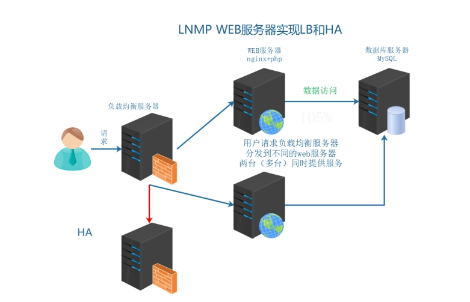

根据以上业务需求，在之前业务架构的基础上实现数据的读写分离。

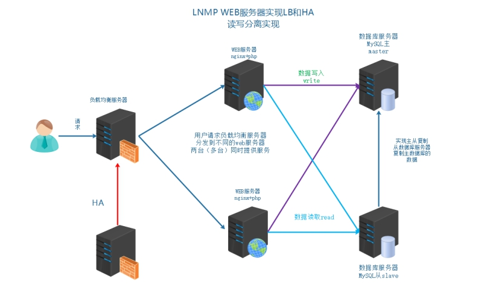

说明：

实现MySQL主从架构 => 解决单点故障问题

引入MyCAT不仅可以实现高可用，MyCAT软件还能实现读写分离技术（master既可以承担写操作也可以承担一部分读操作，slave从服务器可以承担部分读操作）

# 二、MySQL读写分离介绍

## 1、什么是读写分离

读写分离：读写操作，分发不同的服务器，读分发到对应的服务器（slave），写分发到对应的服务器（master）

master（主节点）、slave（从节点）

写操作 => 只能在master节点执行（主从架构中，只有主节点能实现写入）

读操作 => 既可以在master主节点，也可以在slave从节点

> 在生产环境中，一般可以配置一主多从架构。主节点只负责承担写入操作，从节点专门负责读操作。

## 2、读写分离的目的

读写分离  将读写业务分配到不同的服务器上，让服务器做特定的操作，不需要不断的切换工作模式，使工作效率提高

写主服务器，读从服务器

同时降低主服务器的压力，在正常业务下，也是读比较多的情况，写相对读少一些。

大约比例在写3/7读

读写分离：

①M-S下，读写必须分离，如果不分离，业务不可用出问题

②M-M 在此架构中，虽然可以随意读写操作，特定的操作交由特定的服务器操作，工作效率更高

## 3、读写分离的实现基础和原理

实现基础：通过主从复制机制实现数据的一致性、完整性

mysql的读写分离的基本原理是：

SQL语句

==让master（主数据库）来响应事务性操作（insert，update，delete，create，drop）==

==让slave（从数据库）来响应select非事务性操作==

然后再采用主从复制来把master上的事务性操作同步到slave数据库中

没有主从复制，就无法实现业务上的读写分离

## 4、读写分离常见的实现方式

**① 业务代码的读写分离**（了解）

需要在业务代码中，判断数据操作是读还是写，读连接从数据服务器操作，写连接主数据库服务器操作mysql01/mysql02

以当前LNMP为例，就需要使用PHP代码实现读写分离

在ThinkPHP6.0代码端对数据库的操作进行判断：

增加：

```sql
mysql> insert  into  数据表  values  (字段值,字段值,...);
```

删除：

```sql
mysql> delete  from 数据表 where 字段=字段值;
mysql> delete  from 数据表  where 字段  in (字段值1,字段值2...);
mysql> delete  from  数据表;
```

修改：

```sql
mysql> update  数据表  set  字段=字段的值  where  字段=字段值;
mysql> update  数据表  set  字段=字段的值;
```

查询：

```sql
mysql> select  */字段列表  from 数据表;
```

如果insert/update/delete操作，自动连接master主数据库。

如果select操作，自动连接slave从数据库。

**② 中间件代理方式的读写分离**

在业务代码中，数据库的操作，不直接连接数据库，而是先请求到中间件服务器（代理）

由代理服务器，判断是读操作去从数据服务器，写操作去主数据服务器

| 名称        | 描述                                                         |
| ----------- | ------------------------------------------------------------ |
| MySQL Proxy | MySQL官方 测试版 不再维护                                    |
| Atlas       | 奇虎360 基于MySQL Proxyhttps://github.com/Qihoo360/Atlas/blob/master/README_ZH.md |
| DBProxy     | 美团点评                                                     |
| Amoeba      | 早期阿里巴巴                                                 |
| cobar       | 阿里巴巴                                                     |
| MyCat       | 基于阿里开源的Cobar                                          |
| kingshard   | go语言开发https://github.com/flike/kingshard                 |

也就是如下图所示架构

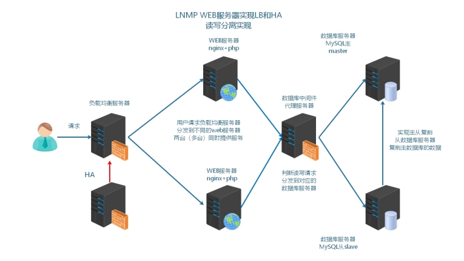

问：如何选择？

① 业务上实现更加方便，成本低一下，如果使用的开发框架不支持分布式数据库的部署模式，

业务的SQL需要修改，改代码（程序猿）

② 中间件代理服务器 更加适合管理更多的数据库服务器集群，查看到服务器是否可用，不只可以实现读写分离，使用中间件实现分库、分表的操作（运维）

# 三、MySQL读写分离的具体实现

前提：MySQL8配合MyCAT比较消耗资源，两台MySQL服务器内存不得低于6GB，否则配置完成后会报错！！！

## 1、配置主从

主从复制的原理 ：主服务器开启bin-log（记录了写操作） 从服务器获取到主服务器的bin-log  记录到relay-log中。从服务器在通过异步的线程方式，对于relay-log进行重放操作。

IO线程去主服务器binlog日志拷贝 => 写入到从服务器的relay log中

SQL线程根据relay log变化，自动去执行拷贝过来DML语句，重演

---

主服务器： bin-log

从服务器： relay-log

DML =>  MASTER SQL => binlog日志中

SLAVE SQL => 监听MASTER binlog日志变化，一旦监测到主服务器发生变化 => 通过网络IO线程复制到SLAVE从服务器中，放入relaylog中继日志 => SLAVE使用SQL线程重演MASTER SQL操作

准备mysql02服务器

```powershell
hostnamectl set-hostname mysql02.itcast.cn
[root@node4 ~]# su
```

配置MySQL主从

```powershell
[root@master ~]# cat > /etc/my.cnf <<EOF
[mysqld]
basedir=/export/server/mysql
datadir=/export/server/mysql/data
socket=/tmp/mysql.sock
port=3306
log-error=/export/server/mysql/master.err
log-bin=/export/server/mysql/data/binlog
server-id=10
character_set_server=utf8mb4
gtid_mode=on
enforce_gtid_consistency=on
log_slave_updates=1
EOF

[root@slave ~]# cat > /etc/my.cnf <<EOF
[mysqld]
basedir=/export/server/mysql
datadir=/export/server/mysql/data
socket=/tmp/mysql.sock
port=3306
log-error=/export/server/mysql/slave.err
log-bin=/export/server/mysql/data/binlog
relay-log=/export/server/mysql/data/relaylog
server-id=20
character_set_server=utf8mb4
gtid_mode=on  
enforce_gtid_consistency=on
log_slave_updates=1
read-only=on
EOF

[root@master ~] # systemctl stop mysqld
[root@master ~] # rm -rf /export/server/mysql/data/auto.cnf
[root@master ~] # rsync -av /export/server/mysql/data/* root@192.168.88.104:/export/server/mysql/data/
[root@master ~] # systemctl start mysqld
mysql> CREATE USER 'slave'@'%' IDENTIFIED WITH mysql_native_password BY '123';
mysql> GRANT REPLICATION SLAVE, REPLICATION CLIENT ON *.* TO 'slave'@'%';

[root@slave ~] # systemctl start mysqld
mysql> change replication source to
  source_host='192.168.88.102',
  source_port=3306,
  source_user='slave',
  source_password='123',
  source_auto_position=1;
  
mysql> start replica;
mysql> show slave status\G
```

## 2、代码层级的读写分离（了解）

筛选：insert/update/delete操作，把这样的SQL传输到主服务器。

筛选：select操作，把这样的SQL传输到从服务器。

NiuShop底层采用ThinkPHP框架，寻找官网手册：https://doc.thinkphp.cn/v6_1/fenbushishujuku.html

```powershell
vim database.php

retun [
	'type'=>'mysql',
	'hostname'=>'主IP,从IP',        ==> 设置服务器列表，逗号隔开，第1台服务器默认为主服务器
	...
	'deploy'=>1,     		  					==> 开启分布式数据库（多台数据库，默认为0）
	'rw_separate'=>true,     		  ==> 开启读写分离模式，主写，从读
]
```

测试可以down主库，看从库是否可以访问，在niushop配置文件中，如果slave宕机，master提供读服务。

## 3、MyCAT2中间件

官方网址：<http://www.mycatone.top/>


Mycat2是Mycat社区开发的一款分布式关系型数据库(中间件)。它支持分布式SQL查询，兼容MySQL通信协议，以Java生态支持多种后端数据库，通过数据分片提高数据查询处理能力。

MyCAT2在架构中的定位：


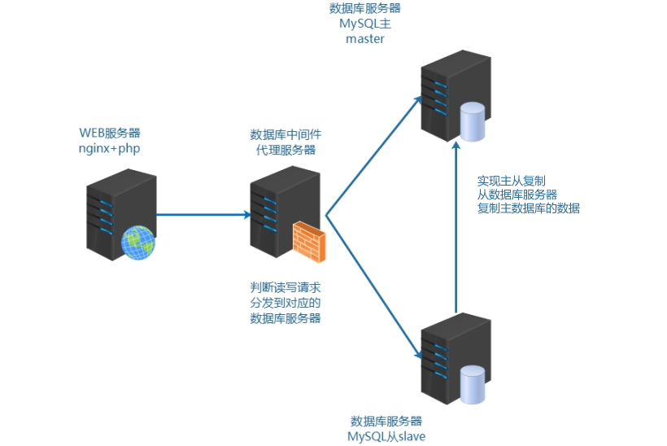

特点：

a.代码开源

学习中间件技术,数据库技术，代码是必须有的。

b.兼容MySQL语法的分布式查询引擎

- 兼容MySQL语法。
- 兼容MySQL值类型。
- 使用基于规则优化与代价的优化器。
- 独立的物理执行引擎。

c.自定义功能算法开发

- 分片算法,序列号算法,负载均衡算法等都可自定义加载。
- 查询引擎可脱离网络框架运行。

d.自定义处理过程

自研DSL操纵物理查询计划。

支持SQL转发,缓存结果集。

## 4、MyCAT2工作原理图

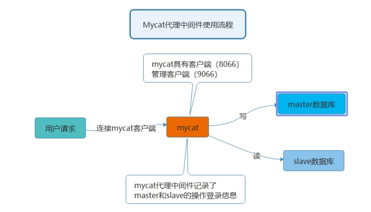

Mycat 数据库中间件

国内最活跃的、性能最好的开源数据库中间件！

官方网址：<http://www.mycatone.top/>

因为mycat2是由java语言开发，必须使用java的允许环境进行启动和操作

## 5、准备机器

最好保证4核6G以上，因为MyCAT2占用内存与CPU比较大

更改IP地址

绑定IP与HOSTNAME到/etc/hosts文件中

```powershell
192.168.88.101 web01 web01.itcast.cn
192.168.88.102 mysql01 mysql01.itcast.cn
192.168.88.103 web02 web02.itcast.cn
192.168.88.104 mysql02 mysql02.itcast.cn
192.168.88.105 mycat mycat.itcast.cn
```

时间同步

```powershell
yum install epel-release -y
yum install ntpsec -y
ntpdate cn.ntp.org.cn
```

## 6、JDK安装

java 静态编译的编程语言 代码编译成机器码  执行机器码输出结果。

编译jdk  javac 编译java代码

运行jre  编译好的机器码（可以执行文件）  java

**问：公司服务器部署的java环境是jdk还是jre？**

答：

jre  java解析运行环境  一般情况编译过的可执行的java程序 ，jre就够用了。

jdk  javac 编译的环境  如果服务器上传是源代码文件 就可以编译，之后再执行。

实际业务环境中，如果存在需要编译的情况，就选择jdk。

oracle jdk（sun公司=>oracle公司收购）

open jdk（完全免费的jdk环境）

https://www.oracle.com/technetwork/java/javase/downloads/jdk8-downloads-2133151.html

 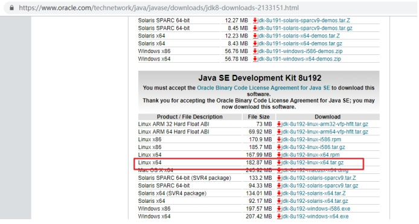

## 7、上传mycat2和jdk到Linux

第一步：解压安装jdk

```powershell
shell > tar xvf jdk-8u192-linux-x64.tar.gz
shell > mkdir /usr/local/java
shell > mv jdk1.8.0_192 /usr/local/java/

注：最终完整路径/usr/local/java/jdk1.8.0_192
```

第二步：配置环境变量

```powershell
shell> rpm -e java-1.8.0-openjdk-headless-1.8.0.362.b09-4.el9.x86_64 --nodeps
shell > vim /etc/profile
export PATH=$PATH:/usr/local/java/jdk1.8.0_192/bin
----------------------------华丽的分割线 --------------------------
shell > source /etc/profile
```

最终脚本：jdk.sh

```powershell
#!/bin/bash
tar xvf jdk-8u192-linux-x64.tar.gz
mkdir -p /usr/local/java
mv jdk1.8.0_192 /usr/local/java/
rpm -e java-1.8.0-openjdk-headless-1.8.0.362.b09-4.el9.x86_64 --nodeps
echo 'export PATH=$PATH:/usr/local/java/jdk1.8.0_192/bin' >> /etc/profile
source /etc/profile
```

执行

```powershell
source jdk.sh
```

## 8、MyCAT2安装

下载地址：https://github.com/MyCATApache/Mycat2，需要编译，直接使用提供给大家的软件包

第一步：安装MyCAT

```powershell
mkdir mycat2  # 上传软件到此目录，mycat2-install-template-1.21.zip 以及 mycat2-1.21-release-jar-with-dependencies.jar
cd mycat2/
unzip mycat2-install-template-1.21.zip
mv mycat /usr/local/
cp mycat2-1.21-release-jar-with-dependencies.jar /usr/local/mycat/lib/
cd /usr/local/mycat/
```

第二步：设置数据源

前提：使用管理员账号

mysql01服务器：

```powershell
mysql> CREATE USER 'root'@'%' IDENTIFIED WITH mysql_native_password BY '123';
mysql> GRANT ALL ON *.* TO 'root'@'%';
```

配置数据源

```powershell
cd conf/datasources

把mycat带的数据源配置正确
vim prototypeDs.datasource.json

{
        "dbType":"mysql",
        "idleTimeout":60000,
        "initSqls":[],
        "initSqlsGetConnection":true,
        "instanceType":"READ_WRITE",
        "maxCon":1000,
        "maxConnectTimeout":3000,
        "maxRetryCount":5,
        "minCon":1,
        "name":"prototypeDs",
        "password":"123",
        "type":"JDBC",
        "url":"jdbc:mysql://192.168.88.102:3306/mysql?useUnicode=true&serverTimezone=Asia/Shanghai&characterEncoding=UTF-8",
        "user":"root",
        "weight":0
}


需要修改位置：
1. 代表要连接数据源的MySQL密码
"password":"123"
2. 代表要连接数据源的MySQL数据库信息
"url":"jdbc:mysql://192.168.88.102:3306/niushop?useUnicode=true&serverTimezone=Asia/Shanghai&characterEncoding=UTF-8"
3. 代表要连接数据源的MySQL账号
"user":"root"
```

## 9、目录说明

```powershell
bin ：mycat二进制文件目录
conf：配置文件目录
logs：目录可以查看到错误日志
```

## 10、启动MyCAT2

默认不进行任何配置，mycat也是可以启动的：

```powershell
chmod +x /usr/local/mycat/bin/*
shell > /usr/local/mycat/bin/mycat console
#确认mycat是否真的启动，查看它的端口 9066 8066
shell > ss -naltp |grep 8066
8066:MyCAT客户端
9066:MyCAT管理端
```

>  如果启动不成功，报错：Ignoring option MaxPerSize:support was removed in 8.0

原因分析：因为系统不能够在规定时间内，启动mycat，可以设置启动等待时间延长（配置低）

部署好mycat之后，先启动一下，是否能够正常启动。就不需要修改。

```powershell
# vim conf/wrapper.conf
111 wrapper.startup.timeout=300  	==>  添加这一行
112 wrapper.ping.timeout=120 		   ==> 默认存在
```

常见错误就几种情况：

① 配置低，服务无法启动，报错：`Ignoring option MaxPerSize:support was removed in 8.0`

解决思路：增大内存或者调整配置文件中的启动超时时间

```powershell
# vim conf/wrapper.conf
111 wrapper.startup.timeout=300  	==>  添加这一行
112 wrapper.ping.timeout=120 		   ==> 默认存在
```

② 数据源报Access Denied，往往`/usr/local/mycat/conf/datasources/prototypeDs.datasource.json`

要么账号密码不对，要么连接地址不对，要么账号没有权限，严格按照这个路径排查

## 11、配置MyCAT2（重点）

第一步：进入数据源配置目录

```powershell
cd /usr/local/mycat/conf/datasources/
```

配置`prototypeDs.datasource.json`文件

```powershell
{
        "dbType":"mysql",
        "idleTimeout":60000,
        "initSqls":[],
        "initSqlsGetConnection":true,
        "instanceType":"READ_WRITE",
        "maxCon":1000,
        "maxConnectTimeout":3000,
        "maxRetryCount":5,
        "minCon":1,
        "name":"prototypeDs",
        "password":"123",
        "type":"JDBC",
        "url":"jdbc:mysql://192.168.88.102:3306/mysql?useUnicode=true&serverTimezone=Asia/Shanghai&characterEncoding=UTF-8",
        "user":"root",
        "weight":0
}
```

第二步：重新启动MyCAT

```powershell
shell > /usr/local/mycat/bin/mycat  start
```

第三步：DataGrip连接MyCAT

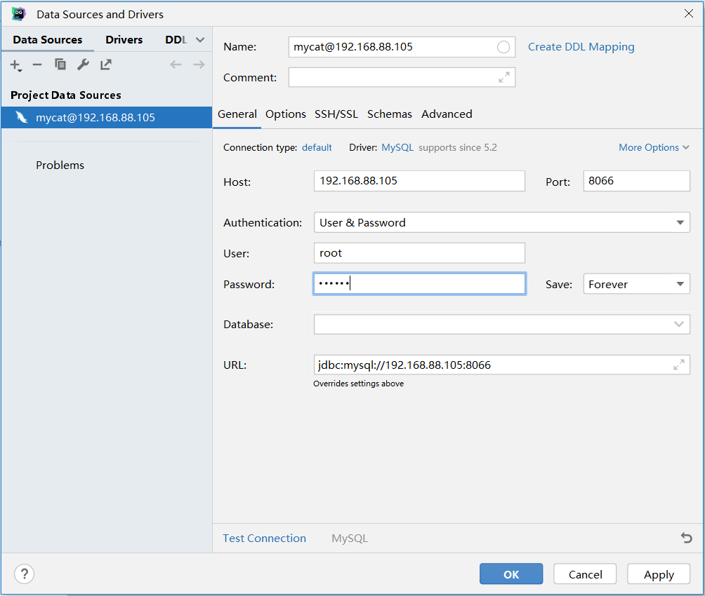

> 默认账号：root

> 默认密码：123456

第四步：创建db1数据库并设置数据源

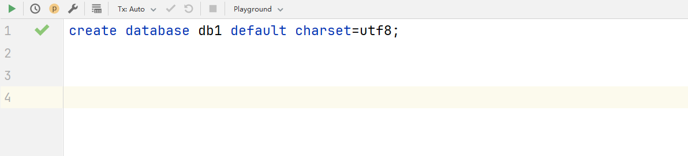

创建完成后，系统会自动在`/usr/local/mycat/conf/schemas`目录下生成db1.schema.json

```powershell
# ll
-rw-r--r-- 1 root root  607 Nov 14 19:46 db1.schema.json
```

编辑schema.json文件

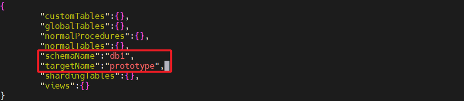

第五步：添加数据源

```powershell
-- 创建一个主数据库连接（负责读写分离中的写操作）
/*+ mycat:createDataSource{
"name":"rwSepw",
"url":"jdbc:mysql://192.168.88.102:3306/db1?useSSL=false&characterEncoding=UTF-8&useJDBCCompliantTimezoneShift=true",
"user":"root",
"password":"123"
} */;

-- 创建一个从数据库连接（负责读写分离中的读操作）
/*+ mycat:createDataSource{
"name":"rwSepr",
"url":"jdbc:mysql://192.168.88.104:3306/db1?useSSL=false&characterEncoding=UTF-8&useJDBCCompliantTimezoneShift=true",
"user":"root",
"password":"123"
} */;

/*+ mycat:showDataSources{} */;
```

扩展：删除数据源操作（不需要操作）

```powershell
/*+ mycat:dropDataSource{"name":"rwSepw"} */;
/*+ mycat:dropDataSource{"name":"rwSepr"} */;
```

第六步：添加数据集群（关键）

```powershell
/*! mycat:createCluster{"name":"prototype","masters":["rwSepw"],"replicas":["rwSepr"]} */;
/*+ mycat:showClusters{} */;

说明：
/*!*/ 语法：
MySQL 兼容的注释语法
这种注释中的内容会被 MySQL 服务器执行，但被其他数据库忽略（条件判断）
在 MyCAT 中表示这是一个需要执行的命令
通常用于执行 MyCAT 的管理命令，如创建集群等
简单理解：/*!*/主要用于实现MyCAT写操作！

/*+*/ 语法：
/*+*/通常用于查询提示(Query Hints)
在 MyCAT 中用于执行一些查询类的命令，如显示信息
一般用于不会修改配置的查询操作
简单理解：/*+*/主要用于实现MyCAT读操作！
```

扩展：删除数据集群（不需要操作）

```powershell
/*+ mycat:dropCluster{"name":"prototype"} */;
```

第七步：启动MyCAT

```powershell
shell > /usr/local/mycat/bin/mycat restart
```

通过查看端口或者进程的方式，确认是否启动：

 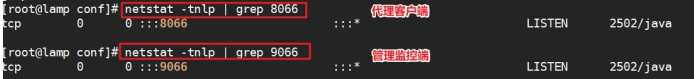

启动不了，一定要看错误日志：

① 翻译错误

② 养成看日志的习惯，自身存在日志看自身；自身不存在的看messages日志

```powershell
cat /usr/local/mycat/logs/wrapper.log
```

配置完成服务启动不了，常见问题：

```powershell
① master和slave没有对应用户给mycat操作  user password  host
② 配置文件语法错误  wrapper.log查看错误解决
```

## 12、读写分离集群测试

第一步：测试之前，把node2（mysql01）、node4（mysql02）、mycat机器都拍一个快照

第二步：在db1这个数据库中创建一个测试数据表test_table

```sql
-- 选择数据库db1，然后创建一个test_table数据表，表中有两个字段，id与hostname主机名称
use db1;
create table test_table(
    id int auto_increment,
    hostname varchar(255),
    primary key(id)
);
```

第三步：插入数据与读取数据测试

```sql
-- 向test_table表中插入一条数据
-- @@hostname是MySQL内置变量，表示当前主机名称
insert into test_table(hostname) values (@@hostname);
select * from test_table;

-- 一定要返回mysql02终端，不能在MyCAT中执行以下语句，然后选择db1数据库，强制向其test_table表中插入一条数据 => 破坏了主从结构
use db1;
insert into test_table(hostname) values (@@hostname);

-- 返回MyCAT查看读是否进行分离
select * from test_table;
-- 通过以上查询结果可知，MyCAT已经将读操作进行了分离，默认采用轮询算法，1次mysql01,1次mysql02
```

常见问题：

① 遇到问题不要紧张，翻译错误，看日志，如果实在翻译有问题，可以使用大模型读取错误或者日志的最后50行左右或者具体报错的内容。

② 注意事项：MyCAT、MySQL8都属于高内存型应用，MyCAT（Java开发）、MySQL8（不低于6G内存），如果MyCAT、MySQL8内存低于6G，MyCAT本身无法启动，Java异常，8066打开的，但是就是连接不上！

③ mycat与mysql01、mysql02数据不一致，比如mycat有一个db1数据库，但是mysql01和mysql02没有，就会导致出现异常，mycat无法启动。

解决思路：因为数据不一致，只能对MyCAT进行重置

> 清理一些文件：cd /usr/local/mycat/conf
>
> rm -rf clusters/prototype.cluster.json
>
> rm -rf datasources/rwSep*
>
> rm -rf schemas/db1.schema.json
>
> 删除完成后，重启MyCAT

## 13、Cluster集群配置选项说明

`vim /usr/local/mycat/conf/clusters/prototype.cluster.json`

readBalanceType：查询负载均衡策略

```powershell
可选值 :
BALANCE_ALL( 默认值 )
获取集群中所有数据源，读取操作轮询所有机器

BALANCE_ALL_READ
获取集群中允许读的数据源，获取所有从服务器，然后在这些机器上轮训

BALANCE_READ_WRITE
获取集群中允许读写的数据源 ，但允许读的数据源优先，所有机器参与读操作，优先从服务器

BALANCE_NONE
获取集群中允许写数据源 ，即主节点中选择，所有读操作都直接打在主服务器上
```

switchType：主从切换

```powershell
NOT_SWITCH: 不进行主从切换
SWITCH: 进行主从切换
```

MyCAT不仅可以实现读写分离，还能实现高可用操作。

SWITCH（默认）：如果主从服务器中的主服务器宕机了，则从服务器则会自动升级为主服务器。

NOT_SWITCH：正好相反，如果主从服务器中的主服务器宕机了，则从服务器不会升级为主服务器。

>这里说的mycat主从切换 和MGR的主从切换有所不同，MGR主从切换，是真正意义上的主从切换。主节点宕机了，则从节点选举出新的主节点，悬着了新的主节点以后，其他的所有从节点都会自动重定向到主节点，成为其附属节点（从节点）。
>
>而mycat中的主从切换，强调的请求路由地址，如果主节点心跳信息检测失败，则系统会自动移除此节点，然后把所有的写入操作转入从节点。在mycat层面已经实现主从切换，但是mysql本质并没有进行切换操作。
>
>mycat+配合shell脚本、配合keepalived、配合MGR一起做高级可用+读写分离集群
>
>

# 四、MyCAT客户端与管理端

## 1、客户端

测试查看代理客户端 8066，负责对接Web

```powershell
# 安装mysql客户端（mysql-server服务器端，mysql客户端）
# yum install mysql -y
# rm -rf /etc/my.cnf
```

启动MyCAT=>通过8066端口代理连接真实数据库服务器：

 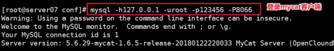

使用show databases以及show tables操作，查看数据信息。

## 2、管理端

```powershell
ss -naltp |grep 9066
LISTEN 0      4096   [::ffff:127.0.0.1]:9066             *:*    users:(("java",pid=101467,fd=51))
```

> MyCAT2中和MyCAT有所不同，MyCAT早期版本，9066是可以正常登录，从管理端才能看到集群等信息，但是在MyCAT2中，把所有功能都集成在8066了，所以9066虽然被占用，但是不需要用户参与管理！

# 五、MyCAT2其他配置

## 1、修改MyCAT2登录密码

```powershell
cd /usr/local/mycat/conf/users
vim root.user.json
{
"dialect":"mysql",
"ip":null,
"password":"itheima123@",      # 修改这里
"transactionType":"xa",
"username":"root"
}
```

## 2、修改服务器server配置

```powershell
cd /usr/local/mycat/conf/
vim server.json
{
  "loadBalance":{
    "defaultLoadBalance":"BalanceRandom",
    "loadBalances":[]
  },
  "mode":"local",
  "properties":{},
  "server":{
    "bufferPool":{

    },
    "idleTimer":{
      "initialDelay":3,
      "period":60000,
      "timeUnit":"SECONDS"
    },
    "ip":"0.0.0.0",
    "mycatId":1,
    "port":8066,
    "serverVersion":"8.0.40-mycat-2.0",       # 这里添加一行
    "reactorNumber":8,
    "tempDirectory":null,
    "timeWorkerPool":{
      "corePoolSize":0,
      "keepAliveTime":1,
      "maxPendingLimit":65535,
      "maxPoolSize":2,
      "taskTimeout":5,
      "timeUnit":"MINUTES"
    },
    "workerPool":{
      "corePoolSize":1,
      "keepAliveTime":1,
      "maxPendingLimit":65535,
      "maxPoolSize":1024,
      "taskTimeout":5,
      "timeUnit":"MINUTES"
    }
  }
}
```

# 今日重点

- [x] keepalived高可用 => Nginx监听以及高可用切换
- [x] keepalived => 非抢占模式、VIP脑裂（理解记忆）、单播模式
- [x] MyCAT读写分离 => 基于GTID主从复制
- [x] MyCAT配置与启动（截止到DataGrip链接MyCAT）

- [x] MyCAT如何实现读写分离
- [x] 使用亿图软件绘制项目架构图并口述每个服务器作用以及业务
