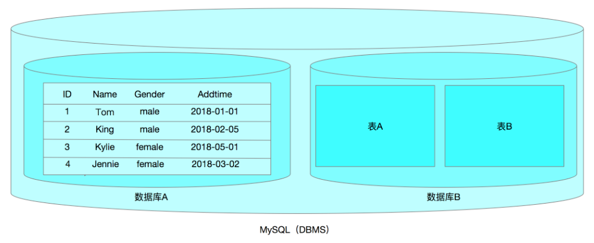
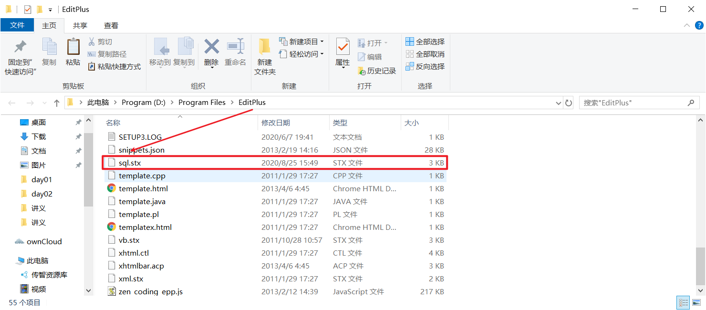
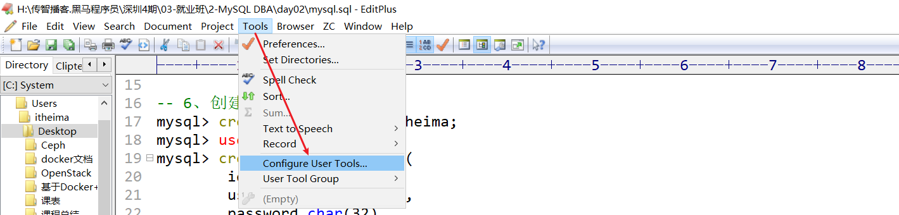
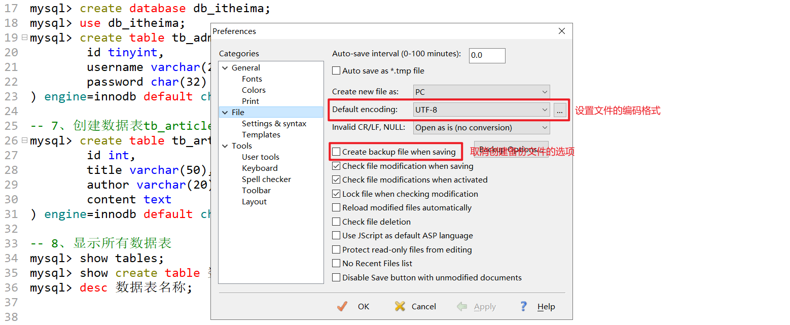
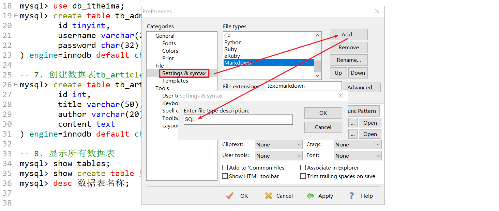
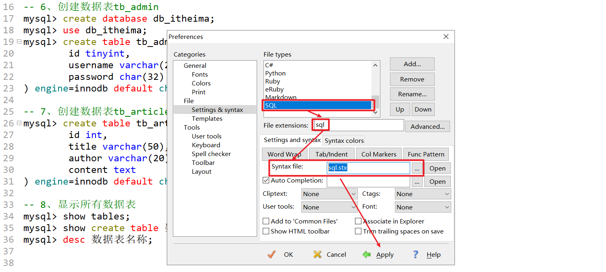

# MySQL基本SQL语句（上）

# 一、客户端工具的使用

## 1、客户端工具mysql使用

```powershell
mysql: mysql命令行工具，一般用来连接访问mysql数据库
```

| 选项               | 说明                                       |
| ------------------ | ------------------------------------------ |
| -u, --user=name    | 指定登录用户名                             |
| -p, --password     | 指定登录密码(注意是小写p),一定要放到最后面 |
| -h, --host=name    | 指定数据库的主机地址                       |
| -P, --port=xxx     | 指定数据库的端口号(大写P)                  |
| -S, --socket=name  | 指定socket文件                             |
| -e, --execute=name | 使用非交互式操作(在shell终端执行sql语句)   |

案例：使用mysql客户端工具连接服务器端（用户名：root、密码：123）

```powershell
# mysql -uroot -p123 
```

> 注：以上连接方式虽然可以连接进入到MySQL，但是官方不建议我们直接把密码写入在终端，建议-p然后直接回车，然后在终端中输入密码。

案例：连接10.1.1.100服务器上的MySQL数据库（用户名：itheima，密码：123）

```powershell
# mysql -h 10.1.1.100 -P 3306 -uitheima -p
Enter password:123
```

案例：根据不同的套接字连接同步的数据库

```powershell
# mysql -S /tmp/mysql.sock -uroot -p
Enter password:123
```

案例：在不进入MySQL内部的情况下，执行SQL语句，获取数据信息

```powershell
# mysql -e "show databases;" -uroot -p
Enter password:123
```

**扩展了解：**

| 默认库             | 描述                                                         |
| ------------------ | ------------------------------------------------------------ |
| information_schema | 1、==对象信息数据库==，提供对数据库元数据的访问 ，有关MySQL服务器的信息，例如数据库或表的名称，列的数据类型或访问权限等；<br>2、在INFORMATION_SCHEMA中，有数个只读表，它们实际上是视图，而不是基本表，因此你将无法看到与之相关的任何文件；<br>3、视图，是一个虚表，即视图所对应的数据不进行实际存储，数据库中只存储视图的定义，在对视图的数据进行操作时，系统根据视图的定义去操作与视图相关联的基本表 |
| mysql              | 1、mysql数据库是==系统数据库==。它包含存储MySQL服务器运行时所需的信息的表。比如权限表、对象信息表、日志系统表、时区系统表、优化器系统表、杂项系统表等。<br>2、==不可以删除==,也不要轻易修改这个数据库里面的表息。 |
| performance_schema | MySQL5.5开始新增一个数据库，主要用于==收集数据库服务器性能==；并且库里表的存储引擎均PERFORMANCE_SCHEMA，而用户是不能创建存储引擎为PERFORMANCE_SCHEMA的表 |
| sys                | 1、mysql5.7增加了sys 系统数据库，通过这个库可以快速的了解系统的元数据信息；<br>2、sys库方便DBA发现数据库的很多信息，解决性能瓶颈；<br>3、这个库是通过视图的形式把information_schema 和performance_schema结合起来，查询出更加令人容易理解的数据 |

## 2、客户端工具mysqladmin使用

```powershell
mysqladmin：客户端管理mysql数据库工具
```

#### ㈠ 常用选项

| 选项              | 描述                 |
| ----------------- | -------------------- |
| -h, --host=name   | 指定连接数据库主机   |
| -p, --password    | 指定数据库密码       |
| -P, --port=#      | 指定数据库端口       |
| -S, --socket=name | 指定数据库socket文件 |
| -u, --user=name   | 指定连接数据库用户   |

#### ㈡ 常用命令

| 命令                    | 描述                          |
| ----------------------- | ----------------------------- |
| password [new-password] | 更改密码                      |
| reload                  | 刷新授权表                    |
| shutdown                | 停止mysql服务                 |
| status                  | 简短查看数据库状态信息        |
| start-slave             | 启动slave                     |
| stop-slave              | 停止slave                     |
| variables               | 打印可用变量                  |
| version                 | 查看当前mysql数据库的版本信息 |

案例：更改root账号的密码为root

```powershell
# mysqladmin password '新密码' -p
Enter password:'旧密码'

# mysqladmin password 'root' -p
Enter password:123
```

案例：更改密码后，建议刷新授权表（mysql> flush privileges;）

```powershell
# mysqladmin reload -p
Enter password:123
```

案例：停止mysql

```powershell
# mysqladmin shutdown -p
Enter password:123
```

> service mysql_3306 stop

案例：查看mysql状态

```powershell
# mysqladmin status -p
Enter password:123
```

案例：打印可用变量（mysql本身预置了很多变量信息）

```powershell
# mysqladmin variables -p
Enter password:123
```

案例：查询mysql版本

```powershell
# mysqladmin version -p
Enter password:123
```

# 二、MySQL中的SQL语句

## 1、什么是SQL？

SQL 是 Structure Query Language(==结构化查询语言==)的缩写,它是使用==关系模型的数据库应==
==用语言==,由 IBM 在 20 世纪 70 年代开发出来,作为 IBM 关系数据库原型 System R 的原型关
系语言,实现了关系数据库中的信息检索。

20 世纪 80 年代初,美国国家标准局(ANSI)开始着手制定 SQL 标准,最早的 ANSI 标准于
1986 年完成,就被叫作 SQL-86。标准的出台使 SQL 作为标准关系数据库语言的地位得到了
加强。SQL 标准目前已几经修改更趋完善。

正是由于 SQL 语言的标准化,所以大多数关系型数据库系统都支持 SQL 语言,它已经发展
成为多种平台进行交互操作的底层会话语言。

## 2、SQL语句的分类

- DDL(Data Definition Languages)语句:

  ==数据定义语言==,这些语句定义了不同的数据段、数据库、表、列、索引等数据库对象的定义。常用的语句关键字主要包括 **create、drop、alter、rename、truncate**。

- DML(Data Manipulation Language)语句:

  ==数据操纵语句==,用于添加、删除、更新和查询数据库记录,并检查数据完整性,常用的语句关键字主要包括 **insert、delete、update**等。

- DCL(Data Control Language)语句:

  ==数据控制语句==,用于控制不同数据段直接的许可和访问级别的语句。这些语句定义了数据库、表、字段、用户的访问权限和安全级别。主要的语句关键字包括 **grant、revoke** 等。

- DQL(Data Query Language)语句:

  ==数据查询语句==，用于从一个或多个表中检索信息。主要的语句关键字包括 **select**

## 3、MySQL中如何求帮助

* 亘古不变的官档（软件作用）

[MySQL5.6官方文档](https://dev.mysql.com/doc/refman/5.6/en/sql-syntax.html)

[MySQL5.7官方文档](https://dev.mysql.com/doc/refman/5.7/en/sql-syntax.html)

* man文档（工具作用）

man文档可以对mysql的一些基本工具及后台命令求帮助，比如：

```powershell
[root@db01 ~]# man mysql
[root@db01 ~]# man mysql_install_db
[root@db01 ~]# man mysqldump
[root@db01 ~]# man mysqld
```

* MySQL的命令行求帮助（主要针对SQL语句求帮助）

```powershell
mysql> help;
mysql> ?
mysql> help create table;

根据内容进行查找帮助
mysql> ? contents
   Account Management
   Administration
   Data Definition
   Data Manipulation
   Data Types
   Functions
   Functions and Modifiers for Use with GROUP BY
   Geographic Features
   Language Structure
   Storage Engines
   Stored Routines
   Table Maintenance
   Transactions
   Triggers
   
寻求账户管理的帮助（一级一级的向内部查）
mysql> ? Account Management
mysql> ? CREATE USER
```

> 注：在mysql内部，没有clear命令，也就是无法使用clear实现清屏，如果想实现清屏操作，可以使用快捷键Ctrl + Shift + L

## 4、SQL语句的基本操作

### ☆ MySQL的内部结构



> 注：我们平常说的MySQL，其实主要指的是MySQL数据库管理软件。

一个MySQL DBMS可以同时存放多个数据库，理论上一个项目就对应一个数据库。如博客项目blog数据库、商城项目shop数据库、微信项目wechat数据库。

一个数据库中还可以同时包含多个数据表，而数据表才是真正用于存放数据的位置。（类似我们Office软件中的Excel表格），理论上一个功能就对应一个数据表。如博客系统中的用户管理功能，就需要一个user数据表、博客中的文章就需要一个article数据表、博客中的评论就需要一个message数据表。

一个数据表又可以拆分为多个字段，每个字段就是一个属性。

一个数据表除了字段以外，还有很多行，每一行都是一条完整的数据（记录）。

### ☆ 数据库的基本操作

#### ① 创建数据库

普及英语小课堂：

创建 => create

数据库 => database

基本语法：

```powershell
mysql> create database 数据库名称;
```

> 特别注意：在MySQL中，当一条SQL语句编写完毕后，一定要使用分号;进行结尾，否则系统认为这条语句还没有结束。

案例：创建数据库的相关案例

```powershell
创建db1库
create database db1;

创建db1库并指定默认字符集
create database db1 default charset gbk;

如果存在不报错(if not exists)
create database if not exists db1 default character set utf8;
说明：不能创建相同名字的数据库！
```

> 扩展：编码格式，常见的gbk（中国的编码格式）与utf8（国际通用编码格式）

latin1    256个字符	（abcd、1234、传统字符）

国内汉字无法通过256个字符进行描述，所以国内开发了自己的编码格式gb2312，升级gbk

中国台湾业开发了一套自己的编码格式big5

很多项目并不仅仅只在本地使用，也可能支持多国语言，标准化组织开发了一套通用编码utf8，后来5.6版本以后又进行了升级utf8mb4

> 编写SQL语句是一个比较细致工作，不建议大家直接在终端中输入SQL语句，可以先把你要写的SQL语句写入一个记事本中，然后拷贝执行。

#### ② 查询已创建数据库

英语小课堂：

显示 => show

数据库 => database

基本语法：

显示所有数据库

```powershell
mysql> show databases;
```

显示某个数据库的数据结构

```powershell
mysql> show create database db_itheima;
```

#### ③ 修改数据库信息

在MySQL5以后的版本中，MySQL不支持更改数据库的名称。我们所谓的修改数据库主要修改的是数据库的编码格式。

英语小课堂：

修改 => alter

数据库 => database

```powershell
mysql> alter database 数据库名称 default charset=新编码格式;
```

案例：把db_itheima数据库的编码格式更改为gbk

```powershell
mysql> alter database db_itheima default charset=gbk;
```

#### ④ 删除数据库

英语小课堂：

删除 => drop

数据库 => database

基本语法：

```powershell
mysql> drop database 数据库名称;
```

案例：删除db_itheima数据库

```powershell
mysql> drop database db_itheima;
```

## 5、数据表的基本操作

### ☆ 数据表的创建

英语小课堂：

创建 => create

数据表 => table

基本语法：

```powershell
mysql> create table 数据表名称(
	字段1 字段类型 [字段约束],
	字段2 字段类型 [字段约束],
	...
); 
```

案例：创建一个admin管理员表，拥有3个字段（编号、用户名称、用户密码）

```powershell
mysql> create database db_itheima;
mysql> use db_itheima;
```

> use在MySQL中的含义代表选择，use 数据库名称相当于选择指定的数据库。而且use比较特殊，其选择结束后，其尾部可以不加分号；但是强烈建议所有的SQL语句都要加分号，养成一个好习惯。

```powershell
mysql> create table tb_admin(
	id tinyint,
    username varchar(20),
    password char(32)
) engine=innodb default charset=utf8;
```

> tinyint ：微整型，范围-128 ~ 127，无符号型，则表示0 ~ 255

> 表示字符串类型可以使用char与varchar，char代表固定长度的字段，varchar代表变化长度的字段。

案例：创建一个article文章表，拥有4个字段（编号、标题、作者、内容）

```powershell
mysql> use db_itheima;
mysql> create table tb_article(
	id int,
	title varchar(50),
	author varchar(20),
	content text
) engine=innodb default charset=utf8;
```

> text ：文本类型，一般情况下，用varchar存储不了的字符串信息，都建议使用text文本进行处理。

> varchar存储的最大长度，理论值65535个字符。但是实际上，有几个字符是用于存放内容的长度的，所以真正可以使用的不足65535个字符，另外varchar类型存储的字符长度还和编码格式有关。1个GBK格式的占用2个字节长度，1个UTF8格式的字符占用3个字节长度。GBK = 65532~65533/2，UTF8 = 65532~65533/3

### ☆ 查询已创建数据表

英语小课堂：

显示 => show

数据表 => table

显示所有数据表（当前数据库）

```powershell
mysql> use 数据库名称;
mysql> show tables;
```

显示数据表的创建过程（编码格式、字段等信息）

```powershell
mysql> show create table 数据表名称;
或
mysql> desc 数据表名称;
```

### ☆ 修改数据表信息

#### ① 数据表字段添加

英语小课堂：

修改 => alter

数据表 => table

基本语法：

```powershell
mysql> alter table 数据表名称 add 新字段名称 字段类型 first|after 其他字段名称;
选项说明：
first：把新添加字段放在第一位
after 字段名称：把新添加字段放在指定字段的后面
```

案例：在tb_article文章表中添加一个addtime字段，类型为date(年-月-日)

```powershell
mysql> alter table tb_article add addtime date after content;
mysql> desc tb_article;
```

#### ② 修改字段名称或字段类型

修改字段名称与字段类型（也可以只修改名称）

```powershell
mysql> alter table tb_admin change username user varchar(40);
mysql> desc tb_admin;
```

仅修改字段的类型

```powershell
mysql> alter table tb_admin modify user varchar(20);
mysql> desc tb_admin;
```

#### ③ 删除某个字段

```powershell
mysql> alter table tb_article drop 字段名称;
mysql> desc tb_article;
```

#### ④ 修改数据表引擎（MyISAM或InnoDB）

```powershell
mysql> alter table tb_article engine=myisam;
mysql> show create table tb_article;
```

#### ⑤ 修改数据表的编码格式

```powershell
mysql> alter table tb_admin default charset=gbk;
mysql> show create table tb_admin;
```

#### ⑥ 修改数据表名称

```powershell
移动表到另一个库里并重命名
rename table db01.t1 to db02.t11;
或者
alter table db01.t1 rename db02.t11;

只重命名表名不移动
rename table tt1 to tt2;
或者
alter table tt1 rename  tt2;
```

### ☆ 删除数据表

英语小课堂：

删除 => drop

数据表 => table

```powershell
mysql> drop table 数据表名称;
```

## 6、给EditPlus添加一个语法着色

第一步：把sql.stx语法着色文件放置在某个位置



第二步：打开EditPlus配置



设置编码格式并取消备份文件



第三步：添加SQL语句的语法着色支持

添加SQL语句支持



引入.sql文件以及语法着色文件



## 7、数据的增删改查（重点）

英语小课堂：

增加：insert

删除：delete

修改：update

查询：select

### ☆ 数据的增加操作

基本语法：

```powershell
mysql> insert into 数据表名称([字段1,字段2,字段3...]) values (字段1的值,字段2的值,字段3的值...);
```

> 特别注意：在SQL语句中，除了数字，其他类型的值，都需要使用引号引起来，否则插入时会报错。

第一步：准备一个数据表

```powershell
mysql> use db_itheima;
mysql> create table tb_user(
	id int,
	username varchar(20),
	age tinyint unsigned,
	gender enum('男','女','保密'),
	address varchar(255)
) engine=innodb default charset=utf8;
```

> unsigned代表无符号型，只有0到正数。tinyint unsigned无符号型，范围0 ~ 255

> enum枚举类型，多选一。只能从给定的值中选择一个

第二步：使用insert语句插入数据

```powershell
mysql> insert into tb_user values (1,'李向阳',24,'男','广东省广州市');
mysql> insert into tb_user(id,username,age) values (2,'马鹏',23);
```

### ☆ 数据的查询操作

基本语法：

```powershell
mysql> select * from 数据表名称 [where 查询条件];
mysql> select id,username,age from 数据表名称 [where 查询条件];
```

案例：查询tb_user表中的所有记录

```powershell
mysql> select * from tb_user;
```

案例：查询tb_user表中的id，username以及age字段中对应的数据信息

```powershell
mysql> select id,username,age from tb_user;
```

案例：只查询id=2的小伙伴信息

```powershell
mysql> select * from tb_user where id=2;
```

案例：查询年龄大于23岁的小伙伴信息

```powershell
mysql> select * from tb_user where age>23;
```

### ☆ 数据的修改操作

基本语法：

```powershell
mysql> update 数据表名称 set 字段1=更新后的值,字段2=更新后的值,... where 更新条件;
```

> 特别说明：如果在更新数据时，不指定更新条件，则其会把这个数据表的所有记录全部更新一遍。

案例：修改username='马鹏'这条记录，将其性别更新为男，家庭住址更新为广东省深圳市

```powershell
mysql> update tb_user set gender='男',address='广东省深圳市' where username='马鹏';
```

案例：今年是2020年，假设到了2021年，现在存储的学员年龄都差1岁，整体进行一次更新

```powershell
mysql> update tb_user set age=age+1;
```

###  ☆ 数据的删除操作

基本语法：

```powershell
mysql> delete from 数据表名称 [where 删除条件];
```

案例：删除tb_user表中，id=1的用户信息

```powershell
mysql> delete from tb_user where id=1;
```


delete from与truncate清空数据表操作

```powershell
mysql> delete from 数据表;
或
mysql> truncate 数据表;
```


delete from与truncate区别在哪里？

- delete：删除==数据记录==
  - 数据操作语言（DML）
  - 在事务控制里，DML语句要么commit，要么rollback
  - 删除==大量==记录速度慢，==只删除数据==不回收高水位线
  - 可以==带条件==删除
- truncate：删除==所有数据记录==
  - 数据定义语言（DDL）
  - ==不在==事务控制里，DDL语句执行前会提交前面所有未提交的事务
  - 清里大量数据==速度快==，回收高水位线（high water mark）
  - ==不能带条件删除==

## 8、自动增长（水位线）与主键约束

### ☆ 自动增长（对某个字段进行自动编号）

```powershell
mysql> create table tb_user(
	id int not null auto_increment,
	username varchar(20),
	age tinyint unsigned,
	gender enum('男','女','保密'),
	address varchar(255)
) engine=innodb default charset=utf8;
```

> not null代表非空约束，这个字段只要是插入数据就必须要有值。

### ☆ 主键约束（非空、唯一）

```powershell
create table tb_user(
	id int not null auto_increment,
	username varchar(20),
	age tinyint unsigned,
	gender enum('男','女','保密'),
	address varchar(255),
	primary key(id)
) engine=innodb default charset=utf8;
```

插入数据库时，id位置直接写NULL即可

```powershell
mysql> insert into tb_user values (null,'李向阳',24,'男','广东省广州市');
mysql> insert into tb_user values (null,'马鹏',23,'男','广东省深圳市');
mysql> insert into tb_user values (null,'上官婉儿',18,'女','湖南省长沙市');
```

