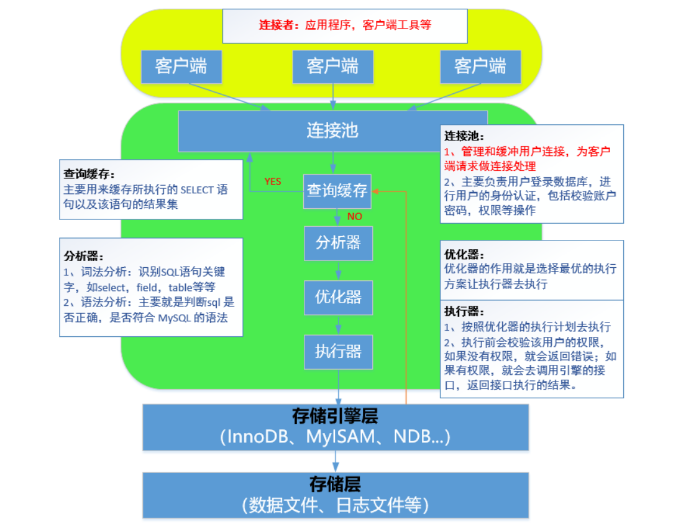
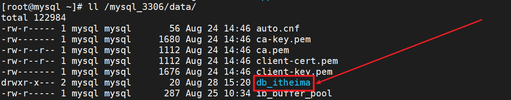
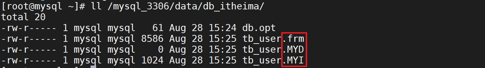
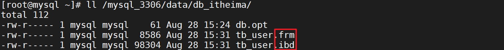
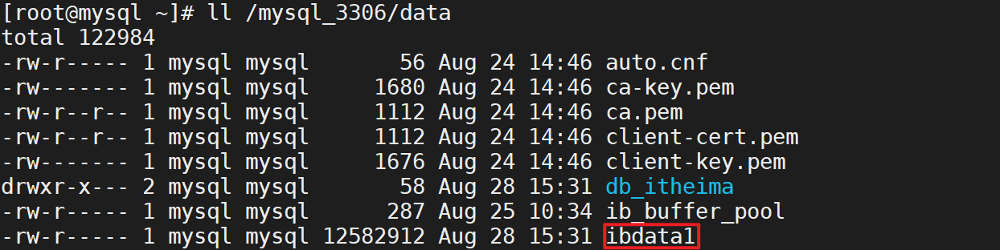
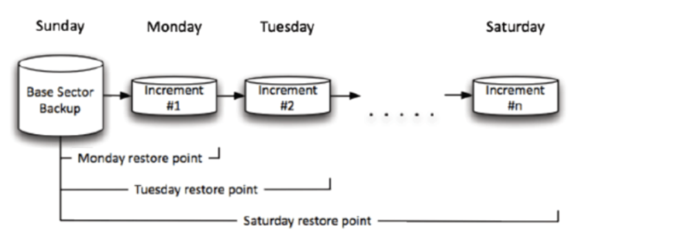

# MySQL备份与恢复（重点）

# 一、用户管理与权限管理

## ☆ 用户管理

### 1、创建MySQL用户

> 注意：MySQL中不能单纯通过用户名来说明用户，必须要加上主机。如**==jack@10.1.1.1==**

基本语法：

```powershell
mysql> create user '用户名'@'被允许连接的主机名称或主机的IP地址' identified by '用户密码';
mysql> select user,host from mysql.user;
```

案例：创建一个MySQL账号，用户名：tom，用户密码：123

```powershell
mysql> create user 'tom'@'localhost' identified by '123';
或
mysql> create user 'tom'@'127.0.0.1' identified by '123';
```

案例：创建一个MySQL账号（要求开通远程连接），主机IP地址：10.1.1.23，用户名：harry，用户密码：123

```powershell
mysql> create user 'harry'@'10.1.1.23' identified by '123';
```

测试：在IP地址为10.1.1.23的主机上

```powershell
# yum install mysql -y
# mysql -h 10.1.1.10 -P 3306 -uharry -p
Enter password:123

选项说明：
10.1.1.10 ：MySQL服务器端的IP地址
```

> yum安装mysql：代表安装的是MySQL的客户端
>
> yum安装mysql-server：代表安装的是MySQL的服务器端

案例：创建一个MySQL账号（要求开通远程连接），主机IP的网段：10.1.1.0，用户名：jack，用户密码：123

```powershell
mysql> create user 'jack'@'10.1.1.%' identified by '123';
```

案例：创建一个MySQL账号（要求开通远程连接），要求面向所有主机开放，用户名：root，用户密码：123

```powershell
mysql> create user 'root'@'%' identified by '123';
```

### 2、删除MySQL用户

基本语法：

```powershell
mysql> drop user '用户名'@'主机名称或主机的IP地址';
特别说明：
如果在删除用户时没有指定主机的名称或主机的IP地址，则默认删除这个账号的所有信息。
```

案例：删除tom这个账号

```powershell
mysql> drop user 'tom'@'localhost';
```

案例：删除jack这个账号

```powershell
mysql> drop user 'jack'@'10.1.1.%';
```

案例：创建两个harry账号（localhost/10.1.1.23），然后删除其中的某个

```powershell
mysql> create user 'harry'@'localhost' identified by '123';
mysql> create user 'harry'@'10.1.1.23' identified by '123';

mysql> drop user 'harry'@'10.1.1.23';
```

扩展：删除MySQL账号的另外一种方式

```powershell
mysql> delete from mysql.user where user='root' and host='%';
mysql> flush privileges;
```

### 3、修改MySQL用户

特别说明：MySQL用户重命名通常可以更改两部分，一部分是用户的名称，一部分是被允许访问的主机名称或主机的IP地址。

基本语法：

```powershell
mysql> rename user 旧用户信息 to 新用户信息;
```

案例：把用户'root'@'%'更改为'root'@'10.1.1.%'

```powershell
mysql> rename user 'root'@'%' to 'root'@'10.1.1.%';
```

案例：把'tom'@'localhost'更名为'harry'@'localhost'

```powershell
mysql> create user 'tom'@'localhost' identified by '123';
mysql> rename user 'tom'@'localhost' to 'harry'@'localhost';
```

> 扩展：使用update语句更新用户信息

```powershell
mysql> update mysql.user set user='tom',host='localhost' where user='harry' and host='localhost';
mysql> flush privileges;
```

## ☆ 权限管理

### 1、权限说明

所有权限说明<https://dev.mysql.com/doc/refman/5.7/en/privileges-provided.html>

```powershell
USAGE	无权限,只有登录数据库,只可以使用test或test_*数据库
ALL		所有权限

以下权限为指定权限
select/update/delete/super/replication slave/reload...

with grant option 选项表示允许把自己的权限授予其它用户或者从其他用户收回自己的权限
```

> 默认情况下，分配权限时如果没有指定with grant option，代表这个用户不能下发权限给其他用户，但是这个权限分配不能超过自身权限。

### 2、权限保存位置（了解）

```powershell
mysql.user				所有mysql用户的账号和密码，以及用户对全库全表权限（*.*）
mysql.db				非mysql库的授权都保存在此(db.*)
mysql.table_priv		某库某表的授权(db.table)
mysql.columns_priv		某库某表某列的授权(db.table.col1)
mysql.procs_priv		某库存储过程的授权
```

### 3、给用户授权

基本语法：

```powershell
mysql> grant 权限1,权限2 on 库.表 to 用户@主机
mysql> grant 权限(列1,列2,...) on 库.表 to 用户@主机
```

> 库.表表示方法：\*.\*代表所有数据库的所有数据表，db_itheima.*代表db_itheima数据库中的所有数据表，db_itheima.tb_admin，代表db_itheima数据库中的tb_admin表

案例：给tom账号分配db_itheima的查询权限

```powershell
mysql> grant select on db_itheima.* to 'tom'@'localhost';
mysql> flush privileges;
```

案例：给tom账号分配db_itheima.tb_student数据表的权限（要求只能更改age字段）

```powershell
mysql> grant update(age) on db_itheima.tb_student to 'tom'@'localhost';
mysql> flush privileges;
```

案例：添加一个root@%账号，然后分配所有权限

```powershell
mysql> create user 'root'@'%' identified by '123';
mysql> grant all on *.* to 'root'@'%';
mysql> flush privileges;
```

### 4、查询用户权限

查询当前用户权限

```powershell
mysql> show grants;
```

查询其他用户权限

```powershell
mysql> show grants for '用户名称'@'授权的主机名称或IP地址';
```

### 5、with grant option选项

with grant option选项作用：代表此账号可以为其他用户下发权限，但是下发的权限不能超过自身权限。

```powershell
mysql> grant all on *.* to 'amy'@'10.1.1.%' identified by '123' with grant option;
mysql> grant all on *.* to 'harry'@'10.1.1.%' identified by '123'; 

如以上命令所示：
amy拥有下发权限的功能，而harry不具备下发权限的功能。
```

> 如果grant授权时没有with grant option选项，则其无法为其他用户授权。

### 6、使用grant创建用户

> 说明：5.7以后==不推荐==，未来会被弃用！

基本语法：

```powershell
mysql> grant 权限 on 数据库.数据表 to '新用户名称'@'授权主机名称或IP地址' identified by '用户的密码';
```

案例：创建一个root账号，主机为%，授予所有权限，密码为123

```powershell
mysql> grant all on *.* to 'root'@'%' identified by '123';
```

### 7、revoke回收权限

基本语法：

```powershell
revoke 权限 on 库.表 from 用户;

撤消指定的权限
mysql> revoke update on db01.tt1 from 'tom'@'10.1.1.1';
撤消所有的权限
mysql> revoke select on db01.* from 'tom'@'10.1.1.1';
```

案例：从tom账号中回收select权限

```powershell
mysql> revoke select on db_itheima.* from 'tom'@'localhost';
mysql> flush privileges;
mysql> show grants for 'tom'@'localhost';
```

案例：从tom账号中回收update权限

```powershell
mysql> revoke update(age) on db_itheima.tb_student from 'tom'@'localhost';
mysql> flush privileges;
mysql> show grants for 'tom'@'localhost';
```

# 二、MySQL备份概述

## 1、关于数据保存你要知道

**思考：**备份和冗余有什么区别？

备份： 能够防止由于**机械故障**以及**人为误操作**带来的数据丢失，例如将数据库文件保存在了其它地方。

冗余： 数据有多份冗余，但不等备份，**只能防止机械故障**带来的数据丢失，例如主备模式、数据库集群。 

## 2、到底要备份什么

### ☆ 备份什么

数据库：==一堆物理文件的集合==；日志文件(二进制日志)+数据文件+配置文件

① 数据文件

② 配置文件 => my.cnf

③ 日志文件（主要是二进制日志文件）

### ☆ MySQL体系结构

扩展：MySQL体系结构（MySQL => DBMS软件到底是由哪些层构成的）



### ☆ 存储引擎层（MyISAM与InnoDB引擎）

存储引擎层：简单来说，就是数据的存储方式。在MySQL中，我们可以使用`show engines`查看当前数据库版本支持哪些引擎，常见的数据存储引擎：InnoDB、MyISAM、NDB...

> 常见面试题：请简述MySQL的MyISAM引擎与InnoDB引擎的区别

① MyISAM引擎：擅长数据的查询，支持全文索引

② InnoDB引擎：Supports transactions, row-level locking, and foreign keys，支持事务处理、行级锁、支持外键。

### ☆ 存储层（数据文件是如何进行存储的）

问题：存储引擎到底是如何保存数据文件的？

```powershell
mysql> create database db_itheima default charset=utf8;
```

> 提出问题：我能不能不进入MySQL终端，然后在命令行中直接创建一个数据库呢？-e

当数据库创建完毕后，查看/mysql_3306/data文件夹：



db_itheima文件夹中还有一个文件`db.opt`，存放内容为数据库的编码格式。


MyISAM引擎

```powershell
mysql> use db_itheima;
mysql> create table tb_user(id int, name char(1)) engine=myisam default charset=utf8;
```

创建完成后，查看db_itheima目录信息，发现产生了3个文件



> *.frm ：框架文件，定义数据表结构     *.MYI ：INDEX索引，主要用于存放索引文件      *.MYD：数据文件

InnoDB引擎

```powershell
mysql> use db_itheima;
mysql> create table tb_user(id int, name char(1)) engine=innodb default charset=utf8;
```

创建完成后，查看db_itheima目录信息，发现产生了2个文件



> *.frm ：框架文件，定义数据表结构    *.ibd：索引文件+数据文件

其实InnoDB引擎不仅仅会产生以上两个文件，其在外部data目录中也会产生一个文件（确切来说不能叫做产生文件，而应该叫做共享文件）



> 所以由此可知，InnoDB引擎的数据备份不能简简单单的通过拷贝方式实现，必须使用专业的备份工具。

### ☆ 日志文件（MySQL中我们需要了解哪些日志）

| 日志类型         | 写入日志的信息                                               |
| ---------------- | ------------------------------------------------------------ |
| error错误日志    | 存放数据库的启动、停止或运行时的错误信息（找ERROR）          |
| binlog二进制日志 | ==数据库的所有更改==操作（DDL/DML/DCL），不包含select或者show这类语句。 |

> error错误日志的命令规则与存放的目录：/data目录下 +  主机名称.err

更改错误日志的存放位置：

```powershell
# vim my.cnf
[mysqld]
...
log_error=data数据目录/主机名称.err或mysql.err
```

> binlog二进制日志应用场景：
>
> 用于==主从复制==中，master主服务器将二进制日志中的更改操作发送给slave从服务器，从服务器执行这些更改操作是的和主服务器的更改相同。
>
> 用于==数据的恢复==操作

**binlog二进制日志如何开启？**

默认binlog日志是==关闭==的，可以通过修改配置文件完成开启，如下：

```powershell
# vim my.cnf
[mysqld]
...
server-id=10
log-bin=data数据目录/binlog
```

> 当我们更改了my.cnf配置文件，一定要记得重启MySQL服务器。service命令

## 3、备份过程须考虑的因素

- 必须制定==详细的备份计划(策略)==（备份频率、时间点、周期）
- 备份数据应该放在==非数据库本地==，并建议==有多份副本==
- 必须做好==**数据恢复的演练**==（每隔一段时间，对备份的数据在测试环境中进行模拟恢复，保证当出现数据灾难的时候能够及时恢复数据。）
- 根据数据应用的场合、特点==选择正确的备份工具==。
- 数据的一致性
- 服务的可用性

## 4、备份的类型

### ☆ 逻辑备份

- 备份的是**建表、建库、插入等操作所执行SQL语句**（DDL DML DCL）。
- 适用于==中小型数据库，效率相对较低==。 一般在数据库**正常提供服务**的前提下进行，如：**mysqldump**、mydumper、into outfile（表的导出导入）等。

* 备份实质：就是把要备份的数据导出成.sql或.txt文件

### ☆ 物理备份

- 直接复制==数据库文件==
- 适用于==大型数据库==环境，不受存储引擎的限制，但不能恢复到不同的MySQL版本。 
- 一般是在==数据库彻底关闭或者不能完成正常提供服务==的前提下进行的备份）；如：tar、cp、==xtrabackup==（数据库可以==正常提供服务==）、lvm snapshot、rsync等

* 备份的实质：对数据文件 + 配置文件 + 日志文件进行拷贝操作

### ☆ 在线热备（数据冗余、AB复制、主从复制）

- MySQL的replication架构，如M-S|M-S-S|M-M-S等
- 实时在线备份

## 5、备份工具

#### ㈠ 社区版安装包中的备份工具

##### ① mysqldump(逻辑备份，只能==全量备份==）

​	1）企业版和社区版都包含

​	2）本质上使用==SQL语句描述数据库==及数据并导出

​	3）在MYISAM引擎上锁表，Innodb引擎上锁行

​	4）数据量很大时不推荐使用

##### ② mysqlhotcopy(物理备份工具）

​	1）企业版和社区版都包含

​	2）perl写的一个脚本，本质上是使用锁表语句后再拷贝数据

​	3）==只==支持MYISAM数据引擎

#### ㈡ 企业版安装包中的备份工具

**mysqlbackup**

​	1）在线备份

​	2）增量备份

​	3）部分备份

​	4）在某个特定时间的一致性状态的备份

#### ㈢ 第三方备份工具

##### ① XtraBackup和innobackupex(物理备份）

​	1）Xtrabackup是一个对**InnoDB**做数据备份的工具，支持==在线热备份==（备份时不影响数据读写），是商业备份工具**InnoDB Hotbackup**的一个很好的替代品。

​	2）Xtrabackup有两个主要的工具：xtrabackup、innobackupex

​	a、xtrabackup只能备份==InnoDB和XtraDB==两种数据表，不能备份myisam类型的表。

​	b、innobackupex是将Xtrabackup进行封装的perl脚本，所以能同时备份处理innodb和myisam的存储引擎，但在处理myisam时需要加一个读锁。

##### ② mydumper(逻辑备份，备份SQL语句）

**多线程备份工具**

 https://launchpad.net/mydumper/mydumper-0.9.1.tar.gz        2015-11-06（最后更新时间）

## 6、备份方法

- 完全备份（全备）
- 增量备份（增量备份基于全量备份）



# 三、MySQL逻辑备份

##1、mysqldump基本备份

**本质**：导出的是sql语句文件

**优点**：无论是什么存储引擎，都可以用mysqldump备成sql语句

**缺点**：速度较慢,导入时可能会出现格式不兼容的突发状况.==无法直接做增量备份==.

**提供三种级别的备份，表级，库级和全库级** 

## 2、mysqldump基本语法

```powershell
表级别备份
mysqldump [OPTIONS] database [tables]
库级别备份
mysqldump [OPTIONS] --databases [OPTIONS] DB1 [DB2 DB3...]
全库级别备份
mysqldump [OPTIONS] --all-databases [OPTIONS]
```

准备一些要备份的数据：

```powershell
mysql> create database db_itheima default charset=utf8;
mysql> use db_itheima;
mysql> create table tb_student(
	id int not null auto_increment,
	name varchar(20),
	age tinyint unsigned default 0,
	gender enum('male','female'),
	subject enum('ui','java','yunwei','python'),
	primary key(id)
) engine=innodb default charset=utf8;

mysql> insert into tb_student values (null,'刘备',33,'male','java');
mysql> insert into tb_student values (null,'关羽',32,'male','yunwei');
mysql> insert into tb_student values (null,'张飞',30,'male','python');
mysql> insert into tb_student values (null,'貂蝉',18,'female','ui');
mysql> insert into tb_student values (null,'大乔',18,'female','ui');
```

## 3、mysqldump表级备份与还原

### ☆ 备份

案例：把db_itheima数据库中的tb_student数据表进行备份

```powershell
# mkdir /tmp/sqlbak
# mysqldump db_itheima tb_student > /tmp/sqlbak/tb_student.sql -p
Enter password:123
```

### ☆ 还原

```powershell
# mysql 数据库名称 < .sql文件位置 -p
Enter password:123
或
# mysql -uroot -p
Enter password:123
mysql> use db_itheima
mysql> source .sql文件的位置
```

## 4、mysqldump库级备份与还原

### ☆ 备份

案例：把db_itheima数据库进行备份

```powershell
# mysqldump --databases db_itheima > /tmp/sqlbak/db_itheima.sql -p
Enter password:123
```

### ☆ 还原

```powershell
# mysql < .sql文件位置 -p
Enter password:123
或
# mysql -uroot -p
Enter password:123
mysql> source .sql文件的位置
```

## 5、mysqldump全库级备份

> 在MySQL中，如果想使用mysqldump进行全库级备份，必须开启二进制日志！！！

开启二进制日志

```powershell
# vim my.cnf
[mysqld]
...
server-id=10
log-bin=/mysql_3306/data/binlog

# service mysql_3306 restart
```

mysqldump高级选项说明：

| 常用选项              | 描述说明                                                     |
| --------------------- | ------------------------------------------------------------ |
| --flush-logs, -F      | 开始备份前刷新日志（二进制日志）binlog.000001 => binlog.000002 |
| --flush-privileges    | 备份包含mysql数据库时刷新授权表 => 刷新用户和授权信息        |
| --lock-all-tables, -x | MyISAM一致性，服务可用性（针对所有库所有表）                 |
| --lock-tables, -l     | 备份前锁表（针对要备份的库）                                 |
| --single-transaction  | 适用InnoDB引擎，保证一致性，服务可用性                       |
| --master-data=2       | 表示将二进制日志位置和文件名写入到备份文件并在dump文件中注释掉这一行 |
| --master-data=1       | 表示将二进制日志位置和文件名写入到备份文件,在dump文件中不注释这一行 |

**--master-data参数其他说明：**

1）恢复时会执行，默认是1
2）需要RELOAD privilege并必须打开二进制文件
3）这个选项会自动打开--lock-all-tables，关闭--lock-tables

### ☆ 备份

前提：一定要开启二进制日志

```powershell
# mysqldump --all-databases --master-data --single-transaction > /tmp/sqlbak/all.sql -p
Enter password:123
```

### ☆ 还原

```powershell
# mysql < all.sql -p
Enter password:123
```

## 总结

1. mysqldump工具备份的是==SQL语句==，故备份不需要停服务
2. 使用备份文件==恢复==时，要保证==数据库处于运行状态==
3. 只能实现全库，指定库，表级别的==某一时刻的备份==，本身==不能增量备份==
4. 适用于==中小型==数据库

# 四、mysqldump + binlog实现增量备份

## 1、核心思路

搞明白一件事：到底什么是增量备份？

答：① 要有全量备份 ② 继续增删改数据 ③ 再次需要备份时，不需要进行全量备份，只需要备份binlog日志文件即可（因为binlog日志记录了增删改操作的所有SQL语句）

## 2、增量备份实验步骤

第一步：先准备数据（前提）

第二步：开启二进制，然后做全量备份（全库备份）

第三步：继续对数据库进行增删改操作

第四步：突然发生了硬件故障，数据库丢失了

第五步：恢复全量备份导出的数据（不完整，可能只有90%）

第六步：备份二进制日志，根据其信息（导入剩余的10%的数据）

...

完成

## 3、增量备份的具体实践

第一步：准备数据

```powershell
mysql> create database db_itheima default charset=utf8;
mysql> use db_itheima;
mysql> create table tb_student(
	id int not null auto_increment,
	name varchar(20),
	age tinyint unsigned default 0,
	gender enum('male','female'),
	subject enum('ui','java','yunwei','python'),
	primary key(id)
) engine=innodb default charset=utf8;

mysql> insert into tb_student values (null,'刘备',33,'male','java');
mysql> insert into tb_student values (null,'关羽',32,'male','yunwei');
mysql> insert into tb_student values (null,'张飞',30,'male','python');
mysql> insert into tb_student values (null,'貂蝉',18,'female','ui');
mysql> insert into tb_student values (null,'大乔',18,'female','ui');
```

第二步：开启二进制日志，重启服务，然后进行全库备份

```powershell
# vim my.cnf
[mysqld]
...
server-id=10
log-bin=/mysql_3306/data/binlog

# service mysql_3306 restart
# rm -rf /tmp/sqlbak/*
# mysqldump --single-transaction --flush-logs --master-data=2 --all-databases > /tmp/sqlbak/all.sql -p
```

第三步：继续对数据库进行增删改操作

```powershell
mysql> insert into tb_student values (null,'小乔',16,'female','ui');
mysql> delete from tb_student where id = 3;
```

第四步：突然发生了硬件故障，数据库丢失了

```powershell
# mysql -e "drop database db_itheima;" -p
Enter password:123
```

...故事开始了（删库）

第五步：动员运维工程师开始进行数据恢复，马上把最新的二进制文件进行备份

```powershell
# cp /mysql_3306/data/binlog.000003 空格 /tmp/sqlbak/
```

第六步：先进行全库恢复

```powershell
# mysql < /tmp/sqlbak/all.sql -p
Enter password:123
```

第七步：通过binlog增量备份还原数据到100%

学会读二进制日志文件，必须通过专业的工具

```powershell
# mysqlbinlog /tmp/sqlbak/binlog.000003  =>  重点找事故的临界点，如drop database
确认at位置
# mysqlbinlog --start-position=4 --stop-position=740 /tmp/sqlbak/binlog.000003 |mysql -p
```

到此恢复100%数据