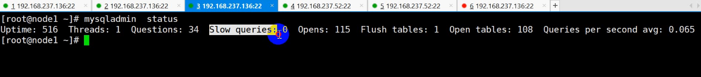

1、简单查询

```
select  * from  tb_name 
   		  where  
   		  group by 
   		  having
   		  order by 
   		  limit 
```

2、子查询
		查询的结果作为另外查询条件


3、联合查询 条件 
union select  列数必须一致，用在sql 注入漏洞

```
SELECT 1,2,3 UNION SELECT 4,5,6
```


4、关联查询 把几张表联合起来一起查，查询慢，会出现笛卡尔层级
	等值关联

```
1、SELECT
	first_name,
	last_name,
	title 
FROM
	employees
	JOIN titles ON employees.emp_no = titles.emp_no

2、SELECT
	first_name,
	last_name,
	dept_name 
FROM
	employees
	JOIN  dept_emp ON employees.emp_no = dept_emp.emp_no
	JOIN departments ON departments.dept_no = dept_emp.dept_no

3、SELECT
	employees.emp_no,
	first_name,
	salary 
FROM
	employees
	RIGHT JOIN salaries ON employees.emp_no = salaries.emp_no
```


 sql 注入漏洞：用户传递的不是正常的字符串而是一条sql语句，后端对传入的sql语句没有进行过滤，而是将这条语句传给了数据库，从而造成用户传递过来的语句在数据库中执行了，而且有可能将这条执行的语句反应到了页面，从而造成数据库的盗取。

```
1、安装软件
[root@www ~]# yum install httpd php-mysqlnd mariadb-server -y
2、开启服务
[root@mysql ~]# systemctl start httpd mariadb
3、[root@mysql ~]# curl http://127.0.0.1:80
4、[root@www ~]# cat /var/www/html/index.html
5、登录github.com---搜索 sqli-labs复制https://github.com/Audi-1/sqli-labs.git
6、[root@www html]# cd /var/www/html/
7、[root@www html]# git clone https://github.com/Audi-1/sqli-labs.git
8、[root@www sqli-labs]# vi sql-connections/setup-db.php
[root@www sqli-labs]# vi sql-connections/db-creds.inc 

```


参数设置：

存储引擎       将文件系统  文件  存储引擎  表====》 将表通过数据库（核心是存储引擎，它的作用就是实现表和文件的转换）文件要放到磁盘里面


	mysql 的存储引擎：将表与文件关联
				1、Innodb (默认)  支持事务，行级锁，外键，热备
						employees.frm  表结构文件 ===》表里面有哪些字段
						employees.ibd  表空间（存放索引+数据）==索引看成目录
				索引： 将某个字段作排序（btree索引，二叉树原型） 将某个字段（emp_no）做成索引（排序），通过索引查找数据
				emp_no  10000-20000000
			1.1查看表的索引：mysql> show index from employees \G
			1.2创建索引：mysql> CREATE INDEX xxy ON employees (first_name);
			1.3查看引擎：mysql> show engines ;
				
				2、MyisAM （）	  不（支持事务，行级锁，外键，热备）
					y2312.frm  表结构 
					y2312.MYD  表数据  
					y2312.MYI  表索引
	查看引擎：show engines;
	查看表的结构： show table stu\G;


数据库变量  	

	一、系统变量（修改数据工作特性）
		1.1查看系统变量中含有engine的数量：show variables like '%engine%';
		1.2修改默认引擎：set default_storage_engine='myisam' ;
		1.3创建一张表：create table y2312(id int primary key) ;
		1.4查看表的状态：show table status like 'y2312' \G
	*************************** 1. row ***************************
	           Name: y2312
	         Engine: MyISAM====》修改的
	
		show variables  like   	
		set var_name=value
	系统变量类型：会话和全局级别
		2.1会话级别 只对当前会话生效 
				set var_name=value
		2.2全局级别 对以后会话生效，要写在配置文件 /etc/my.cnf中的mysqld的下面
				set global var_name=value
			2.2.1修改全局变量：set global  default_storage_engine='myisam' ;
			2.3.2查看当前是否修改：show variables like '%engine%' ;===》当前回话并没有改变，依然是innodb，开启另外一台才显示myisam，但是重启会失效，所以要在配置文件中修改，socket=/var/lib/mysql/mysql.sock
	default_storage_engine=myisam
			3.4重启数据库[root@www Less-1]# systemctl restart mysqld
			3.5 查看修改：show variables like '%engine%' ;===>此时默认引擎改成myisam
			
	innodb_file_per_table   默认关闭 表示每一张表一个表空间文件
	sql_mode = '' | traditional 模式：插入超过字段长度
	
	例：
	1、mysql> use test;
	Database changed
	2、mysql> create table xx(name varchar(10)) ;
	
	3、mysql> insert into xx values('xxxxxxxxxxx') ;
	ERROR 1406 (22001): Data too long for column 'name' at row 1
	4、mysql> set sql_mode='';-======》设置为空
	Query OK, 0 rows affected, 1 warning (0.00 sec)
	5、mysql> insert into xx values('xxxxxxxxxxx') ;
	Query OK, 1 row affected, 1 warning (0.03 sec)===显示插入成功
	6、mysql> set sql_mode='traditional' ;===》修改成传统的
	Query OK, 0 rows affected, 1 warning (0.01 sec)
	
	二、状态变量
	show status  like '' 
	查看有几个线程：show status like '%thread%' ;  thread线程
	mysql外：直接查看线程/启动时间： mysqladmin status
	查看当前有几个连接：show status like '%connection%' ;
	锁  
	
	acid
	
	隔离级别


​	

>线程数量 发起了多少请求 慢查询 打开了多少文件 刷新了多少张表 打开了多少张彪 平均每秒所消耗的时间