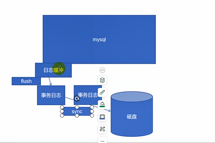

#### 一、锁：

```
1、隐式锁

2、显式锁：手动上锁
	乐观锁：
	悲观锁：自动上锁 等同于隐式锁
	读锁：只能读不能写
	写锁：不能读也不能写
	
语法：lock  tables  表名 read|write===上锁
解锁： unlock tables
在备份的时候先把表锁住再去备份。

终端一：
给某张表上锁：mysql> lock tables employees read ;
解锁：unlock tables；

create table xy (id int);
lock tables xy read ;read====可以查，
lock tables xy write ；write ====查询不了
终端二：
mysql> use test
mysql> select * from employees ;===》可以查询有20条数据
添加一条数据====》显示有21（naticat中添加）
mysql> select * from employees====还是只用20条数据。

insert into xy values(2);======>显示不了

```

#### 二、acid特性：

```
a：原子性 最小一个单位 （整体） mysql中最小执行单位：事务就是 一组sql语句（要么事务都成功，要么都不成功）

c：一致性

i：隔离性  多个事务写入数据执行 串行（针对一个人读一个人写的情况）有四种级别：不能同时写，会造成会话不一致

​		读未提交：READ-UNCOMMITTED，隔离性最差（再改就会变）

​		读已提交：READ-COMMITTED  数据提交才会变化

​		可重读：Repeatable Read（默认可重读）  点击提交commit===在另外一个终端就可以看见（第一次看到的数据库是什么样子，这次事务完了就是什么样子。除非在开启一个事务。）

​		串行：SERIALIZABLE 等别人写完了，你才能写，别人在读，你不能写，除非别人提交，效率差，但安全性较高

d：持久性： 事务 提交 数据就会持久到磁盘中
```


```
1、启动事务：start transaction ;
2、提交：commit;===意味着数据就持久化了，数据同步到磁盘中
添加的数据默认自动提交===可以再配置文件中修改
[root@www ~]# vi /etc/my.cnf   >====autocommit=off
[root@www ~]# systemctl restart mysqld
3、撤回之前的操作：rollback

模拟两人同时操作数据库
终端一：
use test
start transaction；
update xy set id=200 where id=2；

开启事务==修改id=200改成2   ===终端2中 查询的依然显示id=200，只有终端2提交然后再重新开启一个事务才会看到id=2

终端二：
use test
start transaction；
update xy set id=200 where id=2；====》显示修改不了意味两个人不可能同事写入

```

#### 三、隔离性级别：

```
1、改成读未提交：隔离性最差
==针对当前会话生效：set transaction_isolation='READ-UNCOMMITTED' ;
==全局生效：set global transaction_isolation='READ-UNCOMMITTED' ;

终端1：
开启一个事务==更改xy的id=2 的改成id=100
终端2：
开启一个事务==查看xy的id==显示修改成id=100，终端1 的没有点提交，依然显示id=100


2、改成读已提交，数据提交才会变化
终端1：
mysql> set global transaction_isolation='READ-COMMITTED' ; ===退出
mysql> start transaction ;
select * from xy ；===查询时还是id=200
id=200

终端2：
mysql> start transaction ;
use test
mysql> update xy set id=200 where id=2 ;===没有commit
mysql> commit ;提交


3、可重读：默认可重读：Repeatable Read 这边事务开启时另外一个看到的和这边一样，除非这边再开启一个事务。第一个事务读的是什么那就是什么。

4、串行：SERIALIZABLE准确度最高，但速度慢
mysql> set global transaction_isolation='SERIALIZABLE' ;

```


#### 四、mysql 日志管理 

```
1、事务日志：保证事务一致性及持久化
		顺序io--->随机io
			1.1：undo log 用于rollback 回滚
			1.2：redo log 用于commit提交 将日志里面的内容读到磁盘里
				wal： write ahead log 写在日志之前
事务日志相关配置：  innodb_log_file_size:事务日志的大小
				innodb_log_files_in_group：每个事物日志文件组有个文件
				innodb_log_group_home_dir：指定文件日志当前位置
				innodb_log_buffer_size: 指定缓冲大小 
				innodb_flush_log_at_trx_commit= 指定申明什么时候同步到缓冲区
		0 由mysql的main_thread每秒将存储引擎log buffer中的redo日志写入到log file，并调用文件系统的sync操作，将日志刷新到磁盘
		1 每次事务提交时，将存储引擎log buffer中的redo日志写入到log file，并调用文件系统的sync操作，将日志刷新到磁盘。=======只要刷新就同步
		2 每次事务提交时，将存储引擎log buffer中的redo日志写入到log file，并由存储引擎的main_thread 每秒将日志刷新到磁盘。======刷新写在日志里面，不会更新到磁盘里面。
```

**数据库的数据先写在缓冲区（内存），再同步到事务日志里面，再通过事务日志同步到磁盘里，也可以叫mysql2阶段提交**




```
2、错误日志
			log_error： 定义错误日志路径 
			log_error_verbosity： 错误日志级别 1|2|3
								1：错误信息
								2：错误信息和警告信息
								3：错误信息，警告信息，一般信息（mysql运行相关信息）
```

​	

 

```
3、一般查询日志（一般处于关闭），在调试的时候才会开启
	general_log： 一般查询日志 0 关闭 1 开启
	general_log_file： 日志存放的位置	
```


```
4、慢查日志：定位查询时间过长sql语句，一般超过10s就认为查询时间过长。
	slow_query_log： 开启还是关闭慢查日志 开启 1 | 0 关闭  写在配置文件中
	slow_query_log_file： 慢查日志的位置 
	long_query_time： 定义慢查日志时间 

mysql> select if(2=1,1,sleep(5));
+--------------------+
| if(2=1,1,sleep(5)) |
+--------------------+
|                  0 |
+--------------------+
1 row in set (5.00 sec)
这条语句超过3s，就会被记录下来。
```


   

```
5、二进制日志：一般记录数据库数据变化日志，用来数据恢复===还原数据
    	二进制格式：binlog_format： statement|row|mixed（混合）
    	max_binlog_size: 设定二进制文件最大空间
    	sql_log_bin： 会话级开启或者关闭二进制日志（临时的）
    	log_bin：开启二进制日志文件指定二进制日志文件位置 备注：需要指定server-id
    	expire_logs_days: 二进制日志文件最大存放时间
    	sync_binlog=[N]1表示commit就同步到磁盘 0---》根据系统机制同步

例子：
配置文件中修改二进制文件，二进制文件不要与数据文件放在一起，如果数据文件删了那么二进制文件也会删了，所以二进制文件单独放
server-id=1
log_bin=/var/log/mysql/mysqlbin ==mkdir /var/log/mysql==chown -R mysql:mysql /var/log/mysql
systemctl restart mysqld
读取二进制命令：mysqlbinlog /var/log/mysql/mysqlbin.00001===存放二进制日志文件的地方，如果查询不到，可以修改binlog_format=mixed模式


    二进制日志相关查询
    	SHOW {BINARY | MASTER} LOGS
    	show master logs：查看当前有几个二进制文件
    	SHOW MASTER STATUS： 查看当前处于什么二进制日志文件，和位置。
    	SHOW BINLOG EVENTS [IN 'log_name'] [FROM pos] [LIMIT [offset,] row_count]查看日志里面做了哪些事情==例：
    	===show binlog events in 'mysqlbin.000002';（查询到操作了那些sql语句）
        ===show binlog events in 'mysqlbin.000002' from 123;从事件123开始查起

    二进制命令客户端命令 
    	mysqlbinlog [OPTIONS] log_file --start-position=# 指定开始位置 --stop-position=# --start-datetime=#时间格式：YYYY-MM-DD hh:mm:ss --stop-datetime=

   6、 清除日志	
    	PURGE { BINARY | MASTER } LOGS { TO 'log_name' | BEFORE datetime_expr }

​		例：mysql> purge binary logs to 'mysqlbin.000002' ; 删除事件2之前的

​		PURGE BINARY LOGS TO 'mysqlbin.000003'; #删除mariadb-bin.000003之前的日志
​		PURGE BINARY LOGS BEFORE '2023-01-23';
​		PURGE BINARY LOGS BEFORE '2023-03-22 09:25:30'; 


​	7、重置日志 
​		RESET MASTER 二进制日志冲00001开始写
​	8、滚动日志 
​		FLUSH LOGS，换个日志重新写
```

  >如果查看二进制日志，没有看到插入数据的语句，修改二进制日志的格式binlog_format=mixed,重启数据库。

#### 五、利用二进制进行备份和还原：

```
备份工具：1、mysqldump
	 mysqldump  支持逻辑备份（备份sql语句），不支持增量备份（支持整个一起备份，新写入的不能备份，新增加的通过二进制日志来备份）支持热备
	 mysqldump  常见选项 
			--all-databases 备份所有的库
	 		--databases     指定那些库 
	 		--flush-logs    滚动二进制日志  
	 		--master-data   记录二进制日志位置  
	 						1： 不注释 
	 						2： 注释
 		    --lock-tables   锁表 用于温备

 			--single-transaction innodb 启动大事务实现热备
逻辑备份 sql语句
物理备份 备份数据 

冷备份  ===关掉mysql不能读写

温备份  ===能读不能写 （针对myISAM）

热备份  ===能读写（针对innodb）

完全备份 全部备份

增量备份 备份增加的数据


备份： 
	mysqldump 完全备份 
		backname="file$(date +%F-%T)"
		mysqldump  --all-databases --flush-logs --master-data=2 --single-transaction > $backname.sql
	二进制文件
		mysqbinlog --start-position=	--stop-position=  > xxx.sql
```


#### 案例：

```
终端1：13
备份：
create database dbtest ;
use dbtest ;
create table t1(id int);
insert into t1 values(1),(2);
insert into t1 values(3),(4);
commit; \q
备份dbtest这个数据库
mysqldump --databases dbtest --flush-logs --msater-data=2 --single-transaction > backdb.sql

先还原完全备份，在还原增量备份
source /root/backdb.sql
source /root/xx.sql


还原：
新加5、6 靠二进制文件来记录，删除dbtest数据库，并提交退出，还原时不记录二进制了，此时临时关闭二进制
mysql> set sql_log_bin=off ; =====临时关闭二进制
source /root/backdb.sql ;====还原===还原了1234，5和6通过二进制来还原
5和6 通过二进制来还原
终端2：存放5和6的二进制文件在/var/log/mysql/mysqlbin.000004  的154开始读取（mysqlbin.000004通过show master status来查找处于什么位置。）
mysqlbinlog /var/log/mysql/mysqlbin000004 | less
写入到xx.sql中，在终端1中读取

mysqlbinlog /var/log/mysql/mysqlbin000004 > xx.sql ===从154读到删除数据库命令之前，就能还原，否则又是在删除数据库dbtest
mysqlbinlog --stop-position 504（删除位置的地方） /var/log/mysql/mysqlbin.000004 > xx.sql
source xx.sql

利用mysqldump+二进制文件进行备份还原
还原： 先还原完全备份在还原增量备份

```


```
 还原  
	临时关闭二进制日志文件
		set sql_log_bin=0 
		source 完全备份的sql文件 
		source 二进制日志备份文件
	开启二进制日志文件
		set sql_log_bin=1 
		
 xtrabackup 
 	
```

