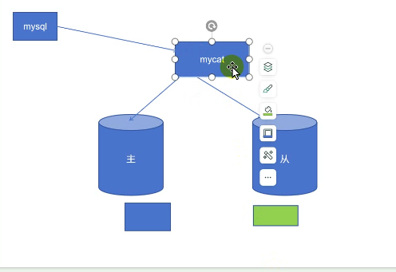
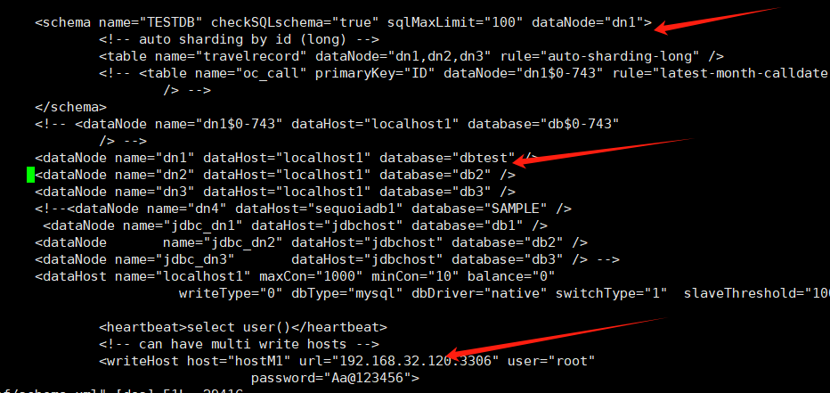
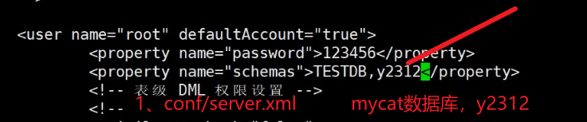
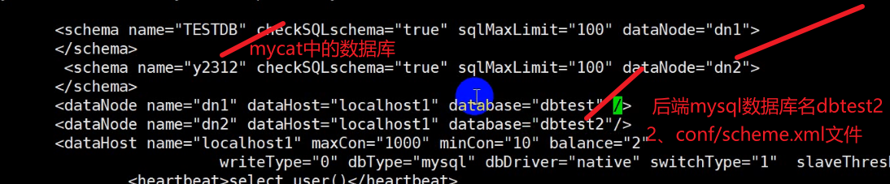
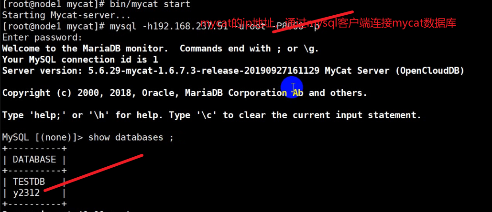

#### 1、mysql读写分离 ：

​	mysql-proxy

​	mycat读写分离，主数据库实现写的操作，从服务器实现读的操作，在两者之间添加一个调度器（mycat）实现读写分离。通过mysql客户端来连接mycat，连接调度器的数据库，但调度器本身不提供数据，而是由后面的主从数据库提供的。将mycat里面的TESTDB与主从数据库关联。

```
主服务器：120

mysql> insert into t1 values(23) ;
mysql> commit ;


```


```
从服务器：101

确保slave开启==start slave
查看slave状态：show slave status \G
```


```
从服务器：140

确保slave开启==start slave
查看slave状态：show slave status \G
```

#### 2、读写分离案例

```
mycat是Java开发的，需要Java环境
调度器mycat：140
[root@y2312 ~]# tar -xf jdk-8u144-linux-x64.tar.gz -C /usr/local/
[root@y2312 ~]# ln -s /usr/local/jdk1.8.0_144/ /usr/local//java
[root@y2312 ~]# vi /etc/profile.d/java.sh====
export JAVA_HOME=/usr/local/java
export PATH=$PATH:$JAVA_HOME/bin
source /etc/profile.d/java.sh

安装mycat：需要先安装java环境
[root@y2312 ~]# tar -xf Mycat-server-1.6.7.3-release-20190927161129-linux.tar.gz -C /usr/local/
cd /usr/local/  =====ls
[root@y2312 mycat]# bin/mycat --help
Usage: bin/mycat { console | start | stop | restart | status | dump }
                  启动信息打在屏幕上|开启|停止|重启|状态
[root@y2312 mycat]# bin/mycat start 开启mycat
查看端口：[root@y2312 mycat]# netstat -taunp | grep java ====port：8066

连接mycat服务：[root@y2312 mycat]# mysql -h192.168.32.140 -uroot -P8066 -p（小写）===此时只是连接mycat，并没有连接主从数据库。
添加主从库：
database定义后台主从复制的数据库
schema.xml配置如何与主从数据库相连：
TESTDB要与datanode关联起来 ： <dataNode name="dn1" dataHost="localhost1" database="dbtest" />
schema关联dn1：<schema name="TESTDB" checkSQLschema="true" sqlMaxLimit="100" dataNode="dn1">

datanode name=dn1 datahost=localhost1===通过dn1来连接localhost1
vi conf/schema.xml修改配置
 <writeHost host="hostM1" url="192.168.18.13:3306" user="root"
                                   password="Aa@123456">

以上配置完成：
开启 /bin/mycat start 
进入mysql： mysql -h192.168.18.150 -uroot -p=====123456
show databases ; ===use TESTDB;====show tables ;====有t1这个表==通过调度器连接到数据库了
一般查询日志：[root@www ~]# tail -f /var/lib/mysql/node.log
在主数据库中授权myscat服务器登陆；grant all privileges on *.* to 'root'@'%' identified by 'Aa@123456' ;
start transaction ;
insert into t1 values(31);
commit ;
===此时在主服务器中：先退出在进入就可以查看到31这条信息==退出是应为隔离级别为：可重读；如果不想重新推出就在主数据库上面也commit；就可以看到31这条信息。


```




通过mycat来实现读写分离：schma.xml就是提供与主从数据库关联的，database定义后台（主从数据库）的数据库，要将TESTDB（调度器mycat）的数据库与datanode（主从数据库的库dbtest）关联，指定schema中的属性来关联dn1




```
140（mycat）：
从服务器加到集群里面：
vi conf/schema.xml中配置可读服务器：
<dataHost name="localhost1" maxCon="1000" minCon="10" balance="2"==修改调度算法为2（随机）
<writeHost host="hostM1" url="192.168.18.13:3306" user="root"
                                   password="Aa@123456">   ==主库写
                <readHost host="host1" url="192.168.18.110:3306" user="root"
从库读   --------》                     password="Aa@123456"> </readHost>
balance=0|1|2|3调度算法：
0：不开启读写分离
1：双主双从模式
2：所有读操作随机发在writehost 和readhost上分发
3：所有读的操作分发到readhost上writehost不负担读
bin/mycat console ==检查语法错误
13和110两个服务器打开一般查询日志 /etc/my.cnf  general-log=1

在调度器上再创建一个新库：
1、vi conf/server.xml==创建新库y2312
<user name="root" defaultAccount="true">
                <property name="password">123456</property>
                <property name="schemas">TESTDB,y2312</property>

2、 vi conf/schema.xml
<schema name="y2312" checkSQLschema="true" sqlMaxLimit="100" dataNode="dn2">
        </schema>
        <dataNode name="dn1" dataHost="host1" database="dbtest" />
        <dataNode name="dn2" dataHost="host1" database="dbtest2" />

bin/mycat stop
bin/mycat console 启动时将日志打印出来
bin/mycat start

总结： 当用户的请求到调度器（mycat），调度器将写的请求分给主数据库，读的请求随机发送给主从数据库，从而分担主数据库读的压力，写的压力不能分担，关系型数据库为保证一致性，不要求多个人同时写，分表可以实现多人，但难度大。

```

>如果还有数据库要添加到mycat中：1、修改conf/server.xml文件；2、修改conf/schema.xml,添加后端服务器的数据库，；3、重新启动mycat；前提：首先在后端mysql服务器中创建dbtest2数据库。







#### 3、mha高可用

> mha高可用（当主服务器挂掉寻找从数据库来充当新的主服务器，如何选择：配置虚vip）

```
120：主服务器开启二进制日志（主数据库）
101：从服务器1 
200：从服务器2 
140：manger 监视主从关系的 node是被监控的，所以数据库是node节点，mycat是监视器。
从1：开启中继日志和change master to（指向新的主数据库）和stop slave 和 vip
从2：reset slave 和change master to

一、从服务器：
101和130：开启二进制日志 /etc/my.cnf
log_bin=/var/log/mysql/mysqlbin
binlog_format=mixed
[root@www ~]# mkdir /var/log/mysql
[root@www ~]# chown -R mysql:mysql /var/log/mysql
在主数据库上将主数据库的完全备份导入两台从服务器中
[root@www ~]# systemctl restart mysqld   ====130这台从服务器。
mysql：CHANGE MASTER TO MASTER_HOST='192.168.32.120', MASTER_USER='zhang', 
	   	   		MASTER_PASSWORD='Aa@123456', 
	   	   		MASTER_LOG_FILE='mysqlbin.000009', 
		   		   MASTER_LOG_POS=154;
show slave status \G;
保证主从关系同步。120主数据库插入数据，两台从服务器可以同步
安装node.tar.gz 三台数据库为被监控端
```


140:manger监视一主两从

```
安装node和manger两个软件
[root@y2312 ~]# rpm -ql mha4mysql-manager ==查看生成的文件
所有数据库都要公钥信任（各个服务器都要互相信任）不需要输入密码
ssh-keygen -t rsa(所有服务器都要安装ssh)
ssh-copy-id 192.168.32.101|130|140
ssh 192.168.32.101|130|140
放入app.cnf给manger调用（manger没有配置文件）
vi app.conf
[server default]
user=root 
password=Aa@123456
manager_workdir=/data/mastermha/app1/  工作目录
manager_log=/data/mastermha/app1/manager.log
remote_workdir=/data/mastermha/app1/
ssh_user=root  
repl_user=root
repl_password=Aa@123456
ping_interval=1  
#master_ip_failover_script=/usr/local/bin/master_ip_failover  切换虚vip
#report_script=/usr/local/bin/sendmail.sh
check_repl_delay=0
master_binlog_dir=/var/log/mysql/
[server1]
hostname=192.168.18.13
candidate_master=1
[server2]
hostname=192.168.18.110
candidate_master=1
[server3]
hostname=192.168.18.200

[root@y2312 ~]# mkdir /data/mastermha/app1/ -pv
[root@y2312 ~]# mkdir /etc/mha
[root@y2312 ~]# cp app.conf /etc/mha/
[root@y2312 ~]# masterha_check_ssh --conf=/etc/mha/app.conf检查语法
启动manager： masterha_manager --conf /etc/mha/app.conf

```


```
13主服务器：
[root@www ~]# ssh-keygen -t rsa==回车
[root@www ~]# ssh-copy-id 192.168.18.150===密码：123456
[root@www ~]# ssh-copy-id 192.168.18.110==123456
[root@www ~]# ssh-copy-id 192.168.18.200==123456
免密登录
[root@www ~]# ssh 192.168.18.150==exit
[root@www ~]# ssh 192.168.18.110
[root@www ~]# ssh 192.168.18.200


所有服务器都要设置免密登录

mysql> insert into t1 values(900);
commit ；

```


```
101和130：可以接受到900的这条信息（主从复制+读写分离）


140调度器：
配置虚ip： ifconfig ens33:0 192.168.18.244/24
[root@localhost ~]# cp master_ip_failover /usr/local/bin/
[root@localhost ~]# chmod +x /usr/local/bin/master_ip_failover
```
