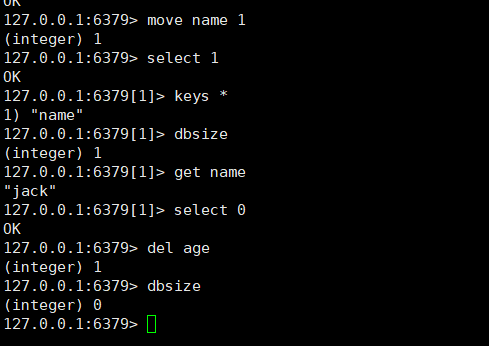
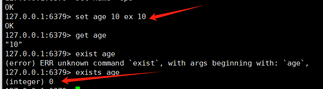

	关系数据库 
		数据的结构严格定死
	
	非关系型数据库  
			k-v 
				键值对  
						memcache： 
							1：数据类型单一支持字符串
							2：不能持久化 
						redis
							1：支持数据类型众多 
							2：持久化 
			   应用场景 ：
			   	   1： 会话服务器 保证会话一致性
			   	   2： 缓存服务器
			   	   3： 消息队列  削峰 解耦
			   	   		kafaka
			   	   		robbitmq
			   	   		rockectmq
			   	   4：热点排名
				   5：点赞 点踩
	
	 reids安装：
			     1: 准备编译环境
			     		yum groupinstall "Development Tools"
			     2: 解压redis包 
		         3:  make [PREFIX=/usr/local/redis] install
	redis启动：/usr/local/redis/bin/redis-server
		连接：/usr/local/redis/bin/redis-cli	

​	

	  启动redis  
	  	  redis-server  配置文件的路径
	  	  cp redis.conf /etc/
	
	  默认情况 redis提供16个数据库  0-15
	
	  	  切换数据库   
	  	  	select  0-15
	  	  	dbsize  查看当前数据库下边有多少key
	  	  	EXISTS  查看key存在
	  	  	KEYS *  列出当前数据库有哪些key (但是慎用)
	  	  	MOVE    移动key到指定数据库 
	  	  	DEL     删除key值
	  	    INFO    列出服务器相关信息
	  数据类型	    
	  	 	字符串 
			  	 	SET  KEY  VALUE  EX(设定存活时间秒) PX（毫秒） NX(当key不存在才创建)
	
			  	 	GET  KEY
				设定多个值：
			  	 	MSET KEY1 VALUE1 KEY2 VLAU2 ......
					例：MSET p1 zhangsan p2 lisi p3 wangwu
				查询：
			  	 	MGET KEY1 KEY2 KEY3 .......
			  	 	 MGET p1 p2 p3
					1) "zhangsan"
					2) "lisi"
					3) "wangwu"
				设定点赞和踩：
			  	 	INCR KEY +1 
			  	 	DECR KEY -1
			  	 	INCRBY AGE 20
					DECRBY AGE 20
		列表： 放入多个value  
			  LPUSH KEY  value1 value2 
			  例：LPUSH hobby "football" "basketball" "volleyball"
			     LRANGE hobby 0 10 从0到10展开
				  1) "volleyball"
				  2) "basketball"
				  3) "football"
				 显示索引： LINDEX hobby 0
							"volleyball"
				 删除： LPOP hobby
						"volleyball"
				长度：LLEN hobby
						(integer) 2
				插入数据：LINSERT hobby before basketball jack
							(integer) 3
						LRANGE hobby 0 10
							1) "jack"
							2) "basketball"
							3) "football"
	    集合: SET 无序 去重
	    	添加：
	        hash


	redis 配置文件  
			bind 0.0.0.0
			port 6379
			protected-mode no 保护模式是否开启
			daemonize yes|no  是否以守护进程方式运行redis，是否在屏幕上显示 
			pidfile /var/run/redis_6379.pid 指定redis进程文件的位置 
			requirepass 123456   指定redis-server 访问密码
	redis-cli  
			auth  密码		
	
			持久化 
				rdb 
					save 3600 1    一小时数据变化1次 作快照
					save 300 100  
					save 60 10000	
					dbfilename dump.rdb  指定快照保存名称 
					dir 指定快照保存 目录
				aof
					appendonly yes  开启aof 功能 
	
					appendfilename "appendonly.aof"  指定aof文件名称 
	
					appendfsync everysec | always  同步频率 
			注意点当aof和rdp同时开启，redis优先使用aof
					需要在终端开启aof 
						config set appendonly yes (立即生效)
	hbase:列式数据库
	
	文档数据库： mongodb 


110:


	[root@www ~]# cd redis-5.0.5
	redis-5.0.5/           redis-5.0.5.tar(1).gz  
	[root@www ~]# cd redis-5.0.5
	[root@www redis-5.0.5]# ls
	00-RELEASENOTES  COPYING  Makefile   redis.conf       runtest-moduleapi  src
	BUGS             deps     MANIFESTO  runtest          runtest-sentinel   tests
	CONTRIBUTING     INSTALL  README.md  runtest-cluster  sentinel.conf      utils
	[root@www redis-5.0.5]# vi redis.conf 
	[root@www redis-5.0.5]# cp redis.conf /etc/
	[root@www redis-5.0.5]# vi /etc/redis.conf 
	开启后台：daemonize yes
	
	字符串：
	/usr/local/bin/redis-cli  --回车
	选择数据库：set 0
	插入表：set name "jack"
	查询： get name
	查询所有的key： keys *  ===不建议
	查询有多少个key：dbsize
	移动： move name 1 ====将0好数据库里卖弄的表移动到一号数据库。
	127.0.0.1:6379> set name "jack" nx  ====nx，用于创建
	OK
	127.0.0.1:6379> set name "lisi" nx
	(nil)
	127.0.0.1:6379> set name "lisi" xx  ====xx，用于修改
	OK
	
	ex： 过期时间，超过一定时间就会没有===用户缓存
	127.0.0.1:6379> set age 10 ex 10
	OK
	127.0.0.1:6379> get age
	"10"
	127.0.0.1:6379> exists age
	(integer) 0
	
	点赞：
	127.0.0.1:6379> set good 0  ====设置点赞
	OK
	127.0.0.1:6379> incr good   ===相当于点击一下
	(integer) 1
	127.0.0.1:6379> get good  ====查询
	"1"
	127.0.0.1:6379> incr good
	(integer) 2
	127.0.0.1:6379> get good
	"2"
	127.0.0.1:6379> decr good  ===取消点赞
	(integer) 1
	127.0.0.1:6379> get good
	"1"
	
	同时设定多个值：
	127.0.0.1:6379> MSET p1 zhangsan p2 lisi p3 wangwu
	OK
	127.0.0.1:6379> mget p1 p2 p3
	1) "zhangsan"
	2) "lisi"
	3) "wangwu"








列表：

```
lpush，向左插入列表，可以索引
127.0.0.1:6379> LPUSH hobby "football" "basketball" "volleyball"
(integer) 3
127.0.0.1:6379> LRANGE hobby 0 10   ===查询范围
1) "volleyball"
2) "basketball"
3) "football"
127.0.0.1:6379> LPUSH hobby "jack"
(integer) 4
127.0.0.1:6379> LRANGE hobby 0 10
1) "jack"
2) "volleyball"
3) "basketball"
4) "football"

显示索引：
127.0.0.1:6379> LINDEX hobby 0|1.。。
"jack"

删除
127.0.0.1:6379> LPOP hobby  ===删除左边
"jack"
127.0.0.1:6379> rPOP hobby  ===删除右边
"football"

查看长度：
127.0.0.1:6379> LLEN hobby
(integer) 2
127.0.0.1:6379> 

在什么字段前插入：
127.0.0.1:6379> LINSERT hobby before basketball jack
(integer) 3
127.0.0.1:6379> LRANGE hobby 0 10
1) "volleyball"
2) "jack"
3) "basketball"

```


集合：set 无序 去重

```
在集合里面添加：
127.0.0.1:6379> SADD students zhangsan lisi zhangsan ===去重
(integer) 2
127.0.0.1:6379> SCARD students   ===查询长度
(integer) 2

查看有几个元素：
127.0.0.1:6379> SMEMBERS students  ===元素位置可能会变
1) "zhangsan"
2) "lisi"

随机弹出（删除）几个元素：
127.0.0.1:6379> SPOP students
"zhangsan"
127.0.0.1:6379> SPOP students
"lisi"

指定删除那些元素：
127.0.0.1:6379> SREM students lisi
(integer) 1

```


hash：相当于字典

```
插入：
127.0.0.1:6379> HMSET per name "zhangsan" age 10   设置name和age
OK

查询：
127.0.0.1:6379> HMGET per name
1) "zhangsan"
127.0.0.1:6379> HMGET per name age
1) "zhangsan"
2) "10"

删除：
127.0.0.1:6379> HDEL per name
(integer) 1
127.0.0.1:6379> HGET per age
"10"


```

