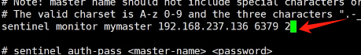

```
redis 配置文件  
		bind 0.0.0.0
		port 6379
		protected-mode no
		daemonize yes|no  是否以守护进程方式运行redis 
		pidfile /var/run/redis_6379.pid 指定redis进程文件的位置 
		requirepass 123456   指定redis-server 访问密码
redis-cli  
		auth  密码		

		持久化 
			1、rdb（类似于快照） 
				save 3600 1    一小时数据变化1次 作快照
				save 300 100  300s内有数据变化就做一次快照
				save 60 10000	60s内有数据变化就做一个快照
				dbfilename dump.rdb  指定快照保存名称 
				dir 指定快照保存 目录
			2、aof===类似于二进制文件，将所有操作保存起来。
				appendonly yes  开启aof 功能 

				appendfilename "appendonly.aof"  指定aof文件名称 

				appendfsync everysec | always  同步频率 
				注意点当aof和rdp同时开启，redis优先使用aof
				需要在终端开启aof 
					config set appendonly yes (立即生效)
				
hbase:列式数据库
文档数据库： mongodb 
```


主从复制：

```
从服务器：101
vi /etc/redis.conf
replicaof 192.168.66.110 6379 =====指定主服务器

```

哨兵模式：类似于mha主服务器挂了要保证集群的稳定

```
主服务器：110
[root@y2312 redis-6.2.14]# cp sentinel.conf /etc/(哨兵配置文件)
sentinel monitor mymaster 127.0.0.1 6379 2
				集群名字   主服务器 端口 权重
sentinel down-after-milliseconds mymaster 3000 当主服务器挂了3s后就开启投票选取下一个主服务器
sentinel parallel-syncs mymaster 1 并发同步
启动： /usr/local/redis/bin/redis-sentinel /etc/sentinel.conf 
从服务器：101 102
vi /etc/redis.conf
dir /data/redis/  ==指定日志文件存放位置
replicaof 192.168.66.110 6379 =====指定主服务器


```

