# 企业级架构缓存篇之Redis7（重点）

# 学习目标

1、能够描述Redis作用及其业务适用场景

2、能够安装配置启动Redis

3、能够使用命令行客户端简单操作Redis

4、能够实现操作基本数据类型

5、能够理解描述Redis数据持久化机制

6、能够操作安装php的Redis扩展

7、能够操作实现Redis7主从模式（Redis新版集群以及哨兵模式）

# 一、背景描述及其方案设计

## 1、业务背景描述

时间：2021.9.-2022.6

发布产品类型：互联网动态站点 商城

用户数量： 25000（用户量猛增）

PV ： 1000000-5000000（24小时访问次数总和）

DAU： 12000（每日活跃用户数）

## 2、模拟运维设计方案

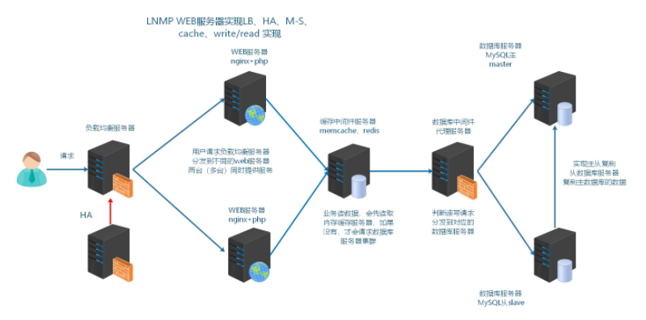

根据以上业务需求，准备加入Redis缓存中间件服务器，可以使用到redis更加丰富的功能

在商城业务中实现：

① 实现活跃用户数的统计（使用set集合）

② session存储到redis

③防刷、防攻击平台开发：openresty（nginx+lua）动态限制IP访问waf（web application firewalld）

# 二、Redis概述

## 1、什么是Redis


Nosql 非关系数据库 key => value  键值对

Redis是**R**emote **D**ictionary **S**erver(远程数据服务)的缩写

由意大利人 antirez(Salvatore Sanfilippo萨尔瓦托桑菲利波)  开发的一款 内存高速缓存数据库

该软件使用C语言编写，它的数据模型为 key-value

它支持丰富的数据结构，比如 **string   list（双向链表）  hash（哈希）   set（集合）  sorted set（zset有序集合）**

可持久化（保存数据到磁盘中），保证了数据安全

## 2、业务使用场合

**① [Sort Set]**排行榜应用，取top n操作，例如sina微博热门话题（取最热的前10个话题）

**② [List]**获得最新N个数据 或 某个分类的最新数据

**③ [String]**计数器应用

**④ [Set]**sns(social network site)获得共同好友

**⑤ [Set]**防攻击系统(ip判断)黑白名单等等

# 三、安装与配置Redis

官方网址：<https://redis.io/>

github: <https://github.com/antirez/redis>

## 1、安装方式

可以通过yum方式在线安装，也可以通过源码编译方式安装

这里，采用源码编译方式安装：

```powershell
第一步：找到对应的安装包资源，使用wget命令下载，这里安装的7.4.0版本。
安装包资源地址：https://download.redis.io/releases/

第二步：上传Redis到Linux系统中

wget https://download.redis.io/releases/redis-7.4.0.tar.gz

第二步：配置=>编译=>安装
tar -zxvf redis-7.4.0.tar.gz
cd redis-7.4.0
make
make PREFIX=/usr/local/redis install
```

 安装成功后，Redis 的可执行文件将被安装到 `/usr/local/redis`

## 2、修改配置

```powershell
sudo mkdir -p /usr/local/redis/conf
sudo cp redis.conf /usr/local/redis/conf/

# 修改配置
sudo vim /usr/local/redis/conf/redis.conf
  88： bind 127.0.0.1 -::1  --> bind 0.0.0.0
  310： daemonize no  --> daemonize yes（yes代表后台启动）

# 添加redis到环境变量
sudo vim /etc/profile
export PATH="$PATH:/usr/local/redis/bin"
source /etc/profile

#过量使用内存设置为0！在低内存环境下，后台保存可能失败
sudo vim  /etc/sysctl.conf
vm.overcommit_memory = 1
sysctl -p
```

>在设置lvs时，设置过ip转发

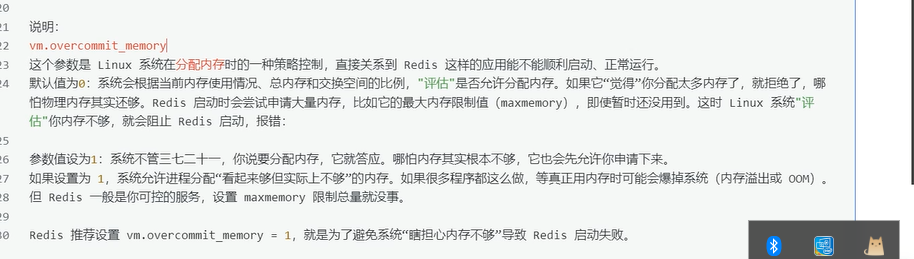

## 3、启动Redis

手工实现服务验证

```powershell
#查看版本
redis-cli   -v
#启动
redis-server /usr/local/redis/conf/redis.conf
#查看服务进程
ps  -ef |  grep  redis
```

封装redis.service脚本

```powershell
sudo vim /etc/systemd/system/redis.service
[Unit]
Description=redis-server
After=network.target
 
[Service]
Type=forking
ExecStart=/usr/local/redis/bin/redis-server /usr/local/redis/conf/redis.conf
PrivateTmp=true
 
[Install]
WantedBy=multi-user.target

pkill redis-server
以后就可以使用：systemctl start redis
```

## 4、6379端口


Alessia Merz（阿莱西亚-梅尔兹）

<http://oldblog.antirez.com/post/redis-as-LRU-cache.html>

## 5、命令行客户端简单使用

redis属于c/s架构软件，telnet可以连接redis，没有本身redis-cli更加好用

**① 简单的数据操作**

string类型：字符串类型、文本类型，用于保存文本信息

```powershell
# redis-cli
127.0.0.1:6379 > set name devops
OK
127.0.0.1:6379 > get name
"devops"
```

**② 查看操作语法帮助**

```powershell
# 127.0.0.1:6379 > help
# 127.0.0.1:6379 > help set
```

**③ 系统状态信息**

```powershell
# 127.0.0.1:6379 > info 
```

>当使用prometheus监控redis时的指标有：1、当前服务器的状态（status）2、是否进行了持久化（persistence） 3、内存占用大小 4、客户端连接信息（connection-client）5、整个服务器版本 6、redis总的连接，中的内存大小。

**④退出redis**

```
# 127.0.0.1:6379 > quit
```


# 四、数据结构类型操作

## 1、key（键名）

内存：NoSQL数据库，存储形式，键值对，类似身份证（不能重复，必须唯一）

key的命名规则不同于一般语言，键盘上除了空格、\n换行符外其他的大部分字符都可以使用。

但是像"my key"和"mykey\n"这样包含空格和换行的key是不允许的。

我们在使用的时候可以自己定义一个key的格式，但是要特别注意：

key不要太长。占内存，查询慢。

key不要太短。像u:1000:pwd:123456   就不如   user:1000:password:123456可读性好

 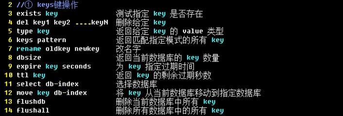

默认在redis配置文件redis.conf中，提供了16库，查看配置文件：

```powershell
# databases 16
# 数据库的编号都是从0开始，最大值为16-1
```

☆ 判断key是否存在

```powershell
# exists key
存在1，不存在0
```

☆ 删除key

```powershell
# del key
```

☆ 获取type类型

```powershell
# type key
```

☆ 显示所有key

```powershell
# keys *
```

☆ 设置过期时间（单位s）

```powershell
# expire name 8
```

☆ 查看剩余时间

```powershell
# ttl name
```

☆ 查看当前库key数量

```powershell
# dbsize
```

☆ 切换数据库（共16个库，index = number -1）

```powershell
# select 0-15
```

☆ flushdb清空当前库(删除所有key，慎重！！！)

```powershell
# flushdb
```

☆ 清空所有库（删除所有数据库中的所有key，慎重！！！）

```powershell
# flushall
```

## 2、string

string是redis最基本的类型

redis的string可以包含任何数据。包括jpg图片 base64或者序列化的对象

单个value值最大上限是==512MB==

如果只用string类型，redis就可以被看作加上持久化特性的memcached

 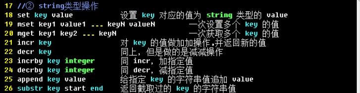

>查看string的使用方法：redis> help @string

☆ 设置string

```powershell
# set name itheima
```

☆ 批量设置string

```powershell
# mset name cndws age 18 address beijing
```

☆ 批量获取

```powershell
# mget name age address
```

☆ 增加与减少（+1与-1）计数器（可以用在防DDos攻击）

```powershell
# incr age
# decr age

# incrby age 2
# decrby age 3
```

☆ 追加

```powershell
# append name 123
```

☆ 截取

```powershell
# substr name start end

start：从哪里开始截取，默认从0第一个字符开始
end  ：到哪里截取结束，必须要添加结束字符的索引号
```

小结：

string字符串类型是redis中最常用数据类型，其可以保存任何数据！！！

单个value值最大上限是512MB

## 3、list

key value(value1,value2,value3，一个key有多个值)

list类型其实就是一个==双向链表==。通过push,pop操作从链表的头部或者尾部添加删除元素

这使得list既可以用作栈，也可以用作队列

同一端进出，先进后出，后进先出  ==>  栈（有底的桶）

一端进，另外一端出，先进先出  ==>  队列

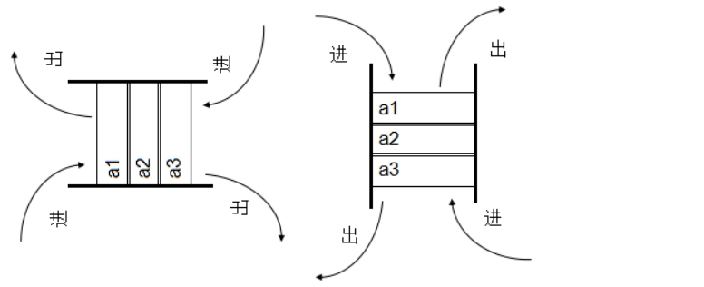

首部（左 left）   尾部（右right）

需求：显示最后登录的几个用户

设计实现：

① 登录一个用户，把用户名称或者id存储在list中

② 从左侧取第一个元素

特点：同一端进，同一端出（大部分以左为主）

用户：xiaohua xiaoming xiaobaitu

key名称：lastlogin

 

案例：获取最后登录的用户

```powershell
# lpush lastlogin xiaohua
# lpush lastlogin xiaoming
# lpush lastlogin xiaobaitu
```

栈操作：获取最后登录的用户

```powershell
# lrange lastlogin 0 0
```

>
>
>小结：栈：可以用于模拟获取最后登录的用户
>
>队列：可以用户模拟秒杀功能实现===> 电商平台==>秒杀（5个产品，打折）,100个用户报名，生产环境下，秒杀功能结合redis，把点击的用户放入redis中，秒杀结束，从队列中取出前五个用户的id，这就是秒杀功能的实现

## 4、set

作用：求交集、并集、差集！！！

redis的set是string类型的无序集合。集合里不允许有重复的元素

set元素最大可以包含(2的32次方-1)个元素。

关于set集合类型除了基本的添加删除操作，其他常用的操作还包含集合的取==并集(union)，交集(intersection)，差集(difference)==。通过这些操作可以很容易的实现sns中的好友推荐功能。

共同好友

好友推荐

TIP:MySQL连表文氏图

<https://www.cnblogs.com/sunjie9606/p/4167190.html>

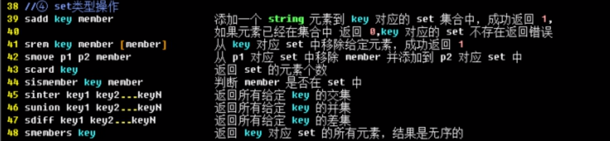

案例1：实现朋友圈的存储和共同好友的计算

设计：

key                           value

xiaomingFR    xiaohong  xiaoqiang  xiaogang  xiaobai  xiaohei

xiaohongFR    xiaoming  xiaolv  xiaolan  xiaobai  xiaohei

第一步：使用sadd添加xiaomingFR与xiaohongFR

```powershell
# sadd xiaomingFR xiaohong xiaoqiang xiaogang xiaobai xiaohei
# sadd xiaohongFR xiaoming xiaolv xiaolan xiaobai xiaohei
```

第二步：求交集(共同好友)

```powershell
# sinter xiaomingFR xiaohongFR
```

第三步：求并集(所有好友)

```powershell
# sunion xiaomingFR xiaohongFR
```

第四步：求差集(互相推荐好友)

```powershell
# sdiff xiaomingFR xiaohongFR
```

案例2：使用set实现制作ip黑名单(白名单)

```powershell
# sadd ips 10.1.1.11 10.1.1.12
# sismember ips 10.1.1.11
# sismember ips 10.1.1.100
```

小结：

set：无序且天生去重数据集合

核心：求交集、并集、差集

## 5、zset

和set一样，zset也是string类型元素的集合 => ==有序集合，元素不允许重复==

不同的是每个元素都会关联一个权。

通过权值可以有序的获取集合中的元素，可以通过score值进行排序

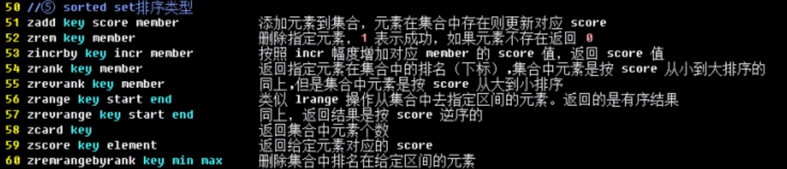

需求：实现手机APP市场的软件排名

key : hotTop

id   score    name

1        2        qq

2        3        wechat

3        5        alipay

4        7        taobao

5       10        mi

6        8         jd

第一步：插入数据

```powershell
# zadd  hotTop  2 qq 3 wechat 5 alipay 7 taobao 10 king 8 jd 
```

第二步：排序，从小到大，qq => wechat => alipay => taobao => jd => mi

```powershell
# zrange hotTop 0 5
```

第三步：排序，从大到小

```powershell
# zrevrange hotTop 0 5
```

扩展：获取某个软件的score值

```powershell
# zscore hotTop  jd
# zscore hotTop  taobao
```

扩展：更新某个软件的score值

```powershell
# zincrby hotTop -2 jd
# zrange hotTop 0 5
```

小结：

和set一样，zset也是集合的一种；不同点在于zset是有序集合，set是无序集合。

## 6、hash（哈希）

作用：使用redis做缓存还可以做数据库。除了可以使用string，还可以使用hash结构，比string压缩效率和使用效率更高。

hash存储数据和关系型数据库（mysql），存储的一条数据的结构极为相似

key：value（field：value）

insert into table(id,name,sex,address) values (null,'王维','男',18,'北京市昌平区')

id:1

name:'王维'

sex:'男'

age:18

address:'北京市昌平区'

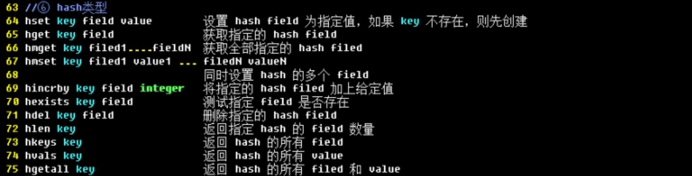

☆ 设置hash数据

```powershell
# hmset devops username cndws age 18 email cndws@itcast.cn
```

☆ 获取的指定的field字段信息

```powershell
# hget devops username
```

```powershell
# hmget devops username age email
```

☆ 更新devops的age字段信息

```powershell
# hincrby devops age 1
```

☆ 获取某个key的所有field信息

```powershell
# hkeys devops
```

☆ 获取某个key的所有field的所有value信息

```powershell
# hvals devops
```

☆ 删除指定的field字段

```powershell
# hdel devops age
```

☆ 获取devops的key数量

```powershell
# hlen devops
```

☆ 查询指定field是否存在

```powershell
# hexists devops name
```

小结：redis既可以作为存储也可以作为NoSQL数据库使用

存储数据时，如果数据与数据之间关联度不太大 => string

存储数据时，如果数据与数据之间关联度还比较大=> hash

相对而言，hash拥有更高的压缩比！！！

# 五、数据持久化操作（重点）

目标：能够说出什么是持久化？RDB持久化和AOF持久化区别即可！

## 1、什么是数据持久化

数据持久化（数据在服务或者软件重启之后不丢失）

如果数据只存在内存中，肯定会丢失，实现持久化，就需要把数据存储到磁盘中（hdd ssd）

Redis持久化：https://redis.io/docs/latest/operate/oss_and_stack/management/persistence/

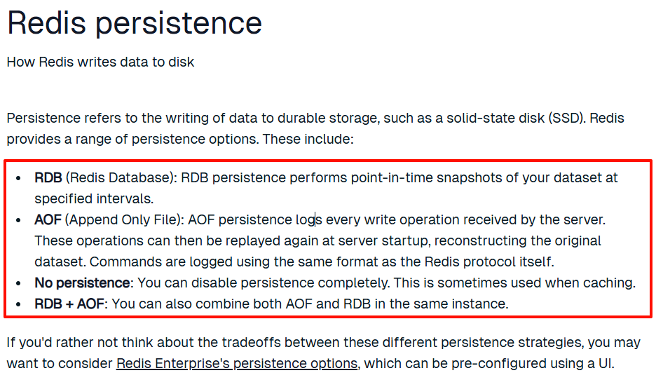

## 2、snappshoting(快照)=>RDB持久化

默认snappshoting是开启的，而且有一个"拍照"的频率

### ☆ RDB自动备份

前提：触发条件，只有满足触发条件，才会自动备份！

通过查看配置文件可以看到：

```powershell
save 900 1				=>  15分钟内最少有1个key改变
save 300 100	     =>  5分钟内最少有100个key改变
save 60	 10000		=>  1分钟内最少有10000个key改变

save 3600 1 300 100 60 10000
save 秒数 redis事务型操作（增删改）次数

暂时设置如下：
 446行：save 10 2
```

快照文件：（conf/redis.conf）

```powershell
dbfilename dump.rdb
```

从Redis6版本开始，引入了一个dir参数 => 代表默认保存路径，之前版本==默认安装路径== => /usr/local/redis

```powershell
dir ./相对路径，redis在哪里启动，默认就会保存dump.rdb文件到哪里？

cd /usr/local/redis
bin/redis-server  conf/redis.conf  ===>重新启动redis
dump.rdb

127.0.0.1:6379> config get dir，可以查看默认保存路径
建议直接更改配置517行

dir /usr/local/redis
```

---

文件名称并不是固定的，可以改变的，如dump_port.rdb，设置完成后，一定要记得重启redis

```powershell
pkill redis-server
cd /usr/local/redis
bin/redis-server config/redis.conf
127.0.0.1:6379> config get dir
127.0.0.1:6379> bgsave
```


测试备份频率

在10s内，进行2key的改变，查看备份效果：

```powershell
set num1 1
set num2 2
```

测试结果：查看dump.rdb文件大小的变化

> RDB可能会遇到的一个缺点：必须要满足10s内有2个key发生改变才能拍照，如果10s只有1个key发生改变，RDB会更新么？如果11s的时候刚好Redis宕机，则丢失一小部分数据从上次拍照到当前时间的数据会丢失！
>
> 非常小概率事件！！！

### ☆ 手工快照备份

```powershell
127.0.0.1:6379 > save或bgsave
```

save：使用 `save` 的时候，在主程序中执行会 **阻塞** 当前 `Redis` 服务器，直到持久化工作完成。执行 `save` 命令期间， `Redis` 不能处理其他命令，**线上禁止使用**。否则，你是自己走，还是送你走。严重一点，可以吃上国家饭了。

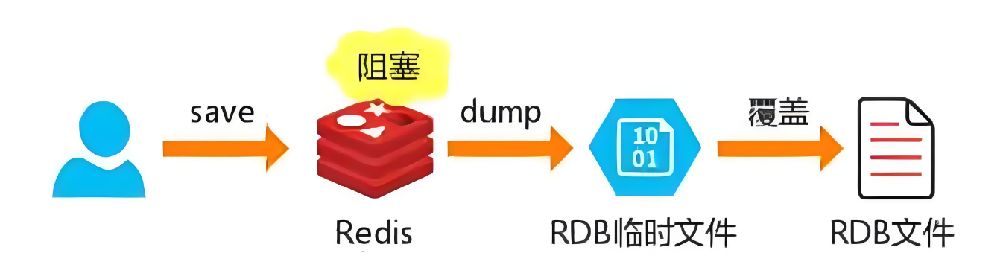

bgsave：`Redis` 会在后台异步对所有数据进行快照操作， **不阻塞** 快照同时还可以响应客户端请求。该触发方式会 `fork` 一个子进程，由子进程复制持久化过程。这个操作是子进程在后台完成的，这就允许父进程同时还可以修改数据。

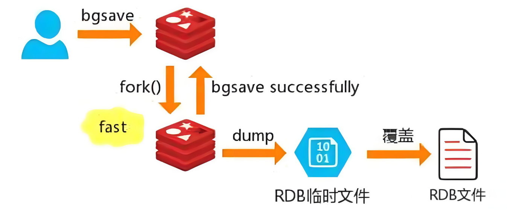

### ☆ 扩展：lastsave

```poewrshell
lastsave
```

可以通过lastsave命令获取最后一次成功的执行快照时间。

运行效果：

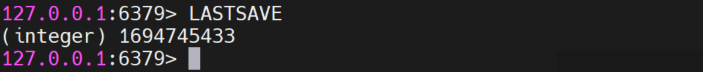

获取一个看不懂的时间戳，需要转换一下

```powershell
date -d @[redis内获取的时间戳]
```

案例：

```powershell
# date -d @1694745433
```

### ☆ RDB优劣势

优点：

RDB是Redis数据的一个非常紧凑的单文件时间点表示。RDB文件非常适合备份。例如，您可能想要对最近24小时内的RDB

文件进行每小时存档，并保存30天内每天的RDB快照。这允许您在发生灾难时轻松地恢复数据集的不同版本。

a) 适合大规模数据恢复

b) 按照业务定时备份

c) 对数据的完整性和一致性要求不高

d) RDB文件在内存中加载速度要比AOF快很多。

缺点：

a) 需要在一定间隔时间做一次备份，所以如果Redis意外down掉的话，就会丢失从当前至最近一次快照期间，还未来得及保存的数据。丢失最新数据的准备。

b) 内存数据的全量同步，如果数据量太大会导致I/O严重影响服务器性能。例如：1天修改1000次，同步一下数据。同步一次，数据量会太大。

c) 为了使用子进程持久化到磁盘上，RDB经常需要fork()。如果数据集很大，fork()可能很耗时，如果数据集很大，CPU性能不太好，可能会导致Redis停止为客户端服务几毫秒甚至一秒钟。AOF也需要fork()，但不太频繁，你可以调整重写日志的频率，而无需权衡持久性。

### ☆ 修复dump.rdb文件

**命令：** `redis-check-rdb`，在 `/usr/local/redis/bin/` 路径下寻找 `redis-check-rdb`

```powershell
写入数据：
[root@node4 redis]# redis-cli 
127.0.0.1:6379> set num1 1
127.0.0.1:6379> set num2 2
cp ./dump.rdb /root/ ==>先复制其他地方
pkill redis-server
=>:rm -rf ./dump.rdb
在复制回来： cp /root/dump.rdb ./
检查：
# redis-check-rdb [dump.rdb文件名称]
bin/redis-check-rdb /usr/local/redis/dump.rdb

启动：
[root@node4 redis]# bin/redis-server conf/redis.conf 
[root@node4 redis]# redis-cli 
127.0.0.1:6379> keys * ==查看是否存在
1) "num1"
2) "num2"
```

### ☆ 哪些情况可以触发RDB快照

a) 配置文件默认的快照配置 900 1 300 100 100 10000

b) 手动save/bgsave命令

c) 执行 `flushall` 清空数据库并执行持久化操作。会生成一个空的rdb文件，无意义。

d) 执行shutdown且没有设置开启AOF 持久化。

e) 主从复制，直接点自动触发。

### ☆ 禁用RDB快照

方式一：

```powershell
bin/redis-cli config set save ""
```

方式二：

在配置文件手动添加： `save ""`

```powershell
save ""
```

### ☆ 配置文件 redis.conf中snappshoting模块

a) stop-writes-on-bgsave-error

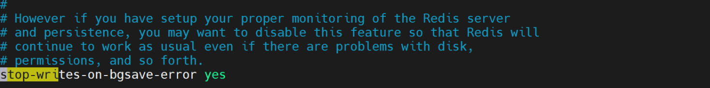

默认：yes
如果配置成no，表示你不在乎数据不一致或者有其他的手段发现和控制这种不一致，那么在快照写入失败时，也能确保redis继续接受新的写请求。

b) rdbcompression

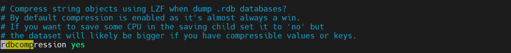

默认：yes
对于存储到磁盘中的快照，可以设置是否进行压缩存储。如果是的话，redis会采用LZF算法进行压缩。如果你不想消耗CPU来进行压缩的话，可以设置为关闭此功能。

c) rdbchecksum

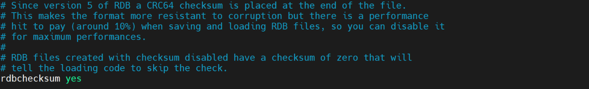

默认：yes
在存储快照后，还可以让redis使用CRC64算法来进行数据校验，但是这样做会增加大约10%的性能消耗，如果希望获取到最大的性能提升，可以关闭此功能。

d) rdb-del-sync-files

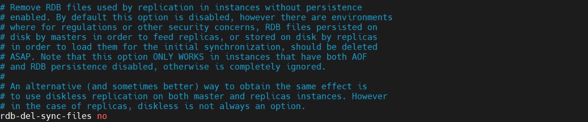

默认：no
在没有持久性的情况下删除复制中使用的RDB文件。默认情况下no，此选项是禁用的。

### ☆ 小结


**优势：**

RDB是一个非常紧凑的文件

==RDB在保存RDB文件时父进程唯一需要做的就是fork出一个子进程，接下来的工作全部由子进程来做，父进程不需要再做==

==其他IO操作，所以RDB持久化方式可以最大化redis的性能。与AOF相比，在恢复大的数据集的时候，RDB方式会更快一些==

**缺点**：

==数据丢失风险大==

==RDB 需要经常fork子进程来保存数据集到硬盘上，当数据集比较大的时候，fork的过程是非常耗时的，可能会导致Redis在一些毫秒级不能响应客户端请求==

## 3、append only file(aof)

### ☆ AOF介绍

>相同点：RDB和AOF都是redis持久化的一种方式
>
>不同点：RDB采用快照持久化（类似于全量备份）、AOF把用户对redis的DML(增删改事务型操作)追加到AOF文件中。

**AOF (Append Only File) :** **`AOF`** 持久化记录服务器接收到的每个写操作。这些操作可以在服务器启动时重播，重建原始数据集。命令使用与Redis协议本身相同的格式记录。
**通俗易懂：**
以日志的形式记录着每个**写**操作，将 **`Redis`** 执行过的所有**写**指令全都记录下来（读操作不记录），只许追加文件但不可以改写文件。Redis启动之初会读取该文件重新构建数据。换言之，Redis重启的话就根据日志文件的内容将**写**指令从前到后执行一次以完成数据的恢复工作（类似relay log中继日志效果）。

>
>
>相同点：RDB和AOF都是redis持久化的一种方式
>
>不同点： RDB采用快照持久化（全量备份）、AOF是把用户对desis的增删改追加到AOF文件中。

### ☆ 工作流程

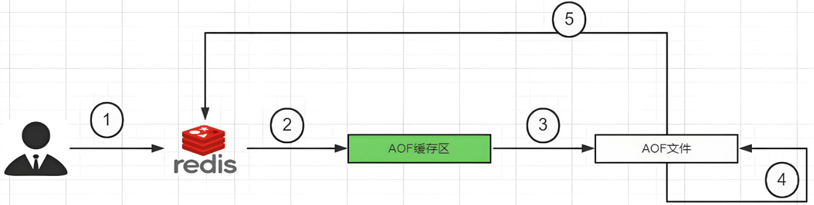

| 步骤 | 详解                                                         |
| ---- | ------------------------------------------------------------ |
| ①    | `Client` 作为命令的来源，会有多个源头以及源源不断的请求命令。 |
| ②    | 在这些命令到达 `Redis Server` 以后并不是直接写入AOF文件，会将其这些命令先放入AOF缓存中进行保存。这里的AOF缓冲区实际上是内存中的一片区域，存在的目的是当这些命令达到一定量以后再写入磁盘，避免频繁的磁盘IO操作。 |
| ③    | AOF缓冲会根据AOF缓冲区 **同步文件的三种写回策略** 将命令写入磁盘上的AOF文件。 |
| ④    | 随着写入AOF内容的增加为避免文件膨胀，会根据规则进行命令的合并( **又称AOF重写** )，从而起到AOF文件压缩的目的。 |
| ⑤    | 当 `Redis Server` 服务器重启的时候会从AOF文件载入数据。      |

### ☆ AOF缓冲区三种写回策略


三种写回策略小结：

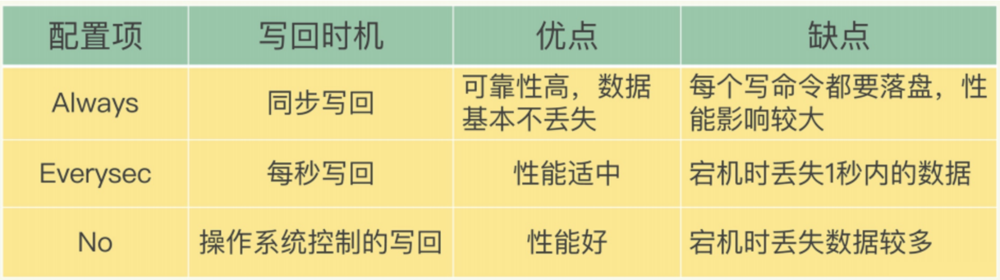

### ☆ AOF持久化配置

第一步：开启aof

**默认情况下**，**`Redis`** 时没有开启AOF的（Append Only File）的，**开启AOF功能需要配置：** `appendonly yes`

```powershell
1399行：appendonly yes
```

第二步：在redis.conf配置文件中，设置备份频率：

```powershell
1458行：appendfsync everysec
```

**Redis 6或之前版本：**
`AOF` 保存文件的位置和 `RDB` 保存文件的位置一样，都是通过 `redis.conf` 配置文件中的 `dir` 配置的。

>rdb保存的是全量数据，而aof保存的是用户对redis写的操作（如增删改）。

**Redis 7：**
`redis.conf` 配置文件中除了要设置dir以外，还新增加了一属性 `appenddirname` 。

AOF保存文件的位置：dir + appenddirname

```powershell
vim redis.conf
dir /usr/local/redis/
appendfilename "appendonly.aof"
appenddirname "appendonlydir"

# ll /usr/local/redis/appendonlydir
# 记得重启redis
pkill redis-server
bin/redis-server conf/redis.conf
```

第三步：写入测试数据

```powershell
127.0.0.1:6379 > set name devops
127.0.0.1:6379 > set age 18
127.0.0.1:6379 > set address beijing
```

第四步：查看测试结果

### ☆ AOF生成文件说明

Redis 6或之前版本：AOF保存文件名称有且只有一个

Redis 7：采用了Redis 7.0 Multi Part AOF的设计，`AOF` 保存文件名称从1到3。分别是：**base基础文件** ， **incr增量文件** ，**manifest清单文件** 。

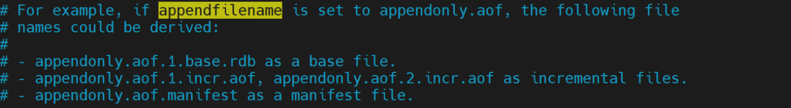

MP-AOF实现：
顾名思义， **`MP-AOF`** 就是将原来的单个 **`AOF`** 文件拆分成多个AOF文件。在 **`MP-AOF`** 中，我们将 **`AOF`** 分为三种类型：

- **BASE：** 表示基础的 **`AOF`** ，一般由子进程通过重写产生，该文件最多只有一个。
- **INCR：** 表是增量的 **`AOF`** ，一般由 **`AOFRW`** 开始执行的时候被创建，该文件可能存在多个。
- **HISTORY：** 表是历史的 **`AOF`** ，由 **`BASE`** 和 **`INCR`** 的 **`AOF`** 变化而来，每次 **`AOFRW`** 成功完成时，本次 **`AOFRW`** 之前对应的 **`BASE`** 和 **`INCR`** 的 **`AOF`** 都将变成 **`HISTORY`** ， **`HISTORY`** 类型的 **`AOF`** 会被 **`Redis`** 自动删除。

为了管理这些 **`AOF`** 文件，引入了 **`manifest（清单）`** 文件类跟踪、管理这些 **`AOF`** 。同时，为了便于 **`AOF`** 备份和拷贝，我们将所有的 **`AOF`** 文件和 **`manifest`** 文件放入一个单独的文件目录中，目录名由 **`appenddirname`** 配置决定。

### ☆ 正常恢复

方式一：

提前在 **`Redis`** 中 **`set`** 值。

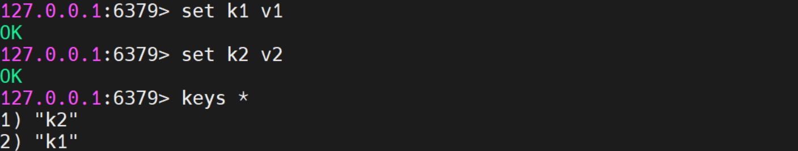

此时发现 **`AOF`** 文件已经生成：


重启Redis服务，重新登陆，发现数据还在。

方式二：将redis迁移到另外一台服务器上进行恢复

将 **`appendonlydir`** 备份一下

```powershell
cd /usr/local/redis
cp -r appendonlydir appendonlydir.bak
```

执行 **`flushdb`** 清库，然后生查询数据为空，在执行 **`shutdown`** 

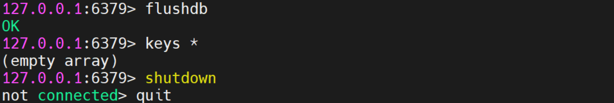

此时，重启 **`Redis`** ，在登陆进入后，执行 **`keys *`** 发现还是空。

说明：**`flushdb`** 命令属于写操作，执行后更新了 **`AOF`** 文件。将旧的 **`redis`** 删除，备份的还原。

```powershell
rm -rf appendonlydir（删除关闭后产生的appendonlydir文件，再将原来备份的复制回来）
mv appendonlydir.bak appendonlydir
重启：bin/redis-server conf/redis.conf
redis-cli
查看： keys *
```

重启 **`Redis`** ，重新登录后，发现数据已恢复！

### ☆ 异常恢复

故意在正常的 **`AOF文件`** 乱写，模拟网络闪断文件写入的 **`error`** 。
由于正常的 **`AOF文件`** 写入的文件是 `appendonly.aof.1.incr.aof` ，所以我们只修改该文件即可。

```powershell
vim appendonly.aof.1.incr.aof
```

随便写入一些内容，保存并退出。

再次重新登陆的时候出现如下报错：拒绝连接。

由此可知，当 **`AOF文件`** 错误的时候， **`Redis`** 启动的时候是失败的。

**修复措施：**

使用如下命令

```powershell
# AOF文件修复命令。切记，一定要加上 “--fix” 
redis-check-aof --fix appendonly.aof.1.incr.aof
```

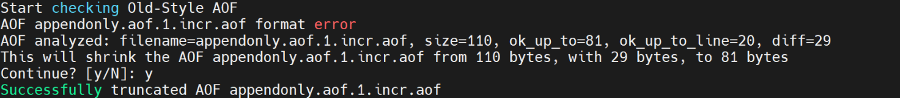

出现如上图，则修复 **`AOF文件`** 成功！
查看 `appendonly.aof.1.incr.aof` 文件，发现错误语法的内容已删除。

重新启动 **`Redis`** ，一切正常。

### ☆ AOF优劣势

优势：

**a）** 使用 **`AOF`** ， **`Redis`** 更持久：你可以有不同的 **`fsync（同步）`** 策略：完全不同步、每秒同步、每次查询都同步。使用默认的每秒同步策略，写性能仍然很好。 **`Fsync`** 是使用后台线程执行的，当没有正在进行的 **`Fsync`** 时，主线程将努力执行写入操作，因此您只能丢失一秒的写入值。

**b）** **`AOF`** 日志是一个只能追加的日志，因此在停电时不会出现寻道或损坏问题。即使由于某种原因(磁盘已满或其他原因)，日志以写了一半的命令结束， **`redis-check-aof`** 工具能够轻松地修复它。

**c）** **`Redis`** 能够在后台自动重写 **`AOF`** ，当它变得太大时。重写是完全安全的，因为当 **`Redis`** 继续追加到旧文件时，使用创建当前数据集所需的最小操作集生成一个全新的文件，一旦第二个文件准备好， **`Redis`** 会切换两个文件并开始追加到新文件。

**d）** **`AOF`** 以易于理解和解析的格式一个接一个地包含所有操作的日志。您甚至可以轻松导出 **`AOF文件`** 。例如，即使用户不小心使用 **`FLUSHALL`** 命令刷出了所有数据，只要在此期间没有重写日志，用户仍然可以通过停止服务器、删除最新的命令并重新启动 **`Redis`** 来保存数据集。

劣势：

**a）** 对于相同的数据集， **`AOF文件`** 通常比对应的RDB文件大。

**b）** **`AOF`** 可能比 **`RDB`** 慢，这取决于确切的 **`fsync（同步）`** 策略。一般来说，如果将 **`fsync（同步）`** 设置为每秒一次，性能仍然非常高，如果禁用 **`fsync（同步）`** ，即使在高负载下，它的速度也应该与 **`RDB`** 一样快。即使在写负载很大的情况下， **`RDB`** 仍然能够为最大延迟提供更多的保证。

### ☆ AOF重写机制

AOF一共生成3个文件，base基础文件，incr增量文件，manifest清单文件（记录本次备份都有哪些文件）

aof实际只有一个incr增量文件，随着时间增长越来越大，为了解决这个问题，我们可以使用AOF重写来减小文件大小。

---

由于 **`AOF`** 持久化是 **`Redis`** 不断将写命令记录到 **`AOF文件`** 中，随着 **`Redis`** 不断的进行，**`AOF`** 的文件会越来越大，文件越大，占用服务器内存越大以及 **`AOF`** 恢复要求时间越长。
为了解决这个问题， **`Redis`** **新增了重写机制**，当 **`AOF文件`** 的大小超过所设定的峰值时， **`Redis`** 就会 **自动** 启动 **`AOF文件`** 的内容压缩，只保留可以恢复数据的最小指令集或者可以手动使用命令 **`bgrewriteaof`**。

触发机制：打开 **`Redis`** 的配置文件 **`redis.conf`**

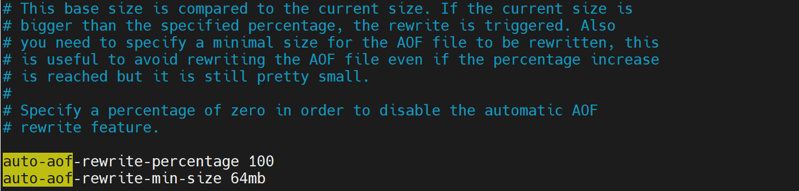

参数解析：

① 假设auto-aof-rewrite-min-size设置为64mb，auto-aof-rewrite-percentage设置为100。当AOF文件首次达到64mb时，Redis会进行第一次重写。重写完成后

② 假设新生成的AOF文件大小为64mb。之后，当AOF文件再次增长到128mb（即64mb的200%）时，由于当前AOF大小超过了上次重写后的100%（64mb * 1 +64mb=128mb），并且也超过了min-size的64mb，此时就会触发第二次重写。

**自动触发：**
**注：** 同时满足，才会触发重写机制。
官网默认 **`AOF文件`** 是 **64M** ，可以手动修改大小。

**手动触发：**
客户端向服务端发送如下命令 **`bgrewriteaof`** 即可手动触发。

#### a) 自动触发机制

① 开启AOF功能

```powershell
appendonly yes
```

② 修改 **`AOF文件`** 峰值的大小为 **`1kb`** ，便于测试。

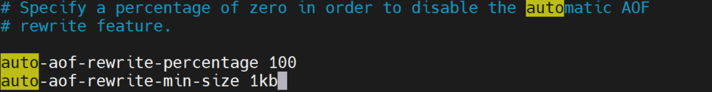

③ 关闭 **`RDB`** 和 **`AOF`** 混合
默认：yes；修改：no

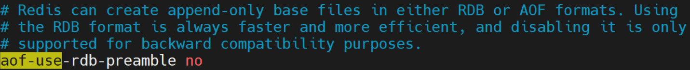

④ 删除之前所有的 **`RDB`** 和 **`AOF`** 文件，防止受外界因素影响。

⑤ 重启 **`Redis`** 服务，执行 **`set k1 v1`** ，检查 **`AOF文件`** 是否正常。

⑥ 查看三大配置

```powershell
# 几种文件类型的前缀，后跟相关序列和类型的附加信息
appendfilename "appendonly.aof"

# Redis 7新增加的目录配置
appenddirname "appendonlydir"

# aof相关文件
# 1、基本文件
appendonly.aof.1.base.rdb

# 2、增量文件
appendonly.aof.1.incr.aof
appendonly.aof.2.incr.aof

# 3、清单文件
appendonly.aof.manifest
```

⑦ 不停的 **`set k1`** ，让 **`AOF文件`** 变大，一直增大到 **`1024kb`** 。查看发现， **`base文件`** 增大， **`base文件`** 和 **`incr文件`** 名称修改为变为 **`2`** 。此时，自动重写机制已触发。

> 注：查看 base文件内容 发现，不管我们之前怎么给 `k1` 赋值，最终都 `base文件` 中只会保存 最后一次 赋值命令。

#### b) 手工触发机制

① 提前给k1赋一个其他的值

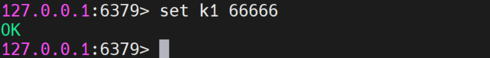

② 使用命令：**`bgrewriteaof`**

```powershell
bgrewriteaof
```

此时发现， **`base文件`** 改大小变， **`incr文件`** 大小归0。说明重写机制已手动触发。


AOF文件 重写并不是对原文件进行重新整理，而是直接读取服务器现有的键值对，然后用一条命令去代替之前记录的这个键值对的多条命令，生成一个新的文件后替换原来的 **`AOF文件`** 。

**AOF重写触发机制：** 通过 **`redis.conf`** 配置文件中的 **`auto-aof-rewrite-percentage：默认值为100`** ，以及 **`auto-aof-rewrite-min-size：默认值为64mb`** 。也就是说，默认 **`Redis`** 会记录上一次重写时的 **`AOF文件`** 大小，默认配置是当 **`AOF文件`** 大小是上次 **`rewrite（重写）`** 后大小的 **`1`** 倍且文件大于 **`64MB`** 时触发。

#### c) 重写原理

① 在重写开始前， **`Redis`** 会创建一个 **`重写子进程`** ，这个子进程 **不会** 读取现有的 **`AOF文件`** ，而是读取当前服务器上数据库内容，并将其包含的指令进行分析压缩并写入到一个临时文件中。

② 与此同时，主进程会将新接收到的 **写指令** 一边累积到内存缓冲区中，一边继续写入到原有的 **`AOF文件`** 中，这样做是保证原有的 **`AOF文件`** 的可用性，避免在重写过程中出现意外。

③ 当 **`重写子进程`** 完成重写工作后，它会给父进程发一个信号，父进程收到信号后就会将内存中缓存的写指令 **追加** 到新 **`AOF文件`** 中。

④当追加结束后， **`Redis`** 就会用 **`新AOF文件`** 来 **替换** **`旧AOF文件`**，之后再有新的写指令，就都会追加到 **`新AOF文件`** 中。

⑤ 重写 **`AOF文件`** 的操作，并没有读取 **`旧AOF文件`** ，而是将整个内存中的数据库内容用命令的方式重写了一个 **`新AOF文件`** ，这点和快照有点类似。

### ☆ 小结

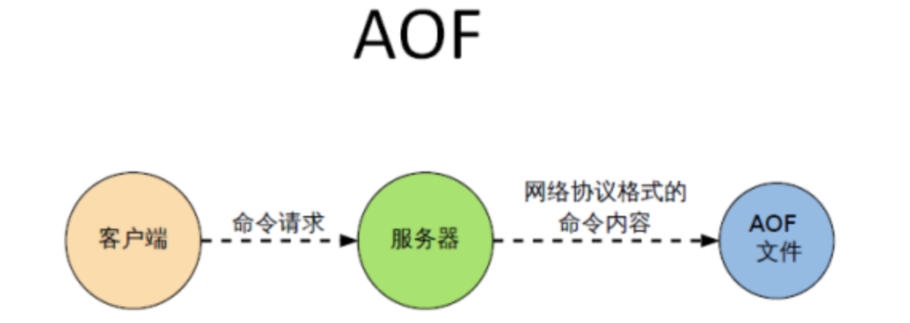

优势：

AOF文件时一个只进行追加的日志文件

Redis 可以在 AOF 文件体积变得过大时，自动地在后台对 AOF 进行重写

AOF文件有序地保存了对数据库执行的所有写入操作，这些写入操作以 Redis 协议的格式保存，因此AOF文件的内容非常容易被人读懂，对文件进行分析也很轻松


缺点：

对于相同的数据集来说，AOF 文文件的体积通常要大于RDB文件的体积。

根据所使用的fsync策略，AOF的速度可能会慢于RDB

## 5、扩展：No persistence（了解）

**No persistence :** 完全禁用持久性。这有时用于缓存，属于纯净模式。

需要同时禁用 RDB 和 AOF

**注：** **`RDB`** 和 **`AOF`** 禁用，只是单纯的禁用**`自动触发`**。不会禁用手动触发，手动输入命令，仍然可以触发 **`RDB`** 和 **`AOF`** 

### ☆ 禁用RDB

配置文件： **`save ""`**
禁用 **`RDB`** 模式下，仍然可以手动输入命令 **`save`** 和 **`bgsave`** 来生成 **`RDB`** 文件。

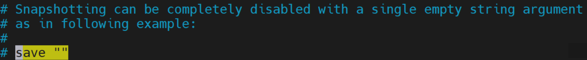

### **☆ 禁用AOF**

配置文件： **`appendonly no`**

禁用 **`AOF`** 模式下，仍然可以手动输入命令 **`bgrewriteaof`** 来生成 **`AOF`** 文件。

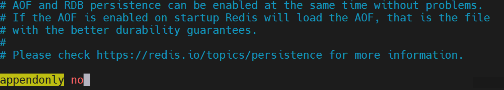

## 6、扩展：RDB + AOF（生产环境）

**RDB + AOF :** 在同一个实例中同时使用 **`AOF`** 和 **`RDB`** 

### ☆ 共存优先级

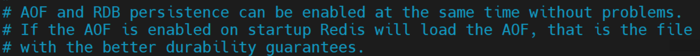

**`AOF`** 和 **`RDB`** 持久化可以同时启用，不会有问题。如果启动时启用了 **`AOF`** ， **`Redis`** 将加载 **`AOF`** ，即文件具有更好的持久性保证。则 **`AOF`** 的优先级高于 **`RDB`** 

### ☆ 数据恢复顺序及加载流程

同时开启 **`RDB`** 和 **`AOF`** 时， **`Redis`** 默认先优加载 **`AOF`** ，则不去加载 **`RDB`** （可以说和 **`RDB`** 毫无关系）。如果 **`AOF`** 文件不存在，再去加载 **`RDB`**

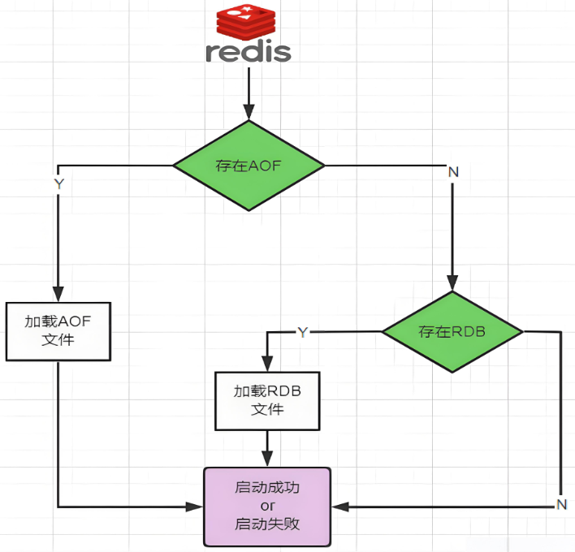

## ☆ 开启RDB和AOF混合模式

结合了 **`RDB`** 和 **`AOF`** 的优点，既能快速加载又能避免丢失过多的数据。江湖人称“ **鸳鸯锅** ”

配置文件中 **`aof-use-rdb-preamble`** 的默认值为 **`yes`** 。 **`yes`** 表示开启，设置为 **`no`** 表示禁用。

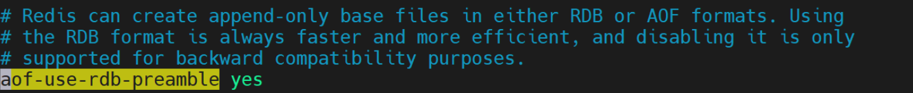

`RDB+AOF` 的混合方式
**`RDB`** 镜像做全量持久化，**`AOF`** 做增量持久化。
先使用 **`RDB`** 进行快照存储，然后使用 **`AOF`** 持久化记录所有的写操作。当重写策略满足或手动触发重写的时候，将最新的数据存储为新的 **`RDB`** 记录。这样的话，重启服务的时候会从 **`RDB`** 和 **`AOF`** 两部分恢复数据，既保证了数据完整性，又提高了恢复数据的性能。简单来说：混合持久化方式产生的文件一部分是 **`RDB`** 格式，一部分是 **`AOF`** 格式。即 **`AOF`** 包括了 **`RDB`** 头部 + **`AOF`** 混写。

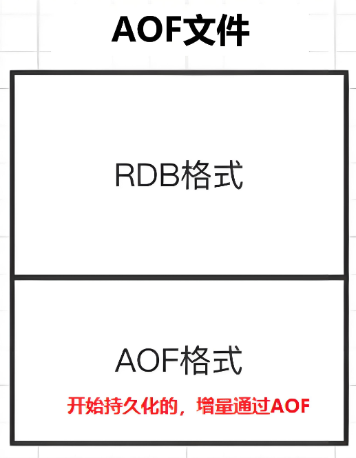


## 5、总结

掌握：学会开启与恢复RDB、学会开启与恢复AOF即可！！！

---

rdb 适用于一般的数据持久化使用，效率高，数据迁移方便

aof 适合于增量备份、数据实时性备份要求更高的情况

**rdb和aof同时开启，redis听谁的？**

答：

① 听aof的，rdb与aof同时开启默认加载AOF的配置文件
② 相同数据集，aof文件要远大于rdb文件，恢复速度慢于rdb
③ aof运行效率慢于rdb，但是同步策略效率好，异步效率和rdb相同

概括：生产环境都是混合模式居多，RDB负责全量备份，AOF适合增量备份。RDB恢复数据快，文件小。

如果只能选一个：一般场景用RDB，实时要求高场景用AOF。

# 六、Redis实际案列

## 1、主从模式

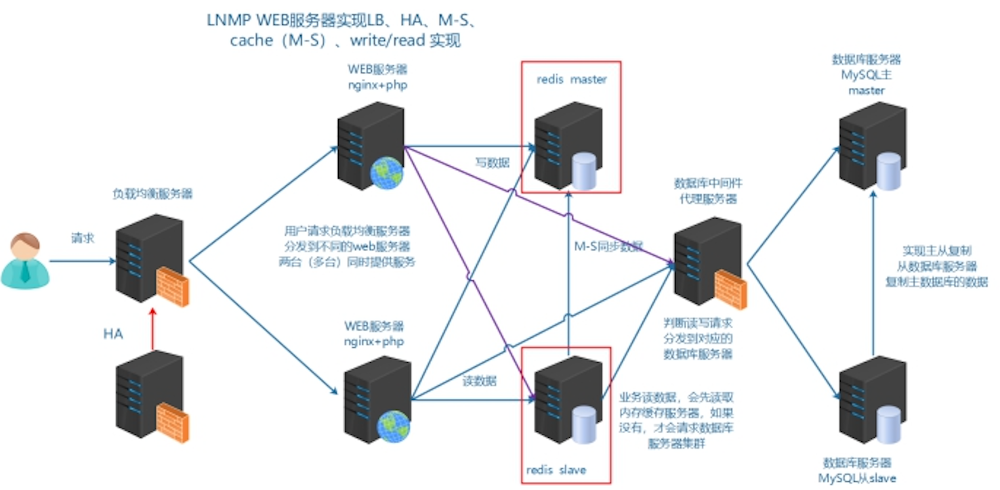

| 编号    | IP             | Redis版本   | 角色   |
| ------- | -------------- | ----------- | ------ |
| redis01 | 192.168.88.111 | redis-7.4.0 | master |
| redis02 | 192.168.88.112 | redis-7.4.0 | slave  |

准备redis02，需要提前安装Redis

```powershell
wget https://download.redis.io/releases/redis-7.4.0.tar.gz

tar -zxvf redis-7.4.0.tar.gz
cd redis-7.4.0
make
make PREFIX=/usr/local/redis install

mkdir /usr/local/redis/conf -p
cp redis.conf /usr/local/redis/conf
bind 0.0.0.0           			  # 允许所有IP连接
daemonize yes				# 允许后台运行

#过量使用内存设置为0！在低内存环境下，后台保存可能失败
sudo vim  /etc/sysctl.conf
vm.overcommit_memory = 1
sysctl -p
```

操作之前，可以把redis01、redis02拍摄一个快照

第一步：配置master

```powershell
# vim /usr/local/redis/conf/redis.conf
```

开启监听，在网络中与其他服务器进行网络交互的网卡，默认ens33。bind的ip指的是其他的主机需要和这个主机通讯的ip：

```powershell
bind 0.0.0.0           			  # 允许所有IP连接
protected-mode no      # 关闭redis安全保护机制，允许主从、哨兵、集群中各节点之间的相互访问，没有安全限制
```

第二步：配置slave

```powershell
# vim /usr/local/redis/conf/redis.conf
```

主从配置：设置master redis信息

```powershell
redis5/6/7 版本 # replicaof 192.168.88.111 6379
```

第三步：重启redis服务器，查看是否成功

```powershell
bin/redis-cli
127.0.0.1:6379> info replication
```

第四步：测试redis主从，主写从读

```powershell
127.0.0.1:6379 master > set title itheima
127.0.0.1:6379 slave > keys *
127.0.0.1:6379 slave > get title
```

注：slave不允许写操作，因为从服务器redis配置文件里进行了replica-read-only设置，也是符合业务的使用需求

```powershell
replica-read-only yes
```

## 2、安全限制

目前redis已经完成相关配置，缺少安全配置，如IP限制，密码限制。

==**IP限制登录**==

① master打开配置IP限制

注意如果有防火墙，先关闭防火墙或者开启端口放行。

bind ip 监听绑定网卡的IP

```powershell
# vim /usr/local/redis/conf/redis.conf
bind 127.0.0.1 本机的网卡IP地址

bind 127.0.0.1代表只能接收本机连接请求
bind 192.168.88.111代表同一网段所有请求，只要通过88.111连接的都可以登录此Redis
bind 0.0.0.0适合公网环境，没有限制任意主机均可访问，但是如果是公网环境必须要添加密码，禁止裸奔！
```

重启redis服务

② slave服务器进行远程连接测试

```powershell
# bin/redis-cli -h 远程IP地址
如果设置了密码也可以通过-a指定密码，密码会保留终端
```

③ master进行密码限制

```powershell
1051行 # requirepass 密码
```

重启redis服务，在slave服务器测试密码是否可用

```powershell
127.0.0.1:6379> set name devops
(error) NOAUTH Authentication required.
127.0.0.1:6379> auth 密码
```

==注意：如果开启了密码限制，搭建主从需要在slave配置中填写master密码==

```powershell
# vim /usr/local/redis/conf/redis.conf
547行：masterauth 密码
```

### 日志设定：

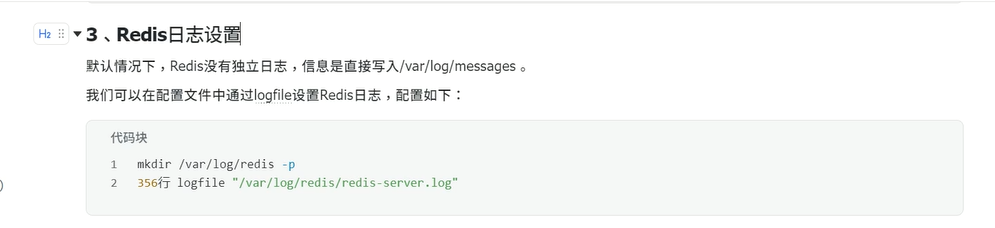

## 3、PHP Redis扩展

项目：LNMP（PHP） =>   .so扩展文件  =>  Redis

源码安装LNMP，要参考下面的代码，手工编译安装redis.so扩展

第一步：安装redis.so扩展

https://github.com/phpredis/phpredis/releases

参考教程：https://www.runoob.com/redis/redis-php.html

```powershell
shell > tar xvf redis-5.3.7.tgz
shell > cd redis-5.3.7
shell > phpize						=>  PHP扩展都需要使用phpize生成./configure
shell > ./configure && make && make install
```

第二步：配置php.ini

```powershell
# vim /usr/local/php/etc/php.ini
extension=redis.so
```

第三步：重启php-fpm

```powershell
# systemctl restart php-fpm
```

第四步：测试php redis是否安装成功

```powershell
# vim /www/wwwroot/www.shop.com/niushop/demo.php
<?php
	phpinfo();
?>
```

---

聊聊宝塔是如何安装扩展的：以node1（Web01）为例进行讲解

第一步：登录宝塔，进入软件商店

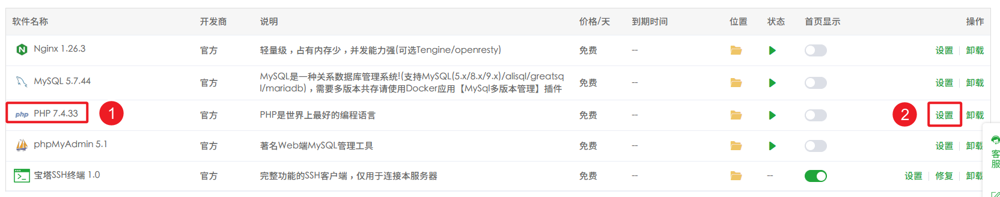

第二步：选择安装扩展，找到redis，单击安装

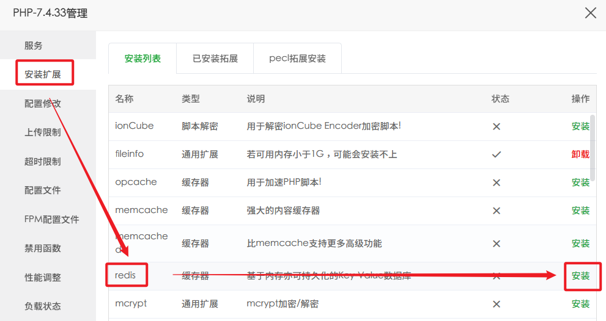

第三步：等待redis安装结束，编写一个demo.php程序，查看语言是否支持redis扩展

```powershell
vim /www/wwwroot/www.shop.com/niushop/demo.php
写入如下内容：
<?php
  phpinfo();
```

第四步：改一下Windows hosts，让www.shop.com指向192.168.88.101（不走负载均衡，直接访问Web01）

```powershell
192.168.88.101 www.shop.com
```

访问如下地址，查看Redis扩展是否生效

http://www.shop.com/demo.php

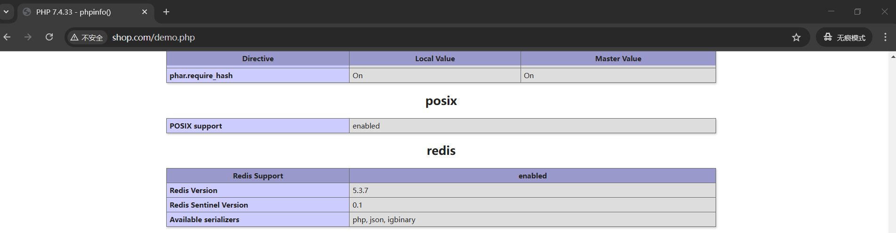

> 作业：node1、node3都需要安装一下redis

## 4、redis应用场景：缓存与session入redis

缓存设计：减少Web对MySQL的访问，减轻数据库压力

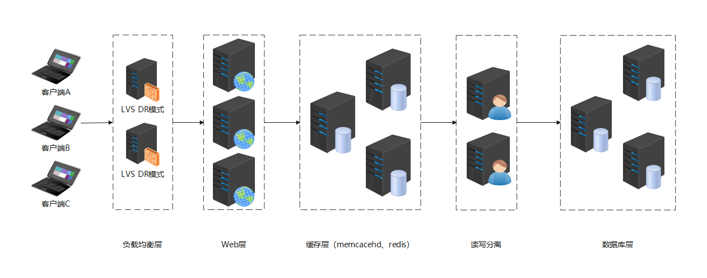

与之前session存储到file文件的方式不同，将session存储到redis中，可以实现session的共享以及单点登录(sso)的操作。

www.baidu.com

pan.baidu.com

image.baidu.com

music.baidu.com

---

Another-Redis-Desktop-Manager软件

双击安装即可

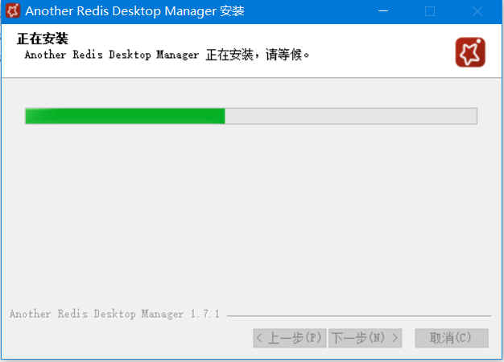

使用Another-Redis-Desktop-Manager连接Redis服务器（88.111）

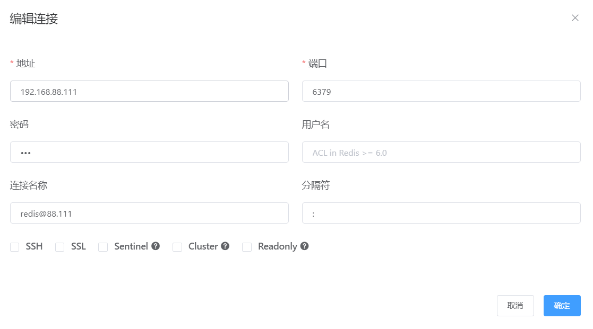

---

① 更改缓存保存方式

`vim /www/wwwroot/www.shop.com/niushop/config/cache.php`

```powershell
return [
    // 默认缓存驱动
    'default' => Env::get('cache.driver', 'redis'),    // 修改这里！！！

    // 缓存连接方式配置
    'stores'  => [
        'file' => [
            // 驱动方式
            'type'       => 'File',
            // 缓存保存目录
            'path'       => '',
            // 缓存前缀
            'prefix'     => '',
            // 缓存有效期 0表示永久缓存
            'expire'     => 0,
            // 缓存标签前缀
            'tag_prefix' => 'tag:',
            // 序列化机制 例如 ['serialize', 'unserialize']
            'serialize'  => [],
        ],
        // redis缓存
        'redis'   =>  [
            // 驱动方式
            'type'   => 'redis',
            // 服务器地址
            'host'       => '192.168.88.111',			//修改这里！！！redis的ip
            // redis密码
            'password'  => '123',						//修改这里！！！redis的密码
            // 缓存有效期 0表示永久缓存
            'expire'     => 604800,
        ],
        // 更多的缓存连接
    ],
];
```

② 更改Session存储位置

https://doc.thinkphp.cn/v6_1/Session.html

`vim /www/wwwroot/www.shop.com/niushop/config/session.php`

web01  session文件

web02  session文件

web01/web02 => session => redis

```powershell
<?php
// +----------------------------------------------------------------------
// | 会话设置
// +----------------------------------------------------------------------

return [
    // session name
    'name'           => 'PHPSESSID',
    // SESSION_ID的提交变量,解决flash上传跨域
    'var_session_id' => '',
    // 驱动方式 支持file cache
    'type'           => 'cache',		// 修改这里
    // 存储连接标识 当type使用cache的时候有效
    'store'          => 'redis',        // 修改这里
    // 过期时间
    'expire'         => 1440*1000,
    // 前缀
    'prefix'         => 'think',      // 修改这里
];
```

## 5、nginx+lua+redis实现访问攻击黑名单 WAF（扩展）

WAF：（Web Application Firewalld），根据nginx访问流量判断是否为恶意攻击，如果1s内超过200个请求，就认为这是恶意攻击。

① redis01，安装openresty 和之前安装一致

```powershell
#!/bin/bash
dnf -y install pcre-devel zlib-devel openssl-devel
tar -zxf openresty-1.25.3.2.tar.gz
cd openresty-1.25.3.2
./configure && make && make install
```

② 编写lua脚本

https://blog.csdn.net/fenglvming/article/details/51996406

```powershell
# mkdir -p /usr/local/lua
# vim /usr/local/lua/access_limit.lua
-- access_by_lua_file '/usr/local/lua/access_limit.lua'
local function close_redis(red)
    if not red then
        return
    end
    --释放连接(连接池实现)
    local pool_max_idle_time = 10000 --毫秒
    local pool_size = 100 --连接池大小
    local ok, err = red:set_keepalive(pool_max_idle_time, pool_size)
 
    if not ok then
        ngx_log(ngx_ERR, "set redis keepalive error : ", err)
    end
end
 
local redis = require "resty.redis"
local red = redis:new()
red:set_timeout(1000)
local ip = "192.168.88.111" -- redis ip（修改）
local port = 6379 -- redis port （修改）
local ok, err = red:connect(ip,port)
red:auth("123") -- redis auth password （修改）
if not ok then
    return close_redis(red)
end
 
local clientIP = ngx.req.get_headers()["X-Real-IP"]
if clientIP == nil then
   clientIP = ngx.req.get_headers()["x_forwarded_for"]
end
if clientIP == nil then
   clientIP = ngx.var.remote_addr
end
 
local incrKey = "user:"..clientIP..":freq"
local blockKey = "user:"..clientIP..":block"
 
local is_block,err = red:get(blockKey) -- check if ip is blocked
if tonumber(is_block) == 1 then
   ngx.exit(ngx.HTTP_FORBIDDEN) -- return 403
   return close_redis(red)
end
 
res, err = red:incr(incrKey)
 
if res == 1 then
   res, err = red:expire(incrKey,1)
end
 
if res > 100 then	-- block 频率，测试环境可以考虑设置为3或5（修改）
    res, err = red:set(blockKey,1)
    res, err = red:expire(blockKey,600)
end
 
close_redis(red)
```

在Nginx中添加Lua脚本：

```powershell
# vim /usr/local/openresty/nginx/conf/nginx.conf

#user  nobody;
worker_processes  1;

#error_log  logs/error.log;
#error_log  logs/error.log  notice;
#error_log  logs/error.log  info;

#pid        logs/nginx.pid;


events {
    worker_connections  1024;
}


http {
    include       mime.types;
    default_type  application/octet-stream;

    #log_format  main  '$remote_addr - $remote_user [$time_local] "$request" '
    #                  '$status $body_bytes_sent "$http_referer" '
    #                  '"$http_user_agent" "$http_x_forwarded_for"';

    #access_log  logs/access.log  main;

    sendfile        on;
    #tcp_nopush     on;

    #keepalive_timeout  0;
    keepalive_timeout  65;

    #gzip  on;

    server {
        listen       80;
        server_name  localhost;

        #charset koi8-r;

        #access_log  logs/host.access.log  main;
        root html;
        location / {
            index  index.html index.htm;
            access_by_lua_file /usr/local/lua/access_limit.lua;
        }

        #error_page  404              /404.html;

        # redirect server error pages to the static page /50x.html
        #
        error_page   500 502 503 504  /50x.html;
        location = /50x.html {
        }

        # proxy the PHP scripts to Apache listening on 127.0.0.1:80
        #
        #location ~ \.php$ {
        #    proxy_pass   http://127.0.0.1;
        #}

        # pass the PHP scripts to FastCGI server listening on 127.0.0.1:9000
        #
        #location ~ \.php$ {
        #    root           html;
        #    fastcgi_pass   127.0.0.1:9000;
        #    fastcgi_index  index.php;
        #    fastcgi_param  SCRIPT_FILENAME  /scripts$fastcgi_script_name;
        #    include        fastcgi_params;
        #}

        # deny access to .htaccess files, if Apache's document root
        # concurs with nginx's one
        #
        #location ~ /\.ht {
        #    deny  all;
        #}
    }


    # another virtual host using mix of IP-, name-, and port-based configuration
    #
    #server {
    #    listen       8000;
    #    listen       somename:8080;
    #    server_name  somename  alias  another.alias;

    #    location / {
    #        root   html;
    #        index  index.html index.htm;
    #    }
    #}


    # HTTPS server
    #
    #server {
    #    listen       443 ssl;
    #    server_name  localhost;

    #    ssl_certificate      cert.pem;
    #    ssl_certificate_key  cert.key;

    #    ssl_session_cache    shared:SSL:1m;
    #    ssl_session_timeout  5m;

    #    ssl_ciphers  HIGH:!aNULL:!MD5;
    #    ssl_prefer_server_ciphers  on;

    #    location / {
    #        root   html;
    #        index  index.html index.htm;
    #    }
    #}

}

# 启动openresty
cd /usr/local/openresty
bin/openresty
# 关闭openrestry
# 强制关闭
bin/openresty -s stop
# 优雅退出
bin/openresty -s quit

# 重载
bin/openresty -s reload
面试：问是否使用过其他版本的nginx
答：使用过，上一家使用openrestry,支持lua版本，支持定制功能开发，比原生nginx更加强大。
```

③ 测试验证黑名单效果

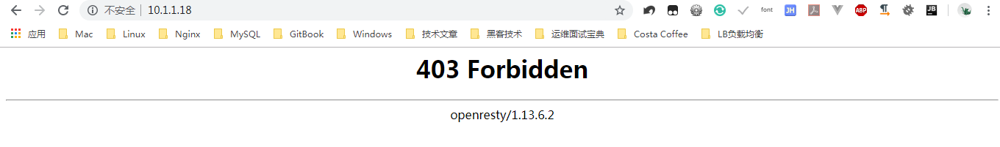

# 今日重点

- [ ] 掌握Redis软件安装
- [ ] 掌握常见数据类型的使用（知道有哪些，会查询，简单写）
- [ ] 持久化：RDB、AOF，会配置，知道两者应用场景
- [ ] 主从复制（必须）
- [ ] 安全配置（公网环境安全第一）
- [ ] Redis扩展 => 使用宝塔安装redis.so扩展
- [ ] 缓存 + session入Redis（没有技术只能用ip_hash、有了它以后就可以实现多个调度算法用法）
- [ ] WAF防火墙 => openresty + redis
- [ ] 哨兵模式 => 无密码实现哨兵模式
