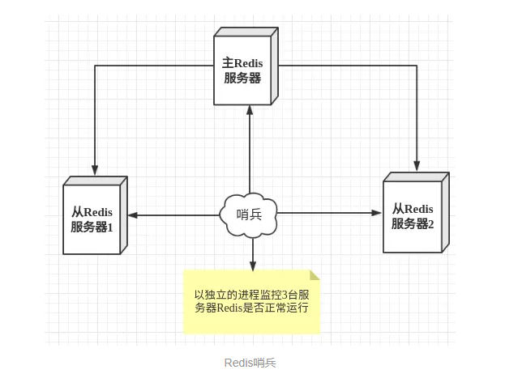
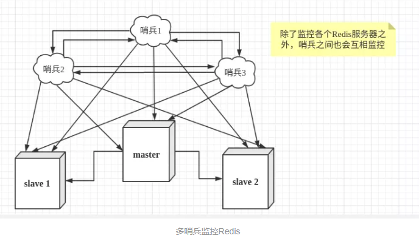

# Redis哨兵

# 一、Redis哨兵概述

**主从切换技术的方法是：当主服务器宕机后，需要手动把一台从服务器切换为主服务器，这就需要人工干预，费事费力，还会造成一段时间内服务不可用。**这不是一种推荐的方式，更多时候，我们优先考虑**哨兵模式**。

## 1、什么是哨兵

哨兵模式是一种特殊的模式，首先Redis提供了哨兵的命令，哨兵是一个独立的进程，作为进程，它会独立运行。其原理是**哨兵通过发送命令，等待Redis服务器响应，从而监控运行的多个Redis实例。**



## 2、哨兵的作用

这里的哨兵有两个作用

- ==健康检查==：通过发送命令，让Redis服务器返回监控其运行状态，包括主服务器和从服务器。
- ==故障切换==：当哨兵监测到master宕机，会自动将slave切换成master，然后通过**发布订阅模式**通知其他的从服务器，修改配置文件，让它们切换主机。

然而一个哨兵进程对Redis服务器进行监控，可能会出现问题，为此，我们可以使用多个哨兵进行监控。各个哨兵之间还会进行监控，这样就形成了多哨兵模式。

用文字描述一下**故障切换（failover）**的过程。假设主服务器宕机，哨兵1先检测到这个结果，系统并不会马上进行failover过程，仅仅是哨兵1主观的认为主服务器不可用，这个现象成为**主观下线**。当后面的哨兵也检测到主服务器不可用，并且数量达到一定值时，那么哨兵之间就会进行一次投票，投票的结果由一个哨兵发起，进行failover操作。切换成功后，就会通过发布订阅模式，让各个哨兵把自己监控的从服务器实现切换主机，这个过程称为**客观下线**。这样对于客户端而言，一切都是透明的。

## 2、前期准备

配置3个哨兵和1主2从的Redis服务器来演示这个过程。

| 服务类型 | 是否是主服务器 | IP地址         | 端口  |
| -------- | -------------- | -------------- | ----- |
| Redis    | 是             | 192.168.88.111 | 6379  |
| Redis    | 否             | 192.168.88.112 | 6379  |
| Redis    | 否             | 192.168.88.113 | 6379  |
| Sentinel | -              | 192.168.88.111 | 26379 |
| Sentinel | -              | 192.168.88.112 | 26379 |
| Sentinel | -              | 192.168.88.113 | 26379 |



> 特别注意：使用Redis哨兵模式，最少需要3个节点（一主多从结构）

# 二、Redis主从复制搭建

## 1、Redis主从配置

① 安装redis

```powershell
第一步：找到对应的安装包资源，使用wget命令下载，这里安装的7.4.0版本。
安装包资源地址：https://download.redis.io/releases/

第二步：上传Redis到Linux系统中
dnf install wget -y
wget https://download.redis.io/releases/redis-7.4.0.tar.gz

第二步：配置=>编译=>安装
shell >  tar -zxvf redis-7.4.0.tar.gz
shell >  cd redis-7.4.0
shell> make
shell> make PREFIX=/usr/local/redis install
```

②  redis01/redis02/redis03修改配置

```powershell
sudo mkdir -p /usr/local/redis/conf
sudo cp redis.conf /usr/local/redis/conf/

# 修改配置
sudo vim /usr/local/redis/conf/redis.conf
     88： bind 127.0.0.1 -::1  --> bind 0.0.0.0
1050： # requirepass foobared --> requirepass 123
  310： daemonize no  --> daemonize yes（yes后台启动）

# 添加redis到环境变量
sudo vim /etc/profile
export PATH="$PATH:/usr/local/redis/bin"
source /etc/profile

#过量使用内存设置为0！在低内存环境下，后台保存可能失败
sudo vim /etc/sysctl.conf
vm.overcommit_memory = 1
sysctl -p
```

③ 启动 redis

```powershell
sudo vim /etc/systemd/system/redis.service
[Unit]
Description=redis-server
After=network.target
 
[Service]
Type=forking
ExecStart=/usr/local/redis/bin/redis-server /usr/local/redis/conf/redis.conf
PrivateTmp=true
 
[Install]
WantedBy=multi-user.target

# systemctl start redis

# 添加redis到环境变量
sudo vim /etc/profile
export PATH="$PATH:/usr/local/redis/bin"
source /etc/profile

#过量使用内存设置为0！在低内存环境下，后台保存可能失败
sudo vim /etc/sysctl.conf
vm.overcommit_memory = 1
sysctl -p
```

我们可以看到，redis 现在的角色是一个master 启动的服务。

master主节点设置：

```powershell
bind 0.0.0.0           			      # 允许所有IP连接
protected-mode no         # 禁用保护模式（确保访问受防火墙控制）（允许其他主机可以访问）
requirepass 123                 # 设置从服务器连接需要使用密码(master slave上都要配置)
masterauth 123                 # 连接主节点时需要使用的主节点密码（master slave上都要配置）

protected-mode：默认代表只允许127.0.0.1访问，集群、哨兵等模式必须关闭此参数
```

## 2、配置slave

和上面配置 master一样，我们需要修改端口号和pid 文件，在修改完之后，我们有两种方法配置从服务。

① 在配置文件中配置从服务

```powershell
################################# REPLICATION #################################

# Master-Replica replication. Use replicaof to make a Redis instance a copy of
# another Redis server. A few things to understand ASAP about Redis replication.
#
#   +------------------+      +---------------+
#   |      Master      | ---> |    Replica    |
#   | (receive writes) |      |  (exact copy) |
#   +------------------+      +---------------+
#
# 1) Redis replication is asynchronous, but you can configure a master to
#    stop accepting writes if it appears to be not connected with at least
#    a given number of replicas.
# 2) Redis replicas are able to perform a partial resynchronization with the
#    master if the replication link is lost for a relatively small amount of
#    time. You may want to configure the replication backlog size (see the next
#    sections of this file) with a sensible value depending on your needs.
# 3) Replication is automatic and does not need user intervention. After a
#    network partition replicas automatically try to reconnect to masters
#    and resynchronize with them.
#
# replicaof <masterip> <masterport>
replicaof 192.168.88.111 6379
```

我们可以在配置文件中直接修改 **slaveof** 属性，我们直接配置主服务器的IP地址和端口号，如果这里主服务器有配置密码。

可以通过配置**masterauth** 来设置链接密码：

```powershell
# If the master is password protected (using the "requirepass" configuration
# directive below) it is possible to tell the slave to authenticate before
# starting the replication synchronization process, otherwise the master will
# refuse the slave request.
#
# masterauth <master-password>
masterauth 123
```

② 启动redis 服务：

```powershell
sudo vim /etc/systemd/system/redis.service
[Unit]
Description=redis-server
After=network.target
 
[Service]
Type=forking
ExecStart=/usr/local/redis/bin/redis-server /usr/local/redis/conf/redis.conf
PrivateTmp=true
 
[Install]
WantedBy=multi-user.target

# systemctl start redis

# 添加redis到环境变量
sudo vim /etc/profile
export PATH="$PATH:/usr/local/redis/bin"
source /etc/profile

#过量使用内存设置为0！在低内存环境下，后台保存可能失败
sudo vim  /etc/sysctl.conf
vm.overcommit_memory = 1
sysctl -p
```

使用==info命令==，查看一下slave主机的状态：

```powershell
redis-cli > info replication
# Replication
role:slave
master_host:127.0.0.1
master_port:6379
master_link_status:up
master_last_io_seconds_ago:1
master_sync_in_progress:0
slave_repl_offset:71
slave_priority:100
slave_read_only:1
connected_slaves:0
master_repl_offset:0
repl_backlog_active:0
repl_backlog_size:1048576
repl_backlog_first_byte_offset:0
repl_backlog_histlen:0
```

我们可以看到，现在的redis 是一个从服务的角色，连接着6379的服务。接下来我们再来看一下目前master 的状态：

```powershell
# Replication
role:master
connected_slaves:2
slave0:ip=192.168.88.112,port=6379,state=online,offset=785,lag=0
slave1:ip=192.168.88.113,port=6379,state=online,offset=785,lag=0
master_repl_offset:785
repl_backlog_active:1
repl_backlog_size:1048576
repl_backlog_first_byte_offset:2
repl_backlog_histlen:784
```

 我们如果需要设置读写分离，只需要在主服务器中设置：

```powershell
# Note: read only slaves are not designed to be exposed to untrusted clients
# on the internet. It's just a protection layer against misuse of the instance.
# Still a read only slave exports by default all the administrative commands
# such as CONFIG, DEBUG, and so forth. To a limited extent you can improve
# security of read only slaves using 'rename-command' to shadow all the
# administrative / dangerous commands.
slave-read-only yes
```

## 3、常见问题！！！

```powershell
Redis01/Redis02/Redis03 => redis.conf

bind 0.0.0.0
...
protected-mode no	=>  哨兵必须配置protected-mode，外部网络连接redis服务
```

## 4、核心代码归纳

master：

```powershell
wget https://download.redis.io/releases/redis-7.4.0.tar.gz

tar -zxvf redis-7.4.0.tar.gz
cd redis-7.4.0
make
make PREFIX=/usr/local/redis install

mkdir /usr/local/redis/conf -p
cp redis.conf /usr/local/redis/conf
bind 0.0.0.0           			  # 允许所有IP连接
daemonize yes				# 允许后台运行
protected-mode no     # 关闭安全模式
requirepass 123             # 设置从服务器连接需要使用密码
masterauth 123             # 连接主节点时需要使用的主节点密码

#过量使用内存设置为0！在低内存环境下，后台保存可能失败
sudo vim  /etc/sysctl.conf
vm.overcommit_memory = 1
sysctl -p
```

slave：

```powershell
wget https://download.redis.io/releases/redis-7.4.0.tar.gz

tar -zxvf redis-7.4.0.tar.gz
cd redis-7.4.0
make
make PREFIX=/usr/local/redis install

mkdir /usr/local/redis/conf -p
cp redis.conf /usr/local/redis/conf
bind 0.0.0.0           			  						# 允许所有IP连接
daemonize yes									  # 允许后台运行
protected-mode no     						 # 关闭安全模式
replicaof 192.168.88.111 6379       # 配置连接master主服务器
requirepass 123             					  # 设置从服务器连接需要使用密码
masterauth 123            						  # 连接主节点时需要使用的主节点密码

#过量使用内存设置为0！在低内存环境下，后台保存可能失败
sudo vim  /etc/sysctl.conf
vm.overcommit_memory = 1
sysctl -p
```

# 三、Sentinel哨兵

## 1、配置Sentinel端口

在sentinel.conf 配置文件中， 我们可以找到port 属性，这里是用来设置sentinel 的端口，一般情况下，至少会需要三个哨兵对 redis 进行监控。

```powershell
cd /root/redis-7.4.0
cp sentinel.conf /usr/local/redis/conf/
vim /usr/local/redis/conf/sentinel.conf

protected-mode no
port 26379
daemonize no

说明：daemonize no仅用于测试环境，生产环境下需要设置为daemonize yes，代表后台运行。
```

## 2、配置主服务器的IP和端口

redis01/redis02/redis03都要配置：

https://redis.io/docs/latest/operate/oss_and_stack/management/sentinel/

```powershell
# sentinel monitor <master-name> <ip> <redis-port> <quorum>
#
# Tells Sentinel to monitor this master, and to consider it in O_DOWN
# (Objectively Down) state only if at least <quorum> sentinels agree.
#
# Note that whatever is the ODOWN quorum, a Sentinel will require to
# be elected by the majority of the known Sentinels in order to
# start a failover, so no failover can be performed in minority.
#
# Slaves are auto-discovered, so you don't need to specify slaves in
# any way. Sentinel itself will rewrite this configuration file adding
# the slaves using additional configuration options.
# Also note that the configuration file is rewritten when a
# slave is promoted to master.
#
# Note: master name should not include special characters or spaces.
# The valid charset is A-z 0-9 and the three characters ".-_".
sentinel monitor mymaster 192.168.88.111 6379 2
sentinel auth-pass mymaster 123

注：2权值/阈值，代表至少需要2个哨兵确认才能客观下线。
原理：首先某个哨兵发现master主节点无法连接（无法响应），则会标记为主观下线，如果超过2台哨兵确认master节点故障，则标记为客观下线，并触发故障转移。
----------------------------------------------
高可用：在一个集群中（最少2台及以上节点），某个节点出现故障，集群依然可以对外提供相关服务（可用）
故障转移：failover，当主节点宕机，从节点升级为主节点
高可用往往包含健康检查以及故障转移等特性
```

## 3、启动所有的Sentinel（m和s服务器都要开启）

```powershell
[root@yunwei ~] # bin/redis-sentinel /usr/local/redis/conf/sentinel.conf
```

## 4、手工关闭master

我们手动关闭Master 之后，sentinel 在监听master 确实是断线了之后，将会开始计算权值，然后重新分配主服务器。

```powershell
128799:X 29 May 12:08:35.657# +failover-end master mymaster 192.168.88.111 6379
128799:X 29 May 12:08:35.657# +switch-master mymaster 192.168.88.111 6379 192.168.88.113 6379
```

查看状态，发现已经发生故障转移，88.113升级为主节点

> 一旦failover发生时，系统会自动调整2个文件，redis.conf更改主节点信息，sentinel.conf最末端会写入一些选举等信息。

## 5、重连master

大家可能会好奇，如果master 重连之后，会不会抢回属于他的位置，答案是否定的，就比如你被一个小弟抢了你老大的位置，他肯给回你这个位置吗。因此当master回来之后，他也只能当个小弟。　

## 6、Sentinel小结

① Master 状态监测

② 如果哨兵发现Master 异常，先主观下线，超过节点阈值为2（至少2个哨兵发现master异常），则客观下线。就会进行Master-Slave 转换，将其中一个Slave作为Master，将之前的Master作为Slave 

③ Master-Slave切换后，master_redis.conf、slave_redis.conf和sentinel.conf的内容都会发生改变，即master_redis.conf中会多一行slaveof的配置，sentinel.conf的监控目标会随之调换

>哨兵模式：就是在主从结构的基础上，增加了一个failover故障切换功能，可以在秒级实现故障转移。从而实现redis高可用架构。

>sentinel哨兵模式：在实际工作中都是后台启动，vi /usr/local/redis/conf/sentinel.conf，修改1、daemonize no   2、logfile "/var/log/redis/redis-sentinel.log",后台启动后，可以在日志文件中查看切换状况，是否有启动异常等情况。