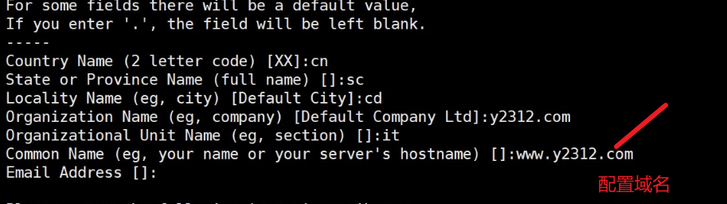

### 一、https 

```
https 加密传输

http  明文传输
加密-----》
	A   123      B  
		C
加密算法
	A   345     B  123
		C
密钥  
	对称密钥  ： 加密解密同一把钥匙
	非对称密钥（较多使用）  ： 公钥 私钥
k8s就是双向认证
公钥加密   私钥解密  
私钥加密（数字签名）  公钥解密
ssl 子层

创建私有CA：CA也有私钥和证书
		openssl的配置文件：/etc/pki/tls/openssl.cnf

(1) 创建所需要的文件（ca端120）
		cd  /etc/pki/CA/
		# touch index.txt ---创建数据库
		# echo 01 > serial ---创建颁发证书的序列号
		# 
		{} 
		()
(2) CA自签证书

		生成CA的私钥：
		# (umask 077; openssl genrsa -out /etc/pki/CA/private/cakey.pem 2048)
		生成证书
		# openssl req -new -x509 -key /etc/pki/CA/private/cakey.pem -days 7300 -out /etc/pki/CA/cacert.pem
			-new: 生成新证书签署请求；
			-x509: 专用于CA生成自签证书；
			-key: 生成请求时用到的私钥文件；
			-days n：证书的有效期限；
			-out /PATH/TO/SOMECERTFILE: 证书的保存路径；

(3) 发证（服务端110，扮演web服务器）
		(a) 用到证书的主机生成证书请求；（web服务器的私钥）
			# (umask 077; openssl genrsa -out /etc/httpd/ssl/httpd.key 2048)
			# openssl req -new -key /etc/httpd/ssl/httpd.key -days 365 -out /etc/httpd/ssl/httpd.csr  证书申请
		(b) 把请求文件传输给CA； scp /etc/httpd/ssl/httpd.csr 192.168.66.120:/root/
		(c) CA签署证书，并将证书发还给请求者；（120服务器盖章）
			# openssl ca -in httpd.csr -out /etc/pki/CA/certs/httpd.crt -days 365
		(d)盖章完成后的发送给web服务器（120）
		[root@localhost ~]# cd /etc/pki/CA/certs
		[root@localhost certs]# scp httpd.crt 192.168.66.110:/etc/httpd/ssl
```

192.168.18.120（51扮演CA）

```
一、[root@www ~]# cd /etc/pki/tls/
[root@www tls]# vi openssl.cnf
[root@localhost tls]# cd /etc/pki/CA/
[root@localhost CA]# touch index.txt
[root@localhost CA]# echo 01 > serial
===》生成CA的私钥
[root@localhost CA]# (umask 077;openssl genrsa -out /etc/pki/CA/private/cakey.pem 2048)
[root@localhost CA]# ls /etc/pki/CA/private/cakey.pem  -ld
-rw------- 1 root root 1679 1月  17 19:08 /etc/pki/CA/private/cakey.pem
[root@localhost CA]# umask
0022
====》生成CA的证书
[root@localhost CA]# openssl req -new -x509 -key /etc/pki/CA/private/cakey.pem -days 7300 -out /etc/pki/CA/cacert.pem
===cn/sc/cd/y2312.com/ca/ca.y2312.com


二、[root@localhost CA]# cd /root/
[root@localhost ~]# ls
anaconda-ks.cfg  httpd.csr  initial-setup-ks.cfg  wordpress-3.3.1-zh_CN.tar.gz


四、盖章
[root@localhost CA]# openssl ca -in httpd.csr -out /etc/pki/CA/certs/httpd.crt -days 365
[root@localhost ~]# cd -
/etc/pki/CA
[root@localhost CA]# ls
cacert.pem  certs  crl  index.txt  index.txt.attr  index.txt.old  newcerts  private  serial  serial.old
[root@localhost CA]# cd certs/
[root@localhost certs]# ls
httpd.crt
[root@localhost certs]# scp httpd.crt 192.168.18.11:/etc/httpd/ssl/

六、真机信任CA证书：120
[root@localhost CA]# sz cacert.pem
修改后缀名改为cacert.crt
```


服务端（18.110）

```
三、[root@www ~]# mkdir /etc/httpd/ssl
[root@www ~]# (umask 077; openssl genrsa -out /etc/httpd/ssl/httpd.key 2048)===生成CA的私钥

===》证书申请
[root@www ~]# openssl req -new -key /etc/httpd/ssl/httpd.key -days 365 -out /etc/httpd/ssl/httpd.csr
[root@www ~]# scp /etc/httpd/ssl/httpd.csr 192.168.18.13:/root/


五、[root@www ~]# yum install mod_ssl -y （110web服务器）
[root@www ~]# rpm -ql mod_ssl
/etc/httpd/conf.d/ssl.conf ---配置文件
/etc/httpd/conf.modules.d/00-ssl.conf


vi /etc/httpd/conf.d/ssl.conf
DocumentRoot "/weba/"
ServerName www.y2312.com:443
<Directory "/weba/">
Require all granted
</Directory>
私钥位置：SSLCertificateKeyFile /etc/httpd/ssl/httpd.key
ca证书：SSLCertificateFile /etc/httpd/ssl/httpd.crt

http中将http的请求重定向到https中：
<VirtualHost 192.168.66.110:80>
ServerName www.y2312.com
Redirect permanent / https://www.y2312.com/  ====修改
</VirtualHost>
```



### 二、ssh远程登录协议

```
telant 明文
ssh 加密
1、修改端口
2、密码复杂度
3、登陆重试次数
产生公钥：110
[root@localhost ~]# ssh-keygen -t rsa
ssh-copy-id 192.168.66.120
```

