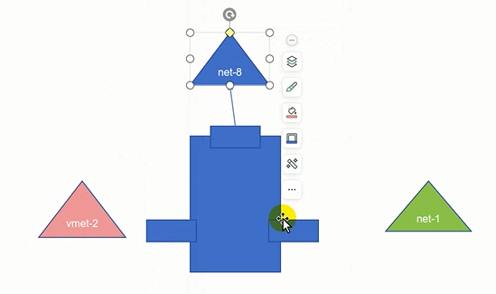

### 防火墙

```
防火墙： 过滤数据（ACCEPT DROP）
防火墙分类：
网络防火墙（流过==forward）： 网络边界 （网关）
主机防火墙： 主机边界 
硬件防火墙 ：设备
软件防火墙：实现功能

linux   内核中模块 ===>netfilter(过滤数据的模块)
            iptables 编写netfilter防火墙 规则
            firewalld本质调用---》iptables

正向代理：源地址转换理解成正向代理（基于ip和端口）===>

反向代理：目标地址（ip和端口）<====

五链
INPUT  OUTPUT  FORWARD  PREROUTING POSTROUTING 

流入    PREROUTING  INPUT 

      （路由之前）

流出（响应）    OUTPUT  POSTROUTING 

流过（经过）    PREROUTING  FORWARD POSTROUTING

                          （在路由之前）                      （路由之后）

四表（检测的动作） 
filter  过滤数据

nat   地址转换

raw   还原数据 

mangle  修改数据

dport=======>指定目标端口 

sport========>指定源端口

过滤数据   
        白名单（写在名单上的就是被允许的，一般允许的少）  ---- 》 DROP  
        黑名单 （写在名单上就是被拒绝的）---- > ACCEPT

====》原则上谁少写谁
```


```
查看过滤表
[root@www ~]# iptables -t filter -L -n
Chain INPUT (policy ACCEPT)
target     prot opt source               destination         
ACCEPT     udp  --  0.0.0.0/0            0.0.0.0/0            udp dpt:53
ACCEPT     tcp  --  0.0.0.0/0            0.0.0.0/0            tcp dpt:53
ACCEPT     udp  --  0.0.0.0/0            0.0.0.0/0            udp dpt:67
ACCEPT     tcp  --  0.0.0.0/0            0.0.0.0/0            tcp dpt:67
ACCEPT     all  --  0.0.0.0/0            0.0.0.0/0            ctstate RELATED,ESTABLISHED
ACCEPT     all  --  0.0.0.0/0            0.0.0.0/0           
INPUT_direct  all  --  0.0.0.0/0            0.0.0.0/0           
INPUT_ZONES_SOURCE  all  --  0.0.0.0/0            0.0.0.0/0           
INPUT_ZONES  all  --  0.0.0.0/0            0.0.0.0/0           
DROP       all  --  0.0.0.0/0            0.0.0.0/0            ctstate INVALID
REJECT     all  --  0.0.0.0/0            0.0.0.0/0            reject-with icmp-host-prohibited
ACCEPT     tcp  --  0.0.0.0/0            0.0.0.0/0            tcp dpt:80
ACCEPT     tcp  --  0.0.0.0/0            0.0.0.0/0            tcp dpt:8080

改策略
[root@www ~]# iptables -P INPUT DROP

-A添加一条规则 -s匹配源地址  -d匹配目标地址 -p指定什么协议 --dport指定目标端口 --sport指定源端口 -j指定过后做的动作 ACCEPT(接受)|DROP（拒绝）

iptables -A INPUT -p tcp --dport 22 -j ACCEPT 

将80和8080端口放行
[root@www ~]# iptables -A INPUT -p tcp --dport 80 -j ACCEPT
[root@www ~]# iptables -A OUTPUT -p tcp --sport 80 -j ACCEPT
[root@www ~]# iptables -A INPUT -p tcp --dport 8080 -j ACCEPT
[root@www ~]# iptables -A OUTPUT -p tcp --sport 8080 -j ACCEPT

使用yum能安装软件==》能出去--我要出去，我是源头dns是目标
iptables -A OUTPUT  -p udp --dport 53 -j ACCEPT
===>进来
[root@www ~]# iptables -A INPUT -p udp --sport 53 -j ACCEPT

访问出去的
[root@www ~]# iptables -A OUTPUT -p udp  --dport 443 -j ACCEPT
[root@www ~]# iptables -A OUTPUT -p udp  --dport 80 -j ACCEPT
进来的
[root@www ~]# iptables -A INPUT -p tdp  --sport 80 -j ACCEPT
[root@www ~]# iptables -A INPUT -p tdp  --sport 443 -j ACCEPT

-D删除
iptables -D OUTPUT 15====>删除ouput15行

ping出去的包
iptables -A OUTPUT - p icmp --icmp-type 8 -j ACCEPT(出去是请求)

回来（响应）
iptables -A INPUT -p icmp --icmp-type 0 -j ACCEPT
此时ping百度能通

INPUT一次性放行多个端口 -m指定模块
iptables -I INPUT 1 -p tcp -m multiport --dports 22,80,8080,443 -j ACCEPT
删除之前所有input配置的==》iptables -D INPUT 2
[root@www ~]# iptables -I INPUT 1 -p tcp -m multiport --sports 80,8080,443 -j ACCEPT
[root@www ~]# iptables -I INPUT 1 -p udp --sport 53 -j ACCEPT

OUTPUT放行多个端口
iptables -I OUTPUT 1 -p tcp -m multiport --sports 22,80,8080,443 -j ACCEPT
iptables -I OUTPUT 1 -p tcp -m multiport --dports 80,8080,443 -j ACCEPT
iptables -I OUTPUT 1 -p udp --dport 53 -j ACCEPT
[root@www ~]# iptables -D OUTPUT 3

ping百度
[root@www ~]#  iptables -A INPUT -p icmp -j ACCEPT
[root@www ~]#  iptables -A OUTPUT -p icmp -j ACCEPT

state:指定状态
iptables -I INPUT -m state --state ESTABLISHED -J ACCEPT
你是客户端，第一次访问就是new，出去的是established
iptables -I INPUT -p tcp -m multiport --dports 22,80,8080,443 -m state --state NEW -j ACCEPT
[root@www ~]# iptables -D INPUT 3
[root@www ~]# iptables -D INPUT 3
[root@www ~]# curl http://www.baidu.com
<!DOCTYPE html>

出去的规则也可以改
[root@www ~]# iptables -I OUTPUT 1  -m state --state ESTABLISHED -j ACCEPT
iptables -I OUTPUT -p tcp -m multiport --dports 80,8080,443 -m state --state NEW -j ACCEPT
[root@www ~]# iptables -I OUTPUT -p udp --dport 53 -m state --state NEW -j ACCEPT
[root@www ~]# iptables -D OUTPUT 4
[root@www ~]# iptables -D OUTPUT 4
此时curl http://www.baidu.com有显示


```

总结：

    查询规则  
            iptables  -L -n   --line-number -v 
    设定默认策略 
            iptables  -P 链名  ACCEPT|DROP  
    添加过滤规则 
            iptables  -A|I 链名  -s -d  -p tcp|udp|icmp  --sport | --dport  -j ACCEPT|DROP
    删除规则 防火墙： 过滤数据（ACCEPT DROP）
    网络防火墙： 网络边界 （网关）


​    支持 模块 
​    

               -m   mulport 同时支持多个端口
                    --dports 目标
                    --sports 源
                 
               state
                    NEW:最先的状态（新的）
                    ESTABLISHED：剩下的状态



```
inside 可以主动访问dmz，但dmz不能访问inside

dmz可以访问outside

开启转发功能
cat /proc/sys/net/ipv4/ip_forward===>0的话改成1

echo 1 > /proc/sys/net/ipv4/ip_forward

```


​    