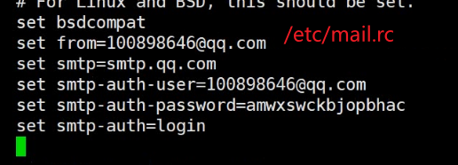

#### 1、lvs负载均衡

	负载均衡 分担服务器，提高服务器并发访问量
	
	lvs  负载均衡
		nat 模型 需要请求报文 响应报文 这两个都需要经过调度器（修改目标ip）
	
		dr模型 请求报文经过调度器（访问量比nat要高）（修改mac地址）
	vip： 接收用户访问ip 
	
	dip:  调度器和后端服务器通信的ip  
	
	rip:  后端服务器ip地址


	调度器：
		yum install ipvsadm 
	调度规则： 
		查询规则 
			ipvsadm  -L -n 
		添加规则 
			添加服务：  
			ipvsadm -A -t vip:port -s rr | wlc | lc | wrr
			添加主机 
			ipvsadm -a -t vip:port -r rip:port -m  
			-m:nat模式
			-w:权重
			-g:dr模型
		开启转发功能 
			cat  /proc/sys/net/ipv4/ip_forward
			echo 1 > /proc/sys/net/ipv4/ip_forward
	后端服务器
				将网关指向dip：  
					ip route add default via 网关地址
			dr 模型：  
				响应报文不经过调度器，修改报文mac地址，不能作端口映射
		调度器只需要开启转发功能 
			echo 1 > /proc/sys/net/ipv4/ip_forward 
	后端服务器：
	    	echo 1 > /proc/sys/net/ipv4/conf/lo/arp_ignore 
	    	echo 2 > /proc/sys/net/ipv4/conf/lo/arp_announce
	    	echo 1 > /proc/sys/net/ipv4/conf/all/arp_ignore 
	    	echo 2 > /proc/sys/net/ipv4/conf/all/arp_announce
	配置vip及路由 
	    	ifconfig  lo:0 vip/32 
	    	route add -host vip dev lo:0


​	

1： 配置dr 模型 
2： 并将后端服务器的配置写成脚本


192.168.18.11（调度器）===>136

```
1、[root@www ~]# ipvsadm -C 清空
2、开启转发功能
[root@www ~]# echo 1 > /proc/sys/net/ipv4/ip_forward
3、配置虚ip
[root@www ~]# ifconfig ens33:0 192.168.18.244/24
[root@www ~]# ifconfig ens33:0===>查看虚ip
ens33:0: flags=4163<UP,BROADCAST,RUNNING,MULTICAST>  mtu 1500
        inet 192.168.18.244  netmask 255.255.255.0  broadcast 192.168.18.255
        ether 00:0c:29:d9:80:a3  txqueuelen 1000  (Ethernet)
4、dos中ping 192.168.18.244=====>能通
5、检查能否平通192.1687.18.13和200=====》curl ip地址


6、配置调度器的规则
[root@www ~]# ipvsadm -A -t 192.168.18.244:80 -s rr
添加服务器 -g：添加dr模型默认不写
[root@www ~]# ipvsadm -a -t 192.168.18.244:80 -r 192.168.18.13
[root@www ~]# ipvsadm -a -t 192.168.18.244:80 -r 192.168.18.200

```

192.168.18.13（realsever）====>51

```
1、开启httpd服务
[root@localhost ~]# systemctl start httpd
2、关闭arp功能，并配置在还回口上
[root@localhost ~]# echo 1 > /proc/sys/net/ipv4/conf/lo/arp_ignore 
[root@localhost ~]# echo 2 > /proc/sys/net/ipv4/conf/lo/arp_announce 
[root@localhost ~]# echo 1 > /proc/sys/net/ipv4/conf/all/arp_ignore 
[root@localhost ~]# echo 2 > /proc/sys/net/ipv4/conf/all/arp_announce 
3、配置虚ip（32代表这个网段中只有这一个ip）
[root@localhost ~]# ifconfig lo:0 192.168.18.244/32 up
4、查看虚ip的还回地址
ifconfig lo：0
dos中ping一下 ping 192.168.66.244-----arp -a(查看是谁相应我们) 00-0c-29-e7-35-6d
5、配置路由及vip
route add -host 192.168.18.244 dev lo:0

```

192.168.18.200（realsever）======>52

```
1、开启httpd服务
[root@localhost ~]# systemctl start httpd
2、关闭arp功能，并配置在还回口上
[root@localhost ~]# echo 1 > /proc/sys/net/ipv4/conf/lo/arp_ignore
[root@localhost ~]# echo 2 > /proc/sys/net/ipv4/conf/lo/arp_announce 
[root@localhost ~]# echo 1 > /proc/sys/net/ipv4/conf/all/arp_ignore 
[root@localhost ~]# echo 2 > /proc/sys/net/ipv4/conf/all/arp_announce 
3、配置虚ip（32代表这个网段中只有这一个ip）
[root@localhost ~]# ifconfig lo:0 192.168.18.244/32 up
4、查看虚ip的还回地址
ifconfig lo：0
5、配置路由及vip
route add -host 192.168.18.244 dev lo:0
```

写脚本（18.13====>51---120）

```
vi lvsconfig.sh
#!/bin/bash
vip=192.168.18.244
dev=lo:0
#定义函数arp开启或者关闭
arp_switch () {
        #arp开启功能
        case $1 in
        "start")
        echo 1 > /proc/sys/net/ipv4/conf/lo/arp_ignore
        echo 2 > /proc/sys/net/ipv4/conf/lo/arp_announce
        echo 1 > /proc/sys/net/ipv4/conf/all/arp_ignore
        echo 2 > /proc/sys/net/ipv4/conf/all/arp_announce
;;
        #关闭功能
        "stop")
        echo 0 > /proc/sys/net/ipv4/conf/lo/arp_ignore
        echo 0 > /proc/sys/net/ipv4/conf/lo/arp_announce
        echo 0 > /proc/sys/net/ipv4/conf/all/arp_ignore
        echo 0 > /proc/sys/net/ipv4/conf/all/arp_announce
;;
        #默认值
        *)
        return 1
;;
esac
}

#配置vip
vip_config () {
        case $1 in
        "start")
        #配置虚ip
        ifconfig $dev $vip/32 up
        #配置路由
		route add -host $vip dev $dev
;;
        "stop")
        #关闭虚ip
        ifconfig $dev $vip/32 down
;;
        *)
        return 1
;;
esac
}

#调用函数
case $1 in
        "start")
        arp_switch start
        vip_config start
;;
        "stop")
        arp_switch stop
        vip_config stop
;;
        *)
        exit 1
;;
esac
[root@localhost ~]# chmod +x lvsconfig.sh 
[root@localhost ~]# ./lvsconfig.sh start
[root@localhost ~]# ./lvsconfig.sh stop
[root@localhost ~]# ./lvsconfig.sh start====》开启
[root@localhost ~]# cat /proc/sys/net/ipv4/conf/lo/arp_announce 
2
```


#### 2、对调度器进行高可用（对调度器进行备份）

```
keepalived：高可用
两台调度器，当其中一台挂掉，另外一台才提供服务，平时访问的是主调度器，当挂掉了就访问另外一台调度器（同一个虚ip，平时没有ip，两个调度器之间会发送心跳信息，当没有收到心跳信息就认为挂掉也会有优先级选择其中一个为新的主调度器，采用组播基于vrrp协议），组播地址：244.0.0.18
对调度器进行高可用（给调度器找个备胎）

vip1和vip2同一个ip，当其中一个挂掉，就会发送一个心跳信息（通过组播），通过优先级判别谁是主服务器，谁是备用

keepalived 采用arrp协议 

采用组播地址：224.0.0.18
```

11调度器=====>136keepalived（110）

```
1、ipvsadm -C==>清空
2、安装keepalived
[root@www ~]# yum install keepalived
3、关闭虚ip
[root@www ~]# ifconfig ens33:0 down
[root@www ~]# ifconfig ens33:0
4、配置文件keepalived
[root@www ~]# vi /etc/keepalived/keepalived.conf 
#   vrrp_strict==》注销掉
：===>.,%s/.*/#&/ig(当前行到最后全部注释掉)
	state MASTER  ===主服务器
    interface ens33===表达用哪张网卡传递心跳信息
    virtual_router_id 51===id要一样
    priority 105==优先级
    #advert_int 1==发送心跳的时间间隔==可以不要
    authentication {
        auth_type PASS
        auth_pass 1111
    }
    virtual_ipaddress {
        192.168.18.242/24 dev ens33 lable ens33:0=====》配置虚ip

    }
}
5、启动k
[root@www ~]# systemctl start keepalived
[root@www ~]# ifconfig ens33:0
复制到13---51中（备用）
[root@www ~]# scp /etc/keepalived/keepalived.conf 192.168.18.13:/etc/keepalived/keepalived.conf 
修改优先级为100 启动keepalived

相互发送邮箱
[root@www ~]# vi /etc/mail.rc===.查看邮箱是否写了
发送消息给邮箱：
[root@www ~]# echo "hello world" | mail -s "y2312 testmail" 1491506452@qq.com==发送helloworld到qq邮箱
[root@www ~]# scp /etc/mail.rc 192.168.18.13:/etc/mail.rc将文件复制到13中去

定义通知的脚本（状态发生改变就发送邮箱）
[root@www ~]# vi /etc/keepalived/notify.sh
#!/bin/bash
touser=1491506452@qq.com  ===发送邮箱
hostname=`hostname` ===主机
vip=192.168.18.242
case $1 in
        "master")
        echo "$host is become master, $vip is configed $(date +%F-%H:%m:%S)" | mail -s "state change" $touser
        systemctl stop httpd
;;
        "backup")
        echo "$host is become backup, $vip is remove $(date +%F-%H:%m:%S)" | mail -s "state change" $touser
        systemctl start httpd
;;
*)
        exit 1
;;
esac
授权
[root@www ~]# chmod +x /etc/keepalived/notify.sh 
[root@www ~]# /etc/keepalived/notify.sh master|backup
===》刷新邮箱会有
将配置文件给13（备份）
[root@www ~]# scp /etc/keepalived/notify.sh 192.168.18.13:/etc/keepalived/
配置文件中修改==定义通知的脚本
[root@www ~]# vi /etc/keepalived/keepalived.conf 
 192.168.18.242/24 dev ens33 lable ens33:0
    }
    notify_master "/etc/keepalived/notify.sh master"
    notify_backup "/etc/keepalived/notify.sh backup"
[root@localhost ~]# systemctl restart keepalived

```

13备用=====>51（120）

```
1、安装keepalived
[root@www ~]# yum install keepalived
2、配置文件：
vrrp_instance VI_1 {
    state BACKUP===备用
    interface ens33
    virtual_router_id 51
    priority 100===优先级
    advert_int 1
    virtual_ipaddress {
        192.168.18.242/24 dev ens33 lable ens33:0
3、查看日志===》宁外复制一个会话
tail -f /var/log/message===>变成BACKUP


[root@localhost ~]# echo "hello world" | mail -s "y2312 from nodel" 1491506452@qq.com
[root@localhost ~]# chmod +x /etc/keepalived/notify.sh 加权限
[root@localhost ~]# vi /etc/keepalived/keepalived.conf 
irtual_ipaddress {
        192.168.18.242/24 dev ens33 lable ens33:0
    }
    notify_master "/etc/keepalived/notify.sh master"
    notify_backup "/etc/keepalived/notify.sh backup"
[root@localhost ~]# systemctl restart keepalived


```


#### 3、keepalived也可以自动生成lvs规则

11（110）

```
vi /etc/keepalived/
virtual_server 192.168.66.242 80 {  ===配虚ip
    delay_loop 2 ===健康检测的时间
    lb_algo rr ----调度算法
    lb_kind DR ---dr模型
    protocol TCP ---采用的协议
    sorry_server 127.0.0.1 8099 
    real_sever 192.168.18.130 80{  -==后台服务器ip地址
        weight 1  ===权重
        HTTP_GET {  ===健康监测
            url {
              path / 检测路径
              status_code 200
            }
            connect_timeout 1 ---连接超时时间
            nb_get_retry 1   ===重试
            delay_before_retry 2---间隔
        }
    }
}
```


11中keepalived中配置文件一共有三个

全局=== 配置ip地址是否要转移的 ====生成lvs规则的

11==写一个检测httpd的脚本，当其中换一个挂掉，优先级降得比backup低==都要提供httpd服务

```
[root@www ~]# systemctl start httpd
[root@www ~]# killall -0 httpd
[root@www ~]# echo $?
0
[root@www ~]# killall -0 httpd
httpd: no process found
[root@www ~]# echo $?
1
定义检测某个服务脚本
1、[root@www ~]# vi /etc/keepalived/keepalived.conf 
vrrp_scrip chkhttpd {
   script "/etc/keepalived/chkhttpd.sh" 脚本地址
   interval 1 脚本频率
   timeout 2 超时时间
   weight -20 权重，当服务挂了优先级就减20
   rise 1 检测成功次数
   fall 1 检测失败次数
}
2、调佣函数
    notify_backup "/etc/keepalived/notify.sh backup"
    track_script {
        chkhttpd
}
3、定义检测脚本
[root@www ~]# vi /etc/keepalived/chkhttpd.sh
#!/bin/bash
killall -0 httpd &> /dev/null

4、当httpd挂了，备用服务器开启httpd，当主服务器httpd起来了就关掉httpd在通知脚本中写入

```

定义邮箱：

