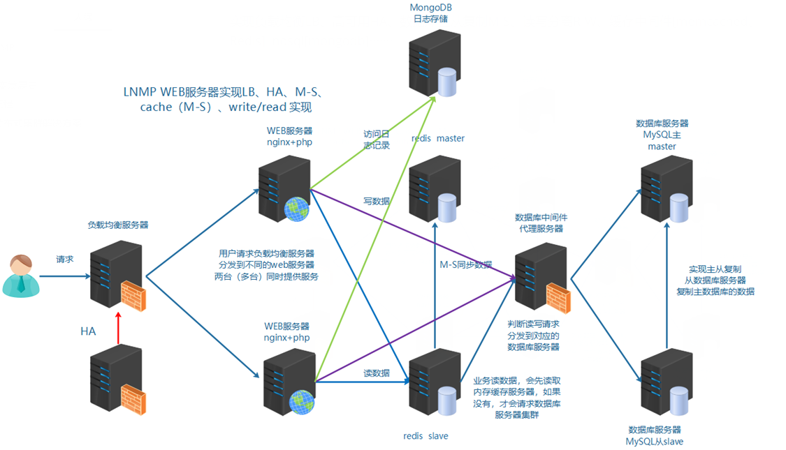
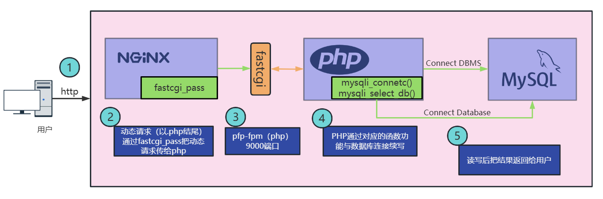
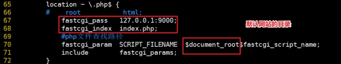
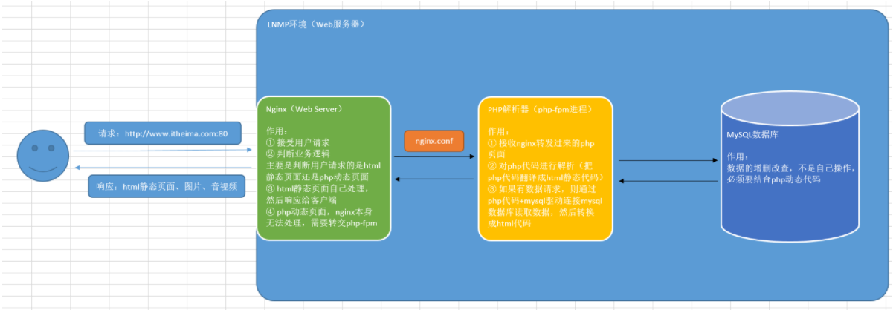
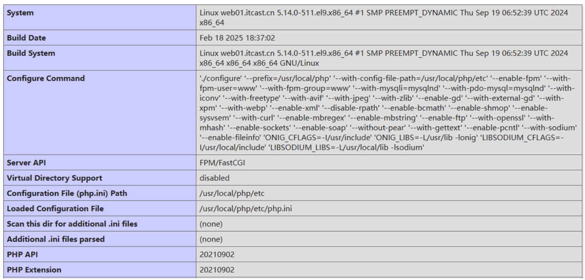

# 企业级架构之LNMP环境构建

# 学习目标

- [ ] 能够描述Web项目运行流程
- [ ] 能够了解PV、DAU、QPS等参数
- [ ] 能够理解LNMP的关系
  - [ ] 能够部署配置MySQL生产环境
  - [ ] 能够部署配置Nginx生产环境（重点）
  - [ ] 能够部署配置PHP生产环境（重点）
- [ ] 能够理解PHP-FPM和Nginx关联关系
- [ ] 能够配置Nginx关联到PHP-FPM

# 一、运维十年演变发展史

## 1、项目开发流程

公司老板和产品经理根据市场调查，决定开发的一整套互联网产品。

==互动社交+电商+用户论坛（BBS）==

> 产品决策（老板+产品+UI设计）=> 代码开发（程序开发人员[前端开发[客户端页面或者APP]和后端开发[java php python node ruby]）=> 测试工作（测试人员）=> 部署上线（运维人员）（sa、dev 开发ops运维=devops=>7（运维）:3（开发））

项目周期：技术人员在项目开发周期大概1-3个月（中小），大型项目开发周期大概6个月-1年左右。

1产品 + 1UI + 1前端 + 3个后端 + 1个测试 +3 运维团队（网络 + 运维 + 数据库） =>  10万

10 * 3 = 30万

10 * 6 = 60万

10 * 12 = 120万

## 2、企业架构分布式集群解决方案

集群：多台服务器在一起作同样的事 。

分布式 ：多台服务器在一起作不同的事 。

咋理解集群与分布式？讲个故事：

小饭店原来只有一个厨师，切菜洗菜备料炒菜全干。后来客人多了，厨房一个厨师忙不过来，又请了个厨师，两个厨师都能炒一样的菜，这两个厨师的关系是集群。为了让厨师专心炒菜，把菜做到极致，又请了个配菜师负责切菜，备菜，备料，厨师和配菜师的关系是分布式，一个配菜师也忙不过来了，又请了个配菜师，两个配菜师关系是集群

最终的架构图示

实现负载均衡LB、高可用HA、数据库主从复制M-S、读写分离R-W、缓存中间件[Memcached、Redis]、nosql[MongoDB]...



## 3、业务背景

年份：2014-2016（互联网蓬勃发展）

发布产品类型：在线电商平台（NiuShop）

用户数量： 500左右（20% ~ 70%）

PV ： 1000-3000

DAU： 100-300（日活，每天的独立访客数量）

参数解析：

```powershell
PV（Page View）：页面访问量，即页面浏览量或点击量，用户每次刷新一次即被计算一次
UV（Unique Visitor）：独立访客，统计1天内访问某站点的用户数
DAU(Daily Active User)，日活跃用户数量。常用于反映网站、互联网应用或网络游戏的运营情况
吞吐量：应用系统每秒钟最大能接受的用户访问量或者每秒钟最大能处理的请求数

QPS（Query Per Second）：每秒钟处理完请求的次数，注意这里是处理完。具体是指发出请求到服务器处理完成功返回结果。可以理解在Server中有个Counter，每处理一个请求加1，1秒后Counter=QPS
TPS（Transactions Per Second）：每秒钟处理完的事务次数，一般TPS是对整个系统来讲的。一个应用系统1s能完成多少事务处理，一个事务在分布式处理中，可能会对应多个请求，对于衡量单个接口服务的处理能力，用QPS比较多
并发量：系统能同时处理的请求数
RT：响应时间，处理一次请求所需要的平均处理时间

计算公式：
QPS = 并发量 / 平均响应时间
并发量 = QPS * 平均响应时间
```

举个栗子：

假设服务并发量为1500，RT为150ms，那么该服务的QPS ：

10000 = 1500（并发数） /  0.15 （RT） 

假如通过压测一台机器的QPS为500，那么该服务需要20+台这样的机器。

# 二、服务器准备

## 1、操作系统

CentOS Stream 9（最小化安装）=>  CentOS7.6~CentOS7.9

## 2、修改主机名和hosts

~~~powershell
# hostnamectl set-hostname web01.itcast.cn
# cat /etc/hosts
127.0.0.1   localhost localhost.localdomain localhost4 localhost4.localdomain4
::1         localhost localhost.localdomain localhost6 localhost6.localdomain6
192.168.88.101   web01 web01.itcast.cn
~~~

## 3、关闭防火墙与SELinux

扩展：CentOS Stream 9 => systemctl

服务管理：启动/停止/重启/查看状态

```powershell
# systemctl start/stop/restart/status 服务名称
```

开机启动项管理：

```powershell
# systemctl enable  服务名称	=>  开机启动
# systemctl disable 服务名称	=>  开机不启动
```

关闭防火墙与SELinux：

~~~powershell
# systemctl stop firewalld
# systemctl disable firewalld
# setenforce 0
# sed -i '/SELINUX=enforcing/cSELINUX=disabled' /etc/selinux/config
等价于
# vim /etc/selinux/config
SELINUX=disabled
~~~

## 4、配置清华yum源

yum/dnf => 系统/etc/yum.repos.d目录，找到镜像仓库配置文件 => 请求远程仓库

配置方案：阿里镜像站、腾讯镜像站、华为镜像站、清华镜像站（推荐）

---

CentOS Stream 9 默认启用了包管理工具 dnf，其是 yum 包管理工具的替代品。dnf 与 yum 大部分的命令都是通用的，dnf 也使用 `/etc/yum.repos.d/` 进行镜像配置。

CentOS Stream 9 中源被整合入两个文件 `centos.repo` 和 `centos-addons.repo`，由于文件中不包含 `baseurl` 字段，需要手动插入，通过文本替换修改源的方法较为复杂，也可以选择直接复制最后的替换结果覆盖源文件。

将这段代码保存为一个文件，例如 `update_mirror.pl`

~~~perl
#!/usr/bin/perl

use strict;
use warnings;
use autodie;

my $mirrors = 'https://mirrors.tuna.tsinghua.edu.cn/centos-stream';

if (@ARGV < 1) {
    die "Usage: $0 <filename1> <filename2> ...\n";
}

while (my $filename = shift @ARGV) {
    my $backup_filename = $filename . '.bak';
    rename $filename, $backup_filename;

    open my $input, "<", $backup_filename;
    open my $output, ">", $filename;

    while (<$input>) {
        s/^metalink/# metalink/;

        if (m/^name/) {
            my (undef, $repo, $arch) = split /-/;
            $repo =~ s/^\s+|\s+$//g;
            ($arch = defined $arch ? lc($arch) : '') =~ s/^\s+|\s+$//g;

            if ($repo =~ /^Extras/) {
                $_ .= "baseurl=${mirrors}/SIGs/\$releasever-stream/extras" . ($arch eq 'source' ? "/${arch}/" : "/\$basearch/") . "extras-common\n";
            } else {
                $_ .= "baseurl=${mirrors}/\$releasever-stream/$repo" . ($arch eq 'source' ? "/" : "/\$basearch/") . ($arch ne '' ? "${arch}/tree/" : "os") . "\n";
            }
        }

        print $output $_;
    }
}
~~~

然后，在命令行中使用以下命令来执行它：

```powershell
dnf install perl-autodie -y
perl ./update_mirror.pl /etc/yum.repos.d/centos*.repo
```

最后，更新软件包缓存：

```powershell
# 使用 dnf
dnf clean all && dnf makecache

# 使用 yum
yum clean all && yum makecache
```

注意，如果需要启用其中一些 repo，需要将其中的 `enabled=0` 改为 `enabled=1`。

## 5、设置网络

```powershell
ls /etc/NetworkManager/system-connections/
sudo vi /etc/NetworkManager/system-connections/ens33.nmconnection
------------------------------------------------------  设置开始 -------------------------------------------------------------
[ipv4]
method=manual
addresses=192.168.88.101/24
gateway=192.168.88.2
dns=8.8.8.8;

[ipv6]
method=ignore
------------------------------------------------------  设置结束 -------------------------------------------------------------
sudo systemctl restart NetworkManager
nmcli device show ens33
```

如果不想重启整个 `NetworkManager` 服务，可以只重新激活特定的网络连接：

```powershell
sudo nmcli connection down <连接名称>
sudo nmcli connection up <连接名称>

sudo nmcli connection down ens33
sudo nmcli connection up ens33
```

如果想重启所有网络接口，可以使用以下命令：

```powershell
sudo nmcli networking off
sudo nmcli networking on
```

当然，你也可以使用传统方式，如：`ifup`，`ifdown`等等

## 6、ntpdate时间同步

centos镜像源有很多种，centos-base.repo基础源，epel-release扩展源

ntpdate手工同步操作 =>  人为实现时间同步

```powershell
# dnf install epel-release -y
# dnf install ntpsec -y
# ntpdate cn.ntp.org.cn
-----------------------------------------
# yum install chrony -y
自行配置chrony时间同步
开机自启：systemctl enable --now chronyd
修改配置文件： vi /etc/chrony.conf
注释第三行，在下方添加阿里云时间服务器：
server ntp1.aliyun.com iburst
server ntp2.aliyun.com iburst
server ntp3.aliyun.com iburst
server ntp4.aliyun.com iburst
server ntp5.aliyun.com iburst
server ntp6.aliyun.com iburst
重启时间服务器： systemctl restart chronyd

```

# 三、LNMP环境搭建

LNMP = Linux + Nginx + MySQL + PHP(独立软件，占用9000)



Nginx：接收用户请求，请求处理后返回结果给用户。

注意：Nginx本身只能处理静态文件（.htm/.html、css、javascript），无法处理动态文件（.php、.py、.java）（ps：动态特指登录、下单、支付等功能），动态文件Nginx会通过反向代理(请求转发，即使把用户请求转发到后端服务器)。

PHP程序（底层进程：PHP-FPM）：专门用于处理.php动态文件，处理完后成后，把结果以静态数据返回

MySQL：负责整个项目中数据的存储（用户数据、产品数据、订单数据、发货数据等等）

## 前期准备

| 编号 | 主机名称        | IP地址         | 角色  |
| ---- | --------------- | -------------- | ----- |
| 1    | web01.itcast.cn | 192.168.88.101 | Web01 |

## 1、MySQL软件安装

瑞典AB公司，MySQL默认编码=>latin1 => Sun公司 =>甲骨文（Oracle），Oracle MySQL

yum安装：默认安装并不是mysql，实际使用的是mariadb

mariadb => 基于mysql的衍生版，开源免费。

安装mysql还可以可以使用二进制软件包（类似Windows中的绿色软件）或者编译安装实现

官网：www.mysql.com

### ☆ 常见的Web架构

ASP  ： IIS服务器软件

PHP ： LAMP/LNMP => A（Apache）、N（Nginx）

JSP   ： Nginx + Tomcat

### ☆ MySQL软件安装

NiuShop商城系统要求：PHP7.4 + MySQL5.6~MySQL8.0 + Nginx（版本没有严格要求）+ Redis（支持，版本没有严格）

第一步：软件包下载

```powershell
mysql-5.7.31-linux-glibc2.12-x86_64.tar.gz
说明：通用linux下的二进制包，已编译好，只需放到相应的安装目录里即可
```

第二步：默认选项

```powershell
默认安装路径：/usr/local/mysql             				mysql安装目录
默认数据目录：/usr/local/mysql/data				  mysql数据目录
默认端口：3306
默认socket文件存放路径：/tmp/mysql.sock	   套接字文件，负责客户端与服务器端进行网络连接
```

B/S => Browser（浏览器）/Server（服务器）

C/S => Client（客户端）/Server（服务器）

> MySQL客户端（mysql）、MySQL Server服务器端（mysqld）

第三步：安装步骤

参考官当：[MySQL-glibc安装手册](https://dev.mysql.com/doc/refman/5.6/en/binary-installation.html)

需求：

1. MySQL的安装目录为：/usr/local/mysql
2. MySQL的数据目录为:  /usr/local/mysql/data

前期规划：

| 安装目录         | 数据目录              | 默认端口 | 套接字（关键）  |
| ---------------- | --------------------- | -------- | --------------- |
| /usr/local/mysql | /usr/local/mysql/data | 3306     | /tmp/mysql.sock |

问题：如果我们MySQL的套接字没有放置在/tmp目录下，会有什么影响？（扩展）

答：mysql客户端无法直接连接到mysqld服务器端，必须手工指定-S选项（mysql -S xxx.sock），指定套接字的位置或者可以在my.cnf文件中，添加一个选项

```powershell
# vim my.cnf
[mysqld]
针对服务器端的相关配置（安装目录、数据目录、端口、套接字以及日志信息等等）

[mysql]
socket=/usr/local/mysql/mysql.sock
```

> 除了套接字问题，还需要注意的就是my.cnf配置文件，其加载顺序：① 安装目录 ② /etc目录，如果安装目录与/etc都有my.cnf，则/etc目录下的my.cnf会覆盖安装目录中的配置文件。

第一步：上传MySQL软件包（5.7.31版本）到Web01服务器端

第二步：解压MySQL软件包，然后移动到/usr/local目录下，起名为mysql

```powershell
# rm -rf /usr/local/mysql
# tar -xf mysql-5.7.31-linux-glibc2.12-x86_64.tar.gz
# mv mysql-5.7.31-linux-glibc2.12-x86_64 /usr/local/mysql
```

第三步：创建一个特定的mysql账号，用于启动与运行mysql软件

```powershell
# useradd -r -s /sbin/nologin mysql
```

第四步：进入/usr/local/mysql目录，创建mysql-files文件夹

```powershell
# cd /usr/local/mysql
# mkdir mysql-files
```

第五步：更改mysql-files文件夹权限（拥有者与所属组以及文件夹权限750）

```powershell
# chown mysql.mysql mysql-files
# chmod 750 mysql-files
```

第六步：删除默认配置文件my.cnf，然后初始化MySQL

```powershell
# rm -rf /etc/my.cnf
# bin/mysqld --initialize --user=mysql --basedir=/usr/local/mysql
[Note] A temporary password is generated for root@localhost: q7+1jT_>yzpA
根据需要决定是否开启SSL加密传输
# bin/mysql_ssl_rsa_setup --datadir=/usr/local/mysql/data

# 创建my.cnf
vim /etc/my.cnf
[mysqld]
basedir=/usr/local/mysql
datadir=/usr/local/mysql/data
socket=/tmp/mysql.sock
port=3306
log-error=/usr/local/mysql/data/mysql.err
log-bin=/usr/local/mysql/data/binlog
server-id=10
character_set_server=utf8mb4
gtid-mode=on
log-slave-updates=1
enforce-gtid-consistency
sql_mode=NO_ENGINE_SUBSTITUTION,STRICT_TRANS_TABLES
```

第七步：MySQL服务配置

```powershell
# vim /usr/lib/systemd/system/mysqld.service
[Unit]
Description=MySQL Server
After=network.target
After=syslog.target

[Service]
User=mysql
Group=mysql
ExecStart=/usr/local/mysql/bin/mysqld --defaults-file=/etc/my.cnf
LimitNOFILE = 5000
PrivateTmp=false

[Install]
WantedBy=multi-user.target
```

启动mysql

```powershell
chown -R mysql.mysql /usr/local/mysql
systemctl start mysqld
```

添加环境变量，进入mysql，更改mysql的默认密码

```powershell
# echo 'export PATH=$PATH:/usr/local/mysql/bin' >> /etc/profile
# source /etc/profile

# ln -s /lib64/libncurses.so.6 /lib64/libncurses.so.5
# ln -s /lib64/libtinfo.so.6 /lib64/libtinfo.so.5
# mysql -p
Enter password: q7+1jT_>yzpA

mysql> set password='123';
mysql> flush privileges;
```

第八步：进行数据库的安全初始化

```powershell
# mysql_secure_installation
```

第九步：配置mysql服务随开机自动启动

```powershell
# systemctl enable mysqld
```

> 扩展：编写MySQL安装脚本

```powershell
# vim mysql.sh
#!/bin/bash
yum install libaio -y
tar -xf mysql-5.7.31-linux-glibc2.12-x86_64.tar.gz
mv mysql-5.7.31-linux-glibc2.12-x86_64 /usr/local/mysql
useradd -r -s /sbin/nologin mysql
rm -rf /etc/my.cnf
cd /usr/local/mysql
mkdir mysql-files
chown mysql:mysql mysql-files
chmod 750 mysql-files
bin/mysqld --initialize --user=mysql --basedir=/usr/local/mysql &>/root/password.txt
cat > /etc/my.cnf <<EOF
[mysqld]
basedir=/usr/local/mysql
datadir=/usr/local/mysql/data
socket=/tmp/mysql.sock
port=3306
log-error=/usr/local/mysql/data/mysql.err
log-bin=/usr/local/mysql/data/binlog
server-id=10
character_set_server=utf8mb4
gtid-mode=on
log-slave-updates=1
enforce-gtid-consistency
sql_mode=NO_ENGINE_SUBSTITUTION,STRICT_TRANS_TABLES
EOF
bin/mysql_ssl_rsa_setup --datadir=/usr/local/mysql/data

cat <<EOF | sudo tee /etc/systemd/system/mysqld.service
[Unit]
Description=MySQL Server
After=network.target
After=syslog.target

[Service]
User=mysql
Group=mysql
ExecStart=/usr/local/mysql/bin/mysqld --defaults-file=/etc/my.cnf
LimitNOFILE = 5000
PrivateTmp=false

[Install]
WantedBy=multi-user.target
EOF

sudo systemctl daemon-reload

echo 'export PATH=$PATH:/usr/local/mysql/bin' >> /etc/profile
source /etc/profile

ln -s /lib64/libncurses.so.6 /lib64/libncurses.so.5
ln -s /lib64/libtinfo.so.6 /lib64/libtinfo.so.5

# source mysql.sh
```

启动数据库

```powershell
[root@web01 mysql]# systemctl start mysqld
Starting MySQL.Logging to '/usr/local/mysql/data/web01.itcast.cn.err'.
 SUCCESS! 
[root@web01 mysql]# ss -naltp|grep mysqld
LISTEN     0      80          :::3306                    :::*                   users:(("mysqld",pid=15921,fd=10))
```

后续配置(任选其一)

```powershell
1）更改数据库管理员root密码
[root@web01 mysql]# ./bin/mysqladmin -u root password '123'
Warning: Using a password on the command line interface can be insecure.

2）安全初始化数据库
[root@web01 mysql]# ./bin/mysql_secure_installation
...
Enter current password for root (enter for none): 输入当前密码
OK, successfully used password, moving on...
...
Change the root password? [Y/n] n	是否更改管理员root密码
...
Remove anonymous users? [Y/n] y		是否移除匿名用户
 ... Success!
...
Disallow root login remotely? [Y/n] n 	是否禁止root从远程登录;生产禁止，测试允许
...
Remove test database and access to it? [Y/n] y 是否移除test库
...
Reload privilege tables now? [Y/n] y	是否刷新权限表
 ... Success!
```

测试登录

```powershell
[root@web01 mysql]# mysql -u root -p
-bash: mysql: 未找到命令
说明：
-u 指定连接用户
-p 指定用户密码

原因：环境变量找不到
解决：修改/etc/profile文件追加以下内容
[root@web01 mysql]# echo 'export PATH=$PATH:/usr/local/mysql/bin' >> /etc/profile
[root@web01 mysql]# source /etc/profile

[root@web01 mysql]# mysql -u root -p  
Enter password: 
...
mysql> show databases;
+--------------------+
| Database           |
+--------------------+
| information_schema |
| mysql              |
| performance_schema |
+--------------------+
3 rows in set (0.00 sec)
```

## 2、Nginx软件安装

### ☆ Nginx概述

Nginx (engine x) 是一个高性能的HTTP和反向代理web服务器，同时也提供了IMAP/POP3/SMTP等邮件服务。Nginx是由伊戈尔·赛索耶夫为俄罗斯访问量第二的Rambler.ru站点（俄文：Рамблер）开发的，第一个公开版本0.1.0发布于2004年10月4日 => F5公司，负载均衡器（硬件）

Nginx是一款轻量级的Web 服务器/反向代理服务器及电子邮件（IMAP/POP3）代理服务器，在BSD-like 协议下发行。其特点是占有内存少，并发能力强，事实上nginx的并发能力确实在同类型的网页服务器中表现较好，中国大陆使用nginx网站用户有：百度、京东、新浪、网易、腾讯、淘宝等。

```powershell
# curl -I 域名地址
Server:Nginx
```

### ☆ 常见用法

```powershell
1) web服务器软件 httpd(apache)
   同类型web服务器软件：apache nginx(俄罗斯) iis(微软) lighttpd(德国)
2) 提供了IMAP/POP3/SMTP服务
3) 充当反向代理服务器，实现负载均衡功能。LB=>Load Blance
```

### ☆ Nginx特点

① 高可靠：稳定性  master进程 管理调度请求分发到哪一个worker=> worker进程 响应请求   一master多worker

② 热部署 ：（1）平滑升级  （2）可以快速重载配置

③ 高并发：可以同时响应更多的请求  事件 epoll模型

④ 响应快：尤其在处理静态文件上，响应速度很快  sendfile

⑤ 低消耗：cpu和内存   1w个请求  内存2~3MB

⑥ 分布式支持：反向代理  七层负载均衡（应用层的转发），新版本也支持四层负载均衡

>
>
>七层物理模型：物数网传会表应

### ☆  常见安装方式

常见安装方式：

① yum安装配置，需使用Nginx官方源或者EPEL源

② 源码编译

### ☆ 编译安装Nginx

软件的编译安装过程：编译安装三步走（配置 + 编译 + 安装）

① 配置软件./configure

② 编译，生成可执行的软件包make

③ 安装make install

--------------------------------------- 华丽的分割线 ------------------------------------

第一步：安装依赖库

```powershell
[root@web01 ~] # dnf -y install pcre-devel zlib-devel openssl-devel
ps: http和https区别
http端口80，传输过程没有通过ssl进行加密，明文传输，有安全隐患。早期浏览器默认使用http协议，新版本不推荐使用http协议，内部项目可以采用http
https端口:443 需要配置ssl证书（免费，3个月续订一次；收费，1-3年续订一次，大概1000左右一年），加密传输，数据传输过程中都会通过ssl进行加密，相对http更加安全。
```

第二步：创建账号

```powershell
[root@web01 ~] # useradd -r -s /sbin/nologin www
```

第三步：配置/编译与安装

```powershell
tar xvf nginx-1.24.0.tar.gz

cd nginx-1.24.0
./configure --prefix=/usr/local/nginx --user=www --group=www --with-http_ssl_module --with-http_stub_status_module --with-http_realip_module

make && make install
```

编译参数说明

| 参数                           | 作用                                                         |
| ------------------------------ | ------------------------------------------------------------ |
| --prefix                       | 编译安装到的软件目录                                         |
| --user                         | worker进程运行用户                                           |
| --group                        | worker进程运行用户组                                         |
| --with-http_ssl_module         | 支持https  需要==**pcel-devel**==依赖                        |
| --with-http_stub_status_module | 基本状态信息显示       查看请求数、连接数等                  |
| --with-http_realip_module      | 定义客户端地址和端口为header头信息     常用于反向代理后的真实IP获取 |

### ☆  Nginx目录介绍

| 目录 | 作用                                 |
| ---- | ------------------------------------ |
| conf | 配置文件(nginx.conf)                 |
| html | 网站默认目录                         |
| logs | 日志(access.log、error.log)          |
| sbin | 可执行文件  [软件的启动 停止 重启等] |

>
>
>nginx比较特殊：即支持重启操作，也支持重载操作
>
>重载：不停服务，重新加载配置文件

### ☆ 软件操作参数

| 参数       | 作用                                                         |
| ---------- | ------------------------------------------------------------ |
| -V         | 显示Nginx版本号以及配置选项                                  |
| -s  signal | stop关闭     quit优雅的关闭     reopen重开日志     reload重载 |

### ☆ Nginx服务配置

CentOS Stream 9配置：

```powershell
# 注意：一定要提前把Nginx停止掉
sbin/nginx -s stop
# Nginx服务配置到该文件中
vim /usr/lib/systemd/system/nginx.service
[Unit]
Description=Nginx Web Server
After=network.target
  
[Service]
Type=forking
ExecStart=/usr/local/nginx/sbin/nginx -c /usr/local/nginx/conf/nginx.conf
ExecReload=/usr/local/nginx/sbin/nginx -s reload
ExecStop=/usr/local/nginx/sbin/nginx -s quit
PrivateTmp=true
  
[Install]
WantedBy=multi-user.target

扩展：
Type=forking，forking代表后台运行
```

启动Nginx服务：

```powershell
[root@server01 ~] # systemctl daemon-reload
[root@server01 ~] # systemctl start nginx
```

设置Nginx开机启动：

```powershell
[root@server01 ~] # systemctl enable nginx
```

## 3、PHP软件安装

### ☆ PHP概述

==**PHP**==（外文名:PHP: Hypertext Preprocessor，中文名：“超文本预处理器”）是一种通用开源脚本语言，主要应用于Web领域。

==PHP是将程序嵌入到HTML（标准通用标记语言下的一个应用）文档中去执行，执行效率比完全生成HTML标记的CGI要高许多==

PHP还可以执行编译后代码，编译可以达到加密和优化代码运行，使代码运行更快。（新特性）

### ☆ PHP-FPM

Apache：Apache + PHP，容易崩溃，效率低

==Nginx ： Nginx + PHP，PHP-FPM进程管理器，稳定，效率高==

```powershell
PHP-FPM(FastCGI Process Manager：FastCGI进程管理器)
对于PHP 5.3.3之前的php来说，是一个补丁包 ，旨在将FastCGI进程管理整合进PHP包中。
相对Spawn-FCGI，PHP-FPM在CPU和内存方面的控制都更胜一筹，而且前者很容易崩溃，必须用crontab定时进行监控，而PHP-FPM则没有这种烦恼。
PHP5.3.3已经集成php-fpm了，不再是第三方的包了。PHP-FPM提供了更好的PHP进程管理方式，可以有效控制内存和进程、可以平滑重载PHP配置，比spawn-fcgi具有更多优点，所以被PHP官方收录了。
注意：
在./configure的时候带 –-enable-fpm 参数即可开启PHP-FPM
```

### ☆ 编译安装PHP

第一步：安装依赖库

```powershell
dnf install epel-release -y
[root@web01 ~] # dnf -y install libxml2-devel libjpeg-devel libpng-devel libwebp-devel freetype-devel curl-devel openssl-devel sqlite sqlite-devel libtool pcre-devel gd-devel libsodium
```

安装 oniguruma 库（如果下载不了，直接上传压缩包到/usr/local/src目录即可）

```powershell
cd /usr/local/src
sudo curl -LO https://github.com/kkos/oniguruma/releases/download/v6.9.8/onig-6.9.8.tar.gz
sudo tar -zxvf onig-6.9.8.tar.gz
cd onig-6.9.8
./configure  && make && make install

注：oniguruma 库，这是 PHP 在启用多字节正则表达式支持时的必需库

设置ONIG_CFLAGS 和 ONIG_LIBS 环境变量
export ONIG_CFLAGS="-I/usr/include"
export ONIG_LIBS="-L/usr/lib -lonig"
```

安装libsodium库（如果下载不了，直接上传压缩包到/usr/local/src目录即可）

```powershell
# 下载 libsodium 源码
cd /usr/local/src
dnf install wget -y
wget https://download.libsodium.org/libsodium/releases/libsodium-1.0.20.tar.gz
tar -xzvf libsodium-1.0.20.tar.gz
cd libsodium-1.0.20

# 编译并安装
./configure && make && make install

# 更新库缓存
sudo ldconfig

设置LIBSODIUM_CFLAGS和LIBSODIUM_LIBS环境变量
export LIBSODIUM_CFLAGS="-I/usr/local/include"
export LIBSODIUM_LIBS="-L/usr/local/lib -lsodium"
export LD_LIBRARY_PATH=/usr/local/lib:$LD_LIBRARY_PATH
```

第二步：解压压缩包

```powershell
[root@web01 ~] # cd
[root@web01 ~] # tar -zxf php-7.4.33.tar.gz
[root@web01 ~] # cd php-7.4.33
```

第三步：编译安装PHP => php_fpm（PHP扩展，PHP连接MySQL，需要MySQL扩展）

```powershell
[root@web01 php-7.4.33] # ./configure --prefix=/usr/local/php --with-config-file-path=/usr/local/php/etc --enable-fpm --with-fpm-user=www --with-fpm-group=www --with-mysqli=mysqlnd --with-pdo-mysql=mysqlnd --with-iconv --with-freetype --with-jpeg --with-zlib --enable-gd --with-external-gd --with-xpm --with-webp --enable-xml --disable-rpath --enable-bcmath --enable-shmop --enable-sysvsem --with-curl --enable-mbregex --enable-mbstring --enable-ftp --with-openssl=/usr/local/openssl --with-mhash --enable-sockets --enable-soap --without-pear --with-gettext  --enable-pcntl --with-sodium --enable-fileinfo

[root@web01 php-7.4.33] # make -j$(nproc) && make install
make默认单核编译，可以通过make -j数字（核心数）
$(nproc) 会自动返回当前系统的 CPU 核心数，从而加速编译过程。
```


如果编译过程中提示openssl报错，原因：由于openssl版本过高导致的，可以考虑卸载openssl，自定义安装openssl-1.1.1w版本

```powershell
wget https://github.com/openssl/openssl/releases/download/OpenSSL_1_1_1w/openssl-1.1.1w.tar.gz
tar -xf openssl-1.1.1w.tar.gz
cd openssl-1.1.1w
./config --prefix=/usr/local/openssl --shared
make && make install

export PKG_CONFIG_PATH=/usr/local/openssl/lib/pkgconfig:$PKG_CONFIG_PATH
export LD_LIBRARY_PATH=/usr/local/openssl/lib:$LD_LIBRARY_PATH
export OPENSSL_CFLAGS="-I/usr/local/openssl/include"
export OPENSSL_LIBS="-L/usr/local/openssl/lib -lssl -lcrypto"
排查错误：
1、dnf remove openssl-devel -y
2、dnf install make gcc perl-core zlib-devel -y
3、cd openssl-1.1.1w
./config --prefix=/usr/local/openssl --shared zlib
4、make && make install
```

如果php编译还报错，可以使用如下方式：

```powershell
export LDFLAGS="-L/usr/local/openssl/lib -lssl -lcrypto"
export LIBS="-lssl -lcrypto"
export LD_LIBRARY_PATH=/usr/local/openssl/lib:$LD_LIBRARY_PATH
export PKG_CONFIG_PATH=/usr/local/openssl/lib/pkgconfig:$PKG_CONFIG_PATH
```


### ☆ 配置

使用php-fpm进行管理php服务，有三个配置文件：

① php.ini                     #默认php配置文件（/root/php-7.4.33）

② php-fpm.conf       #php-fpm.conf是 `php-fpm` 进程服务的配置文件 （默认已存在）

③ www.conf			   #www.conf这是 `php-fpm` 进程服务的扩展配置文件（默认以存在）

```powershell
cp /root/php-7.4.33/php.ini-development /usr/local/php/etc/php.ini
cp /usr/local/php/etc/php-fpm.conf.default /usr/local/php/etc/php-fpm.conf
cp /usr/local/php/etc/php-fpm.d/www.conf.default /usr/local/php/etc/php-fpm.d/www.conf
```

注意：

development配置项多一些  显示语法错误等等信息  适合于部署开发环境和测试环境

production  默认开启项少  生产环境是不要出现错误、不暴露服务器目录结构

### ☆ 添加启动服务

```powershell
vi /usr/local/php/etc/php-fpm.conf
------------- 修改如下 -------------
13 [global]
14 ; Pid file
15 ; Note: the default prefix is /usr/local/php/var
16 ; Default Value: none

17 pid = run/php-fpm.pid
99 daemonize = yes
注意事项：17、99行前面都有一个分号；必须要去除，因为在php-fpm.conf文件中，分号；代表注释！！！
---------------------------------------


# vim /usr/lib/systemd/system/php-fpm.service
[Unit]
Description=PHP FastCGI Process Manager
After=network.target

[Service]
Type=forking
PIDFile=/usr/local/php/var/run/php-fpm.pid
ExecStart=/usr/local/php/sbin/php-fpm --fpm-config /usr/local/php/etc/php-fpm.conf
ExecReload=/bin/kill -USR2 $MAINPID
ExecStop=/bin/kill -QUIT $MAINPID
TimeoutStartSec=180
LimitNOFILE=65535
LimitNPROC=500
PrivateTmp=true
User=www
Group=www

[Install]
WantedBy=multi-user.target
```

启动前，权限配置说明：

```powershell
touch /usr/local/php/var/log/php-fpm.log
chmod 664 /usr/local/php/var/log/php-fpm.log
chown -R www.www /usr/local/php

systemctl daemon-reload
systemctl start php-fpm
报错：查看日志===cat /var/log/messages
>>>:ln -s /usr/local/openssl/lib/libssl.so.1.1 /usr/lib64/
>>>:重启systemctl restart php-fpm
还是报错：
>>>:ln -s /usr/local/openssl/lib/libcrypto.so.1.1 /usr/lib64/
再次重启！！！！

注意：php-fpm在计算机中默认会占用9000端口！！！
```

### ☆ 添加环境变量

（方便php、phpize、phpconfig查找使用）

```powershell
# echo 'export PATH=$PATH:/usr/local/php/bin' >> /etc/profile
# source /etc/profile
```

## 4、Nginx+PHP配置

>
>
>ps：yum安装的nginx，项目目录在====>/var/www/html中
>
>源码安装的nginx在===> /usr/local/nginx/html

写入文件`vim /usr/local/nginx/html/demo.php`

```powershell
<?php
	phpinfo();
?>
```

nginx和php进行关联，告诉nginx，php在哪里：

vim /usr/local/nginx/conf/nginx.conf，提升root：

```powershell
root html;
location / {
	index index.html index.htm index.php;
}
```

设置nginx+php关联，$document_root就是加载root目录：

 

让Nginx可以转发PHP代码到PHP-FPM



要想让Nginx可以转发PHP代码到PHP解析器（PHP-FPM），必须在nginx.conf文件中进行配置，把所有后缀名为.php的文件转发到当前计算机的9000端口。（PHP-FPM占用9000端口）

第一步：进入/usr/local/nginx目录，然后把conf/nginx.conf文件进行备份

```powershell
# cd /usr/local/nginx
# cp conf/nginx.conf conf/nginx.conf.bak
```

第二步：使用grep过滤conf/nginx.conf文件，只显示非注释内容

```powershell
# grep -Ev '#|^$' conf/nginx.conf
worker_processes  1;
events {
    worker_connections  1024;
}
http {
    include       mime.types;
    default_type  application/octet-stream;
    sendfile        on;
    keepalive_timeout  65;
    server {
        listen       80;
        server_name  localhost;
        location / {
            root   html;
            index  index.html index.htm;
        }
        error_page   500 502 503 504  /50x.html;
        location = /50x.html {
            root   html;
        }
    }
}
```

第三步：去除http模块中的root选项（项目目录），只在server模块中保留一个即可

```powershell
# vim conf/nginx.conf
worker_processes  1;
events {
    worker_connections  1024;
}
http {
    include       mime.types;
    default_type  application/octet-stream;
    sendfile        on;
    keepalive_timeout  65;
    server {
        listen       80;
        server_name  localhost;
        root html;					=>			整个server只保留一个root选项
        location / {
            index  index.html index.htm;
        }
        error_page   500 502 503 504  /50x.html;
        location = /50x.html {
        }
    }
}
```

第四步：添加PHP支持，让Nginx可以识别.php文件，然后转发给9000端口

```powershell
# vim conf/nginx.conf
worker_processes  1;
events {
    worker_connections  1024;
}
http {
    include       mime.types;
    default_type  application/octet-stream;
    sendfile        on;
    keepalive_timeout  65;
    server {
        listen       80;
        server_name  localhost;
        root html;					=>			整个server只保留一个root选项
        location / {
            index  index.html index.htm;
        }
        ------------------ 华丽的分割线 --------------------
        location ~ \.php$ {
        	fastcgi_pass   127.0.0.1:9000;
        	fastcgi_index  index.php;
        	fastcgi_param  SCRIPT_FILENAME  $document_root$fastcgi_script_name;
        	include        fastcgi_params;
        }
        ------------------ 华丽的分割线 --------------------
        error_page   500 502 503 504  /50x.html;
        location = /50x.html {
        }
    }
}


注意：
$document_root：指代我们的项目目录，这里就是root html指定html文件夹！
$fastcgi_script_name：指代url地址中请求的.php文件
```

设置完成后，重启Nginx软件（重载reload）

```powershell
# systemctl reload nginx
```

第五步：编写php测试文件，查看是否可以运行

```powershell
# vim /usr/local/nginx/html/demo.php
<?php
	phpinfo();
?>
```

访问http://192.168.88.101/demo.php，显示PHP信息界面：



到此，LNMP环境就全部搭建完毕了。

# 今日重点

- [ ] 使用亿图绘制架构图（操作）
- [ ] LNMP环境搭建（理解每个软件原理、会自动安装）

扩展：MySQL、Nginx => 尝试自己把MySQL安装、Nginx安装都封装为Shell脚本 => 尝试自己把LNMP封装为Ansible Playbook或者Ansible Roles。
