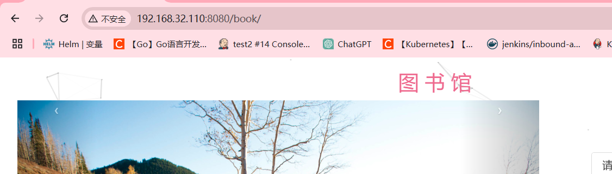
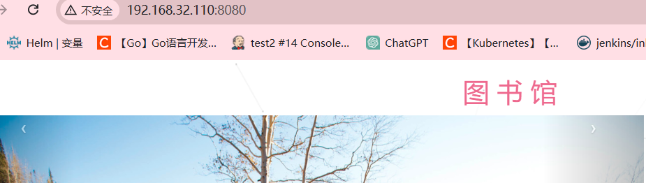
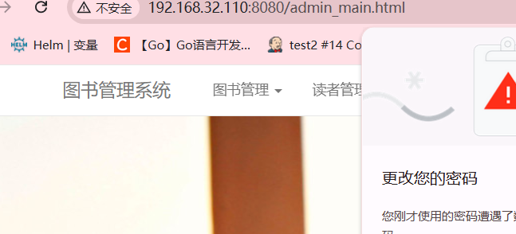
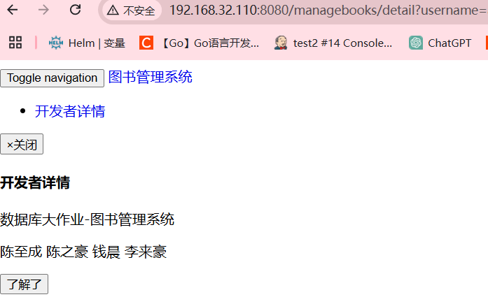

php  

```
java特点：一次编译 任意运行
	
hello.java  --->	hello.class  
						jvm：java的虚拟主机
java的运行环境：jre 


```

jdk: 

	oracle（官方）   java 8  java 11 java 17 java 21
	openjdk（开源）
	 php  ---》 php-fpm
	 类库 jsp----》tomcat

```
html 

<p> 
h1   ajax
xml  配置文件
<person name="jack">
   <hobby> basketball </hobby>
   <gender>
</person>


json  
 {
   "name": "jack",
   "hobby": ["basketball","football"]
   "gender": "female", 
   gf: {
     "name"
   }
 }

yaml  

name: jack
hobby

- basketball 
- football
  gf:
  name:
  hob

 获取代码  github   git 
 	git: 代码分支管理 
 		 获取代码
 		 提交代码
 编译构建   maven  下载依赖包
 部署tomcat 


spring mvc  tomcat  
springboot   

1 准备jdk环境 
2 准备mvn工具 
3 准备tomcat
代理地址 https://mirror.ghproxy.com/ 

项目地址： https://github.com/jacklightChen/ManageBooks  springboot  
项目地址： https://github.com/withstars/Books-Management-System
```

#### 安装java

```
[root@www ~]# tar -xf jdk-8u144-linux-x64.tar.gz -C /usr/local/
[root@www ~]# ln -s /usr/local/jdk1.8.0_144/ /usr/local/java
[root@www ~]# vi /etc/profile.d/java.sh
修改java环境
export JAVA_HOME=/usr/local/java
export PATH=$PATH:$JAVA_HOME/bin
[root@www ~]# source /etc/profile.d/java.sh 
编写一个java代码
[root@www ~]# vi  HelloWorld.java
public class HelloWorld {
    public static void main(String[] args) {
        System.out.println("Hello World!");
    }
}
[root@www ~]# javac HelloWorld.java 
[root@www ~]# java HelloWorld======运行
Hello World!

```

#### 安装tomcat：

>类库  jsp（类似于php语言）作用：将java代码嵌入到html css前端页面，跑起来需要运行环境----> 运行jsp这种代码就需要安装java服务器-----tomcat

```
[root@www ~]# tar -xf apache-tomcat-8.5.98-src.tar.gz -C /usr/local/
[root@www ~]# ln -s /usr/local/apache-tomcat-8.5.98-src/ /usr/local/tomcat
修改java中tomcat环境
[root@www ~]# vi /etc/profile.d/tomcat.sh
export CATALINA_HOME=/usr/local/tomcat
export PATH=$PATH:$CATALINA_HOME/bin
[root@www ~]# source /etc/profile.d/tomcat.sh 
启动：
[root@www local]# catalina.sh start
[root@www local]# netstat -taunp | grep 80 ====端口为8080
tcp6       0      0 :::8080                 :::*                    LISTEN      3717/java           
tcp6       0      0 127.0.0.1:8005          :::*                    LISTEN      3717/java 
浏览器中访问：http://192.168.18.11:8080/===出现汤姆猫默认页面
将自己写的jsp代码运行在tomcat中，默认页面在/usr/local/tomcat/webapps/ROOT/index.jsp
[root@www local]# vi /usr/local/tomcat/webapps/ROOT/hello.jsp
<%@ page language="java" contentType="text/html; charset=UTF-8" %>
<!DOCTYPE html>
<html>
<head>
    <meta http-equiv="Content-Type" content="text/html; charset=UTF-8">
    <title>JSP Test Page</title>
</head>
<body>
    <%-- JSP注释 --%>
    
    <!-- HTML注释 -->
    
    <%-- JSP脚本片段 --%>
    <% String message = "Hello World"; %>
    
    <%= message %><br/><!-- 输出变量值到HTML中 -->
    
    <%-- Java代码片段 --%>
    <% int num1 = 5;
       int num2 = 3;
       out.println("Sum of " + num1 + " and " + num2 + ": " + (num1+num2)); // 使用out对象打印结果到网页上
    %>
</body>
</html>
在浏览器中输入：http://192.168.18.11/hello.jsp出现jsp测试页面

```

#### 安装maven

> 部署java应用 manve部署工具，只要看到有pom.xml就可以编译构建

```
解压---符号链接---环境---更新环境----进入图书管理系统的/usr/local/mvn/conf/settings.xml添国内阿里云镜像仓库----编译构建（mvn clean package）会下载target目录，将book-1.0-XXX.war复制到/usr/local/tomcat/webapps/book.war
```

#### 编译构建：

```
部署java的war包和数据库连接在一起：
1、安装java8： 解压---符号链接---环境----更新环境（java -version）
2、安装jsp类库（安装tomcat）： git clone 代理服务器:图书馆系统ip地址
3、编译构建maven工具： 同1 ----进入图书系统----添加maven国内阿里云镜像（/usr/local/mvn/conf/settings.xml） ----mvn clean package----会生成target目录里面有war包---复制到/usr/local/tomcat/webapps/ROOT.war
4、连接数据库： 安装mariadb-server----创建数据库librarb+字符集-------将图书馆系统导入数据库mysql library  <  library.sql
```

#### java架构

>springboot和spring mvc tomcat

##### 1、部署springboot结构

```
springboot 不需要部署tomcat ，自带的tomcat
部署java的jar包+数据库
java -jar xxx.jar
连接数据库
```

##### 2、部署spring mvc 架构：

```
1、准备 jdk环境

2、准备maven工具

3、准备tomcat

spring mvc tomcat架构：  前后端在一起的.mvc相当于liunx的中的yum，把一些依赖包下载下来。spring mvc tomcat结构：拉取代码---编译构建---部署到tomcat
```

#### spring mvc架构实例：

```
步骤：
110服务器：
1、yum install git -y
2、下载java源码：
git clone https://mirror.ghproxy.com/https://github.com/withstars/Books-Management-System
3、编译构建：都写在Books的pop.xml里面，下载mvn工具
[root@www ~]# tar -xf apache-maven-3.8.8-bin.tar.gz -C /usr/local
[root@www ~]# ln -s /usr/local/apache-maven-3.8.8/ /usr/local/mvn
[root@www ~]# vi /etc/profile.d/mvn.sh
export MAVEN_HOME=/usr/local/mvn
export PATH=$PATH:$MAVEN_HOME/bin
[root@www ~]# source /etc/profile.d/mvn.sh
编译构建了：
[root@www ~]# cd Books-Management-System/
[root@www Books-Management-System]# ls
book.iml  library.sql  LICENSE  pom.xml  preview  README.md  src==看到pom.xml就可以编译构建了
mvn clean package ====下载速度慢，添加国内镜像仓库：
/usr/local/mvn/conf/settings.xml
mirror下添加：
<mirror>
  <id>aliyun</id>
  <mirrorOf>central</mirrorOf>
  <name>aliyun-central</name>
  <url>https://maven.aliyun.com/repository/public</url>
</mirror>
编译构建完成后会长生target目录，里面是一些压缩包，将这些压缩包复制到webapps里面就能够解压。
[root@www Books-Management-System]# cp target/book-1.0-SNAPSHOT.war /usr/local/tomcat/webapps/book.war
浏览器访问：192.168.32.110:8080/book/

将这个部署到根目录下面去：
[root@www webapps]# rm -rf book*
[root@www ~]# cp Books-Management-System/target/book-1.0-SNAPSHOT.war /usr/local/tomcat/webapps/ROOT.war
此时浏览器访问：192.168.32.110:8080会涉及到数据库的问题。

```







```
设计数据库问题解决：
[root@www Books-Management-System]# ls src/main/resources/book-context.xml 保存数据库的文件
 <bean id="dataSource" class="org.apache.commons.dbcp.BasicDataSource"
          destroy-method="close"
          p:driverClassName="com.mysql.jdbc.Driver"===jdbc为java连接数据库的驱动
		  p:url="jdbc:mysql://localhost:3306/library"
          p:username="root"
          p:password="0000"/>
[root@www ~]# yum install mariadb-server -y
[root@www ~]# systemctl start mariadb
MariaDB [(none)]> CREATE DATABASE IF NOT EXISTS `library` CHARACTER SET utf8 COLLATE utf8_general_ci;  ==创建数据库
导入数据库：[root@www Books-Management-System]# mysql library < library.sql

查看：mysql----show databases;-----use library;-----show tables;

授权用户和密码：MariaDB [library]> grant all privileges on *.* to 'root'@'localhost' identified by '0000'; 
MariaDB [library]> flush privileges;==刷新
MariaDB [library]> select * from admin;===保存的用户名和密码
+----------+----------+
| admin_id | password |
+----------+----------+
| 20170001 | 111111   |
+----------+----------+

登录图书馆系统：输入192.168.32.110:8080===输入账号和密码，然后跳转页面。
```




#### springboot架构实例：

> https://github.com/jacklightChen/ManageBooks.git

```
springboot：
1、拉取代码：
[root@www ~]# git clone https://mirror.ghproxy.com/https://github.com/jacklightChen/ManageBooks.git
2、编译构建：
[root@www ~]# cd ManageBooks/
[root@www ManageBooks]# ls
CONTENT.JPG  LICENSE  pom.xml  README.md  src 数据库DUMP.sql 需求.pdf ==看到pom.xml就可以编译
[root@www ManageBooks]# mvn clean package
[root@www ManageBooks]# ls target/
classes            maven-archiver  springbootdemo-0.0.1-SNAPSHOT.jar====jar包
generated-sources  maven-status    springbootdemo-0.0.1-SNAPSHOT.jar.original
这个jar包也默认监听在8080端口，先将calatina.sh stop 关掉

此时java -jar跑不起来，数据库没有开起来。
3、数据库：
root@www ManageBooks]# vi src/main/resources/application.yml 
编写一个jdbc的连接数据库的url
url: jdbc:mysql://localhost:3306/library?useUnicode=true&characterEncoding=UTF-8
        username: "root"
        password: "0000"
重新编译一下：mvn clean package
[root@www ManageBooks]# mysql -p< 数据库DUMP.sql===导入数据库 0000
Enter password: 0000
4、修改了文件，重新编译构建和删除之前的数据库
mysql -uroot -hlocalhost -p ====0000
drop database library
导入数据库： mysql -p < 数据库.sql  ===0000
重新编译： mvn clean package
[root@www ManageBooks]# java -jar target/springbootdemo-0.0.1-SNAPSHOT.jar
浏览器中输入： 192.168.32.110:8080和账号密码：admin_czc，123456
```




