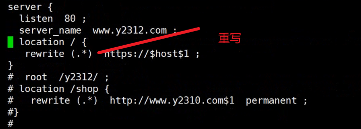
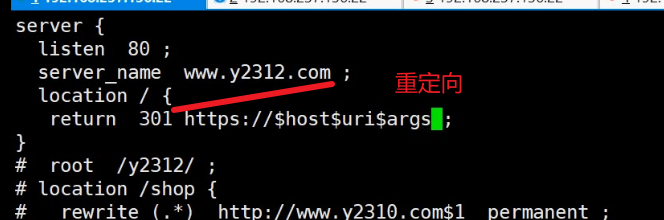
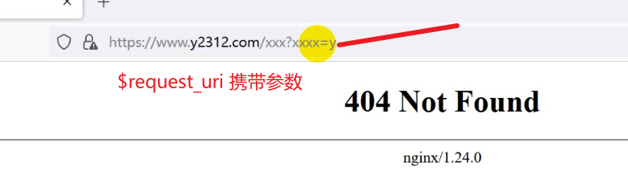
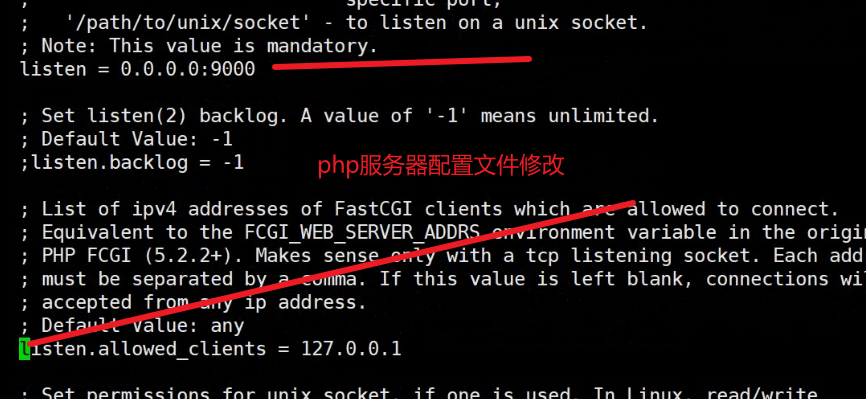

## nginx防盗链、反向代理、动静分离

#### 1、重写 Module ngx_http_rewrite_module	

 	break跳出rewrite和location
 	last  ==以上同一个server中（站点）
 	redirect  定位到另外一个server,临时重定向302
 	permanent 永久重定向301===以上两个在

```
[root@www ~]# vi /etc/nginx/conf.d/y2312.conf 
server {
 listen 80;
 server_name www.y2310.com;
 root /y2310/ ;
}

[root@www ~]# mkdir /y2310
[root@www ~]# echo "this is y2310 site" > /y2310/index.htnl
[root@www ~]# systemctl restart nginx
在浏览器中输入www.y2310.com会出现"this is y2310 site

shop这个从y2312迁移到y2310中
[root@www ~]# vi /etc/nginx/conf.d/y2312.conf 
location /shop {
  rewrite (.*) http://www.y2310.com$1 permanent|redirect;===永久重定向
 }

mkdir /y2310/shop
echo "this is y2310 shop" > /y2310/shop/index.html
systemctl restart nginx
在浏览器中输入www.y2312.com/shop会出现this is y2310 shop会出现301

```

#### 2、防盗链Module ngx_http_referer_module：

```
valid_referers none blocked server_names ==none自己合法输入的，blocked防火墙阻止的，server_names从那些站点跳转过来的，以上三个都是合法的。
               *.example.com example.* www.example.org/galleries/
               ~\.google\.;

if ($invalid_referer) {
    return 403;  ===不合法的就是返回403
}

解析域名
[root@www ~]# vi /etc/hosts
192.168.18.11 www.y2312.com

[root@www ~]# vi /y2310/index.html
<
在浏览器中输入www.y2310.com会出现li.jpeg

[root@www ~]# vi /y2312/index.html  在y2312中自己跳转自己


所有图片不都让白嫖
[root@www ~]# vi /etc/nginx/conf.d/y2312.conf 
 location ~* .*\.(jpeg|jpg|png|gif)$ {
  valid_referers none blocked server_names
               *.y2312.com y2312.* ~\.google\.;=====合法的允许访问
  if ($invalid_referer) {
    return 403;====不合法的
  }
在浏览器中输入www.y2312.com会出现li.jpeg
输入www.y2310.com不会出现li.jpeg(照片防盗了)

```

#### 3、多端响应，根据不同的设备响应不同的页面，匹配用户的请求头部

$http_user_agent

```

[root@www ~]# mkdir /y2310pc
[root@www ~]# mkdir /y2310mobile
[root@www ~]# echo "this is pc site" > /y2310pc/index.html
[root@www ~]# echo "this is mobile site" > /y2310mobile/index.html

server {
 listen 80;
 server_name www.y2310.com;
 set $rootdir /y2310pc/;
 if ($http_user_agent ~* (Android|iPhone)) {
   set $rootdir /y2310mobile/;
 }
 root $rootdir;
}


```


#### 4、https 证书和密钥  Module ngx_http_ssl_module

```
server {
        listen              443 ssl;
        keepalive_timeout   70;
        server_name         www.y2312.com ;
        ssl_protocols       TLSv1 TLSv1.1 TLSv1.2 TLSv1.3;
        ssl_ciphers         AES128-SHA:AES256-SHA:RC4-SHA:DES-CBC3-SHA:RC4-MD5;
        ssl_certificate     /etc/httpd/ssl/httpd.crt ;  ==重要的
        ssl_certificate_key /etc/httpd/ssl/httpd.key ;  ==重要的
        ssl_session_cache   shared:SSL:10m;
        ssl_session_timeout 10m;
        root     /y2312ssl ; ===站点
    }   
[root@www ~]# mkdir /y2312ssl
[root@www ~]# echo "this is y2312 ssl site" > /y2312ssl/index.html
[root@www ~]# systemctl restart nginx
[root@www ~]# netstat -taunp | grep 443
tcp        0      0 0.0.0.0:443             0.0.0.0:*               LISTEN      7558/nginx: master
在浏览器中输入：https://www.y2312.com/===会出现this is y2312 ssl site
但输入http://www.y2312.com===会出现li.jpeg这个图片，此时需要url重写
:set number给shell标注行号，此时4-32行不需要，注释掉4,32s@.*@#&@ig

===都要从/下面访问
 listen 80;
 server_name www.y2312.com;
 location / {
 rewrite (.*) https://$host$1 ;
}
[root@www ~]# systemctl restart nginx
在浏览器中输入http://www.y2312.com还是会出现https://www.y2312.com

```



#### 5、用户请求的参数$args和$uri

```
location / {
 return 301 https://$host$uri$args ;   301永久重定向
}
在浏览器中输入http://www.y2312.com还是会出现https://www.y2312.com

判断参数有没有传过来====$request_uri带有参数
location / {
 return 301 https://$host$request_uri ;   请求行中会要求带有参数?username=jack等
}

```

>$uri:为请求的路径，$args：为请求的参数
>
>$request_uri：为请求行中要求携带参数 xxx?username=jack





#### 6、 stub_status：查看服务状态

```
location /status {
         stub_status;
      }
在浏览器中输入：https://www.y2312.com/status会出现
Active connections: 1 
server accepts handled requests
 1 1 1 
Reading: 0 Writing: 1 Waiting: 0 

```

以上是静态资源


#### 7、反向代理Module ngx_http_proxy_module

==**proxy_pass**== 指的是请求的服务不提供服务，而是后面的服务提供服务，匹配后面的URL，或者是匹配后者的头部。（类似于端口映射）

资源不在代理期这边，而在后面的服务器上，客户端不能访问后面，而是通过代理器访问后面的服务器，但是客户端要访问代理器，代理器又没有这些资源，此时代理器将请求转发到后面的服务器，后端服务器得到这个消息在转发给代理器，代理器再讲这些转发给前面的客户端。

110（136代理器）

```
这台不提供图片只是调转，没有/images/,然后就代理到后端13（51服务器上）
 location ~* (jpeg|png|gif)$ {     <====/images/
    proxy_pass http://192.168.18.13(后端服务器)  <==  proxy_pass http://192.168.18.13 ;
        }
```

120（51服务器）==提供图片提供静态资源（后端服务器）

```
开启httpd服务
systemctl start httpd
[root@www ~]# cd /var/www/html/
[root@www html]# rz -E
rz waiting to receive.==将li.jpeg传过来


```


## 动静分离（资源分离），前后分离（代码分离）

#### 1、ngx_http_upstream_module：定义服务器组的

定义服务器组的==Module ngx_http_upstream_module只能写在http中

110（136）===此时充当代理器

```
[root@www ~]# vi /etc/nginx/nginx.conf 
 upstream imageserver { ===提供图片资源的服务器（主配置文件）
     server 192.168.18.13:80；
     server 192.168.18.200:80；
}
[root@www ~]# vi /etc/nginx/conf.d/y2312.conf   ===反向代理到这组服务器上（子配置文件）
location ~* (jpeg|png|gif)$ {
         proxy_pass http://imageserver ;
        }
[root@www ~]# systemctl restart nginx
在浏览器中输入https://www.y2312.com/li.jpeg

[root@www ~]# scp /etc/yum.repos.d/nginx.repo 192.168.18.13:/etc/yum.repos.d/
101: scp /images/li.jpeg 192.168.66.102:/var/www/html/
注意101（13）和102（200）中的li.jpeg图片不一样

以上为负载均衡
```

#### 2、Module ngx_http_fastcgi_module===**反向代理**（nginx不能提供动态页面，里面有静态资源图片等，通过fast_cgi做反向代理）

```
110（nginx服务器）
vi /etc/nginx/conf.g/y2312.conf
location ~ \.php$ {
        root           html;
        fastcgi_pass   192.168.32.120:9000;（php服务器）
        fastcgi_index  index.php;
        fastcgi_param  SCRIPT_FILENAME  /scripts$fastcgi_script_name;
        include        fastcgi_params;
    }

```

120==后端服务器（php服务器）

```
[root@www images]# scp li.jpeg 192.168.18.200:/var/www/html/
[root@www images]# vi /etc/php-fpm.d/www.conf ==修改配置文件
[root@www images]# systemctl restart php-fpm
[root@www images]# mkdir /scripts/
[root@www images]# vi /scripts/info.php
<?php
   phpinfo();
?>
```



>浏览器中输入：https://www.y2312.com/info.php出现php页面

**解析静态页面**：

```
解析静态页面：
110：
定义默认页面：
server{
...
 listen              443 ssl;
        keepalive_timeout   70;
        server_name         www.y2312.com ;
        index               index.php;  ===指定默认页面
有可能找不到index,php,使用try_files
 location / {
          try_files $uri $uri/index.php;
      }
   }
101：（动静分离）
[root@www images]# tar -xf  wordpress-3.3.1-zh_CN.tar.gz -C /scripts/
[root@www images]# ls /scripts/
info.php  wordpress
[root@www images]# systemctl restart php-fpm
yum install php-mysqlnd -y
[root@www images]# mv /scripts/wordpress/* /scripts/
[root@www images]# rm -rf /scripts/wordpress/
在浏览器中输入：https://www.y2312.com/会出现wordpress页面，但是样式没有

yum install nginx -y 
[root@www images]# mv /etc/nginx/conf.d/default.conf /etc/nginx/conf.d//default.conf.bak
[root@www images]# vi /etc/nginx/conf.d/y2312.conf
server {
 listen 8091 ;
 root /imgroot/ ;
}

[root@www images]# vi /etc/nginx/conf.d/y2312.conf 
server {
 listen 8092 ;
 root /cssroot/ ;
}


```


110：

```
[root@www ~]# vi /etc/nginx/conf.d/y2312.conf 11（136）
location ~ \.php$ {
          root           html;
          fastcgi_pass   192.168.18.13:9000;===修改，此时13服务器是后端服务器，存放了php页面，提供了动态资源。
          fastcgi_index  index.php;
          fastcgi_param  SCRIPT_FILENAME  /scripts$fastcgi_script_name;
          include        fastcgi_params;

[root@www ~]# vi /etc/nginx/nginx.conf 
 upstream imageserver {
     server 192.168.18.13:8091;

vi /etc/nginx/conf.d/y2312.conf
location ~ \.css$ {
  proxy_pass http://192.168.66.101:8092
}
```

```
13：提供php动态页面
yum install php-fpm
mkdir /scripts
vi scritps/info.php
<?php
	phpinfo();
?>
```


