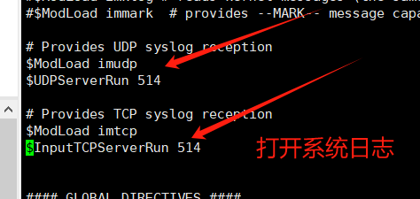
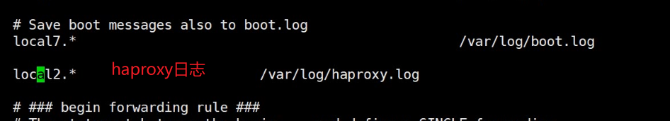
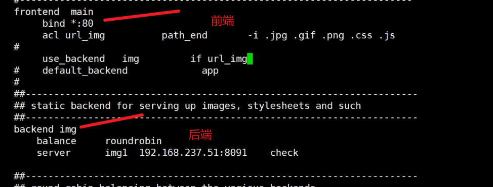
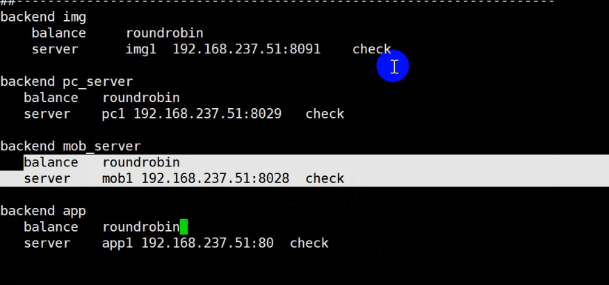
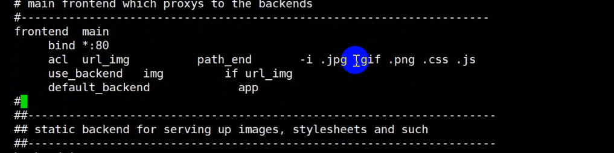

## haproxy配置

#### haproxy知识点

```
nginx可以做 web服务器、 调度器
haproxy 只能做调度器，支持四层调度（tcp），也支持7层调度（http https）

haproxy配置：
	全局配置：
	默认配置：（主要是代理）
	前端配置：监听的端口，交给后端front——end
	后端配置
proxy 配置段 
defaults [<name>] #默认配置项，针对以下的frontend、backend和listen生效，可以多个name也可
以没有name
	frontend <name>   #前端servername，类似于Nginx的一个虚拟主机 server和LVS服务集群。
	backend <name>   #后端服务器组，等于nginx的upstream和LVS中的RS服务器
	listen   <name>   #将frontend和backend合并在一起配置，相对于frontend和backend配置更简洁，生产常用
haproxy没有日志，在系统日志里面打开设置：
系统日志： /etc/rsyslog.conf
打开系统日志+添加haproxy日志
local2.*                       /var/log/haproxy.log
[root@www ~]# systemctl restart rsyslog|haproxy
[root@www ~]# ss -taunp | grep 514
```






```
chroot #锁定运行目录
deamon #以守护进程运行
user, group, uid, gid  #运行haproxy的用户身份
nbproc   n #开启的haproxy worker 进程数，默认进程数是一个
cpu-map 1 0   #绑定haproxy worker 进程至指定CPU，将第1个work进程绑定至0号CPU
cpu-map 2 1     #绑定haproxy worker 进程至指定CPU，将第2个work进程绑定至1号CPU
maxconn n      #每个haproxy进程的最大并发连接数
maxsslconn n   #每个haproxy进程ssl最大连接数,用于haproxy配置了证书的场景下
maxconnrate n   #每个进程每秒创建的最大连接数量
pidfile #指定pid文件路径
log 127.0.0.1 local2 info #定义全局的syslog服务器；日志服务器需要开启UDP协议，最多可以定
义两个
haproxy全局配置：

```

#### haproxy全局配置：

```
vi /etc/haproxy/haproxy.cnf

1.开启worker进程数量：nbproc
nbproc 4 ==开启进程数量为4个
[root@www ~]# ps -aux | grep haproxy   ===查看进程数量

2.绑定cpu
cpu-map 1 0   #绑定haproxy worker 进程至指定CPU，将第1个work进程绑定至0号CPU
cpu-map 2 1     #绑定haproxy worker 进程至指定CPU，将第2个work进程绑定至1号CPU
```

#### haproxy默认配置：

```
haproxy默认配置：
defaults 

mode http|tcp #设置默认工作类型,使用TCP服务器性能更好，减少压力
timeout http-keep-alive 120s #session 会话保持超时时间，此时间段内会转发到相同的后端服务器
timeout connect 120s #客户端请求从haproxy到后端server最长连接等待时间(TCP连接之前)，默认单位ms
timeout server 600s #客户端请求从haproxy到后端服务端的请求处理超时时长TCP连接之后认单位ms，如果超时，会出现502错误，此值建议设置较大些，访止502错误
timeout client 600s #设置haproxy与客户端的最长非活动时间，默认单位ms，建议和timeout server相同
timeout check   5s   #对后端服务器的默认检测超时时间
default-server inter 1000 weight 3   #指定后端服务器的默认设置
先注释：表示当前到下面全部注释
.,$s@.*@#$@ig

110服务器：
default中注释 保持连接数
listen  
listen y231280 
   bind *:80  
   mode http
   balance roundrobin 调度算法
   option forwardfor  插入一个头部
   server web1   192.168.32.130:8082   check inter 1000 fall 3 rise 2  ==check inter 1000检查频率为1s
   server web2   192.168.32.130:8081   check inter 3000 fall 3 rise 5

120服务器：
vi /etc/nginx/conf.d/y2312.conf
server {
 listen 8082;
 root /node1/;
}

server {
 listen 8081;
 root /node2/;
}
[root@localhost ~]# echo "this is node1" > /node1/index.html
[root@localhost ~]# echo "this is node2" > /node2/index.html
浏览器中输入：192.168.66.110会出现node1和node2（采用轮询算法）
```

#### haproxy之server配置：

```
server 配置  
#针对一个server配置
check #对指定real进行健康状态检查，如果不加此设置，默认不开启检查,只有check后面没有其它配置也可以启用检查功能
 #默认对相应的后端服务器IP和端口,利用TCP连接进行周期性健康性检查,注意必须指定
端口才能实现健康性检查
 addr <IP>   #可指定的健康状态监测IP，可以是专门的数据网段，减少业务网络的流量
 port <num> #指定的健康状态监测端口
 inter <num> #健康状态检查间隔时间，默认2000 ms
 fall <num>   #后端服务器从线上转为线下的检查的连续失效次数，默认为3
 rise <num>   #后端服务器从下线恢复上线的检查的连续有效次数，默认为2
weight <weight> #默认为1，最大值为256，0(状态为蓝色)表示不参与负载均衡，但仍接受持久连接
backup #将后端服务器标记为备份状态,只在所有非备份主机down机时提供服务，类似Sorry Server
disabled #将后端服务器标记为不可用状态，即维护状态，除了持久模式，将不再接受连接,状态为深黄色,优雅下线,不再接受新用户的请求
maxconn <maxconn> #当前后端server的最大并发连接数

常见调度算法 
balance roundrobin|leastconn|source|uri(相同ip访问会调度在同一台服务器中)|hdr（User-Agent相同的头部始终调度在同一台服务器中）

cookie name [ rewrite | insert | prefix ][ indirect ] [ nocache ][ postonly ] [ preserve ][ httponly ] [ secure ][ domain ]* [ maxidle <idle> ][ maxlife ]
name： #cookie 的 key名称，用于实现持久连接
insert： #插入新的cookie,默认不插入cookie
indirect： #如果客户端已经有cookie,则不会再发送cookie信息
nocache： #当client和hapoxy之间有缓存服务器（如：CDN）时，不允许中间缓存器缓存cookie，因为这会导致很多经过同一个CDN的请求都发送到同一台后端服务器


110服务器 基于cookid的哈希：相同的cookie始终调度到相同的服务器里面
listen web_port
 bind 10.0.0.7:80
 balance roundrobin
 mode http #不支持 tcp mode
 log global
 cookie WEBSRV insert nocache indirect <===基于cookie
 server web1  10.0.0.17:80 check inter 3000 fall 2 rise 5 cookie web1 
 server web2  10.0.0.27:80 check inter 3000 fall 2 rise 5 cookie web2
浏览器中输入：192.168.66.110会出现node1 检查---内存可以修改cookie的web2就会出现node2
注意：cookie算法，相同的cookie始终调度在同一台服务器中。

hdr（[<name> [，<occ>]]）：完全匹配字符串,header的指定信息，<occ> 表示在多值中使用的值的出
现次数
hdr_beg（[<name> [，<occ>]]）：前缀匹配，header中指定匹配内容的begin
hdr_end（[<name> [，<occ>]]）：后缀匹配，header中指定匹配内容end
hdr_dom（[<name> [，<occ>]]）：域匹配，header中的domain name
hdr_dir（[<name> [，<occ>]]）：路径匹配，header的uri路径
hdr_len（[<name> [，<occ>]]）：长度匹配，header的长度匹配
hdr_reg（[<name> [，<occ>]]）：正则表达式匹配，自定义表达式(regex)模糊匹配
hdr_sub（[<name> [，<occ>]]）：子串匹配，header中的uri模糊匹配
```

#### haproxy之动静分离：

```
110服务器（调度器）：
frontend  main  （前端）
     bind *:80
     acl url_img  path_end  -i .jpg .gif .png .jpeg .css .js
     acl pc_hdr   hdr_sub(User-Agent)  -i windows 响应头部
     acl mob_hdr  hdr_sub(User-Agent)  -i iPhone Android
     use_backend  img  if url_img
     use_backend  pc_server  if pc_hdr
     use_backend  mob_server if mob_hdr

后端：
backend img（取名）
    balance     roundrobin调度算法
    server      img1   192.168.66.101:8091 check

backend pc_server
    balance     roundrobin
    server   pc1 192.168.66.101:8029 check

backend mob_server
    balance     roundrobin
    server   mob1 192.168.66.101:8028 check
    
101服务器：
vi /etc/nginx/conf.d/y2312.conf
server {
 listen 8082;
 root /node2/;
}

server {
 listen 8029;
 root /pcroot/;
}

server {
 listen 8028;
 root /mobroot/;
}
[root@node1 ~]# mkdir /pcroot
[root@node1 ~]# mkdir /mobroot
[root@node1 ~]# echo "this is pc root" > /pcroot/index.html
[root@node1 ~]# echo "this is mob root" > /mobroot/index.html
[root@node1 ~]# systemctl restart nginx

浏览器中输入：192.168.66.110会出现pc 改为手机端为手机端会出现 mob root
```



#### haproxy反向代理：

##### 后端服务器：

```
后端服务器：
yum install php php-mysqlnd -y
tar -xf wordpress..tar 
cp -r wordpress/.* /var/www/html/
站点根目录有index.php wordpress
浏览器中输入：后端服务器的ip/index.php  ====>出现php的页面
```

##### haproxy调度器：

```
vi /etc/haproxy/haproxy.cnf
...
backend app
  balance roundrobin
  server app1 192.168.66.50(后端服务器) check
  
frontend main 
  default_backend   app
```






```
浏览器中输入：haproxy的ip出现wordpress页面
```

