### 一、centos9中安装ceph集群

#### 1、使用cephadm创建集群

> 安装软件：
>
> dnf install -y snappy leveldb gdisk gprtftools-libs podman

```
node1 /etc/ceph> cephadm bootstorap --mon-ip 192.168.66.101
```

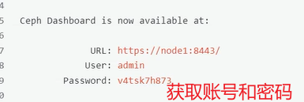

**配置ceph源**

```
vi /etc/yum/repos.d/ceph.repo
[ceph]
name=Ceph repository - Tsinghua
baseurl=https://mirrors.tuna.tsinghua.edu.cn/ceph/rpm-reef/e19/x86_64/
enabled=1
gpgcheck=1
gpgkey=https://mirrors.tuna.tsinghua.edu.cn/ceph/keys/release.asc

```


登录ceph web界面：

> https://192.168.66.101:8443/#/dashboard

#### 2、**密码重置**：

```
node1> echo "admin" > /tmp/admin_pass.txt
node1> ceph dashboard set-login-credentials admin -i /tmp/admin_pass.txt
node1> rm -f /tmp/admin_pass.txt
```

#### 3、节点上安装ceph-common

```
node1> dnf install ceph-common -y
检查集群状态
node1> ceph -s
```

#### 4、添加OSD节点

把集群公钥复制到各个节点中

```
node1> ssh-copy-id -f -i /etc/ceph/ceph.pub root@node2
node1> ssh-copy-id -f -i /etc/ceph/ceph.pub root@node3
node1> ssh-copy-id -f -i /etc/ceph/ceph.pub root@node4
```

添加节点node2、node3、node4（各节点要先安装python3，podman）

```
node1> ceph orch host add node2 192.168.66.102
node1> ceph orch host add node3 192.168.66.103
node1> ceph orch host add node4 192.168.66.104

node1> ceph orch host ls
```

注：如果操作错了

```
ceph orch host rm node2
```

给node1、node4打上管理员标签，拷贝ceph配置文件和keyring到node4

```
node1> ceph orch host label add node1 _admin
node1> ceph orch host label add node4 _admin
node1> scp /etc/ceph/{*.conf,*.keyring} root@node4:/etc/ceph
node1> ceph orch host ls
```

#### 5、配置管理节点（MGR）

```
node1> ceph orch apply mgr --placement="node1,node2,node3"
```

作用：用来安装、配置、管理和监控ceph集群，运行ceph命令，dashboard、集群编排等管理操作。

特点：通常是你登录运维操作的节点，可以与其他服务节点共用（如mon，mgr），也可以单独设立。

不是ceph集群核心组件，但对日常维护必不可少。

#### 6、配置监控节点（MON）

```
node1> ceph orch apply mon "node1,node2,node3"
```

作用：负责维护集群的健康状态、监控集群各节点服务，并保存集群的元数据（如集群成员，认证信息，服务状态），时ceph集群的大脑。

特点：至少需要1个（生产建议3个奇数个），所有客户端、OSD、MGR等组件都要和MON通信，保障集群一致性和高可用。

#### 7、创建存储池（OSD）

注意：不同的VMware版本，可能添加磁盘时，产生的磁盘名称不一致

VMware16中

第一块盘：sdb | sdc | sdd

VMware17

第一块盘：sda| sdb | sdc

具体添加盘对应的设备名称可以通过`lsblk`查看

```
node1> ceph orch daemon add osd node1:/dev/sdb
node1> ceph orch daemon add osd node1:/dev/sdc
node1> ceph orch daemon add osd node1:/dev/sdd
#node2、node3、node4同理，也可以是一下循环添加
node1> for i in node1 node2 node3;do for j in sdb sdc sdd; do ceph orch daemon add osd $1:/dev/$j; done; done
```

如果磁盘无法添加报错，提示磁盘非空，可以考虑使用如下脚本清理所有磁盘：disk_clean.sh

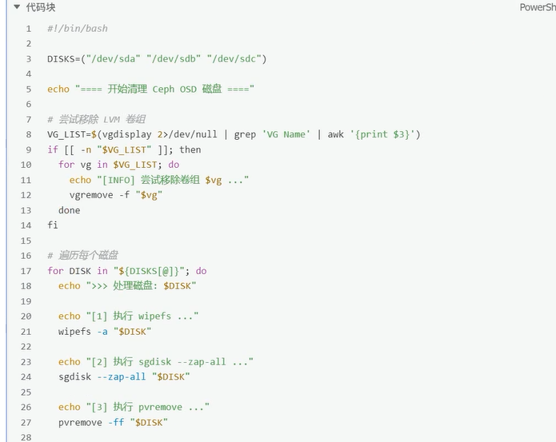

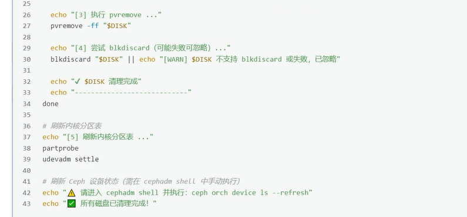

登录ceph web界面：

> https://192.168.66.101:8443/#/dashboard

### 二、集群节点扩容方法：

假设再加一个新的集群节点node5

1、主机名配置和绑定

2、安装必备软件dnf install -y snappy leveldb gdisk gperftools-libs padman

3、配置免密以及拷贝集群证书到node5

```
node1> ssh-copy-id -i -f /etc/ceph/ceph.pub root@node5
node1> scp /etc/ceph/{ceph.conf,ceph.client.admin.keyring} root@node4:/etc/ceph
```

4、在node1服务器，将node5添加到集群中

```
ceph orch host add node5 192.168.66.105
ceph orch host label rm node5 _no_schedule
ceph orch host label rm node5 _no_conf_keyring

注意：
ceph orch host label rm node5_no_schedule
移除节点node5上的特殊标签 _no_schedule
标签 _no_schedule 表示禁止在这个节点上调度部署新的守护进程或服务
移除此标签意味着允许 Ceph 在节点node5上部署或者调度扶额u和守护进程

ceph orch host label rm node5 _no_conf_keyring
移除系欸但node5上的特殊标签 _no_conf_keyring
标签 _no_conf_keyring 表示不会自动在该节点上部署ceph 配置文件和认证密钥环
移除此标签以为这允许ceph 自动将配置文件和密码环分发到节点node5，以便节点能正常加入集群并运行ceph服务。
```

5、按需求选择在node5上添加mon或mgr或osd等

```
node1> ceph orch apply mon "node1,node2,node3,node4,node5"
node1> ceph orch apply mgr --placement="node1,node2,node3,node4,node5"
node1> ceph orch daemin add osd node5:/dev/sda
#如果这个机器上由多个磁盘，可依次添加
#node1> ceph orch daemin add osd node5:/dev/sdb
#node1> ceph orch daemin add osd node5:/dev/sdc

node1> scp /etc/ceph/{ceph.conf,ceph.client.admin.keyring} root@node5:/etc/ceph

```

### 三、集群节点的缩容方法：

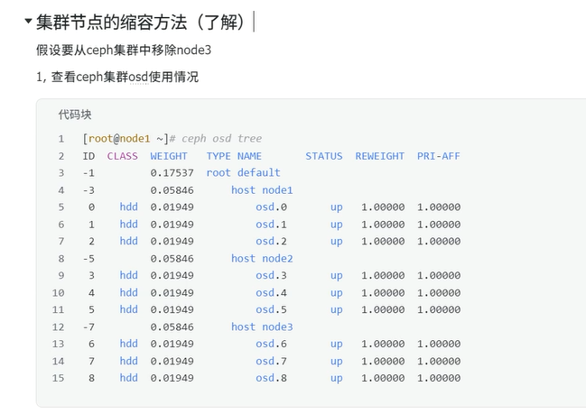

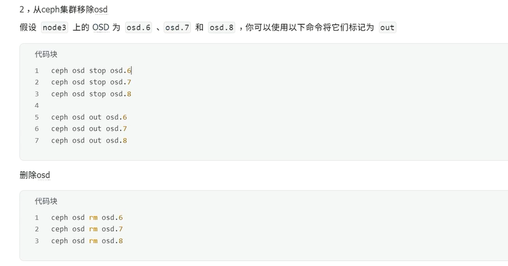

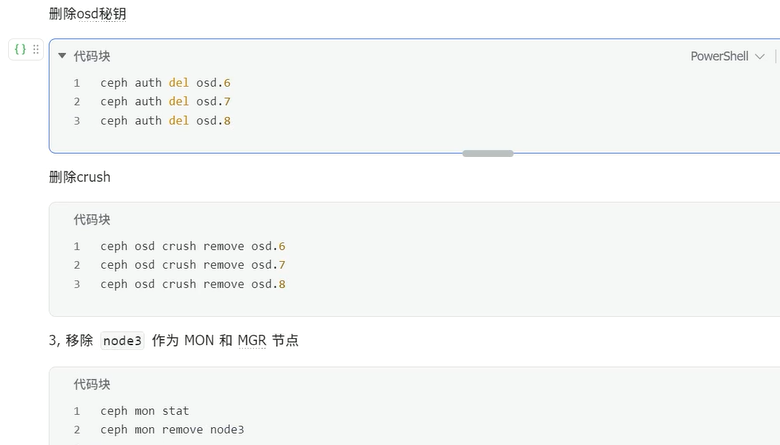

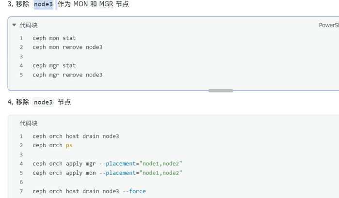

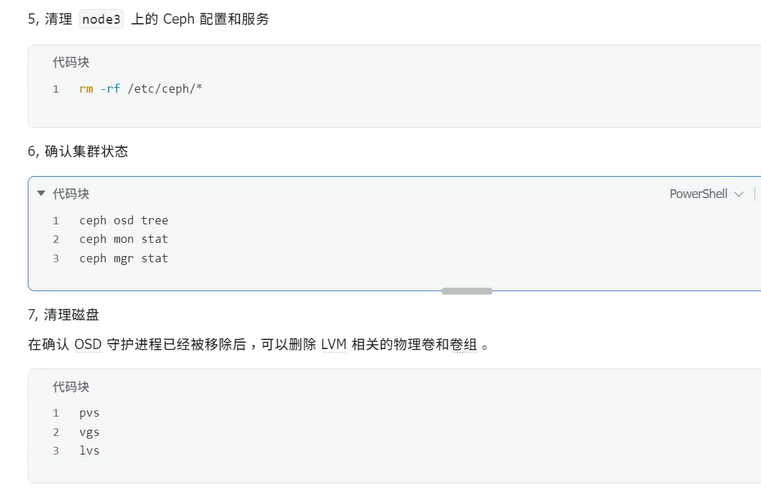

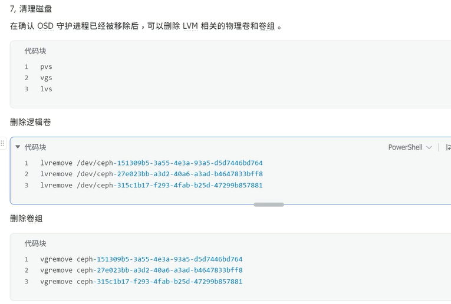

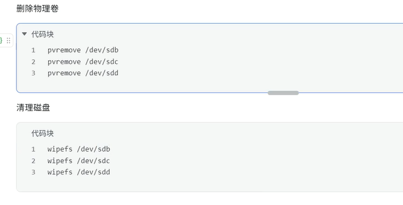

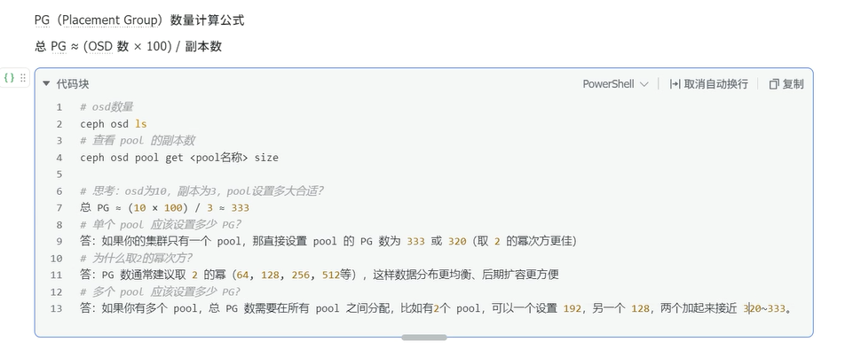

### 四、创建ceph文件存储

在所有操作系统中，文件通常分为两部分：①数据（文件具体内容）②元数据（文件目录结构、权限、属性）

---

在ceph集群中，MDS（Metadata Server）是负责管理ceph文件系统（CephFS）元数据的服务，负责处理文件系统的目录结构、文件操作等元数据相关的任务。要部署MDS服务，一下是使用cephadm部署MDS的步骤。

#### 1、创建文件存储并使用

##### 1、查看ceph集群状态

```
node1 ceph> ceph -s
```

##### 2、创建ceph文件系统数据池和元数据池

为了运行ceph文件系统（CephFS），需要至少两个RADOS池，一个用于数据（data pool），另一个用于元数据（metadata pool）

实际数据与元数据，对应的PG数量对比，一般建议2/1、4/1、8/1

数据仓库：128个

元数据仓库：32个或16个（除以4或者8得到的结果）

比如一个文件128MB，但是元数据（文件目录结构、权限、属性）=> 16MB

创建数据池和元数据池

```
node1 ceph> ceph osd pool create cephfs_data 128
node1 ceph> ceph osd pool create cephfs_metadata 64

#查看池是否创建成功
node1 ceph> ceph osd pool ls

```

##### 3、创建ceph文件系统，并确认客户端访问节点

基本语法：

ceph fs new <文件系统名称> cephfs_metadata cephfs_data

```
node1 ceph> ceph fs new cephfs cephfs_metadata cephfs_data

node1 ceph> ceph fs ls

node1 ceph> ceph health detail

```

##### 4、创建mds服务

```
ceph orch apply mds cephfs
ceph mds stat
```

cepgfs 文件系统已经有一个MDS守护进程在运行并处于active状态。

另一个MDS守护进程处于standby状态，表示它已经其发动，但目前部署主工作节点。

我们也可以调整mds数量

```
增加备用节点：
node1 ceph> ceph fs set cephfs max_mds 3
node1 ceph> ceph fs set cephfs standby_count_wanted 1
node1 ceph> ceph prch apply mds cephfs --placement="node1,node2,node3"
```

> ceph fs set cephfs max_mds 3这个命令的作用是将文件系统cephfs的max_mds参数设置为3，允许最多启动3个MDS守护进程。这本身是修改ceph配置文件的操作，不会力气部署新的的MDS守护进程。

##### 5、客户端准备验证key文件

- 说明：ceph默认启用了cephx认证，所以客户端的股灾必须要验证

在集群节点（node1，node2，node3）上任意一台查看密钥字符串

```
node1 ceph> cat /etc/ceph/ceph.client.admin.keyring
[client.admin]
		key= AFSDJVSDHSF===
		....
```

在客户端上创建一个文件记录密钥字符串

```
client> vi admin.key
AFSDJVSDHSF===
```

##### 6、客户端挂载（挂载ceph集群中跑了mon监控节点，mon监控为6789端口）

```
client> mount -t ceph node1:6789:/ /mnt -o name=admin,secretfile=/root/admin.key
```

##### 7、验证

```
client> df -h |tail -1
192.168.66.101:6789:/ 	57G 	0	57G		0% 		/mnt #大小不用在意，场景不一样，pg数不一样，副本数都会影响

```

如果验证读写请自行验证

可以使用两个客户端，同时挂载此文件存储，可实现同读同写

#### 2、删除文件存储方法

如果需要删除文件存储，请按下面操作过程来操作

##### 1、在客户端上删除数据，并umount所有挂载

```
client> rm /mnt/* -rf
client> umount /mnt/
```

##### 2、回到集群任意一个节点上（node1，node2，node3其中之一）删除

```
client> ceph fs rm cephfs --yes-i-really-mean-it
client> ceph osd pool delete cephfs_metadata cephfs_metadata --yes-i-really-really-mean-it
client> ceph osd pool delete cephfs_data cepgfs_data --yes-i-really-really-mean-it
client> ceph osd pool delete cephfs_pool cephfs_pool --yes-i-really-really-mean-it
```

### 五、创建ceph块存储

#### 1、创建块存储并使用

##### 1、在node1同步配置文件到client节点上

```
node1 ceph> scp /etc/ceph/{*.conf,*.keyring} root@client:/etc/ceph
```

##### 2、建立存储池，并初始化

**注意**：在客户端操作

```
client> ceph osd pool create rbd_pool 128
client> rdb pool init rbd_pool
```

##### 3、创建一个存储卷（卷名volume1，大小为5000M）

**注意**：volume1的专业术语为image，这里叫存储卷

```
client> rdb create volume1 --pool rbd_pool --size 5000
client> rdb ls rbd_pool
client> rdb info volume1 -p rbd_pool
```

##### 4、将创建的卷映射成块设备

```
client> rdb map rbd_pool/volume1
```

##### 5、查看映射（如果要取消映射，可以使用rdb unmap /dev/rbd0）

```
client> rdb showmapped
```

##### 6、格式化，挂载

```
client> mkfs.xfs /dev/rbd0
client> mount /dev/rbd0 /mnt/
client> df -h|tail -1
```

可自行验证读写

**注意**：块存储是不能实现同读同写的，请不要两个客户端同时挂载进行读写

#### 2、块存储扩容与裁剪

##### 1、**在线扩容**

经测试，分区后/dev/rbd0p1不能在线扩容，直接使用`/dev/rbd0`才可以

```
扩容成8000M
client> rbd resize --size 8000 rbd_pool/volume1
client> rbd info rbd_pool/volume1 |grep size
查看大小并没有变化
client> df -h|tail -1
client> xfs_growfs -d /mnt/
再次查看大小，在线扩容成功
client> df -h|tail -1
/dev/rbd0 	7.9G	33M		7.9G	1%	/mnt
```

##### 2、**块存储裁剪**

不能在线裁剪，裁剪后需要重新格式化在挂在，所以请提前备份好数据

```
再裁剪回5000M
client> rbd resize --size 5000 rbd_pool/volume1 --allow-shrink
重新格式化挂载
client> umount /mnt/
client> mkfs.xfs -f /dev/rbd0
client> mount /dev/rbd0 /mnt
再次确认，确认裁剪成功
client> df -h| tail -1
```

##### 3、删除块存储方法

```
client> umount /mnt/
client> rbd unmap /dev/rbd0
client> ceph osd pool delete rbd_pool --yes-i-really-really-mean-it
```

### 六、ceph对象存储

#### 1、测试ceph对象网关的连接

##### 1、再node1上创建rgw

```
node1 ceph> ceph orch apply rgw myrealm myzone --placement="node1"
注意：默认端口为80，如果需要修改可以参考如下方式
ceph orch apply rgw myrealm myzone --placement="node1" --port=7480
myrealm（领域）就像一个大范围的名字，代表一套对象存储的大环境，比如整个公司或者整个项目的存储系统。
myzone（区域）是一个大环境里面的一个小区域，比如某个具体的数据中心或者机房，用来实际放RGW的地方。
noce1> ceph -s
node1> ceph osd pool ls

```

##### 2、再客户端测试连接对象网关

```
node1> radosgw-admin user create --uid=s3 --display-name="object_storage" --system|grep -E "access.key|secret.key"   ===>上面一段主要获取access.key和secret.key，用于连接对象存储网关

```

#### 2、S3连接ceph对象网关

Amazon S3是一种面向Internet的对象存储服务，我们这里可以使用s3工具连接ceph的对象存储进行操作

##### 1、客户端安装s3cmd工具，并编写ceph连接配置文件

```
client> yum install s3cmd -y
#创建并编写下面的文件，key文件对应前面创建测试用户的key
cilent> s3cmd --configure
```

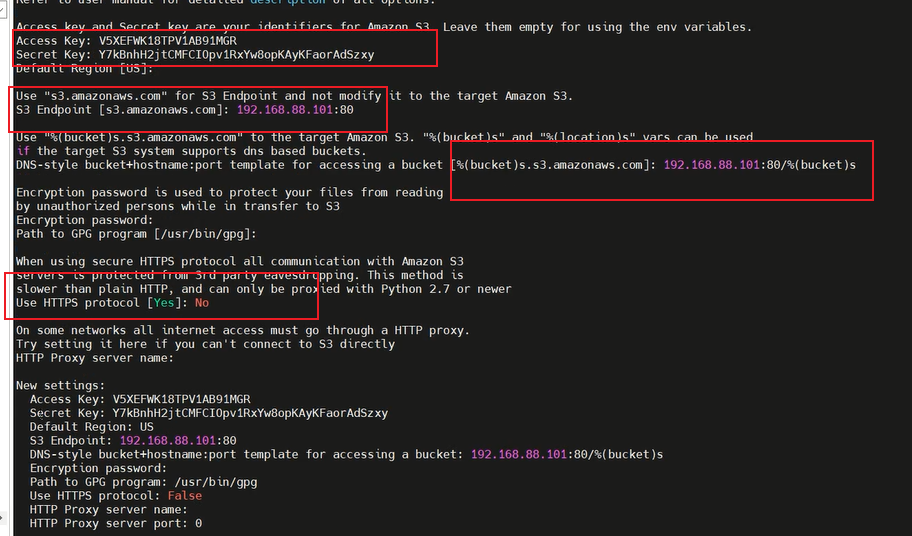

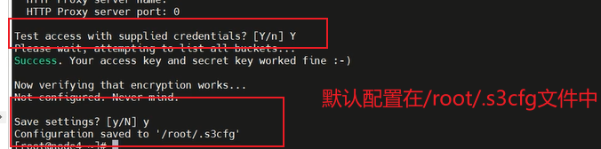

##### 2、命令测试

```
#查看是否有bucket
client> s3cmd ls
#新建一个bucket桶
client> s3cmd mb s3://test_bucket
#上传文件到桶
client> s3cmd put /etc/fstab s3://test_bucket
#下载到当前目录
client> s3cmd get s3://test_bucket/fstab
#更多命令请见命令帮助
client> s3cmd --help
```

### 七、项目部署实践：ceph+nextcloud打造私有云盘

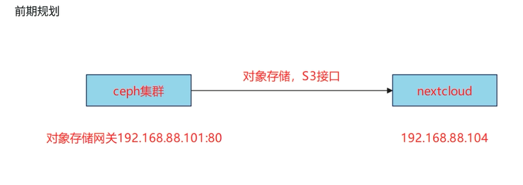

#### 1、创建bucket

在ceph的客户端上准备bucket和相关的连接key

```
client> s3cmd mb s3://next_cloud
client> cat /root/.s3cfg
[default]
...
access_key = xxxx
secret_key = xxxx
...

```

#### 2、nextcloud环境准备

在client端安装nextcloud云盘运行所需要的web环境

nextcloud需要web服务器和php支持，目前最新版本nextcloud需要php8.x版本，在这里我们为了节省事件，使用rpm版安装

```
client> dnf install -y epel-release
client> dnf module reset php -y
client> sudo dnf module enable php:8.2
client> yum install httpd mod_ssl php-mysqlnd php php-gd php-xml php-mbstring php-pecl php-intl php-process php-imagick -y
client> systemctl restart httpd
```

#### 3、部署nextcloud

上传nextcloud软件包，并解压到httpd家目录

```
client> mget https://download.nextcloud.com/server/releases/latest.tar.tar.gz2
client> tar -xf latest.tar.bz2 -C /var/www/html/
client> chmod apache:apache -R /var/www/html/
#需要修改为运行web服务器的用户owner,group,否则后面写入会出现权限问题。
```

> 浏览器中输入:192.168.66.104/nextcloud

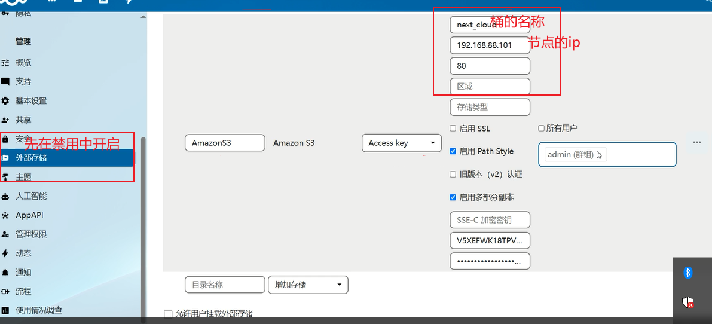