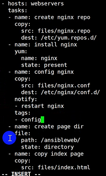
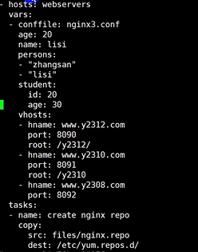
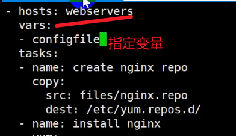
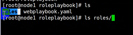

```
ansible：远程部署工具 基于ssh协议
​	资产清单“：/etc/ansible/hosts
​	[组名] [webservers]
​	ip地址 192.168.18.11 被控制的主机

模块：
​		ping
​		command 远程命令
​		shell
​		copy 复制
​		file： state=file|directory|link|hard|absent 文件
​		yum | apt 安装
​		service 服务开启还是关闭
```

#### 一、playbook安装nginx:

> 类似于脚本 重复执行 批量执行里面的指令、模块

```
13：主服务器
[root@www ~]# mkdir y2312palybook
[root@www ~]# cd y2312palybook/
vi test.yaml
- hosts: webservers  ----那些主机来执行
  tasks:
  - name: test connectity
    ping: ""   ====测试连通性
[root@www y2312palybook]# ansible-playbook test.yaml

nginx仓库：===
提供仓库配置文件：
[root@www y2312palybook]# mkdir files   ====存放nginx的配置文件
vi files/nginx.repo
[nginx-stable]
name=nginx stable repo
baseurl=http://nginx.org/packages/centos/$releasever/$basearch/
gpgcheck=0
enabled=1

提供nginx配置文件：
vi files/nginx.conf
server{
 listen 8090 ;
 root /ansibleweb/ ;
}

写剧本 vi test.yaml：
- hosts: webservers
  tasks:
  - name: create nginx repo
    copy:
      src: files/nginx.repo
      dest: /etc/yum.repos.d/
  - name: install nginx
    yum:
      name: nginx
      state: present
  - name: config nginx   ===nginx的配置文件
    copy:
      src: files/nginx.conf
      dest: /etc/nginx/conf.d/
  - name: mkdir page dir  ===创建目录
    file:
      path: /ansibleweb/
      state: directory
  - name: start nginx
    service:
      name: nginx
      state: started
[root@www y2312palybook]# ansible-playbook test.yaml
提供页面：
vi files/index.html
<h1> this is ansible page </h1>

====test.yaml中增加页面
- name: copy index nginx
    copy:
      src: files/index.html
      dest: /ansibleweb/
[root@www y2312palybook]# ansible-playbook test.yaml==查看是否改变
浏览器中访问：192.168.18.11：8090

改变端口：8091
vi files/nginx.conf

[root@www y2312palybook]# ansible-playbook test.yaml

提供重新启动的命令
vi test.yaml
- name: restart nginx
    service:
      name: nginx
      state: restarted
要求配置文件发生改变才要重新启动nginx：
- name: config nginx
    copy:
      src: files/nginx.conf
      dest: /etc/nginx/conf.d/
    notify:========通知配置文件改变才重启
    - restart nginx
    tags:======打个标签，到时候自己选择执行那个任务
    - config 
  - name: mkdir page dir
    file:
      path: /ansibleweb/
      state: directory
  - name: copy index nginx
    copy:
      src: files/index.html
      dest: /ansibleweb/
  - name: start nginx
    service:
      name: nginx
      state: started
  handlers:=====触发器，配置文件发生改变了就重启
  - name: restart nginx
    service:
     name: nginx
     state: restarted
[root@www y2312palybook]# ansible-playbook -t config test.yaml ===指定这个标签

```






```
查看结果：
11：
netstat -taunp | grep 8090

```

#### 二、playbook：接受变量，定义变量

##### 1、资产配置清单里面

> 例如：这边主机安装nginx，另外一台安装httpd，此时可以再资产清单（/etc/ansible/hosts）上面定义变量，安装不同的应用。定义变量可以下载资产清单里面

```
13：
vi /etc/ansible/hosts
[webservers]
192.168.18.11 pkg=httpd    ==》定义变量

vi test.yaml
===调用变量
- name: install nginx
    yum:
      name: "{{ pkg  }}"===变量pkg=httpd==卸载httpd
      state: absent
    tags:
    - install
[root@www y2312palybook]# ansible-playbook -t install test.yaml ==执行

vi /etc/ansible/hosts
[webservers]
192.168.18.11 pkg=httpd conffile=nginx2.conf

vi test.yaml==测试变量
- name: test vars
    file:
      path: /tmp/{{  conffile  }}  =创建的地方
      state: touch
    tags:
    - test
[root@www y2312palybook]# ansible-playbook -t test test.yaml  调用变量


```

##### 2、传递变量:在命令行里面传递     -e

```
传递变量：       -e 传递变量

playbook        vars

when： 来判断变量类型，在执行
ansible-playbook -t test -e conffile=nginx1.conf test.yaml
```

##### 3、在配置文件中传递变量：playbook中的vars



##### 4、传递变量 使用when

```
将变量嵌入配置文件中
模版引擎：jinja2
[root@www y2312palybook]# ansible-playbook -t test -e conffile=nginx1.conf test.yaml====  -e 传递过来的变量优于配置清单里面的变量


在配置清单里面配置变量
变量1、ansible_os_family
变量2、ansible_rocessor_vcpus：根据开启worker进程
vi test.yaml
- hosts: webservers
  vars:
  - conffile: nginx3.conf
由此可知变量传递： 写在命令行里面 （-e ）> 配置清单（test.yaml > 资产清单（/etc/ansible/hosts）
收集主机相关信息
ansible webservers -m setup======收集主机的相关信息并返回回来变量
 ansible_os_family： 返回发行版本的变量
安装软件时判断是否是RedHat,如果是就安装 卸载等操作
vi test.yaml
- name: install nginx
    yum:
      name: "{{ pkg  }}"
      state: absent| installed==安装httpd，在此之前卸载了
    when: ansible_os_family == "RedHat"
    tags:
    - install
 ansible-playbook -t install test.yaml

- name: yum install nginx====yum 安装
    yum:
      name: "{{ pkg  }}"
      state: absent | installed
    when: ansible_os_family == "RedHat" ===判断
    tags:
    - install
  - name: apt install nginx  ====apt安装
    apt:
      name: "{{ pkg  }}"
      state: absent
    when: ansible_os_family == "Debian"
    tags:
    - install
```

#### 三、playbook模板引擎：jinja2

```
将变量嵌入到配置文件中，根据不同的服务器提供不同的配置文件，ansible采用python开发的此时引入模板引擎jinja2，就是将python嵌入到文件中。

jinja2模版：
[root@www y2312palybook]# mkdir templates
[root@www y2312palybook]# vi templates/nginx.conf.jinja2  ===表明是一个模板文件
worker_process: {{  ansible_processor_vcpus  }} ;  ===指定worker进程，开几个cpu
vi test.yaml
 - name: template config
    template:
      src: templates/nginx.conf.jinja2
      dest: /tmp/nginx.conf
    tags:
    - template
[root@www y2312palybook]# ansible-playbook -t template test.yaml
===查看11是否有/tmp/nginx.conf=====> vi /tmp/nginx.conf====>worker_process: 4 ;
```

##### 1、jinja2模板语法：

```
1、jinja2模板也可以进行运算：
vi templates/nginx.conf.jinja2
worker_process: {{ ansible_processor_vcpus + 1 }} ;
[root@www y2312palybook]# ansible-playbook -t template test.yaml
查看11服务器 vi /tmp/nginx.conf====>worker_process: 5由4+1了

2、模板里面进行判断：
vi test.yaml
vars:
- conffile: nginx3.conf
  age: 20===
  name: lisi
vi templates/nginx.conf.jinja2

   {{ name }} is goodboy

   {{ name }} is badboy

[root@www y2312palybook]# ansible-playbook -t template test.yaml
查看11服务器： lisi is badboy

3、模板里面定义循坏：
vi templates/nginx.conf.jinja2

   {{ name }} {{ i }}

[root@www y2312palybook]# ansible-playbook -t template test.yaml

4、模板里面遍历列表：
vi test.yaml
- hosts: webservers
  vars:
  - conffile: nginx3.conf
    age: 20
    name: lisi
    persons:====定义变量
    - "zhangsan"
    - "lisi"
    - "wangwu"
vi templates/nginx.conf.jinja2

   {{ p }}

ansible-playbook -t template test.yaml
查看11服务器会出现persons 的变量[root@www ~]# cat /tmp/nginx.conf

5、模板里面遍历字典：
vi test.yaml
 student:
      id: 20
      age: 30
vi templates/nginx.conf.jinja2

   {{ k }} {{ v }}

{{ student.id }}
{{ student.age }}
或

   {{ k }} {{ student[k] }}

[root@www y2312palybook]# ansible-playbook -t template test.yaml
查看11，会出现age 30 ，id 20


ansible模版：
不同主机，不同端口
vi test.yaml
vhosts:
    - hname: www.y2312.com
      port: 8090
      root: /y2312/
    - hname: www.y2310.com
      port: 8091
      root: /y2310/
	- hname: www.y2308.com
      port: 8092===此时没有提供路径
写在虚拟主机里面：===遍历三个server主机
vi templates/nginx.conf.jinja2


server {
   server_name {{ v.hname }} ;
   listen {{ v.port }} ;
     判断：root要打引号
   root {{ v.root }} ;
   
   root /webroot/ ;
   
}

  ====上面三个主机y2308没有写root会报错，此时添加一个判断
ansible-playbook -t template test.yaml
```

#### 四、playbook角色：

>将任务与主机分离，使任务可以重用

```
ansible角色：

webservers --- webplaybook角色
dbservers ---dbplaybook角色
另外一个服务器也想执行webplaybook
1、ansible角色：===>将任务与主机分离，使任务可以重用，把任务扮演成角色
[root@www ~]# mkdir roleplaybook
[root@www ~]# mkdir roleplaybook/roles
[root@www ~]# ansible-galaxy role init roleplaybook/roles/web===初始化创建角色
- Role roleplaybook/roles/web was created successfully
写任务：
[root@www ~]# vi roleplaybook/roles/web/tasks/main.yml 
---
# tasks file for roleplaybook/roles/web
- name: install nginx  安装
  yum: 
    name: nginx
    state: present
- name: config nginx  提供配置文件
  template:
    src: nginx.conf.jinja2==》到 roleplaybook/roles/web/templates/nginx.conf.jinja2找
    dest: /etc/nginx/conf.d/nginx.conf
  notify:    ====通知
  - restart nginx
- name: page file  ===提供页面文件
  copy: 
    src: index.html
    dest: "{{ root }}"   ==/usr/share/nginx/html/
- name: start nginx ====开启nginx
  service: 
    name: nginx
    state: started

2、修改配置文件：
vi roleplaybook/roles/web/templates/nginx.conf.jinja2
server {
 server_name {{ hname }};
 listen {{ port }};
 root {{ root }};
}

3、写变量
vi roleplaybook/roles/web/vars/main.yml
# vars file for roleplaybook/roles/web
hname: www.y2312.com
port: 8099
root: /usr/share/nginx/html/


 4、写页面文件：
 vi roleplaybook/roles/web/files/index.html
 <h1> this is ansible role </h1>

5、写触发器：
[root@www ~]# vi roleplaybook/roles/web/handlers/main.yml 
- name: restart nginx  ===重启nginx
  service:
    name: nginx
    state: restarted

11服务器：卸载nginx
[root@www ~]# yum remove nginx -y

6、已经写好角色，谁扮演角色
[root@www ~]# cd roleplaybook/
vi webplaybook.yaml
- hosts: webservers
  roles:===扮演
  - web===角色
  - db
[root@www roleplaybook]# ansible-playbook webplaybook.yaml ===执行

创建另外一个角色：db
[root@www roleplaybook]# ansible-galaxy role init roles/db

解压：unarchive模块
ssh-keygen -R “你的远程服务器ip地址”
```




