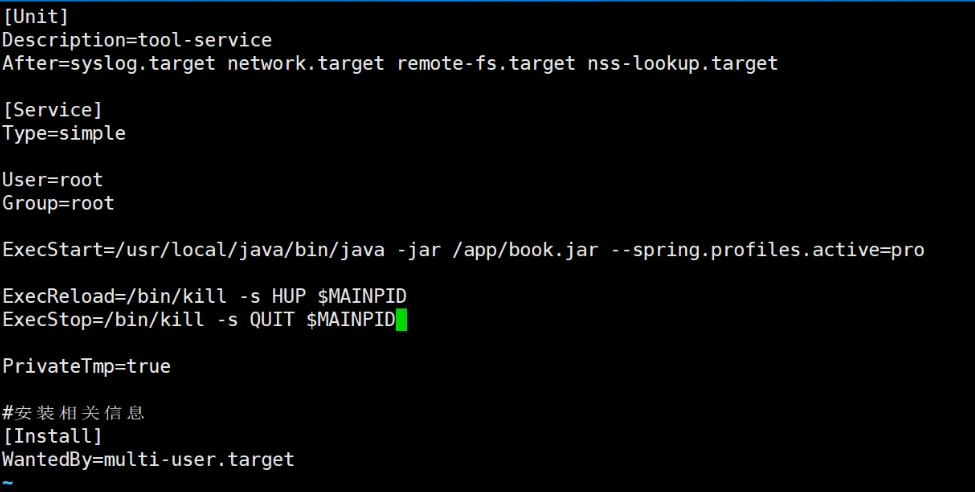

#### 一、ansible部署lnmp平台和java

##### 1、知识回顾：

```
1、任务与主机分离，是任务可以重用，把任务扮演成角色==创建角色
[root@www ~]# ansible-galaxy role init roleplaybook/roles/web

2、修改配置文件：
vi roleplaybook/roles/web/templates/nginx.conf.jinja2

3、写变量
vi roleplaybook/roles/web/vars/main.yml

4、写页面文件：
 vi roleplaybook/roles/web/files/index.html
 
 5、写触发器：
[root@www ~]# vi roleplaybook/roles/web/handlers/main.yml

6、执行
[root@www roleplaybook]# ansible-playbook webplaybook.yaml ===执行
```

##### 2、利用ansible部署lamp平台

>nginx ：提供仓库--安装软件--配置文件==启动服务（找专门的角色提供页面）
>
>php：提供仓库---安装软件（php-fpm 和php-mysqlnd）--配置文件（0.0.0.0）--启动服务		
>
>mariadb：提供仓库--安装软件--配置文件==启动服务

#### 二、部署lamp平台nginx、php、mariadb

```
13：======nginx
1、创建角色：
[root@www ~]# mkdir /y2312role
[root@www ~]# cd y2312role
[root@www y2312role]# mkdir roles
提供nginx并提供反向代理
[root@www y2312role]# ansible-galaxy role init roles/web

2、写任务：
[root@www y2312role]# vi roles/web/tasks/main.yml 
- name: install nginx
  yum: 
    name: nginx
    state: present
- name: config nginx  ===配置文件
  template: ===写在模板
    src: nginx.conf.jinja2
    dest: /etc/nginx/conf.d/default.conf
- name: root directory  ====提供站点根目录
  file:
    state: directory
    path: "{{ root }}"
- name: start nginx
  service:
    name: nginx
    state: started

3、提供nginx的配置文件：
vi roles/web/template/nginx.conf.jinja2
server {  ===反向代理到php
 listen 80;
 index index.php;  ===默认页面
 location / {
  root  {{ root }};
  try_files $uri $uri/index.php ;
 }
 location ~ \.php$ {
 fastcgi_pass     {{ php }}:9000 ;
 fastcgi_index    index.php;
 fastcgi_param     SCRIPT_FILENAME /scripts$fastcgi_script_name ;
 include          fastcgi_params;
   }
}

4、写变量
vi roles/web/vars/main.yml
# vars file for roles/web
port: 8090
root: /usr/share/nginx/html/
php： localhost  反向代理到本机

5、写角色：
vi web.yaml
- hosts: webservers
  roles:
  - web

6、执行：
ansible-playbook web.yaml


=====安装php-fpm 和php-mysqlnd
1、创建角色：
ansible-galaxy role init roles/php
[root@www y2312role]# ansible-galaxy role init roles/php
[root@www y2312role]# cp /etc/php-fpm.d/www.conf ./roles/php/files/

vi roles/php/tasks/main.yaml==任务
- name: install php
  yum:
    name: "{{ item }}"   ===可以安装多个软件
    state: present
  loop:
  - php-fpm
  - php-mysqlnd
- name: config php
  copy:
    src: www.conf
    dest: /etc/php-fpm.d/
- name: start php-fpm
  service:
    name: php-fpm
    state: started
2、执行文件：
vi php.yaml
- hosts: webservers
  roles:
  - php
  
======》11服务器：
[root@www ~]# mkdir /scripts
[root@www ~]# echo "<?php phpinfo(); ?>" > /scripts/info.php
====访问浏览器192.168.18.11/info.php====会出现php页面


====安装mariadb
1、创建角色
ansible-galaxy role init roles/mysql
vi roles/php/tasks/main.yaml
- name: install mariadb
  yum:
    name: mariadb-server
    state: present
- name: start mariadb
  service:
     name: mariadb
     state: started
2、执行mariadb
vi msyql.yaml
- hosts: webservers
  roles:
  - mysql
3、测试
ansible-playbook mysql.yaml


部署wordpress
将wordpress部署到nginx下的/usr/share/nginx/html/
部署到php下的/scripts/里面

1、写角色：
ansible-galaxy role init roles/wordpress

2、写任务：
vi roles/wordpress/tasks/main.yaml
- name: copy wordpress to nginx
  copy:
    src: wordpress
    dest: /usr/share/nginx/html/
- name: copy wordpress to php
  copy:
    src: wordpress
    dest: /scripts/

3、复制wordpress到roles/wordpress/files/
cp -r wordpress roles/wordpress/files/

4、写剧本
vi wordpress.yaml
- hosts: webservers
  roles:
  - wordpress
===浏览器中输入192.168.18.11/wordpress


```

#### 三、java应用:

>准备java包===解压到对应的目录===符号链接===修改环境变量java_home和path
>
>springmvc：mvc+tomcat====war包
>
>spring boot：mvn工具实现编译构建====jar包

##### 1、部署java的jdk包：

```
一、部署java的jdk包：（部署java环境）

1、创建角色：
ansible-galaxy role init roles/jdk
cp jdk-8u144-linux-x64.tar.gz roles/jdk/files/
2、写任务：
vi roles/jdk/tasks/main.yaml
- name: jdk package
  unarchive:
     src: jdk-8u144-linux-x64.tar.gz
     dest: /usr/local/
- name: jdk link
  file:
     src: /usr/local/jdk1.8.0_144
     dest: /usr/local/java
     state: link
- name: excute jdk pakeage
  copy:
     src: java.sh=====java环境
     dest: /etc/profile.d/
 
 3、java的环境
 vi roles/jdk/files/java.sh
 #! bin/bash
 export JAVA_HOME=/usr/local/java
 export PATH=$PATH:$JAVA_HOME/bin
 
 4、写剧本
 vi jdk.yaml
 - hosts: webservers
   roles:
   - jdk

5、执行剧本：
ansible-playbook jdk.yaml


```

##### 2、部署java的jar包：

```
二、部署java的jar包：===springboot架构
提前编译构建:cd ManageBooks/
mvn clean package,生成target/...jar包。
1、写角色
ansible-galaxy role init roles/managebook

 [root@www ManageBooks]# cp target/springbootdemo-0.0.1-SNAPSHOT.jar /y2312role/roles/managebook/files/book.jar===>>>>>>改名book.jar
[root@www ManageBooks]# scp 数据库DUMP.sql 192.168.18.11:/root/====> 修改数据库密码
11服务器：
mysql < 数据库DUMP.sql

2、写任务：
vi roles/managebook/tasks/main.yaml
- name: create app directory
  file:
    path: /app/
    state: directory
- name: cp app jar
  copy:
    src: book.jar
    dest: /app/
- name: run book
    shell: "nohup java -jar /app/book.jar &"=====>运行在后台，不用终止终端
或者：service
       name:book
       state: started

3、写剧本：
vi book.yaml
- hosts: webservers
  roles:
  - managebook==========>角色名字

4、执行剧本：
ansible-playbook book.yaml

5、查看11的80端口
在浏览器中输入192.168.18.11:8080

遇到的困难：通过ansible来部署playbook时，使用ansible来部署java的项目是运行在前台，ansible也是运行在前台的，当我们中断ansible时java的项目也会中断，因为主进程挂了子进程也会挂了所以使用/usr/lib/systemd/system/book.service（被监控主机）
vi /usr/lib/systemd/system/book.service  ====>被监控主机
jar 包配置成systemctl启动：
[Unit]
Description=MyApp Java Service
After=syslog.target
After=network.target

[Service]
User=root
# 或者一个普通用户，比如 User=myuser
ExecStart=/usr/local/java/bin/java -jar /app/book.jar ====java的绝对路径，book.jar的地址为后面的
SuccessExitStatus=143
Restart=always
RestartSec=3
StandardOutput=syslog
StandardError=syslog
SyslogIdentifier=myapp

[Install]
WantedBy=multi-user.target

终端上：
systemctl daemon-reload
systemctl start book
```



##### 3、springmvc：部署war包运行所需的tomcat环境

>war包跑起来需要tomcat支持，还需要安装tomcat，war包才能运行起来

```
springmvc：mvc+tomcat====war包
部署tomcat：
1、写角色：
ansible-galaxy role init roles/tomcat
tar -xf apache-tomcat-8.5.93.tar.gz

2、复制apache-tomcat-8.5.93到files中
cp apache-tomcat-8.5.93 roles/tomcat/files/

3、写任务：
vi roles/tomcat/tasks/main.yaml
- name: tomcat package
  unarchive:
     src: apache-tomcat-8.5.93.tar.gz
     dest: /usr/local/
- name: tomcat link
  file:
     src: /usr/local/apache-tomcat-8.5.93
     dest: /usr/local/tomcat
     state: link
- name: excute tomcat pakeage
  copy:
     src: tomcat.sh=====tomcat环境
     dest: /etc/profile.d/

4、写tomcat环境
vi roles/tomcat/files/tomcat.sh
export CATALINA_HOME=/usr/local/tomcat
export PATH=$PATH:$CATALINA_HOME/bin

5、写剧本：
vi tomcat.yaml
- hosts: webservers
  roles:
  - tomcat
 
6、执行剧本：
ansible-playbook tomcat.yaml
```

##### 4、执行war包

```
二、部署war包
cd Books-Management-System中 
[root@www Books-Management-System]# vi src/main/resources/book-context.xml 
改数据库密码为空
mvn clean package

1、写角色：
ansible-galaxy role init roles/book

回话2：cp target/book-1.0-SNAPSHOT.war /y2312role/roles/book/files/ROOT.war
vi roles/book/tasks/main.yaml
- name: copy war
  copy:
    src: ROOT.war
    dest: /usr/local/tomcat/webapps/
- name: start tomcat
  shell: "catalina.sh run"

2、写剧本：
vi manage.yaml
- host: webservers
  roles:
  - book

3、 执行剧本：
ansible-playbook manage.yaml
```

**注意：catalina.sh run 还是运行在前台，如果想要运行：1、使用nohup ...  & 2、写入/usr/lib/systemd/system/book.service中。**