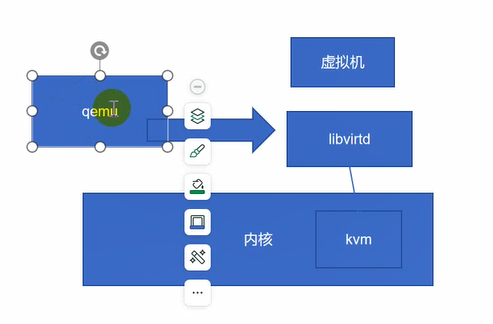
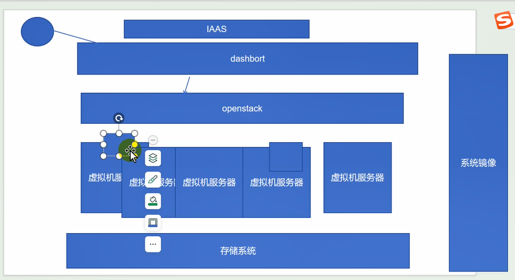
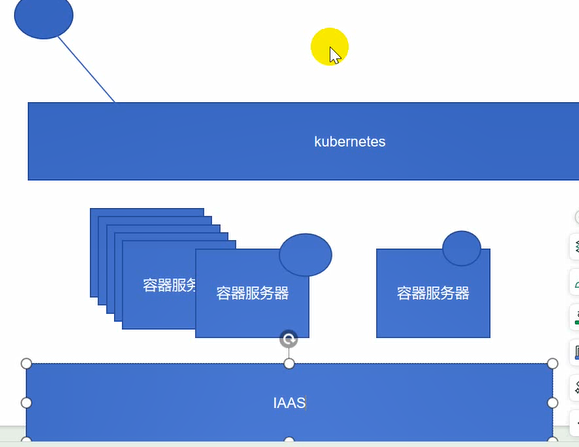

虚拟机  kvm | xen 管理套件openstack  IAAS 	基础架构即服务

容器 docker| containerd | podman kubernetes	PASS 平台即服务

云计算本质： 通过虚拟化技术或者容器化技术来提供一些算例


	服务进程   libvirtd  
	客户端工具  qemu
			   virt-manager
			   virsh
			   virt-install
	创建磁盘镜像 
				qemu-img 




容器服务器（nginx等）在这上面可以跑nginx等，这些容器服务器需要被管理起来就是管理组件kubernetes，使用某个容器例如ningx、java就向kubernetes发送请求，根据需求去创建两个或者几个nginx java，就在下面创建几个容器（提前打包好了，运行起来，不需要在安装nginx等）；这些容器可以是真实的服务器也可以是虚拟机，里面利用和解循环，期望运行两个容器，kubernetes会时刻监视是否运行两个容器，当其中一个挂掉，会自动创建一个，这就是生命式api（就像操作空调一样，期望23，会慢慢调到23）.云原生叫生命式api，kubernetes尽量让当前状态满足期望值



```
业务系统：lvs httpd nginx haproxy php java mysql|mariadb redis
监控： zabbix
自动化： ansible
堡垒机： jumpserver

```

```
安装服务端，客户端，镜像工具  
	yum install libvirt* virt-* qemu-kvm*

启动libvirtd 服务进程
	systemctl  start libvirtd  

[root@www jumpserver-installer-v3.10.5]# mkdir /opt/kvm
[root@www jumpserver-installer-v3.10.5]# cd /opt/kvm/

创建带光盘镜像虚拟机
	virt-install --name vm-1  --vcpus 1 --memory 1024 --cdrom ./iso/CentOS-7-x86_64-Minimal-2009.iso --disk path=./img/vm1.qcow2,size=10,format=qcow2 --network network=default --graphics vnc,port=5900,listen=0.0.0.0 --os-type linux --os-variant centos7.0 --noautoconsole
创建一个已经装好系统桥接模型
	virt-install --name vm-2 --virt-type kvm --vcpus 1 --memory 2048 --disk path=./img/vm1.qcow2,size=10,format=qcow2 --network bridge=br0 --graphics vnc,port=-1,listen=0.0.0.0 --os-type windows --os-variant win7 --noautoconsole

在vnc中连接： 192.168.18.13：5900

virsh: 虚拟机管理命令 
	virsh list 列出虚拟机  
			  --all 
		  start  启动
		  shutdown 关闭
		  destroy  强制关闭 
		  suspend  挂起
		  resume   恢复
		  autostart 让虚拟机自动启动
		  undefine
		  autostart
		  snapshot  快照 
使用virt-manager 管理虚拟机   

热迁移： 
		1： 共享存储实现镜像文件共享 
		2： 主机需要基于名称解析 
	迁移命令: virsh migrate vm-2  qemu+ssh://192.168.237.192/system --live --unsafe
```

