监控系统:

```
收集数据：
	agent(客户端)：采集数据

	snmp：采用协议收集

存储数据：

	数据库------关系型数据库（mysql posgsql）

			   时序数据（influxdb promentheus）：大规模的数据

数据显示：

	三方：grafana

告警：

	邮件 短信 企业微信 钉钉 飞书
qq授权码：drqffdvhcyseigfc
cat <<EOF >> /etc/mail.rc 
set from=1491506452@qq.com # 发送邮件的源邮箱地址
set smtp=smtps://smtp.qq.com:465 # QQ邮箱的SMTP服务器地址和端口
set smtp-auth-user=1491506452@qq.com # 发送邮件的源邮箱用户名
set smtp-auth-password=drqffdvhcyseigfc # QQ邮箱的授权码（注意不是登录密码）
set smtp-auth=login # 认证协议，这里使用login方式
EOF
echo "asdadw" | mail -s "y2312" 1491506452@qq.com
zabbix-server服务端port：10051
zabbix-agent客服端port：10050
```

​	

#### 1、安装zabbix

```
13服务器：
搭建lamp平台： yum install httpd php php-mysqlnd -y
zabbix.com官网安装
[root@www zabbix-server-mysql-5.0.41]# scp /etc/yum.repos.d/zabbix.repo 192.168.18.11:/etc/yum.repos.d/
浏览器中输入：192.168.18.13/zabbix
[root@www zabbix-server-mysql-5.0.41]# yum install zabbix-get
[root@www zabbix-server-mysql-5.0.41]# zabbix_get -s 192.168.18.11 -k "agent.hostname"======向客服端发送一条指令，客户端返回一个结果
=======》y2312web
net.if.in[ens33,bytes]

修改客服端配置文件：vi /etc/zabbix/zabbix.agent.conf
添加zabbix-server服务端地址
```

#### 2、监控指标：

##### 一、获取被监控服务器主机名

##### 1、手动配置主机：

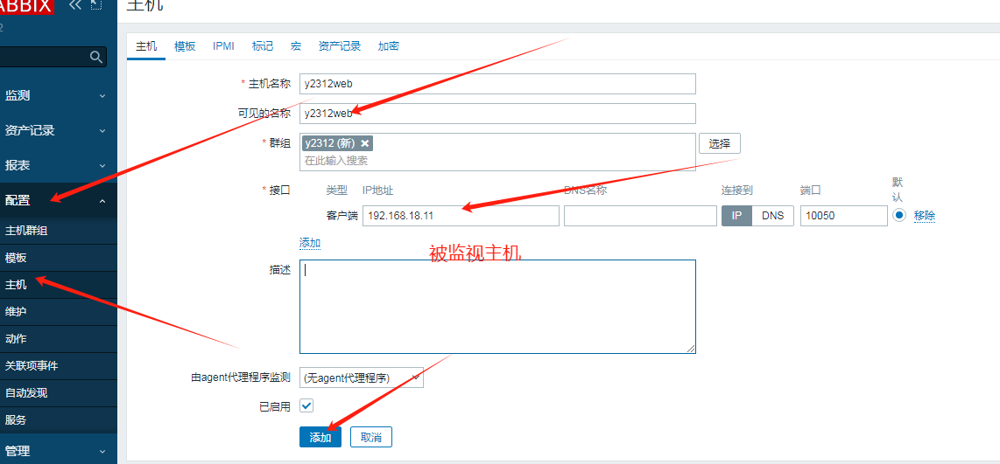


##### 2、创建监控项：就是一个脚本

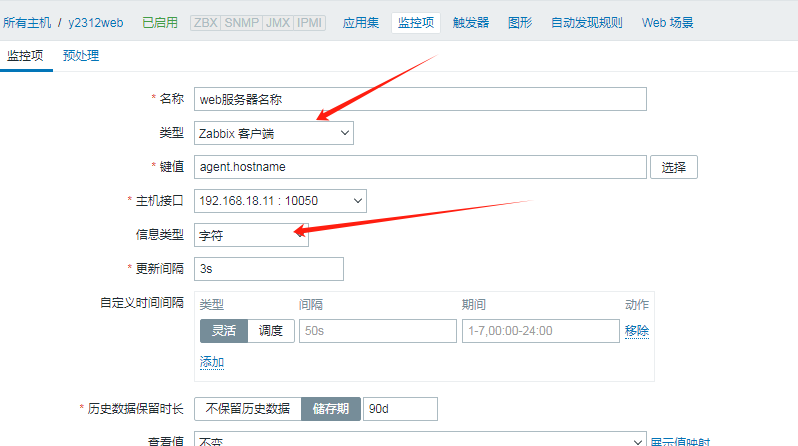

##### 3、 添加测试

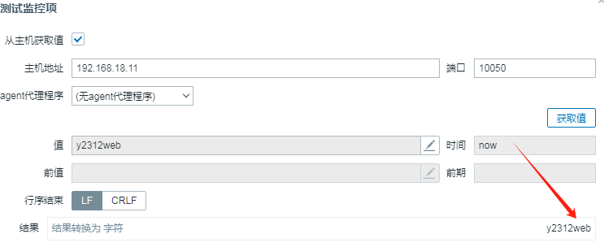

##### 二、流量的监控

##### 1、创建主机监控服务器流量的流入

>net.if.in[if,mode],if代表那张网卡，mode：packets 或者bytes（默认bytes）

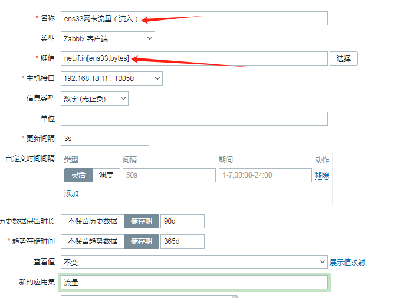


##### 2、预处理：

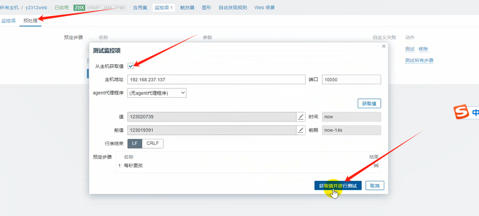

##### 3、检测----查看最新数据：

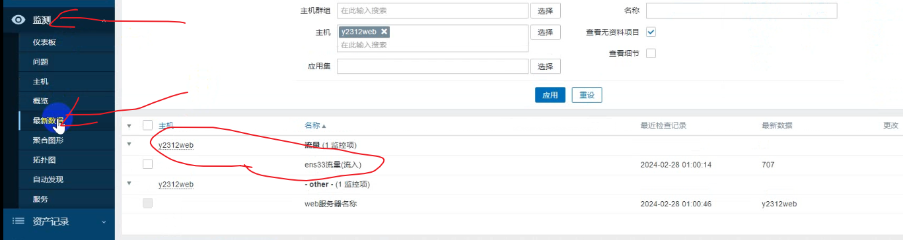

##### 三、检测服务器状态

##### 1、添加一个触发器：

>设定阈值，当达到阈值就触发告警。

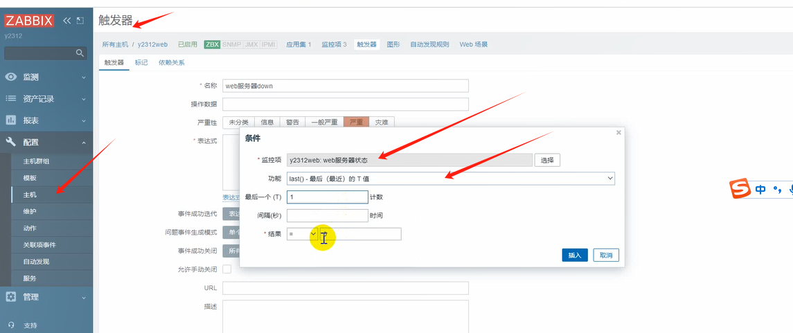

##### 2、添加动作：

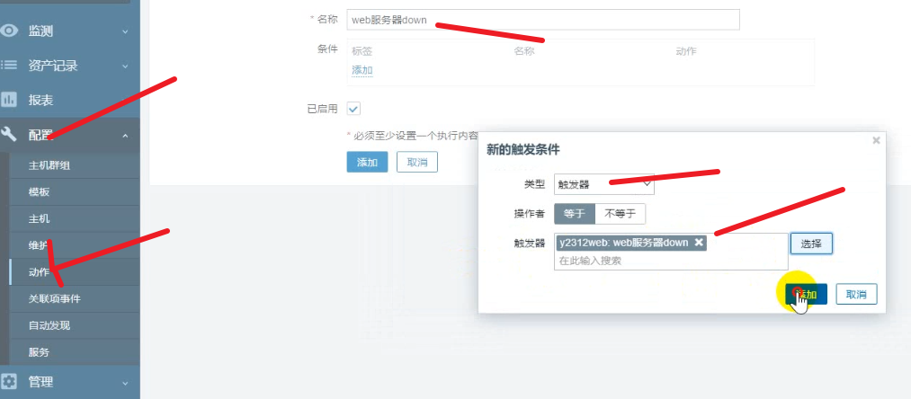

##### 3、添加告警媒介：

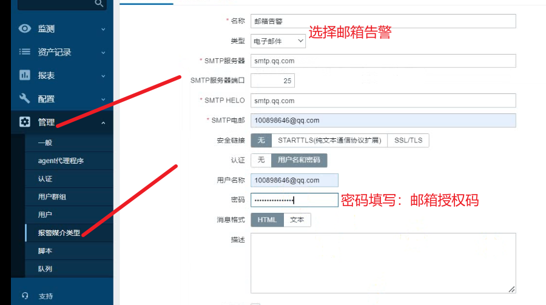

##### 4、用户绑定告警媒介：

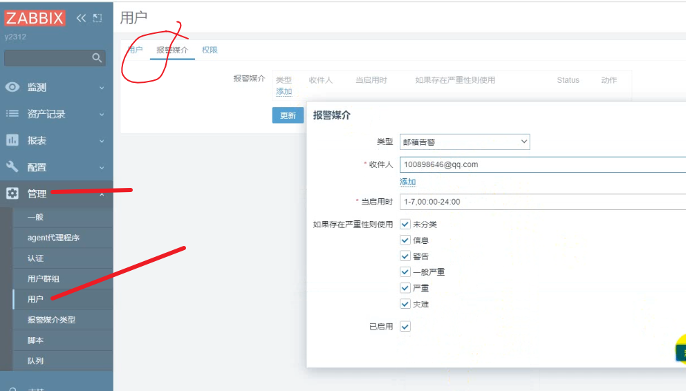

##### 5、测试告警：

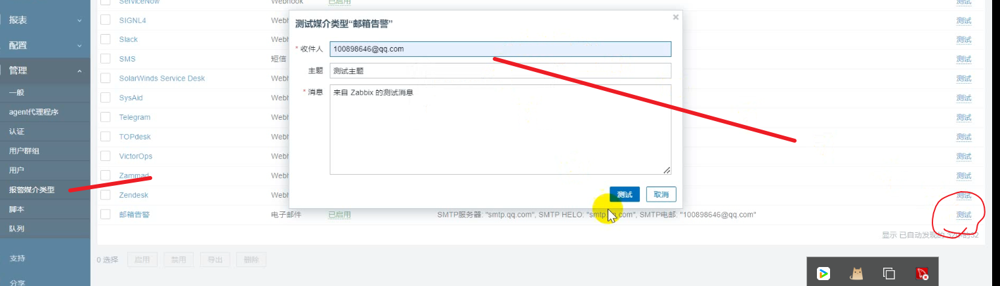

##### 6、触发动作：

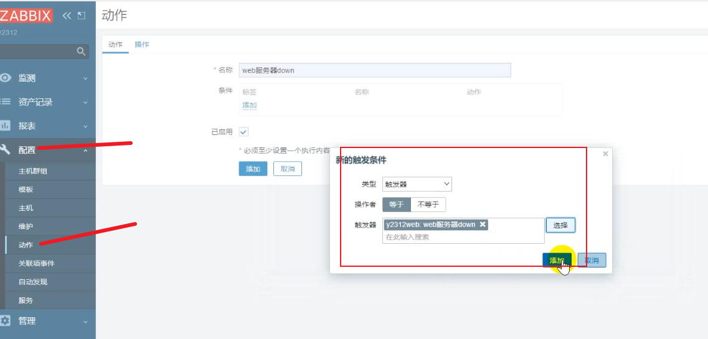

##### 7、绑定动作：

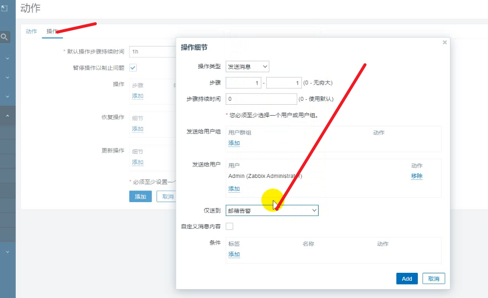

关闭web服务器，然后触发严重级别

11被监控的主机：

```
[root@www ~]# yum install zabbix-agent
修改配置文件：
[root@www ~]# vi /etc/zabbix/zabbix_agentd.conf 
1、pessive模式下：
接受的主机：ServerActive=192.168.18.13   指定拉去数据的主机
2、active主动模式下：
接受的主机：ServerActive=192.168.18.13    主动发送给的主机
3、主机名：Hostname=y2312web

[root@www ~]# systemctl start zabbix-agent
[root@www ~]# netstat -taunp | grep 10050
```

#### 3、当服务器down后远程执行命令：

>当服务器down后可以触发动作进行告警，也可以通过远程执行命令

##### 一、当服务器down后执行远程命令

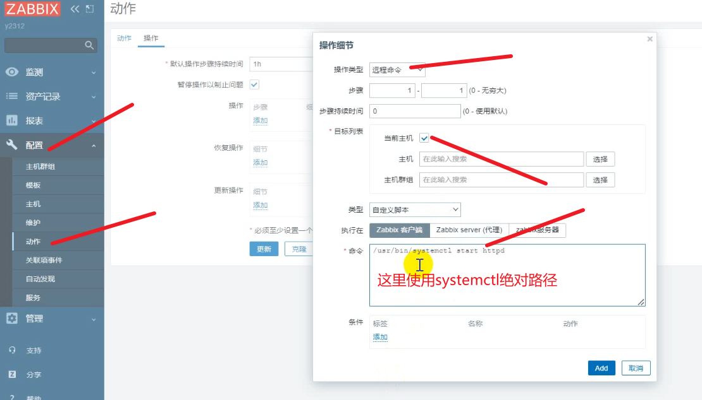

##### 2、zabbix授权执行远程命令：

```
11授权：授权zabbix执行 systemctl start httpd
vi /etc/zabbix/zabbix-agent.conf（被监控主机）

# Mandatory: no
AllowKey=system.run[*]
[root@www ~]# systemctl restart zabbix-agent

visudo授权动作
...
root    ALL=(ALL)       ALL
zabbix  ALL=(ALL)      NOPASSWD:ALL
推荐做法（只允许特定命令）：
zabbix ALL=(ALL) NOPASSWD: /usr/bin/systemctl restart httpd
测试：systemctl stop httpd，查看浏览器zabbix最新问题，问题已解决

邮箱配置：
/etc/mail.rc

管理里面先添加报警媒介类型----用户绑定报警媒介（mail）---动作
定义一个触发器------问题-----动作
							发送信息：配置媒介--用户绑定媒介
							执行命令：
								zabbix-agent																AllowKey=system.run[*]
								visudo
```


