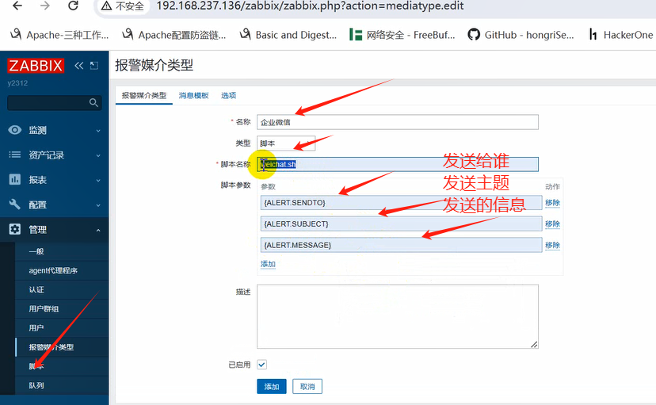
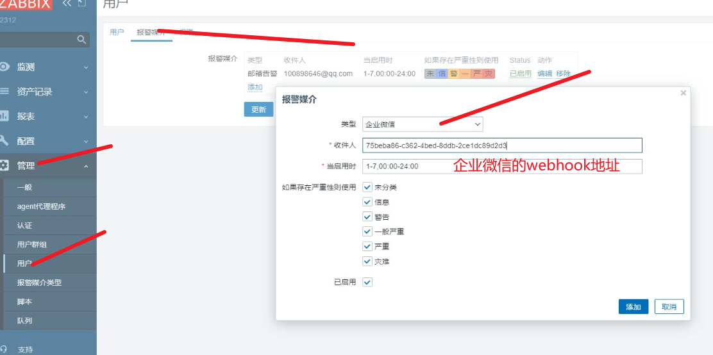
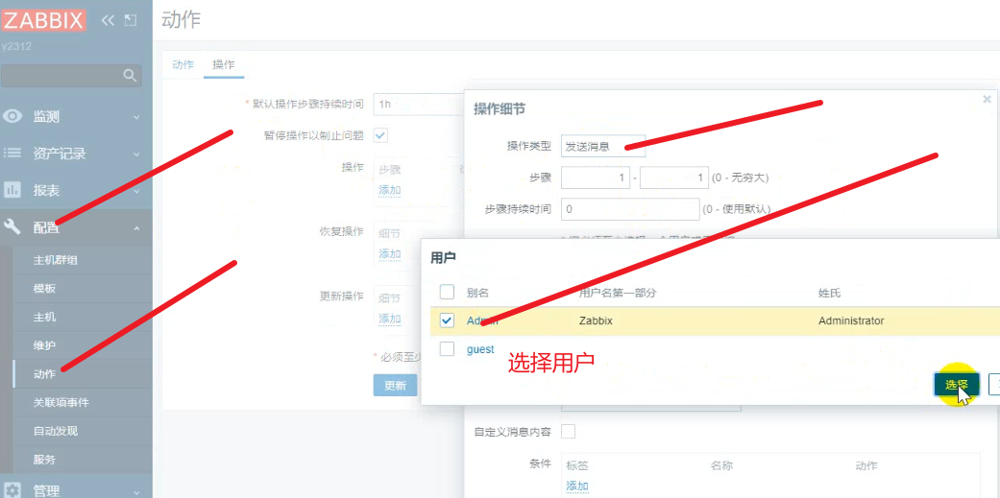
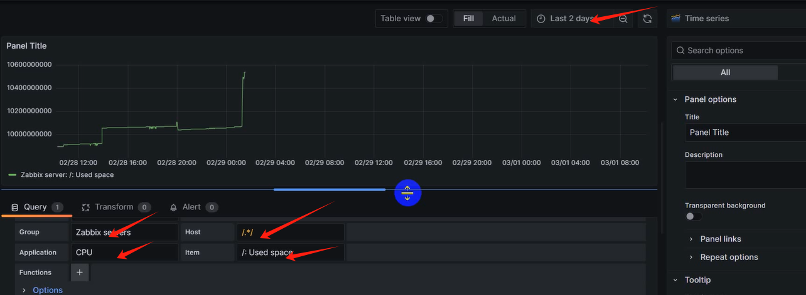
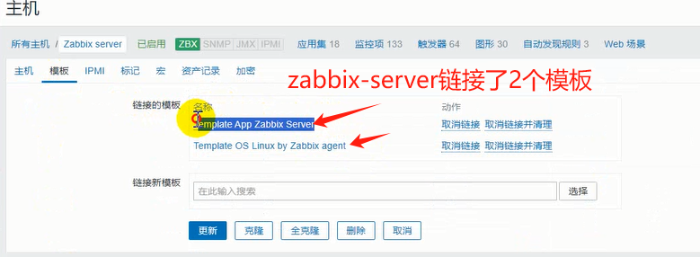
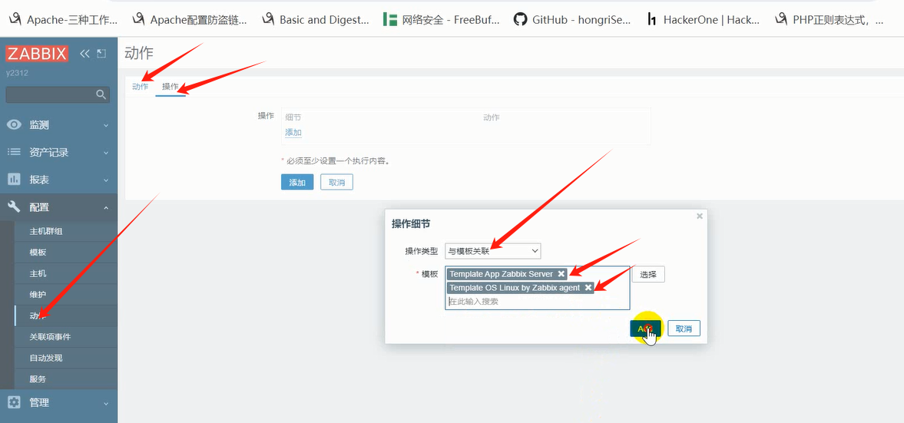
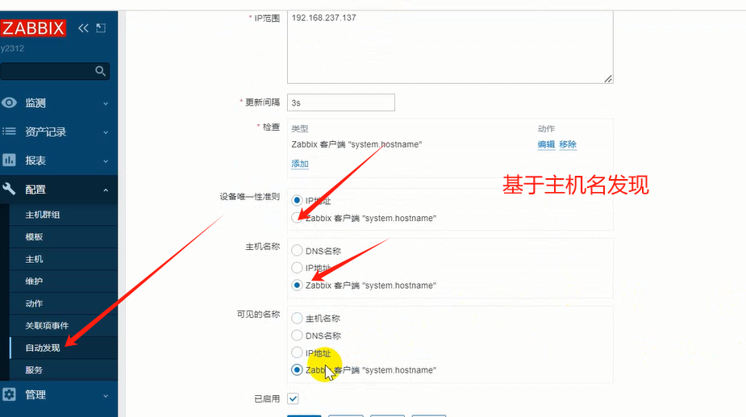
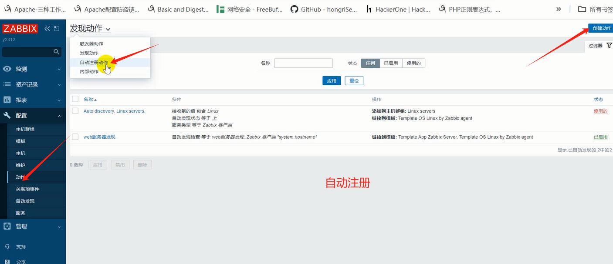
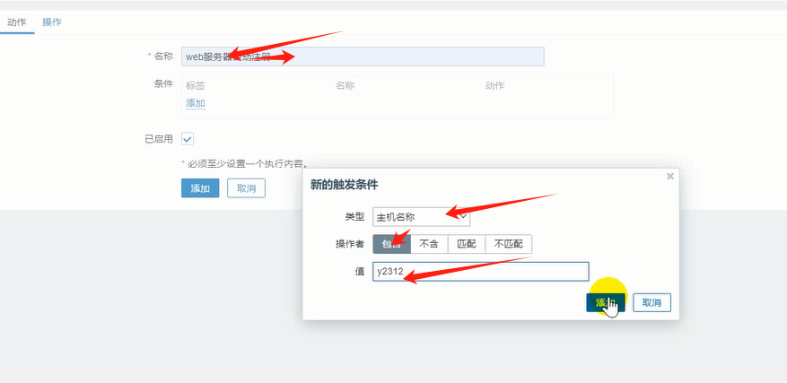
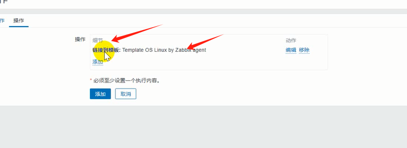

### zabbix企微告警及自动发现与注册

```
知识回顾：
监控项---触发器---告警媒介（给予邮箱告警）---配置动作

报警媒介：企业微信来实现告警
```

#### 一、告警媒介之企业微信告警：

##### 1、添加告警媒介：



##### 2、zabbix修改配置文件

```
13：vi /etc/zabbix/zabbix-server.conf
...
AlertScriptsPath=/usr/lib/zabbix/alertscripts==脚本写入的位置

写脚本： vi /usr/lib/zabbix/alertscripts/wechat.sh
#!/bin/bash
sentto=$1
content="主题：$2\n内容：$3"

curl "https://qyapi.weixin.qq.com/cgi-bin/webhook/send?key=$sentto" \
    -H 'Content-Type: application/json' \
    -d "
     {
          \"msgtype\": \"text\",
          \"text\": {
                \"content\": \"${content}\"
          }
     }"

https://qyapi.weixin.qq.com/cgi-bin/webhook/send?key=4b79cc47-4d42-4116-831a-4e89d14867e7  ===机器人

[root@www ~]# /usr/lib/zabbix/alertscripts/wechat.sh https://qyapi.weixin.qq.com/cgi-bin/webhook/send?key=4b79cc47-4d42-4116-831a-4e89d14867e7 监控工具 服务器down
{"errcode":0,"errmsg":"ok"}[root@www ~]# 

钉钉同理
curl -X POST dingding机器人地址 \
-H 'Content-Type: application/json' \
  -d '
  {
    "text":{
         "content": "y2312我就是我"
    },
    "msgtype":"text"
  }'
```

##### 3、用户与报警媒介绑定：



##### 4、配置动作：



##### 5、测试：

```
systemctl stop httpd
查看zabbix中是否触发问题。
```

#### 二、数据展示grafana

```
1、下载可视化grafana
grafana.com==oss社区版 9.5.10版本
yum install grafana包包
[root@www ~]# systemctl start grafana-server
配置文件在/etc/hrafana/grafana.ini 0.0.0.0
/var/lib/grafana/plugins===存放插件的位置
浏览器： 192.168.18.11:3000===登录admin admin
2、添加数据源：
服务器上安装插件：zabbix

[root@www ~]# unzip alexanderzobnin-zabbix-app-4.4.5.linux_amd64.zip 
[root@www ~]# cp alexanderzobnin-zabbix-app /var/lib/grafana/plugins -r
[root@www ~]# systemctl restart grafana-server
刷新页面
5363
在plugins上面enable启用zabbix
在数据源添加数据： data sources上面添加zabbix====下图为zabbix的对外的接口  Admin zabbix
新建dashboards（自己画的）
添加第三方画的： grafana官网下面找dashboards===搜索数据源zabbix，在里面复制id===然后再本机的grafana添加dashboards的new的下方import附上添加的id
```




#### 三、自动发现：

```
1、zabbix-server连接了2 个模板：Template App Zabbix Server和Template OS Linux by Zabbix agent
在zabbix中y2312web中关联上面两个模板---自动发现主机然后关联起来：配置--动作--名称： web服务器发现 条件：ip地址段：192.168.66.137- 操作： 操作类型：与模板关联Template App Zabbix Server和TemplateOS Linux by Zabbix agent----以上基于IP地址，实践中基于主机名：自动发现--hostname
```



##### 1、添加模板（关联模板）：



##### 2、基于主机名自动发现：



#### 四、自动注册：

```
当主机带有y2312就自动发现注册进来，修改zabbix-agent（被监控主机）配置文件，并重启
```

##### 1、自动注册：



##### 2、添加动作：



##### 3、关联模板：


